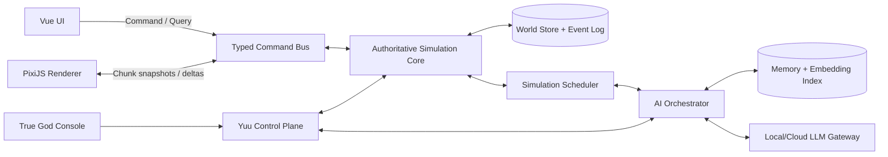

# My Open World — Đặc tả ý tưởng và mô hình hệ thống

> Trạng thái: bản thiết kế nền tảng. Tài liệu này chuyển ý tưởng thô thành một mô hình game có quy tắc, dữ liệu, vòng lặp gameplay và lộ trình triển khai cụ thể.

## 1. Tầm nhìn

**My Open World** là một game sandbox mô phỏng đa thế giới fantasy, góc nhìn top-down 2D theo lát cắt của không gian 3D. Thế giới không xoay quanh một cốt truyện cố định; lịch sử hình thành từ địa hình, sinh thái, nhu cầu, tri thức, quan hệ, chiến tranh, phép thuật, công nghệ và quyết định của các thực thể.

Người chơi là **True God** — chủ sở hữu tối cao của toàn bộ thực tại. Người chơi có thể:

- Quan sát thế giới ở mọi tỷ lệ, từ một ô vật chất đến toàn bộ mạng lưới đa thế giới.
- Ra lệnh cho **Yuu**, hệ thống quản trị và “cánh tay phải” của True God.
- Chỉnh sửa luật, dữ liệu, sinh vật, sự kiện và prompt thông qua các giao dịch có thể xem trước, ghi lịch sử và hoàn tác.
- Tạo avatar mới, hóa thân hoặc nhập vai vào một cá thể để trực tiếp sinh sống trong thế giới.
- Để thế giới tự vận hành, rồi quan sát những lịch sử và câu chuyện tự phát sinh.

### 1.1. Câu giới thiệu ngắn

> Một đa vũ trụ dạng lưới 3D có lịch sử sống, nơi mọi sinh vật hành động dựa trên điều nó thật sự biết; công nghệ và ma thuật phải được khám phá; còn người chơi có thể sống như một người bình thường hoặc chỉnh sửa thực tại với tư cách True God.

### 1.2. Năm trụ cột thiết kế

1. **Quan hệ nhân quả nhất quán**: kết quả phải có nguyên nhân trong mô phỏng. “Siêu thực tế” đến từ tính nhất quán, không phải từ việc tính từng phân tử.
2. **Tri thức cục bộ**: một cá thể chỉ biết điều nó cảm nhận, được dạy, suy luận hoặc nghe kể. Dữ liệu thật của thế giới không tự động trở thành kiến thức của nhân vật.
3. **Mô phỏng nhiều độ chi tiết**: khu vực đang được quan sát chạy chi tiết; khu vực xa chạy bằng mô hình tổng hợp nhưng vẫn bảo toàn kết quả quan trọng.
4. **LLM là tầng nhận thức, không phải engine vật lý**: LLM lập kế hoạch, nhập vai, đối thoại và phản tư; engine quyết định hành động nào hợp lệ và tác động vật lý nào thật sự xảy ra.
5. **Quyền năng có kiểm soát**: True God có quyền tối cao, nhưng mọi can thiệp được biểu diễn rõ, có preview, log, snapshot và nhánh thời gian để tránh phá hỏng save ngoài ý muốn.

## 2. Các quyết định nền tảng

| Chủ đề | Quyết định mặc định |
|---|---|
| Chế độ | Single-player, desktop-first, offline-first; multiplayer chưa nằm trong phạm vi đầu tiên |
| Không gian | Lưới voxel 3D `(x, y, z)`, mỗi tọa độ là số nguyên có dấu 64-bit |
| Hiển thị | 2D top-down, xem một lát `z` hoặc một dải lát cắt |
| Đơn vị cơ sở | Mặc định một ô là `1 m × 1 m × 1 m`; thực thể có thể chiếm nhiều ô |
| Sinh thế giới | Procedural, deterministic theo seed; chỉ sinh chunk khi cần |
| Lưu trữ | Lưu seed + phiên bản generator + phần thay đổi, không lưu toàn bộ thế giới nguyên thủy |
| Mô phỏng | Authoritative, event-driven, nhiều cấp độ chi tiết |
| AI | Utility AI/behavior policy cho việc thường ngày; LLM cho quyết định có ý nghĩa |
| Dữ liệu định nghĩa | YAML dành cho authoring, kiểm tra và chỉnh sửa; runtime dùng schema đã biên dịch/ECS |
| Giao diện | Vue cho UI; PixiJS v8 (WebGPU có fallback WebGL) cho bản đồ; không dùng DOM cho từng ô |
| Kiến trúc đích | Simulation core Rust authoritative, chạy ngoài UI thread; tầng nhận thức tách tiến trình; frontend Vue/PixiJS; đóng gói Tauri cho desktop. Topology chi tiết ở `docs/plan.md` |
| Số học authoritative | Số nguyên hoặc fixed-point; float chỉ tồn tại ở renderer và số liệu không commit |
| Phân tầng sinh vật | `Animate` cho mọi sinh vật; `Sapient` mới có cognition contract và ngân sách LLM |
| Runtime luật | DSL khai báo cho phần lớn; WASM deterministic có fuel cho luật phức tạp; không Lua, không `eval` |
| Khởi tạo thế giới | Worldseed = seed + generation profile + scenario, biên dịch thành genesis command |
| Mở rộng | Content pack dữ liệu, behavior module WASM và UI plugin; id có namespace, save ghi pack set |
| Nội dung nhạy cảm | Mô phỏng đầy đủ ở tầng cơ chế và hậu quả; trình bày ở mức biên niên sử |
| Vật phẩm | Là entity có component, không có engine riêng; instance/stack/aggregate theo LOD |
| Giá trị | Không lưu trong vật phẩm; giá hình thành ở thị trường và trong belief người đánh giá |
| Sở hữu | Possession là ground truth vật lý, claim là belief xã hội; hai thứ tách hẳn |
| Lượt hành động | Không có round cố định; lượt sinh ra từ `ready_at` trên chính timeline mô phỏng |
| Thời gian tiến trình | Mỗi tiến trình khai báo clock domain; qua portal thì rebase theo domain đó |
| Khóa phiên bản | Worldseed chia sẻ trỏ tới lockfile đã resolve, không phải khoảng version |
| Kết quả xã hội | Volition tính bằng quy tắc trên social state; LLM chọn ý định, engine tính kết quả |
| Event seed | Storylet có precondition và salience, chỉ đặt điều kiện, không bao giờ đặt kết quả |
| Tuổi thọ | Là đường cong tử vong, không phải một con số; loài sống lâu dùng mô hình lão hóa không đáng kể |
| Lai giống | Tương hợp là ma trận theo cặp và có thể bất đối xứng, không phải một chỉ số thuần chủng |

### 2.1. Những điều cố ý không làm

- Không gọi LLM cho mỗi entity ở mỗi tick.
- Không mô phỏng mọi ô của toàn bộ tọa độ 64-bit cùng lúc.
- Không cho LLM chạy JavaScript/Rust tùy ý hoặc trực tiếp sửa database.
- Không dùng một chỉ số “sức mạnh” duy nhất để giải quyết mọi tương tác.
- Không biến “điểm công nghệ” thành tiền mua phát minh mà bỏ qua kiến thức, vật liệu, thử nghiệm và hạ tầng.
- Không tạo sự kiện xã hội bằng cách ép một nhân vật phải phản bội, yêu, ghét hoặc gây chiến. Yuu tạo điều kiện; nhân vật vẫn tự quyết định.
- Không hứa mô phỏng vật lý cấp phân tử. Độ trung thực được chọn theo tác động gameplay và ngân sách tính toán.
- Không tick nhu cầu của mọi sinh vật ở mọi tick; giá trị được suy ra bằng tích phân đóng khi cần.
- Không dùng một thanh “hạnh phúc” hay “đạo đức” duy nhất thay cho tính cách, giá trị và hoàn cảnh.
- Không đánh dấu một entity là “tội phạm” bằng một cờ toàn tri; tội chỉ tồn tại qua chuẩn mực, phát hiện và chứng cứ.
- Không sinh nội dung tình dục tường minh. Hệ thống mô phỏng nguyên nhân và hậu quả, không mô tả cảnh.
- Không cho plugin cộng đồng ghi state authoritative hoặc nới bất biến engine.
- Không có “tỉ lệ rơi đồ huyền thoại”. Vật phẩm phi thường đến từ tay nghề, lịch sử, phép thuật hoặc nguồn gốc dị thường.
- Không cho vật phẩm bất tử; hao mòn là cống chính của nền kinh tế.
- Không lưu một con số “giá trị” bên trong vật phẩm.
- Không gán sẵn nghề nghiệp cho dân cư; chuyên môn hóa phải nảy sinh từ việc họ quan sát được nhau.
- Không để văn bản LLM ghi thẳng belief, kể cả khi nó rất tự tin.
- Không lưu bộ gen đầy đủ cho từng sinh vật; genome suy ra từ cha mẹ, seed tái tổ hợp và danh sách đột biến.
- Không dùng một con số “tuổi thọ tối đa” làm nguồn sự thật cho cái chết.
- Không cho phép thuật vượt rào cản sinh sản mà không khai báo giá phải trả.

## 3. Trải nghiệm và vòng lặp gameplay

### 3.1. Ba cách chơi đồng thời

#### Chế độ True God

1. Quan sát trạng thái hoặc vấn đề của thế giới.
2. Hỏi Yuu phân tích nguyên nhân, hậu quả và các phương án can thiệp.
3. Xem trước thay đổi: phạm vi, chi phí, thực thể bị ảnh hưởng, luật bị vi phạm.
4. Chấp nhận, sửa hoặc hủy giao dịch.
5. Quan sát hệ quả trực tiếp và hệ quả dây chuyền qua lịch sử.

Ví dụ: tạo một loài rồng không chỉ là spawn model. Yuu phải thiết kế cấu tạo cơ thể, nguồn năng lượng, khả năng bay, chu kỳ sinh sản, thức ăn, vị trí sinh thái, quan hệ với mana và rủi ro tuyệt chủng hoặc phá hủy hệ sinh thái.

#### Chế độ hóa thân

1. Sống bằng giác quan và kiến thức của avatar, không mặc định toàn tri.
2. Sinh tồn, giao tiếp, học nghề, luyện tập, khám phá, xây dựng quan hệ.
3. Tham gia gia đình, tổ chức, quốc gia, tôn giáo, chiến tranh hoặc nghiên cứu.
4. Có thể che giấu hoặc tiết lộ thân phận True God.
5. Rời avatar, tiếp tục hóa thân hoặc để avatar trở thành một thực thể tự trị.

#### Chế độ quan sát

1. Chọn một cá thể, gia đình, thành phố, nền văn minh hoặc world.
2. Theo dõi timeline, bản đồ quan hệ, dòng tài nguyên và thay đổi tri thức.
3. Tua nhanh thời gian; dừng khi phát hiện sự kiện quan trọng.
4. Lưu “biên niên sử” do engine tổng hợp từ event log, không bịa thêm sự kiện.

### 3.2. Vòng lặp emergent story

```text
Điều kiện vật chất
  → nhu cầu và cơ hội
  → nhận thức/belief của cá thể
  → ý định và kế hoạch
  → hành động hợp lệ
  → tác động lên thế giới
  → người khác quan sát/diễn giải
  → ký ức, quan hệ và thể chế thay đổi
  → điều kiện mới
```

Một câu chuyện hay phải đi qua vòng lặp này. Ví dụ, “tham nhũng” không phải một sự kiện ngẫu nhiên cộng `+10 corruption`; nó xuất hiện khi một người có quyền phân phối tài nguyên, có động cơ, có cơ hội che giấu, đánh giá rủi ro thấp và sống trong một thể chế giám sát yếu.

## 4. Bản thể của đa thế giới

### 4.1. Thuật ngữ

- **Multiverse**: toàn bộ save và mọi world/nhánh thuộc save đó.
- **World**: một không gian có seed, tọa độ, đồng hồ, luật vật lý và luật siêu hình riêng.
- **World branch**: một nhánh lịch sử của world, sinh ra khi True God rewind hoặc fork.
- **Cell**: một ô vật chất tại `(x, y, z)`.
- **Chunk**: đơn vị sinh, tải, mô phỏng và lưu trữ không gian.
- **Region**: nhóm chunk dùng cho khí hậu, chính trị, thống kê và mô phỏng xa.
- **Entity**: vật thể có định danh và component; sinh vật chỉ là một nhóm entity đặc biệt.
- **Soul**: định danh siêu hình tùy theo luật world, có thể duy trì tính liên tục qua chết, triệu hồi hoặc tái sinh.
- **Law**: phải ghi rõ loại, vì luật vật lý, luật phép thuật, pháp luật xã hội và policy AI không phải một thứ.

Các khái niệm được định nghĩa ở phần sau nhưng dùng xuyên suốt, gom lại đây để tra nhanh:

- **`Animate` / `Sapient`**: hai tầng sinh vật. `Animate` có cơ thể và nhu cầu; `Sapient` thêm cognition contract và mới được nhập vai bằng LLM (§9.1).
- **`Homeostasis`**: toàn bộ nhu cầu sinh lý và tâm lý của một sinh vật, tính bằng tích phân đóng chứ không tick (§9.7).
- **Effect**: một model duy nhất cho bệnh, phép, lá chắn, nguyền, nghiện, sang chấn và hiệu ứng cấp vùng. Chỉ đẩy modifier, không ghi base stat (§9.8).
- **Proper time**: đồng hồ riêng của một entity, tách khỏi thời gian cục bộ của world. Quyết định cách rebase deadline khi qua portal (§4.5).
- **Instance / stack / aggregate**: ba mức chi tiết của vật phẩm, tương đương LOD của không gian (§8.5.2).
- **Possession / claim**: chiếm hữu là ground truth vật lý; claim là belief xã hội về việc ai được công nhận là chủ (§12.8.1).
- **`norm_set`**: bộ chuẩn mực của một jurisdiction, biến một hành vi thành tội hoặc không (§12.5.1).
- **Talent / knowledge / revelation**: thiên phú là bẩm sinh và không truyền được; kiến thức học và dạy được; khải thị là sự kiện ban thẳng, có provenance (§13.8.1).
- **Storylet**: đơn vị dữ liệu của event seed — precondition trên state thật, nhiễu loạn điều kiện, salience, và không bao giờ có outcome (§15.6).
- **Worldseed / lockfile**: worldseed gói seed, generation profile và scenario; lockfile là bản resolve bất biến của mọi phiên bản mà worldseed đó phụ thuộc (§7.6, §7.6.6).
- **Genesis command**: chuỗi transaction tại tick 0 mà scenario được biên dịch thành; không có đường ghi thẳng state vào save (§7.6.2).
- **Provenance**: nguồn gốc của một thay đổi hoặc một vật — simulation, LLM, Yuu, True God, genesis hay devtool. Là thứ khiến mọi việc truy ngược được.
- **Cognition contract**: tập component bắt buộc để một entity có thể nhập vai; thiếu một phần là lỗi tạo entity, không phải cảnh báo (§9.1).

### 4.2. Bốn tầng luật

1. **Engine invariant**: bất biến bảo vệ dữ liệu, thứ tự event, quyền truy cập và tính hợp lệ. Sinh vật trong game không thể phá tầng này.
2. **Physical/metaphysical law**: trọng lực, nhiệt, mana, linh hồn, domain thần linh; có thể khác nhau theo world.
3. **Social law**: luật của một tổ chức. Luật này chỉ có hiệu lực khi có người biết, chấp nhận hoặc cưỡng chế.
4. **Behavior policy**: cách entity/Yuu chọn hành động; không có quyền sửa kết quả vật lý.

Phân tầng này ngăn lỗi thiết kế kiểu “quốc gia cấm dịch chuyển nên engine không cho kẻ phạm pháp dịch chuyển” hoặc “một LLM tuyên bố bất tử nên health không giảm”.

### 4.3. Định danh và tọa độ

- `WorldId`, `EntityId`, `SoulId`, `EventId`: định danh 128-bit hoặc UUID, không phụ thuộc tọa độ.
- `x`, `y`, `z`: signed 64-bit integer.
- Không ép ba tọa độ vào một số 64-bit duy nhất.
- Mọi khóa không gian đều kèm `WorldId` và `BranchId`.
- Mọi phép cộng/trừ tọa độ, lấy ô lân cận, tạo bounding box và biến đổi portal đều dùng checked arithmetic. Bước đi vượt `i64::MIN..=i64::MAX` bị từ chối bằng lỗi xác định, không panic hoặc wrap.
- Hiệu của hai tọa độ được nâng lên `i128` theo từng trục. Khoảng cách bình phương chính xác trên toàn miền 3D cần số nguyên rộng ít nhất 130 bit (`U256`/big integer); truy vấn gameplay thông thường chuyển về hệ tọa độ cục bộ có bán kính bị chặn để tránh phép tính toàn miền.
- JavaScript `Number` không biểu diễn chính xác mọi số nguyên 64-bit. Frontend nhận tọa độ bằng `BigInt`, cặp high/low hoặc chuỗi; renderer chỉ nhận tọa độ tương đối quanh camera dưới dạng số 32-bit/64-bit an toàn.

Khóa vị trí đầy đủ:

```text
(multiverse_id, branch_id, world_id, x:i64, y:i64, z:i64)
```

### 4.4. Thời gian và quan hệ nhân quả

Mỗi branch có một `DivineTime` đơn điệu. Branch mới kế thừa thời điểm và state đã commit tại điểm fork, sau đó tiến độc lập. Mỗi world có đồng hồ cục bộ dùng tỷ lệ hữu tỷ và một bộ tích lũy phần dư:

```text
total       = remainder + divine_delta × numerator
local_delta = floor(total / denominator)
remainder   = total mod denominator
```

`numerator >= 0`, `denominator > 0`, `0 <= remainder < denominator`; world tạm dừng dùng `numerator = 0`. Phép nhân/cộng dùng kiểu rộng và checked arithmetic, nên tỷ lệ như `1/3` không mất thời gian do làm tròn ở từng tick.

Quy tắc mặc định:

- Entity già đi và tiến trình địa phương chạy theo thời gian cục bộ.
- Portal đưa entity đến “hiện tại” của branch/world đích, không đưa về quá khứ trong baseline.
- Rewind tạo branch mới thay vì sửa event đã xảy ra.
- Fork chỉ lấy state đã commit. Request LLM/job đang chạy bị hủy hoặc giữ `branch_id` nguồn; kết quả đến muộn không được commit sang branch khác.
- Event có khóa thứ tự ổn định trong một branch: `(branch_id, divine_tick, world_id, subsystem_order, sequence)`. Không định nghĩa thứ tự nhân quả giữa hai branch đã tách.
- State hash được tính cho một branch tại một checkpoint cụ thể; metadata riêng lưu parent branch và fork event.

Cách này cho phép một ngày ở World 3 bằng nhiều năm ở World 1 nhưng vẫn tránh nghịch lý ghi đè lịch sử.

### 4.5. Clock domain của tiến trình

§4.4 định nghĩa đồng hồ của world. Nhưng nhu cầu, bệnh, thai kỳ, hợp đồng, deadline nghiên cứu và effect đều là **tiến trình có thời hạn**, và mỗi tiến trình phải khai báo nó đếm theo đồng hồ nào:

| Clock domain | Dùng cho |
|---|---|
| `world_local` | Mùa màng, thời tiết, lịch xã hội, hạn hợp đồng |
| `divine` | Điều phối liên-world, lịch của Yuu, thứ tự event toàn multiverse |
| `proper` | Thời gian riêng của entity: tuổi, đói, ủ bệnh, hồi phục |
| `law_defined` | Đồng hồ đặc biệt do luật quy định: lời nguyền theo tuần trăng, giao ước theo chu kỳ thần |

Khi một entity đi qua portal sang world có tỉ lệ thời gian khác, **mọi deadline phải được rebase theo domain của chính tiến trình đó**, không phải đổi đồng loạt. Thiếu quy tắc này thì một người đang ủ bệnh sẽ khỏi hoặc chết ngay lập tức chỉ vì bước qua cổng — và một hợp đồng vay có thể đáo hạn tức thì.

Rebase là một phép biến đổi xác định, ghi event, và là một phần của portal transfer transaction ở §22.8. Chênh lệch thời gian giữa hai world vì thế trở thành một cơ chế chơi được: gửi người sang world chảy nhanh để nghiên cứu, hoặc giam kẻ thù ở world chảy chậm.

## 5. Các world nền tảng

Tên và con số dưới đây là mặc định thiết kế, có thể đổi trong dữ liệu.

### 5.1. World 1 — Gaia, thế giới sinh mệnh

**Vai trò**: trung tâm xã hội và lịch sử; nơi con người, elf, người thú, orc, động vật, quái vật và nhiều nền văn minh cùng tồn tại.

- Vật lý tương đối ổn định, mana trung bình và phân bố không đều.
- Sinh thái đa dạng; địa chất, sông, biển, khí hậu và mùa ảnh hưởng trực tiếp đến định cư.
- Công nghệ và ma thuật có thể cùng phát triển, cạnh tranh hoặc kết hợp.
- Các quốc gia không được tạo sẵn vĩnh viễn. Chúng hình thành, chia tách, sáp nhập và biến mất.
- Thần World 3 có thể ảnh hưởng qua domain, tín ngưỡng, hiệp ước hoặc avatar nhưng không mặc định toàn quyền.
- Đây là world phù hợp nhất để True God hóa thân và trải nghiệm từ góc nhìn hữu hạn.

### 5.2. World 2 — Umbral Abyss, thế giới bóng đêm

**Vai trò**: áp lực hỗn mang và nguồn xung đột liên-world.

- Luật entropy, biến dị và ăn mòn thực tại mạnh hơn Gaia.
- Sinh vật có thể hấp thụ năng lượng, ký ức, vật chất hoặc cấu trúc phép của world khác tùy loài.
- Vị Thần Hỗn Mang là một thực thể cực mạnh với mục tiêu bành trướng, nhưng vẫn là entity trong simulation và không có quyền engine-level.
- Xâm lược cần portal, khe nứt hoặc liên kết thật; không được spawn quân tùy tiện vào world khác.
- World 2 có thể chiến tranh với World 3 vì tài nguyên domain, thù địch lịch sử hoặc đối nghịch luật.
- “Cái ác thuần túy” là vai trò vũ trụ của phe thống trị, nhưng cá thể cấp thấp vẫn có thể có sợ hãi, trung thành, phản bội hoặc mâu thuẫn nội bộ. Điều này tạo câu chuyện tốt hơn một khối quân đồng nhất.

### 5.3. World 3 — Pantheon, thế giới của các vị thần

**Vai trò**: chính trị thần linh theo tinh thần thần thoại Hy Lạp.

- Cư dân là các thực thể sống cực mạnh, không phải True God tuyệt đối.
- Mỗi thần có tính cách, ham muốn, quan hệ gia đình, lời thề, danh dự, đố kỵ, trách nhiệm và domain riêng.
- `DomainAuthority` là capability có phạm vi cụ thể như bão, biển, mùa màng, chiến tranh, chữa lành. Nó cho phép đề xuất hoặc khuếch đại hiệu ứng, không cho phép viết thẳng kết quả.
- Quyền lực có thể đến từ bản chất, artifact, tín ngưỡng, giao ước, địa vị hoặc quyền được True God/Yuu cấp.
- Một người từ Gaia có thể thăng thần nếu hoàn thành tiến trình biến đổi thân thể/linh hồn, duy trì identity và nhận được domain hoặc nguồn năng lượng phù hợp.
- Thần bảo hộ có thể cứu một thành phố; thần hiếu chiến có thể kích động phe phái; thần dục vọng có thể theo đuổi quan hệ. Tuy nhiên, nhân vật khác vẫn có agency và quan hệ phải đi qua hệ thống xã hội thay vì “ép bằng prompt”.
- Các vị thần có thể chết, mất domain, bị giam, bị lãng quên hoặc hạ phàm nếu luật cho phép.

### 5.4. Super Ultra World — nơi ở của True God

**Vai trò**: nhà, phòng điều khiển và sandbox tối cao.

- Mặc định chỉ True God, Yuu và entity có capability do True God ký mới được vào.
- Cổng vào được bảo vệ ở tầng engine access control, không chỉ bằng một bức tường phép có thể phá.
- World 2 và World 3 dù mạnh đến đâu cũng không thể vượt quyền này bằng sức mạnh trong simulation.
- Có khu thử nghiệm tách biệt để tạo loài, vật chất, spell, artifact, địa hình hoặc luật mới trước khi đưa vào world thật.
- Có kho snapshot, timeline, world template và phòng quan sát.
- True God có thể đặt luật cục bộ tùy ý, nhưng thay đổi vẫn được ghi log để tránh làm hỏng dữ liệu ngoài ý muốn.

### 5.5. World sinh thêm

Yuu có thể tạo world từ `WorldTemplate`, ví dụ:

- World đại dương, không có đất liền.
- World đảo bay, trọng lực hướng về các lõi cục bộ.
- World đã chết, chỉ còn máy móc và ký ức.
- World có thời gian rất chậm.
- World nhà tù cho thực thể nguy hiểm.
- World phòng thí nghiệm tạm thời, tự hủy sau một điều kiện.

`narrative_role` chỉ hướng dẫn Yuu và giao diện; nó không được bí mật thay đổi vật lý để ép world hoàn thành một cốt truyện.

## 6. Cổng và mạng lưới đa thế giới

Các world tạo thành một đồ thị. Cổng là cạnh có trạng thái, không phải lệnh teleport tùy ý.

### 6.1. Dữ liệu một portal

- `portal_id`, source anchor, destination anchor.
- Chủ sở hữu, người tạo và phương pháp tạo.
- Điều kiện mở: năng lượng, vật liệu, nghi thức, thiết bị, thời điểm, khóa.
- Chính sách truy cập: allow/deny theo entity, faction, loài, capability hoặc chữ ký của True God.
- Băng thông: số lượng khối lượng/năng lượng có thể đi qua trong một khoảng thời gian.
- Độ ổn định, sai số tọa độ, thời gian tồn tại và cooldown.
- Biến đổi hướng, vận tốc, tỷ lệ thời gian và trạng thái vật chất khi chuyển.
- Dấu vết có thể quan sát: ánh sáng, nhiệt, mana, âm thanh, phóng xạ hoặc nhiễu thực tại.

### 6.2. Vòng đời portal

```text
DORMANT → CHARGING → OPEN → UNSTABLE → COLLAPSING → CLOSED
```

Chuyển entity là giao dịch nguyên tử:

1. Reserve entity và phần inventory đi kèm.
2. Kiểm tra quyền, khối lượng, môi trường đích và năng lượng.
3. Áp chế độ tiếp xúc của cổng theo §6.4: kiểm dịch, hàng cấm, quyền cư trú, luật mang sinh vật và linh hồn qua cổng. Bước này có thể từ chối hoặc giữ lại ở vùng cách ly thay vì cho qua.
4. Kiểm tra khả năng sống ở world đích theo `needs_profile` (§9.7.5) — khí quyển, nhiệt độ, mật độ mana. Không sống nổi mà vẫn đi là một quyết định hợp lệ, nhưng hệ quả phải được áp ngay khi tới.
5. **Rebase mọi tiến trình có thời hạn theo clock domain của chính nó** (§4.5): tuổi, ủ bệnh, thai kỳ, effect đang chạy, hợp đồng, deadline nghiên cứu. Đây là bước dễ quên nhất và là bước gây ra loại bug tệ nhất.
6. Ghi event rời world nguồn.
7. Chuyển state sang world đích.
8. Ghi event đến world đích, kèm bản ghi những gì đã đi cùng: ký sinh, mầm bệnh, hạt giống, vật phẩm (§9.10.1).
9. Commit theo **escrow hai pha**, vì hai world có thể nằm ở hai partition và hai vòng tick khác nhau: entity rời world nguồn được đưa vào bản ghi trung chuyển; world đích spawn và commit; chỉ khi có xác nhận thì bản ghi trung chuyển mới được giải phóng. Crash ở bất kỳ điểm nào để lại một bản ghi trung chuyển có thể dò lại và hoàn tất hoặc hoàn tác — không nhân đôi và không bốc hơi.

Một câu "commit cả hai phía rồi rollback nếu lỗi" là chưa đủ: không có giao thức nào bảo đảm hai bên cùng thành công khi chúng không chia sẻ một transaction.

### 6.3. Khe nứt tự nhiên hiếm gặp

Khe nứt không xuất hiện từ RNG thuần túy. Nó cần các điều kiện như:

- Hai world có tần số mana cộng hưởng.
- Mật độ năng lượng địa phương vượt ngưỡng.
- Barrier giữa world suy yếu.
- Có xung đột domain, thí nghiệm thất bại hoặc artifact làm neo.

Yuu tính `rift_score` từ những biến này, áp dụng seed deterministic và event budget. Vì vậy người chơi có thể điều tra nguyên nhân, dự đoán hoặc ngăn chặn khe nứt.

### 6.4. Chế độ tiếp xúc và kiểm dịch cổng

Mở được cổng mới là bước đầu. Thứ quyết định cổng đó trở thành cái gì là **chế độ tiếp xúc** mà hai phía thiết lập sau đó:

- Kiểm dịch sinh học và ma thuật, thời gian cách ly, quyền từ chối nhập cảnh.
- Thuế quan và hàng cấm.
- Chuẩn đo lường chung, vì hai world không mặc định dùng cùng đơn vị.
- Quy chế pháp nhân: một tổ chức ở world này có tồn tại về mặt pháp lý ở world kia không.
- Quyền cư trú và quyền lao động.
- Luật mang sinh vật, vật phẩm và linh hồn qua cổng.
- Phiên dịch và cơ chế giải quyết tranh chấp xuyên world.

Thiếu các thỏa thuận này, cổng vẫn hoạt động — nhưng nó trở thành ổ dịch, chợ đen, trại tị nạn hoặc đầu cầu xâm lược. Một cổng có kiểm soát tốt trở thành khu thương mại; cùng một cổng đó bị bỏ mặc trở thành vấn đề an ninh quốc gia.

Đây là điều khiến đa thế giới khác với một bản đồ có cửa dịch chuyển. Xem thêm §12.14 về xung đột thẩm quyền và §9.10 về hệ quả sinh thái.

Tham khảo: [WHO — International Health Regulations](https://www.who.int/publications/i/item/9789241580410).

## 7. Không gian, chunk và sinh địa hình

### 7.1. Phân vùng mặc định

- Cell: `1 × 1 × 1 m`.
- Chunk: `32 × 32 × 16` cell.
- Region: `32 × 32` chunk theo mặt phẳng và nhiều dải `z` khi cần.
- Tọa độ chunk dùng phép chia floor, không dùng phép chia cắt về 0; vì vậy tọa độ âm không tạo seam.

```text
chunk_x = floor_div(x, 32)
local_x = floor_mod(x, 32)  // luôn nằm trong 0..31
```

Kích thước là cấu hình theo world template nhưng một world đã tạo không tự đổi kích thước chunk giữa chừng.

### 7.2. Sinh lười và deterministic

Một cell nguyên thủy là hàm của **generation profile snapshot bất biến** được khóa khi tạo world:

```text
base_cell = Generate(
  world_seed,
  generation_profile_id,
  generation_profile_version,
  x, y, z
)
```

Profile snapshot chứa những hằng số vật lý/siêu hình cần cho worldgen ban đầu; nó không trỏ tới bộ luật runtime đang thay đổi. Chỉ chunk nằm trong viewport, gần entity hoạt động hoặc được một subsystem yêu cầu mới được materialize. Save lưu:

- Seed, generation profile và phiên bản generator.
- Chunk đã khám phá nếu cần fog/history.
- Delta do đào, xây, cháy, ngập, phép thuật hoặc sự kiện tạo ra.
- Entity và event có liên quan.

Không lưu hàng tỷ cell chưa từng thay đổi. Khi True God sửa luật runtime, base cell vẫn sinh theo profile lúc khai sinh rồi law history/LOD catch-up áp dụng tác động về sau. Muốn viết lại địa chất nền phải tạo migration có preview, bake delta hoặc fork sang generation profile mới; thời điểm mở chunk không được làm thay kết quả.

### 7.3. Pipeline địa hình

1. **Khung vũ trụ**: dạng world, trọng lực, mực biển, thành phần khí quyển, cường độ mana.
2. **Địa chất vĩ mô**: mảng kiến tạo giả lập, vùng nâng/hạ, đường đứt gãy, núi lửa.
3. **Độ cao nhiều tần số**: continental shape, mountain chain, hill và local detail.
4. **Thủy văn phân cấp**: lưu vực và dòng chính ở region scale; suối cục bộ được bổ sung khi materialize.
5. **Khí hậu**: vĩ độ giả định, độ cao, khoảng cách biển, gió, lượng mưa, mùa.
6. **Địa tầng**: lớp đá, đất, quặng, hang động, magma và nước ngầm.
7. **Biome**: dựa trên nhiệt, ẩm, đất, ánh sáng, mana và lịch sử nhiễu loạn.
8. **Sinh thái ban đầu**: vi sinh, thực vật, con mồi, thú săn, quái vật theo carrying capacity.
9. **Di tích và anomaly**: đặt sau khi địa hình hợp lệ; phải có provenance như nền văn minh cũ, thiên thạch hoặc xung đột phép.
10. **Delta lịch sử**: thành phố, đường, chiến trường, đập, hầm mỏ và thay đổi do simulation.

Để thế giới “vô hạn thực dụng” mà sông và dãy núi không đứt ở biên chunk, các đặc trưng lớn được quyết định từ ô phân cấp lớn hơn rồi chunk chỉ lấy mẫu kết quả. Không chạy erosion toàn hành tinh mỗi khi mở một chunk.

### 7.4. Topology và trường vĩ mô

Mỗi generation profile khóa một topology: `infinite_cartesian`, `bounded_box` hoặc `toroidal_xy`. Gaia mặc định dùng `infinite_cartesian` — một mặt phẳng rộng thực dụng phù hợp lát cắt top-down, không giả vờ là bề mặt cầu. World cần hành tinh cầu phải dùng topology và phép chiếu riêng; không tái diễn giải tọa độ Gaia giữa chừng.

Các trường vĩ mô được lấy mẫu từ lưới phân cấp liên tục qua biên:

- Continental potential quyết định biển/đất và cho phép ước lượng khoảng cách tới biển từ các ô thô lân cận.
- Climate coordinate tạo dải nhiệt tương tự vĩ độ nhưng được ghi rõ là trường khí hậu procedural, không phải vĩ độ thiên văn.
- Mỗi lưu vực thô có outlet và thứ tự thoát nước deterministic; mạng dòng chảy cục bộ nối vào outlet đó nên không đổi ở seam chunk.
- Mô phỏng xa giữ thể tích hồ/lưu vực và lưu lượng tổng hợp; chỉ vùng active giải dòng chảy theo cell.

World có bounds dùng checked arithmetic và policy biên khai báo trong profile. World không có bounds vẫn kết thúc biểu diễn tại biên `i64`; hành động cố vượt biên bị từ chối rõ ràng.

### 7.5. Phiên bản generator

- Mỗi world khóa `generation.profile_id` và `generator_version` tại lúc tạo; profile snapshot là một phần của save.
- Nâng phiên bản game hoặc sửa law runtime không âm thầm đổi địa hình nền cũ.
- Migration có thể giữ generator cũ, bake vùng quan trọng hoặc tạo branch/world với profile mới.
- Mọi stream RNG được đặt tên; thêm một loại cây không được làm thay toàn bộ vị trí quặng.

### 7.6. Worldseed và kịch bản khởi tạo

Một thế giới không chỉ cần địa hình. Nó cần biết bắt đầu với quốc gia nào, thế lực nào, dân số bao nhiêu, loài nào ở đâu, đã biết những gì và ghét nhau vì chuyện gì. Mục này định nghĩa nơi quản lý toàn bộ điều kiện ban đầu đó.

#### 7.6.1. Ba lớp phải tách bạch

| Lớp | Trả lời câu hỏi | Ví dụ |
|---|---|---|
| `seed` | Nhiễu ngẫu nhiên nào | `"9f5c..."` |
| `generation_profile` | Vật lý và địa hình ra sao | `gaia-earthlike`, topology, mực biển, cường độ mana |
| `scenario` | Văn minh khởi đầu thế nào | Quốc gia, thế lực, dân số, trình độ công nghệ, thù hằn có sẵn |

**Worldseed** là gói đóng cả ba lại cùng metadata, và là **đơn vị chia sẻ được**. Người chơi trao đổi worldseed giống như trao đổi map: cùng một worldseed cộng cùng version engine và cùng bộ plugin thì cho ra cùng thế giới khởi đầu, kiểm chứng bằng hash.

Tách ba lớp cho phép ghép chéo: cùng một địa hình Gaia có thể chạy kịch bản “bình minh của nông nghiệp” hoặc “tàn tích sau đại chiến pháp thuật”, và cùng một kịch bản chính trị có thể thả lên nhiều địa hình khác nhau.

#### 7.6.2. Genesis là một chuỗi command, không phải một khối state

Đây là ràng buộc quyết định tính đúng đắn của cả hệ thống. Scenario **không được ghi thẳng state vào save**. Nó được biên dịch thành một chuỗi transaction commit tại `divine_tick = 0` với `provenance.kind = genesis`, đi qua đúng validator, đúng action registry và đúng law như mọi thay đổi khác.

Ba hệ quả:

- Invariant §22.1 và §22.9 giữ nguyên. Khởi tạo thế giới replay được như mọi đoạn lịch sử khác.
- Một scenario không thể tạo ra thứ mà luật của world cấm. Nếu nó thử, lỗi lộ ra ngay lúc biên dịch chứ không phải sau 200 giờ chơi.
- Timeline ở §18.3 hiển thị được cả phần khởi tạo. Người chơi truy ngược được “vì sao hai nước này thù nhau” tới tận event gốc, kể cả khi event gốc là do scenario đặt.

#### 7.6.3. Trình độ công nghệ không phải một con số

“Bắt đầu ở thời trung cổ” không được cài bằng `tech_level: 3`. Nó phải được diễn giải thành trạng thái nhất quán trên bốn mặt:

1. **Tri thức**: node nào trong knowledge graph §13.1, ai biết, ở mức nào theo thang §13.2, và ai giữ bí mật.
2. **Hạ tầng**: lò rèn, cối xay, cảng, thư viện, mạng đường, tháp mana đã tồn tại trên bản đồ.
3. **Vật chất**: kho, công cụ, giống cây trồng, gia súc, quặng đã khai thác.
4. **Con người**: có bao nhiêu thợ, bao nhiêu học giả, bao nhiêu người biết đọc.

Validator coherence phải bắt các tổ hợp vô lý trước khi commit: cấp node “luyện thép” cho một quốc gia không có mỏ sắt, không có lò và không có thợ thì nền văn minh đó sụp trong vài mùa. Đây là kiểm tra cùng loại với viability check của loài ở §9.6, và Yuu phải báo rủi ro trước khi True God duyệt.

#### 7.6.4. Tiền sử tùy chọn

Scenario có thể khai báo một giai đoạn **tiền sử** chạy trước khi người chơi vào: N năm mô phỏng ở mức aggregate của §8.3, không gọi LLM.

Kết quả không phải văn bản viết tay mà là dữ liệu thật: event log tổng hợp, biên giới đã dịch chuyển, chiến tranh đã xảy ra, dòng họ đã phân nhánh, tàn tích ở đúng nơi từng có thành phố, thù hằn có nguyên nhân truy ngược được, và huyền thoại đã sai lệch so với sự kiện gốc theo cơ chế truyền miệng ở §12.3.

Tiền sử là cách rẻ nhất để có một thế giới “đã sống” ngay từ giờ đầu tiên mà không vi phạm §22.17 — mọi thứ trong biên niên sử đều có event thật đằng sau.

**Tiền sử phải tiến qua thời gian thật.** Genesis đặt điều kiện ban đầu tại tick 0, sau đó đồng hồ cục bộ chạy đủ N năm ở mức aggregate. Khi người chơi xuất hiện, tuổi nhân vật, version luật, đời dòng họ, thời điểm event và niên đại tàn tích đều mang timestamp thật, không bị nén hết về tick 0. Không có quy tắc này thì mọi thứ trong world trông như vừa được tạo ra cùng một lúc.

**Lịch sử vĩ mô phải được chốt trước khi mở chunk.** Tàn tích, tuyến thương mại, biên giới và mối thù do tiền sử sinh ra được commit dưới dạng macro-delta ngay khi tiền sử kết thúc. Việc người chơi mở một chunk chỉ **chi tiết hóa** kết quả đã khóa, không bao giờ được quyết định kết quả đó. Nếu không, lịch sử sẽ phụ thuộc vào đường đi của camera — đúng loại lỗi mà §7.2 đã cấm với địa hình nền.

#### 7.6.5. Seed Vault

Nơi quản lý worldseed trong UI, đặt cạnh Multiverse view ở §18.3:

- Duyệt, tìm và gắn thẻ worldseed đã có, kể cả worldseed do cộng đồng chia sẻ.
- Preview trước khi tạo: bản đồ thu nhỏ, danh sách thế lực, cây quan hệ ngoại giao, phân bố loài, báo cáo rủi ro của Yuu.
- Fork một worldseed để sửa rồi lưu thành bản mới, giữ nguyên quan hệ cha–con.
- Diff hai worldseed ở mức dữ liệu, không phải mức văn bản.
- Ghi rõ worldseed cần plugin nào và version nào theo §19.7; thiếu thì báo trước khi tạo, không lỗi giữa chừng.
- Xuất/nhập dưới dạng một thư mục hoặc một file nén, có checksum.

#### 7.6.6. Lockfile

Worldseed ở §21.4 khai báo phụ thuộc bằng khoảng version (`^1.4`), nhưng lại cam kết cùng worldseed cho cùng hash. Hai điều đó mâu thuẫn: `^1.4` hôm nay và `^1.4` sáu tháng sau có thể là hai build khác nhau.

Vì vậy, **trước genesis, worldseed phải được resolve thành một lockfile bất biến** ghi chính xác:

- Engine build.
- Từng pack: version và content hash.
- WASM runtime, ABI version và hash của từng module.
- Tập migration đã áp.
- Version của generator và của từng law profile.
- Quy tắc cấp phát ID deterministic.

Worldseed đem đi chia sẻ trỏ tới lockfile này. Khoảng version chỉ dùng lúc **tạo mới**; sau khi khóa, chỉ còn con số cụ thể. Đây cũng là thứ làm cho §22.30 kiểm chứng được thay vì chỉ là mong muốn.

## 8. Vật chất, vật phẩm và môi trường

### 8.1. Dữ liệu cell

Không đặt một object nặng vào mọi ô. Chunk dùng mảng compact/palette và sparse component. Một cell có thể tham chiếu:

- Vật liệu rắn nền và tỷ lệ lấp đầy.
- Lượng/chủng loại chất lỏng.
- Hỗn hợp khí được tổng hợp theo vùng khi không cần chi tiết.
- Nhiệt độ, áp suất, độ ẩm.
- Ánh sáng và tầm nhìn.
- Trường mana, corruption, divine influence hoặc anomaly.
- Structural support và trạng thái cháy/phản ứng nếu đang hoạt động.
- Occupancy index tới entity/item; entity không được nhúng trực tiếp vào cell.

### 8.2. Material definition

Mỗi vật liệu có các thuộc tính có đơn vị hoặc giá trị chuẩn hóa rõ ràng:

- Density, hardness, toughness, melting/boiling point.
- Heat capacity, thermal conductivity, flammability.
- Permeability, viscosity, toxicity.
- Mana conductivity/resistance và domain affinity.
- Màu, pattern, opacity và sprite tùy chọn.
- Reaction rules với vật liệu/năng lượng khác.

“Lava”, “stone”, “air” không chỉ khác màu; chúng khác hành vi. Tuy nhiên, subsystem chỉ chạy ở nơi thay đổi có ý nghĩa.

### 8.3. Các mức trung thực

| Hệ thống | Khu vực hoạt động | Khu vực gần | Khu vực xa |
|---|---|---|---|
| Chuyển động/va chạm | Theo cell và body | Lộ trình + kết quả | Lịch trình tổng hợp |
| Chất lỏng | Cellular có ngân sách | Cân bằng theo chunk | Thể tích lưu vực |
| Nhiệt/lửa | Lan truyền theo vật liệu | Event theo khu vực | Xác suất thiệt hại tổng hợp |
| Thời tiết | Trường cục bộ | Region model | Climate trend |
| Sinh thái | Cá thể quan trọng | Quần thể theo loài | Carrying-capacity model |
| Chiến đấu | Hit/body part/effect | Encounter resolution | Campaign/casualty model |
| Dịch bệnh | Cá thể: ủ bệnh, tải mầm, lây theo tiếp xúc | Ngăn S/E/I/R theo khu định cư | Tỉ lệ mắc/tử vong và dòng di cư |
| Tội phạm và thực thi | Hành vi, nhân chứng, chứng cứ theo cá thể | Tỉ lệ phát hiện và xử án theo khu vực | Chỉ số trật tự, quyền lực ngầm, thiệt hại kinh tế |
| Vật phẩm | Instance đầy đủ có provenance | Stack theo kho, tách khi cần | Tồn kho tổng hợp theo khu vực |

Mọi chuyển cấp độ phải giữ các đại lượng quan trọng: dân số, tài nguyên, thương vong, công trình, quan hệ, tri thức và event lịch sử.

**Mỗi subsystem tự khai báo hợp đồng LOD của mình** gồm bốn phần: `aggregate` (gộp xuống), `materialize` (dựng lại lên), danh sách đại lượng bảo toàn, và một bất biến round-trip kiểm tra được. Không có một hàm gộp chung cho mọi thứ, vì thứ cần bảo toàn của quan hệ xã hội khác hẳn thứ cần bảo toàn của trữ lượng quặng.

Hệ quả cho thi công: một subsystem **chưa tồn tại thì chưa có gì để bảo toàn**. LOD được xây theo từng subsystem cùng lúc với subsystem đó, không phải xây một lần từ đầu rồi vá sau — vá sau nghĩa là viết lại promotion/demotion và làm đổi hash của mọi save cũ.

### 8.4. Tick và scheduler

- Render hướng tới 60 FPS nhưng độc lập simulation.
- Active simulation mặc định 10 tick/giây; animation nội suy giữa snapshot.
- Subsystem có nhịp riêng: movement nhanh, nhu cầu chậm hơn, khí hậu chậm hơn nhiều.
- Không quét toàn bộ entity. Scheduler dùng event/deadline: entity chỉ thức dậy khi tới lịch hoặc có stimulus.
- Tập vùng active được suy ra deterministic từ avatar/entity hoạt động, nguy hiểm đang diễn ra và `SimulationFocus` do người chơi pin. Di chuyển camera chỉ tải dữ liệu để render; nếu muốn nâng fidelity của một vùng, UI phải commit focus command có tick và ghi event.
- Khi máy không theo kịp, engine giảm tốc độ tiến simulation so với wall-clock hoặc bỏ frame render, không tự đổi mô hình authoritative theo tải CPU. Mọi thay đổi simulation budget/LOD policy phải là command được ghi event; replay dùng lại đúng quyết định đó và không bỏ event đã lên lịch.

### 8.5. Vật phẩm là entity, không phải một bảng riêng

Tài liệu này đã tham chiếu tới `item` ở mười mấy chỗ — vật chứng ở §12.5.3, effect target ở §9.8.6, `substance` ở §12.6.2, `Inventory` ở §9.1 — mà chưa định nghĩa nó. Mục này định nghĩa.

Nguyên tắc đầu tiên, đúng theo §19.4: **không tạo engine thứ hai cho vật phẩm.** Một đồ vật là một entity mang tổ hợp component, giống hệt sinh vật, chỉ khác tập component.

- `Form`: hình dạng, khối lượng, thể tích, footprint khi đặt xuống.
- `MaterialComposition`: **theo bộ phận**, không phải một vật liệu duy nhất. Lưỡi thép, chuôi gỗ sồi, khảm bạc. Nhờ vậy lưỡi cùn, chuôi mục và khảm bị bóc là ba chuyện khác nhau.
- `CraftQuality`: chất lượng lúc làm ra, bất biến (§8.6).
- `Condition`: hao mòn hiện tại, thay đổi liên tục (§8.6).
- `Provenance`: ai làm, khi nào, ở đâu, bằng phương pháp gì, và toàn bộ chuỗi đổi chủ về sau (§8.9).
- `Function`: các affordance mà vật thể cho phép.
- `EffectSet`: phù phép, lời nguyền, đánh dấu truy vết — dùng lại nguyên §9.8.
- `Contents`: nếu là vật chứa.
- `Legibility`: nếu mang thông tin (§8.8).
- `Identity`: chỉ vật phẩm có tên riêng mới có, phần lớn đồ vật không có.

Quyền sở hữu **không** nằm trong danh sách này. Nó là claim xã hội, thuộc §12.8.

#### 8.5.1. Chức năng là affordance, không phải phân loại

Không hard-code `type: weapon`. Một cái xà beng nạy được cửa, đập được đầu, bẩy được tảng đá, và cả ba khả năng đó đều **suy ra** từ vật liệu cộng hình dạng theo đúng tinh thần §9.2:

```text
Function.pry     ← độ cứng, chiều dài đòn bẩy, độ bền uốn
Function.strike  ← khối lượng, phân bố khối lượng, độ cứng bề mặt
Function.cut     ← độ sắc hiện tại (chịu Condition), góc lưỡi, độ cứng
Function.contain ← thể tích rỗng, độ kín, tính thấm của vật liệu
```

Nhờ vậy một nhân vật đói có thể dùng lưỡi cày làm vũ khí, và một nồi đồng có thể trở thành mũ giáp tạm — những chuyện xảy ra trong lịch sử thật và không cần ai viết luật riêng cho chúng.

#### 8.5.2. Instance và stack: LOD cho vật phẩm

4200 thỏi sắt trong kho ở §21.4 không được là 4200 entity. Áp dụng đúng nguyên tắc nhiều độ chi tiết của §8.3 cho đồ vật:

| Mức | Biểu diễn | Khi nào |
|---|---|---|
| **Instance** | Entity đầy đủ, có id riêng | Có trạng thái cá biệt hóa: tên riêng, provenance đáng kể, chất lượng vượt ngưỡng, effect đang mang, hư hỏng riêng, đang bị tranh chấp, đang là vật chứng |
| **Stack** | `(item_def, count, material, quality_bucket, condition_bucket)` | Hàng hóa đồng nhất trong kho, trên xe, trong túi |
| **Aggregate** | Tồn kho theo khu vực | Vùng xa theo §8.3 |

Ba mức đều nằm trong ECS: instance là entity riêng, còn stack và aggregate là component trên entity vật chứa (§22.32). Thứ được thăng lên instance **giữ nguyên provenance** — id mới được cấp nhưng chuỗi nguồn gốc nối liền với lô nó tách ra, nên không có đứt gãy lịch sử.

Chuyển giữa ba mức là **deterministic và ghi event**. Một thỏi sắt được rèn thành thanh kiếm mà người thợ đặt tên thì được thăng lên instance; một thanh kiếm tầm thường nằm trong kho hai mươi năm không ai nhớ thì rút xuống stack. Điều kiện thăng/giáng là dữ liệu, không phải cảm tính, để §22.9 vẫn giữ.

Đây là biện pháp chống nổ số lượng entity, tương đương với việc cấm tick nhu cầu theo từng cá thể ở §9.7.2.

#### 8.5.3. Một vật ở đúng một nơi

Vật phẩm nằm trong `cell`, trong `Contents` của vật khác, hoặc trong inventory của một entity — **đúng một trong ba**, không bao giờ hai. Mọi di chuyển là transaction, cùng loại bảo đảm với portal transfer ở §22.8: không nhân đôi, không bốc hơi khi commit nửa chừng.

Vật chất được bảo toàn. Chế tác tiêu thụ nguyên liệu thật, phá hủy trả lại mảnh vụn hoặc vật liệu tái chế được, và không có đường nào sinh vật phẩm từ hư không ngoài genesis (§7.6.2) và can thiệp của True God có provenance (§16.2).

### 8.6. Vật liệu, chất lượng và tình trạng

#### 8.6.1. Chất lượng và tình trạng là hai thứ khác nhau

Nhiều game gộp hai khái niệm này và tạo ra nghịch lý “kiếm huyền thoại bị sứt mẻ thì thành kiếm thường”. Tách hẳn:

- **`CraftQuality`** — đóng dấu tại thời điểm chế tác, **không bao giờ đổi**. Nó là hàm của kỹ năng người làm, chất lượng công cụ, độ tinh khiết vật liệu, thời gian bỏ ra, `focus` và `fatigue` lúc làm (§9.7), cộng khả năng có một lần thăng hoa hiếm gặp.
- **`Condition`** — thay đổi liên tục theo sử dụng, môi trường và bảo dưỡng. Gỉ, mục, mốc, cùn, nứt, giãn.

Sửa chữa phục hồi `Condition`, **không bao giờ phục hồi `CraftQuality`**. Và một chi tiết đắt giá: nếu người sửa kém hơn người làm, phần được sửa mang chất lượng của người sửa. Một thanh kiếm bậc thầy bị thợ làng vá lại là một thanh kiếm có lịch sử, và người sành sỏi nhìn ra được.

#### 8.6.2. Liên tục bên trong, phân bậc khi hiển thị

Lưu `CraftQuality` dưới dạng fixed-point liên tục để mô phỏng đúng phân phối kỹ năng; hiển thị theo bậc rời rạc vì đó là cách con người thật sự nói về đồ vật. Bậc hiển thị là dữ liệu của văn hóa (§12.3), không phải hằng số toàn cục — mỗi nền văn minh có thang đánh giá và ngưỡng riêng.

#### 8.6.3. Hao mòn là sink của nền kinh tế

Đây là ràng buộc kinh tế, không chỉ là chi tiết mô phỏng. Nếu đồ vật không hỏng, tổng của cải chỉ tăng, và mọi cơ chế rút tiền ra khỏi lưu thông đều dẫn tới giảm phát. Hao mòn vật chất là **sink chính**, và §12.8.4 quy định phần còn lại.

Hao mòn đến từ nguồn có thật: sử dụng, va chạm, nhiệt, ẩm, muối biển, axit, nấm mốc, côn trùng, và mana ăn mòn ở world có luật đó. Bảo dưỡng là lao động có chi phí, nên “giữ được đồ” là một chỉ dấu của trật tự xã hội — kho vũ khí của một quốc gia đang tan rã sẽ tự nói lên điều đó mà không cần biến `stability`.

#### 8.6.4. Giá trị không phải một con số lưu trong vật phẩm

Vật phẩm lưu **thuộc tính khách quan** — vật liệu, chất lượng, tình trạng, công sức, provenance. Giá là kết quả của thị trường ở §12.2 và của **belief người đánh giá**, đúng logic danh tiếng ở §9.9.3.

Hệ quả: một kiệt tác vô giá ở kinh đô có thể đổi được vài cân lúa ở một ngôi làng không ai nhận ra nó. Thẩm định là một kỹ năng có thật, và chênh lệch thông tin giữa người bán và người mua là chỗ sinh ra thương nhân, kẻ lừa đảo và nhà sưu tầm.

### 8.7. Chế tác và dấu ấn người làm

Công thức là node trong knowledge graph §13.1, không phải một bảng riêng. Chế tác tiêu thụ nguyên liệu, công cụ, thời gian, năng lượng và không gian làm việc; nó tạo ra vật phẩm cộng một event provenance.

Kết quả **không đồng nhất**. Cùng một người thợ, cùng một công thức, cho ra một phân phối chất lượng phụ thuộc kỹ năng hiện tại, công cụ, vật liệu, mệt mỏi và tập trung. Đuôi trên của phân phối, cộng với `talent` hiếm ở §13.8.1, là nơi kiệt tác xuất hiện — không phải một lượt tung xúc xắc “rơi đồ hiếm”.

**Dấu ấn người làm** là dữ liệu bắt buộc với vật phẩm chất lượng cao: chữ ký, dấu lò, phong cách trường phái, thói quen kỹ thuật. Nó mở ra bốn thứ cùng lúc mà không cần hệ thống nào khác: thẩm định, giả mạo, lịch sử nghệ thuật, và tranh chấp quy kết tác giả.

Phong cách hình thức đến từ culture ở §12.3, nên một món đồ đào được từ tàn tích của tiền sử (§7.6.4) có thể được xác định niên đại và nguồn gốc bằng suy luận, chứ không bằng một nhãn dán sẵn. Khảo cổ học trở thành một hoạt động có thật trong world.

Chế tác thất bại theo cách có thật: hỏng vật liệu, thương tích, bán thành phẩm, hoặc một món đồ trông ổn nhưng có khuyết tật ẩn chỉ lộ ra khi chịu tải.

### 8.8. Vật phẩm mang thông tin

Sách, cuộn giấy, bản đồ, thư, bia khắc, bảng đất sét đều là vật phẩm có `Legibility`:

```yaml
legibility:
  language: "language:old_veskaran"
  script: "script:runic"
  medium: vellum
  encoding: { cipher: "cipher:temple_substitution", key_required: true }
  payload:
    - { kind: knowledge_ref, node: "knowledge:iron_smelting", fidelity: 0.72 }
    - { kind: event_claim,   event: "event:...", as_believed_by: "entity:..." }
    - { kind: belief,        statement: "...", confidence: 0.9 }
  copied_from: "item:..."         # chuỗi bản sao, có thể dài
  transcription_errors: 3
```

Bốn quy tắc:

1. **Đọc là một lần truyền dạy có hao hụt**, dùng đúng cơ chế §13.3. Người đọc cần ngôn ngữ, chữ viết, khả năng đọc và kiến thức tiền đề. Một cuốn sách phép cao cấp trong tay người thiếu nền tảng chỉ cho ra trạng thái `HEARD_OF`, không phải `PRACTICED`.
2. **Nội dung là dữ liệu không tin cậy**, đúng §22.18. Sách ghi lại *điều tác giả tin*, kèm provenance. Nó có thể sai, có thể là tuyên truyền, có thể là ngụy tạo.
3. **Sao chép sinh lỗi.** Mỗi thế hệ bản sao tích lũy sai lệch, y hệt cơ chế trôi dạt truyền miệng ở §12.3. Từ đó có phê bình văn bản, bản gốc thất lạc, và những dị giáo sinh ra từ một lỗi dịch.
4. **Tri thức có thể mất thật.** Nếu mọi bản sao bị hủy và không ai còn node đó trong `Knowledge`, tri thức biến mất khỏi world cho tới khi có người khám phá lại. Đốt sách vì thế là một hành động có hậu quả đo được, không phải một sự kiện trang trí — và nó nối thẳng vào effect `bị cấm dạy` trên `knowledge_node` ở §9.8.6.

Bản đồ là một vật chứa **belief về địa lý**, nên nó sai được, và làm sai lệch được. Bán bản đồ giả cho một đoàn thám hiểm là một hành vi có thể dẫn tới cái chết của họ, và có thể bị truy tố theo §12.5.

### 8.9. Vật phẩm huyền thoại và di sản

#### 8.9.1. Bốn con đường thành huyền thoại

Không có “tỉ lệ rơi đồ huyền thoại”. Một món đồ trở nên phi thường qua ít nhất một trong bốn đường:

1. **Tay nghề tuyệt đỉnh** — đuôi trên của phân phối ở §8.7, thường gắn với một khoảnh khắc thăng hoa của người thợ.
2. **Lịch sử tích lũy** — thanh kiếm tầm thường đã có mặt ở ba trận đánh quyết định và giết một vị vua. Giá trị nằm ở provenance, không ở vật liệu.
3. **Ràng buộc phép thuật** — nghi thức, domain, hoặc một linh hồn bị neo vào vật, theo luật ma thuật §13.6.
4. **Nguồn gốc thần thánh hoặc dị thường** — khải thị ở §13.8.2, mảnh vỡ từ rift, di vật của một world khác.

#### 8.9.2. Truyền thuyết không phải lịch sử

Đây là một quyết định thiết kế cần nói rõ, vì nó ngược với cách một số game làm.

*Caves of Qud* sinh lịch sử bằng cách tạo sự kiện trước rồi hợp lý hóa sau — hiệu quả cho việc tạo huyền thoại, nhưng vi phạm trực tiếp §22.17 của tài liệu này. Ta làm ngược lại: **sự kiện có thật trước, truyền thuyết là ảnh biến dạng của nó.**

Chuỗi provenance là dữ liệu thật, ghi từng lần đổi chủ, từng lần được dùng, từng lần bị sửa. Truyền thuyết là *belief* về chuỗi đó, lan qua kể lại và chịu trôi dạt theo §12.3. Kết quả là Legends view ở §18.3 hiển thị được **hai lớp cạnh nhau**: điều đã xảy ra, và điều người ta tin là đã xảy ra. Khoảng cách giữa hai lớp chính là nội dung chơi được — một học giả có thể dành cả đời để chứng minh thanh kiếm quốc bảo thực ra được rèn sau ngày lập quốc một trăm năm.

#### 8.9.3. Vật phẩm là đối tượng xã hội

Vương miện, ấn tín, thánh tích và bảo kiếm gia truyền có sức mạnh **một phần đến từ niềm tin**. Quyền uy của một chiếc vương trượng chỉ thật đúng bằng mức người ta tin vào nó, nên nó nối thẳng vào tính chính danh ở §12.5 và tín ngưỡng ở §14.2.

Từ đó rơi ra một loạt hệ quả không cần viết riêng: tranh chấp thừa kế, chiến tranh đòi lại bảo vật gia tộc, cướp thánh tích để hạ uy tín đối phương, làm bản sao để trưng bày và giấu bản thật, và cả trường hợp một bản sao được tin là thật suốt hai trăm năm.

#### 8.9.4. Vật phẩm có tri giác

Một vật mang `MemoryNamespace` và tag `Sapient` là hợp lệ — linh hồn bị ràng vào thanh kiếm, một cuốn sách biết nói. Nó không phải trường hợp đặc biệt: nó tuân thủ toàn bộ §9.1, chiếm ngân sách nhận thức như mọi `Sapient` khác, và chịu mọi ràng buộc ở §22.

#### 8.9.5. Hủy diệt là thật

*Dwarf Fortress* cho artifact hồi sinh sau khi bị phá hủy. Ta không làm vậy. Vật phẩm bị hủy là bị hủy, có event, có nhân chứng, có hậu quả chính trị.

Nhưng **truyền thuyết sống sót sau vật thể**, vì truyền thuyết là dữ liệu nằm trong văn hóa và ký ức chứ không nằm trong món đồ. Một thanh kiếm bị nung chảy vẫn để lại một khoảng trống có tên trong lịch sử, những kẻ đi tìm nó, và những kẻ tuyên bố đã tìm thấy nó.

### 8.10. Vật phẩm mang hành vi: module, khóa sử dụng và phù phép

Công cụ, sách phép, trượng, bùa, máy móc và di vật không chỉ là vật chất có thuộc tính. Chúng **mang hành vi**: một tác động lên thế giới mà người cầm có thể kích hoạt. Mục này định nghĩa cách gắn hành vi vào vật phẩm, cách kiểm soát ai dùng được, và cách nhân vật trong world tự tạo ra hành vi mới.

#### 8.10.1. Vật phẩm mang tham chiếu module, không mang mã nguồn

Vật phẩm **không chứa code**. Nó chứa một tham chiếu tới law/spell đã đăng ký cộng một bộ tham số đã đóng băng:

```yaml
behavior:
  module: "law.rune.frost_lance@3"   # Tier 0 DSL hoặc Tier 1 WASM, §13.9
  bound_params:
    power: 4200                       # fixed-point, đóng băng lúc phù phép
    element: frost
  charges: { max: 12, current: 7, recharge: "ambient_mana", rate_per_day: 0.5 }
  fuel_budget: 250000                 # trần thực thi riêng cho vật phẩm này
```

Hệ quả bắt buộc:

- Kích hoạt vật phẩm đi qua **đúng contract §13.9.3**: hàm thuần, trả `EffectProposal`, không ghi state, có fuel, host function chỉ trả observation của người dùng theo §13.9.4.
- Module có version. Save ghi version đã dùng, nên một cây trượng cũ không đổi hành vi vì hôm nay Yuu chỉnh cân bằng (§13.9.5).
- Vật phẩm không mở được cửa sau nào mà spell thường không có. Một cái trượng chỉ là một cách **đóng gói và trao đi** khả năng thi triển, không phải một hệ thống luật song song.

Về ngôn ngữ: Lua vẫn có thể là **bề mặt viết** cho người làm mod, biên dịch xuống Tier 0/Tier 1 theo §13.9.2. Nó không bao giờ là runtime, và nhân vật trong world không bao giờ sinh ra văn bản mã nguồn — xem §8.10.4.

#### 8.10.2. Cổng sử dụng

“Dễ dùng” và “khó dùng” không phải một con số độ khó. Nó là tập cổng mà người dùng phải qua, và mỗi cổng có một đường phá riêng:

| Cổng | Nội dung | Đường vượt qua trong world |
|---|---|---|
| `literacy` | Đọc được vật mang chữ (§8.8) | Học ngôn ngữ, thuê người dịch, giải mã |
| `knowledge` | Biết node ở mức tối thiểu theo §13.2 | Học, được dạy, nghiên cứu, ăn cắp tri thức |
| `stat` | `focus`, mana, sức, kỹ năng đủ ngưỡng | Luyện tập, thuốc, nghi thức tăng cường |
| `command_word` | Mật khẩu, câu thần chú, chuỗi cử chỉ, trình tự rune | Được truyền lại, tra khảo chủ cũ, tìm ghi chép, thám mã, thử mò có rủi ro |
| `attunement` | Ràng buộc theo linh hồn, huyết thống, lời thề, giao ước | Nghi thức chuyển ràng buộc, giết chủ cũ, phá giao ước và chịu hậu quả |
| `physical` | Ổ khóa, phong ấn, vật chứa cần chìa | Chìa khóa, phá khóa, cưỡng lực, dịch chuyển |
| `cost` | Mana, tuổi thọ, máu, vật hiến, lần dùng còn lại | Tích tài nguyên, tìm nguồn nạp |
| `risk` | Không chặn, nhưng dùng sai thì phản đòn | Chấp nhận rủi ro, chuẩn bị phòng hộ |

Nguyên tắc thiết kế: **mọi cổng phải khám phá được và phá được bằng phương tiện có trong world.** Một cổng không có đường vượt là một cái khóa tùy tiện, không phải nội dung chơi được.

Ba điều rơi ra ngay từ bảng này:

- Một cây trượng mạnh mà **mất khẩu quyết** trở thành di vật huyền thoại không ai dùng được. Học giả bỏ cả đời nghiên cứu để khôi phục nó — nối thẳng vào §13.4 và §8.9.
- Tra khảo chủ nhân để lấy khẩu quyết là hành vi phạm tội theo §12.5, có động cơ rõ ràng và chứng cứ để lại.
- Thử mò khẩu quyết là hành động hợp lệ với xác suất thấp và `risk` cao. Đó là lý do các phòng thí nghiệm phép thuật hay phát nổ.

Mọi cổng đều là **precondition authoritative** do action registry tự tính theo §10.4 bước 7. Không cổng nào được kiểm bằng lời khẳng định của LLM.

#### 8.10.3. Bí mật không bao giờ đi vào prompt

Đây là cái bẫy kỹ thuật nghiêm trọng nhất của toàn bộ ý tưởng này, và nó cùng loại với lỗ hổng host function ở §13.9.4.

Nếu prompt của một NPC chứa mô tả vật phẩm kèm khẩu quyết của nó, LLM **sẽ dùng khẩu quyết đó** dù nhân vật chưa bao giờ được ai nói cho biết. Toàn bộ §10.2 sụp đổ, và tệ hơn, nó sụp theo cách rất khó phát hiện khi test.

Quy tắc cứng:

- Trường `secret` của vật phẩm — khẩu quyết, chìa, trình tự rune, điều kiện ràng buộc — **không bao giờ được render vào context** trừ khi entity có belief tương ứng, với provenance rõ ràng về việc nó biết bằng cách nào.
- Prompt builder ở §10.4 bước 4 nhận vật phẩm dưới dạng **view đã lọc theo người quan sát**, giống hệt cách `perceptible_as` lọc effect ở §9.8.2.
- Một entity biết khẩu quyết thì đó là một mục trong `Knowledge`/`Memory` của nó, có nguồn, có thể sai, có thể quên, và có thể bị người khác moi ra.
- Auditor ở §15.1 chạy kiểm tra chuyên biệt: quét mọi prompt đã gửi tìm chuỗi bí mật mà entity chưa có quyền biết. Rò một lần là một bug nghiêm trọng, không phải một chi tiết nhỏ.

Cùng nguyên tắc áp cho: bản đồ chưa mở, nội dung sách chưa đọc, điều khoản của một claim chưa được cho xem (§12.8.5).

#### 8.10.4. NPC tự tạo hành vi mới

Có, và đây là một trong những thứ đáng giá nhất của thế giới này — nhưng **NPC không viết ra văn bản mã nguồn.** Chúng ghép các thành phần mà chúng biết, đúng như pipeline sáng tạo spell ở §13.8.3:

```text
Ý tưởng (LLM đề xuất, CHỈ từ các node mà entity thật sự biết)
  → candidate behavior graph
  → law compiler: kiểu, đơn vị, bảo toàn, termination, fuel (§13.9)
  → thử nghiệm thật, có rủi ro thật, tiêu hao vật liệu thật
  → thất bại: nổ, thương tích, hỏng vật liệu, chấn thương mana
  → thành công: node tri thức mới, ghi rõ tác giả
  → phù phép: ràng node đó vào một vật phẩm, tốn vật liệu, mana và nghi thức
```

Bốn ràng buộc quyết định chất lượng của hệ thống này:

1. **Không gian sáng tạo bằng đúng những gì entity biết.** Một thợ rèn biết ba rune chỉ ghép được từ ba rune đó. Đây là lý do §13.3 truyền dạy và §13.4 nghiên cứu mới có ý nghĩa: mở rộng vốn primitive là con đường duy nhất để làm ra thứ mạnh hơn.
2. **Trần độ phức tạp gắn với năng lực.** Skill, `talent` (§13.8.1) và công cụ quyết định số node, độ sâu lồng nhau và `fuel_budget` tối đa mà entity có thể tạo ra. Một học đồ không thể vô tình tạo ra thứ mà cả một học viện chưa làm được.
3. **Module do NPC tạo đi qua đúng validator như luật do Yuu sinh** (§15.3). Không có đường tắt. `no_direct_state_write`, whitelist hàm, giới hạn fuel áp dụng y hệt.
4. **Dự án lớn cần nhiều người.** Hành vi phức tạp vượt trần một cá nhân trở thành `Project` ở §13.5, cần đội ngũ, phòng thí nghiệm và thời gian — đúng cách một quốc gia mới tạo ra được vũ khí chiến lược.

#### 8.10.5. Lỗi là tính năng

Chất lượng module do NPC tạo phụ thuộc kỹ năng, và **sản phẩm kém thì có khuyết tật thật**: hao phí mana, tác dụng phụ ngoài ý muốn, điều kiện biên chưa xử lý, hành vi kỳ lạ khi hết charge.

Phần lớn “vật phẩm bị nguyền” trong thế giới này nên là **script viết ẩu bởi một người phù phép quá tham vọng**, chứ không phải một nhãn `cursed: true` dán sẵn. Điều đó khiến việc điều tra một món đồ nguy hiểm trở thành công việc kỹ thuật thật: tìm ra nó sai ở đâu, và sửa được hay không.

Vật phẩm hỏng theo cách này vẫn ghi rõ tác giả trong `craft_marks` (§8.7), nên danh tiếng của người phù phép chịu hậu quả — theo đúng cơ chế danh tiếng ở §9.9.3.

#### 8.10.6. Tháo ngược và tri thức thất truyền

Một vật phẩm mang hành vi là **bằng chứng vật lý rằng hành vi đó khả thi**. Nghiên cứu nó theo §13.4 có thể trả về node tri thức, kể cả node đã thất truyền từ một nền văn minh đã sụp đổ.

Đây là cơ chế chính đưa công nghệ cổ quay lại thế giới: đào được một cỗ máy từ tàn tích do tiền sử sinh ra (§7.6.4), tháo ra, hiểu một phần, tái tạo sai lệch, rồi từ đó phát triển tiếp theo một hướng khác hẳn nguyên bản.

Tháo ngược có rủi ro phá hủy vật, và thường cần nhiều mẫu. Vì thế các quốc gia tranh nhau di vật, và người sở hữu độc quyền có động cơ giữ bí mật thay vì công bố.

#### 8.10.7. Lần dùng, tiêu hao và kinh tế

`charges` và tiêu hao không chỉ là cân bằng chiến đấu. Cuộn giấy dùng một lần, thuốc, đạn dược và vật hiến là **cống vật chất** theo §12.8.4, và là lý do ngành chế tác tiêu hao luôn có cầu.

Vật phẩm nạp lại được thì nguồn nạp trở thành tài nguyên chiến lược: mạch mana, ánh trăng, máu, tín ngưỡng, hoặc một loại quặng hiếm. Kiểm soát nguồn nạp là một `casus belli` hoàn toàn hợp lý mà không ai phải viết ra nó.

## 9. Sinh vật và thực thể sống

### 9.1. Mô hình component

Sinh vật được phân theo hai tag chồng nhau, không phải một mức duy nhất:

- **`Animate`**: có cơ thể, nhu cầu, tri giác và behavior controller. Côn trùng, cá, sói, gia súc và phần lớn quái vật dừng ở đây. Chúng đói thật, bệnh thật, chết thật và tham gia sinh thái thật, nhưng không có persona, không có memory namespace và không bao giờ chiếm ngân sách LLM.
- **`Sapient`**: là `Animate` cộng thêm **cognition contract** hoàn chỉnh. Chỉ tag này mới nhập vai bằng LLM, mới chịu trách nhiệm trước pháp luật ở §12.5 và mới được coi là một bên có thể ưng thuận ở §12.7.2.

Tách hai tầng này là quyết định hiệu năng lẫn quyết định thiết kế. Gộp làm một nghĩa là mỗi con chuột cũng cần persona version, RAG namespace và fallback policy — chi phí nổ tung mà không đổi lại điều gì.

`sapience_level` là thuộc tính của species template chứ không phải công tắc bật/tắt tùy tiện:

```text
nonsentient → sentient → sapient → transcendent
```

Nó quyết định chi phí nhận thức, tư cách pháp lý và ranh giới taboo giữa các loài. Nâng mức này cho một cá thể là một sự kiện có provenance, không phải một field chỉnh tay.

Component của mọi `Animate`:

- `Identity`: tên, tuổi, đại từ, culture, entity/soul lineage.
- `Transform`: world, vị trí, hướng, footprint.
- `Body`: anatomy, body parts, vật liệu mô, khối lượng, thương tích.
- `Genotype` và `Phenotype`: di truyền, biến dị và biểu hiện do môi trường.
- `Homeostasis`: toàn bộ nhu cầu sinh lý và tâm lý theo §9.7; thay cho `Needs` dạng danh sách phẳng.
- `Perception`: giác quan, tầm, ngưỡng và trạng thái suy giảm; là nguồn duy nhất của observation ở §10.2.
- `Capability`: đi, bơi, bay, cầm nắm, nói, nhìn trong tối, cast spell; phần lớn là thuộc tính suy ra.
- `Skill`: mức thành thạo có domain và decay rule theo §9.3.
- `EffectSet`: mọi effect đang tác động theo §9.8; thay cho `StatusEffect`.
- `Relationship`: cảm xúc, niềm tin, nghĩa vụ, nợ, huyết thống; loài không sapient dùng dạng rút gọn cho bầy đàn.
- `Inventory`, `Equipment` nếu loài có khả năng cầm nắm hoặc mang vác; vật phẩm bên trong tuân theo §8.5.
- `BehaviorController`.

Component chỉ `Sapient` mới có:

- `Personality`: năm lớp trait/values/affective/clinical/self-narrative theo §9.9.
- `Knowledge`: khái niệm, công thức, spell, ngôn ngữ và mức tin cậy.
- `Affiliation`: gia đình, guild, tôn giáo, quốc gia.
- `CognitionSchedule`.
- `CognitionProfile`: persona/prompt version, LLM eligibility/routing, fallback policy và danh sách field LLM được phép đề xuất thay đổi.
- `MemoryNamespace`: namespace RAG riêng, branch scope, ACL và retrieval profile.

Khi một cá thể `Sapient` sinh ra, engine materialize state đã validate và luôn có thể export/inspect thành YAML. Runtime giữ dữ liệu trong schema đã biên dịch/ECS, không parse một file YAML riêng ở mỗi tick. Thiếu bất kỳ phần bắt buộc nào làm creation/migration thất bại; engine không âm thầm biến entity thành “thông minh nhưng không có trí nhớ”. `Sapient` mặc định bắt buộc có `llm.eligible: true`; scheduler có thể hoãn request nhưng không xóa khả năng nhập vai. Chỉ một override được True God ghi log mới có thể tắt eligibility.

LLM nhập vai qua cognition cycle của chính entity. Nó chỉ được đề xuất sửa field trong `mutable_by_cognition`, chẳng hạn ưu tiên mục tiêu, self-narrative hoặc thói quen đã học. Mọi thay đổi vẫn qua validator và event; health, anatomy, skill, inventory và capability chỉ đổi qua hành động/law tương ứng.

### 9.2. Thuộc tính gốc và thuộc tính suy ra

Không lưu cùng một sự thật ở nhiều nơi. Ví dụ:

- Khối lượng cánh, diện tích cánh, lực cơ, trọng lực và mật độ khí là dữ liệu gốc.
- `can_fly_now` là kết quả suy ra, còn phụ thuộc thương tích, tải trọng, gió và năng lượng.
- Tầm nhìn phụ thuộc mắt, ánh sáng, vật cản, thời tiết và trạng thái.
- Tốc độ phụ thuộc anatomy, kỹ năng, địa hình, tải, đau và mệt.
- Khả năng cast phụ thuộc kiến thức spell, mana, focus, môi trường và component cần thiết.

Điều này ngăn mâu thuẫn kiểu entity có `can_fly: true` dù hai cánh đã gãy.

### 9.3. Phát triển và suy giảm

Mỗi năng lực có thể gồm:

- `baseline`: thiên hướng bẩm sinh.
- `potential`: giới hạn mềm chịu ảnh hưởng genetics và tuổi.
- `current`: năng lực hiện tại.
- `adaptation`: thay đổi do luyện tập/môi trường.
- `fatigue/injury`: giảm tạm thời.
- `decay`: suy giảm khi không sử dụng, nếu skill đó có decay.

Luyện tập chỉ tăng khi hành động thật sự sử dụng năng lực, có thời gian, dinh dưỡng và hồi phục. LLM có thể chọn luyện tập nhưng không được trực tiếp cộng điểm.

### 9.4. Sức khỏe và chiến đấu

- Không chỉ có một thanh HP. Body part có mô, chức năng, máu, đau, nhiễm trùng và thương tích.
- `vitality` có thể hiển thị như chỉ số tổng hợp cho UI, không phải nguồn sự thật duy nhất.
- Tấn công chạy trên đúng máy trạng thái ba pha `wind_up → impact → recovery` của §10.8, cộng reaction timeline riêng. Không có mô hình pha thứ hai dành riêng cho chiến đấu.
- Nhắm mục tiêu là một phần của `wind_up`; hậu quả xã hội và y tế là effect phát sinh sau `impact`, không phải một pha riêng.
- Armor, vật liệu, góc đánh, động lượng, spell shield và anatomy quyết định thương tích.
- Khu vực xa có thể giải encounter bằng mô hình tổng hợp nhưng phải tạo casualty/injury hợp lý khi entity quan trọng được materialize.
- Đầu hàng, bỏ chạy, cứu thương, bắt tù binh và hậu cần có thể quan trọng hơn damage thuần túy.

### 9.5. Sinh sản, trưởng thành và tử vong

- Species template định nghĩa anatomy, tuổi trưởng thành, phương thức sinh sản (§9.5.3), đường cong tử vong (§9.5.6) và điều kiện sống.
- Cá thể con nhận genotype từ cơ chế của loài, cộng mutation deterministic có policy của Yuu.
- Phenotype còn chịu dinh dưỡng, bệnh, mana, khí hậu và quá trình trưởng thành.
- Tử vong tách body, identity và soul theo luật world.
- Nếu có soul, ký ức có thể mất một phần, bị khóa, chuyển sang afterlife, tái sinh hoặc được triệu hồi. Không tự động hồi sinh chỉ vì còn record trong database.

#### 9.5.1. Di truyền định lượng

`Genotype`/`Phenotype` ở §9.1 cần một mô hình thật, nếu không việc lai giống, dòng dõi quý tộc và thuần hóa quái vật chỉ là trang trí.

Phần lớn đặc điểm đáng quan tâm — chiều cao, sức bền, tuổi thọ, ái lực mana, khuynh hướng tính cách — là **đa gen**: nhiều locus, mỗi locus đóng góp một phần nhỏ. Mô hình tối thiểu:

```text
phenotype = giá_trị_di_truyền_cộng_gộp
          + hiệu_ứng_môi_trường      (dinh dưỡng, bệnh, khí hậu, mana)
          + tương_tác_gen×môi_trường
          + nhiễu
```

Ba tham số quyết định cảm giác chơi:

- **`h²` (hệ số di truyền)** cho mỗi trait: con giống cha mẹ đến đâu. `h²` cao thì dòng dõi có ý nghĩa; `h²` thấp thì hoàn cảnh quyết định. Đặt khác nhau cho từng trait là cách rẻ nhất để có một thế giới nơi “con nhà nòi” đúng với vài thứ và sai với nhiều thứ khác.
- **Tương tác gen×môi trường**: cùng một genotype cho ra phenotype khác nhau ở vùng đói kém và vùng trù phú. Điều này khiến chọn giống ở một nơi rồi mang sang nơi khác có thể thất bại.
- **Hệ số cận huyết `F` và suy thoái cận huyết**: giao phối cận huyết làm giảm giá trị trung bình của các trait gắn với sức sống, và mức giảm phụ thuộc cả kiểu giao phối lẫn cấu trúc di truyền của quần thể — không phải một hình phạt cố định.

Hệ quả rơi ra mà không cần viết riêng: một dòng họ quý tộc khép kín để giữ huyết thống sẽ tự suy yếu qua vài thế hệ và tự tạo ra khủng hoảng kế vị ở §12.9; một quần thể rồng bị săn xuống dưới ngưỡng sẽ mắc kẹt trong nút thắt di truyền; và **chọn giống có định hướng trở thành một `Project` nhiều thế hệ ở §13.5** — đúng loại việc mà một quốc gia làm để có ngựa chiến tốt hơn hoặc một giáo phái làm để tạo ra người có ái lực mana.

Yuu ở §15.2 điều khiển phân phối ban đầu; sau đó chính chọn lọc, môi trường và quyết định của nhân vật mới là thứ dịch chuyển quần thể.

#### 9.5.2. Kiến trúc bộ gen

§9.5.1 mô tả trait ở mức thống kê. Dưới nó cần một cấu trúc cụ thể để lai giống, đột biến và hình thành loài có chỗ bám.

- **Locus và allele**: mỗi locus có một tập allele; đóng góp của allele gồm phần **cộng gộp** và phần **trội/lặn**. Bệnh di truyền lặn tự nhiên xuất hiện từ đây, và cũng tự nhiên bộc lộ khi cận huyết làm tăng đồng hợp tử.
- **Nhóm liên kết**: locus nằm trên cùng nhiễm sắc thể di truyền cùng nhau theo tỉ lệ tái tổ hợp. Nhờ vậy có những đặc điểm “đi kèm” nhau qua nhiều đời rồi tách ra — nguồn của những dòng dõi có dấu hiệu nhận biết.
- **Bội thể và cơ chế xác định giới**: lưỡng bội, đơn bội, đa bội; XY, ZW, đơn-lưỡng bội, xác định theo nhiệt độ, hoặc không có giới. Đây không phải chi tiết trang trí — nó quyết định hình dạng của rào cản lai giống ở §9.5.4 và cấu trúc xã hội của loài ở §9.11.4.
- **Đột biến**: tỉ lệ theo locus, lấy từ named RNG stream ở §19.6. Mana anomaly, phóng xạ hoặc độc có thể nâng tỉ lệ này cục bộ.
- **Locus phép thuật**: cơ quan mana, ái lực domain và `talent` ở §13.8.1 dùng đúng bộ máy này. Vì thế `heritability` trong schema talent là một con số có ý nghĩa cơ học, không phải nhãn.

**Lưu trữ**: không giữ một bộ gen đầy đủ cho mỗi sinh vật. Genome được **suy ra** từ genome cha mẹ cộng seed tái tổ hợp và danh sách đột biến — cùng nguyên tắc tiết kiệm với instance/stack ở §8.5.2 và tích phân đóng ở §9.7.2. Một đàn cá 40.000 con lưu vài trăm byte, không phải 40.000 bộ gen.

#### 9.5.3. Phương thức sinh sản

`reproduction.mode: egg` ở §21.2 là quá hẹp. Species template chọn từ một tập rộng hơn, vì phương thức sinh sản quyết định gần như mọi thứ khác về loài đó:

| Phương thức | Hệ quả kéo theo |
|---|---|
| `sexual_diploid` | Tái tổ hợp, đa dạng cao, cần tìm bạn đời — sinh ra toàn bộ §12.7 |
| `asexual_clonal` | Nảy chồi, phân đôi; sinh sôi nhanh, đa dạng thấp, cực kỳ dễ tổn thương trước một dịch bệnh |
| `parthenogenesis` | Có điều kiện, thường kích hoạt khi vắng con đực; là van cứu quần thể sắp tuyệt chủng |
| `haplodiploid` | Chúa, con đực đơn bội, thợ vô sinh. **Đổi toàn bộ vật lý xã hội**: xem §9.11.5 |
| `spore` / `broadcast` | Rất nhiều hậu duệ, không chăm sóc, tỉ lệ sống cực thấp |
| `oviparous` / `viviparous` | Trứng hay đẻ con quyết định gánh nặng chăm sóc ở §12.9 và mức rủi ro của người mẹ |
| `mana_condensation` | Không có bộ gen; hình thành từ điều kiện trường mana. Elemental, linh thể |
| `constructed` | Chế tác theo §8.7 cộng module hành vi §8.10; “thế hệ mới” là một bản thiết kế mới |
| `raised` | Xác chết được nghi thức hóa; tính liên tục danh tính theo luật soul ở §11.4 |
| `divine_fiat` | Thần hoặc True God tạo trực tiếp, luôn có provenance theo §9.6 |

Cắt ngang bảng trên là trục **nhiều con đầu tư ít** đối lại **ít con đầu tư nhiều**. Trục này quyết định gánh nặng của kinh tế chăm sóc ở §12.9, mức chịu đựng tổn thất dân số sau chiến tranh, và cả thái độ văn hóa với cái chết của trẻ nhỏ — một xã hội mất nửa số con trước tuổi trưởng thành sẽ có tang lễ, tên gọi và tình cảm gia đình khác hẳn.

#### 9.5.4. Lai giống và rào cản sinh sản

Đây là chỗ “lai tạo thế hệ mới” thật sự sống hay chết. Biến chủ đạo là **khoảng cách di truyền** giữa hai quần thể, và rào cản xếp theo thứ tự chúng chặn:

**Trước hợp tử** — không tạo ra hợp tử:
tập tính tán tỉnh không khớp, mùa sinh sản lệch nhau, không tương thích cơ học, giao tử không nhận nhau.

**Sau hợp tử** — có hợp tử nhưng hỏng:
hợp tử không sống được, con lai vô sinh, hoặc thế hệ F2 sụp đổ.

Cơ chế nền là **bất tương hợp Bateson–Dobzhansky–Muller**: hai dòng tách ra tích lũy các allele mà **mỗi allele đều vô hại trong nền di truyền của chính nó**, nhưng gây hại khi gặp nhau trong cùng một cơ thể. Ba hệ quả thiết kế rất đắt:

1. **Tương hợp là ma trận theo cặp, không phải một con số “độ thuần chủng”.** Loài A có thể lai được với B, B lai được với C, mà A không lai được với C. Thế giới trở thành một phổ liên tục thay vì các hộp rời rạc.
2. **Ma trận có thể bất đối xứng.** A♀×B♂ ra con khỏe, B♀×A♂ ra con chết non. Đây là chi tiết khiến hôn nhân liên loài thành vấn đề chính trị có chiều.
3. **Quy tắc Haldane**: con lai thuộc giới dị giao tử chịu thiệt nặng hơn. Với hệ XY, con trai lai chịu ảnh hưởng nặng hơn con gái lai. Trong world, đây là một quy luật **quan sát được** mà các học giả có thể phát hiện qua nhiều đời: “con gái lai người-tiên sinh con được, con trai thì không”.

**Ưu thế lai**: F1 có thể mạnh hơn cả hai bố mẹ trong khi vẫn vô sinh. Con la là ví dụ thật, và nó là khuôn mẫu hoàn hảo cho fantasy: một sinh vật lai cực mạnh nhưng **không tự nhân giống được**, nên mỗi cá thể phải được tạo ra lại từ đầu. Điều đó biến chúng thành tài nguyên chiến lược có chi phí liên tục, chứ không phải một quân bài mở khóa một lần.

**Sụp đổ ở F2** giải thích vì sao dòng lai không nuốt trọn thế giới: đời cháu tổ hợp lại các allele bất tương hợp và mất sức sống.

**Phép thuật vượt rào cản** là hợp lệ, nhưng phải có giá thật, không được là một công tắc:

- Nghi thức ép tương hợp, chế tác chimera, can thiệp thần linh.
- Giá phải trả nằm ở một trong các dạng: tuổi thọ rút ngắn, vô sinh, bất ổn định cần một effect duy trì theo §9.8 và tan rã khi người thi triển chết, đau đớn mãn tính, hoặc mất trí.
- Mọi cá thể lai tạo bằng phép vẫn phải qua **kiểm tra viability** của §9.6. Yuu không được phép tạo ra một sinh vật không thở được rồi để nó chết ngay.

#### 9.5.5. Hình thành loài mới

Loài mới không chỉ đến từ Yuu. Có bốn con đường trong world:

1. **Cách ly rồi phân kỳ**: một quần thể bị tách bởi núi, biển, hoặc **bởi một portal đóng lại**. Sau đủ nhiều đời, đột biến và chọn lọc độc lập tích lũy đủ bất tương hợp BDM.
2. **Trôi dạt trong quần thể nhỏ**: nút thắt cổ chai làm allele hiếm cố định ngẫu nhiên.
3. **Áp lực chọn lọc mới**: khí hậu đổi, con mồi biến mất, một trường mana mới xuất hiện.
4. **Tác nhân gây đột biến**: dị thường mana, chất độc, bức xạ từ một thí nghiệm thất bại ở §13.4.

Portal là **cỗ máy tạo loài tốt nhất** của thế giới này. Một nhóm di cư sang world khác sống dưới trọng lực, khí quyển và mật độ mana khác; vài trăm năm sau cổng mở lại, hai bên gặp nhau ở một **vùng tiếp xúc thứ cấp** — vẫn nhận ra nhau là họ hàng, nhưng con lai đã bắt đầu vô sinh. Toàn bộ bi kịch chính trị và tôn giáo của tình huống đó là thứ tự nó viết ra.

#### 9.5.6. Lão hóa và đường cong tử vong

**Tuổi thọ không phải một con số.** Nó là một đường cong tử vong, và các loài khác nhau ở *hình dạng* của đường cong chứ không chỉ ở độ dài.

- **Lão hóa kiểu Gompertz**: xác suất chết tăng theo hàm mũ với tuổi. Đây là kiểu của gần như mọi động vật đa bào thật; loài khác nhau ở tham số tốc độ.
- **Lão hóa không đáng kể**: xác suất chết **không tăng** theo tuổi. Có thật ở chuột chũi trụi lông, vài loài rùa, cá rockfish mắt thô, và ngao đại dương sống tới khoảng 400 năm.

Phân biệt này quan trọng hơn nó thoạt nhìn. Một elf sống 3000 năm nên được mô hình hóa là **lão hóa không đáng kể**, không phải Gompertz chậm. Hệ quả: elf **không chết già** — họ chết vì tai nạn, bạo lực, bệnh tật hoặc tuyệt vọng. Nghĩa là:

> Phân bố tuổi thật của một loài sống lâu là một chỉ báo đọc được về mức nguy hiểm của lịch sử họ đã trải qua.

Một cộng đồng elf trong rừng yên bình có các cụ ba nghìn tuổi. Cùng loài đó ở vùng biên chiến tranh thì hiếm ai qua nổi hai trăm. Không cần viết thêm lore; con số tự kể chuyện.

Lão hóa tác động qua **effect** ở §9.8 chứ không qua một chỉ số phẳng: giảm dần `potential` ở §9.3, tăng nhạy cảm với bệnh, giảm hồi phục, và ở loài có trí tuệ thì thay đổi cả `focus` lẫn tốc độ học ở §13.3.

**Tuổi thọ là một loại tài nguyên.** §13.6 đã liệt kê tuổi thọ như một chi phí hợp lệ của phép thuật. Với mô hình này, “đốt tuổi thọ” có nghĩa cụ thể: dịch đường cong tử vong của chính mình. Một pháp sư đổi ba mươi năm lấy một lần thi triển là một quyết định có thể tính ra hậu quả, không phải một câu thoại.

Kéo dài tuổi thọ vì thế là một `Project` ở §13.5 mà mọi nền văn minh đủ mạnh đều sẽ thử — và hậu quả xã hội của việc thành công nằm ở §9.11.4.

Tham khảo: [100 years of Haldane's rule](https://academic.oup.com/jeb/article/36/2/337/7326090), [Dobzhansky–Muller incompatibilities](https://www.nature.com/articles/hdy2008129), [An explanation for negligible senescence in animals](https://onlinelibrary.wiley.com/doi/full/10.1002/ece3.8970).

### 9.6. Tạo loài bởi Yuu

Quy trình bắt buộc:

1. True God mô tả fantasy và vai trò sinh thái.
2. Yuu tạo species template có anatomy, nhu cầu, giác quan, vòng đời và nguồn năng lượng.
3. Validator kiểm tra viability: có thể thở, ăn, di chuyển, sinh sản và không vi phạm law ngoài chủ ý.
4. Simulator chạy thử quần thể trong sandbox qua nhiều thế hệ.
5. Yuu báo rủi ro: tuyệt chủng, bùng nổ dân số, không đủ thức ăn, quá mạnh hoặc phá cân bằng mana.
6. True God duyệt và chọn vị trí/điều kiện đưa vào world.
7. Mọi cá thể nhận variation theo distribution và constraint; không random độc lập khiến cơ thể vô lý.

### 9.7. Nhu cầu sinh tồn và homeostasis

Nhu cầu không phải một danh sách thanh trạng thái để trang trí UI. Nó là nguồn động cơ đầu tiên của mọi hành vi, kể cả hành vi phạm pháp ở §12.5.

#### 9.7.1. Hai lớp biến

**Lớp sinh lý** — tích lũy hoặc cạn theo thời gian, có đơn vị vật lý:

| Biến | Đơn vị | Ghi chú |
|---|---|---|
| `energy` | kcal | Cạn theo hoạt động, lạnh, mang thai, thương tích |
| `hydration` | mL | Cạn nhanh hơn khi nóng, sốt, mất máu |
| `oxygen` | % bão hòa | Phụ thuộc khí quyển tại ô đang đứng và anatomy |
| `core_temp` | mK | Không phải “ấm/lạnh”; là kết quả trao đổi nhiệt với môi trường |
| `sleep_pressure` | chuẩn hóa | Tăng khi thức, giảm khi ngủ; ảnh hưởng `focus` và tai nạn lao động |
| `bladder`, `bowel` | mL | Tùy loài; ảnh hưởng vệ sinh và chuẩn mực xã hội |
| `hygiene_load` | đơn vị bẩn | Tăng theo lao động, máu, xác, nước thải; đầu vào của bệnh truyền nhiễm |
| `blood_volume` | mL | Mất máu là biến độc lập, không phải một phần của “HP” |
| `pain` | chuẩn hóa | Tổng hợp từ thương tích body part; giảm bởi thuốc hoặc phép |
| `toxin_load` | mg theo loại | Rượu, chất gây nghiện, nọc độc, kim loại nặng |
| `nutrient_vector` | vector | Đạm, béo, vi chất; thiếu dài hạn gây bệnh thiếu chất, khác với đói |
| `mana_reserve` | mMU | Chỉ tồn tại nếu species và magic profile của world cho phép |

**Lớp tâm lý** — không có đơn vị vật lý nhưng có động học rõ ràng:

`stress`, `mood(valence, arousal)`, `sanity` (minh mẫn, mạch lạc nhận thức), `morale`, `focus`, `trauma_load`, `craving`, `belonging`, `esteem`, `boredom`, `meaning`.

Không tồn tại một thanh “hạnh phúc” tổng. UI có thể hiển thị một chỉ số tổng hợp, nhưng nó là giá trị suy ra giống `vitality` ở §9.4, không phải nguồn sự thật.

#### 9.7.2. Không tick nhu cầu theo từng entity

Đây là quyết định hiệu năng quyết định quy mô của toàn dự án. Mỗi need lưu:

```text
(value_at_tick, last_update_tick, clock_domain, rate_terms)
```

`clock_domain` là bắt buộc theo §4.5: nhu cầu sinh lý đếm theo **proper time** của entity, còn nhu cầu gắn với lịch xã hội đếm theo **world local time**. Thiếu trường này thì việc đi qua portal sẽ làm cơn đói nhảy sai.

Giá trị hiện tại được suy ra bằng **tích phân đóng** khi có ai đọc, và scheduler chỉ đặt wake-up tại thời điểm chạm ngưỡng kế tiếp, đúng mô hình event/deadline ở §8.4. Một đàn 40.000 con cá không tốn 40.000 phép cộng mỗi tick; chúng chỉ thức dậy khi đói tới ngưỡng, khi bị săn hoặc khi môi trường đổi.

Khi `rate_terms` đổi — trời trở lạnh, entity bắt đầu chạy, bị thương — engine chốt giá trị tại tick đó rồi mở một đoạn tích phân mới. Mọi phép tính dùng số nguyên hoặc fixed-point theo §19.6.

**Đánh thức phải được rải ra.** Tích phân lười tiết kiệm ở trạng thái bình thường nhưng dồn cục khi có kích thích diện rộng: cháy làng hay tiếng chuông báo động đánh thức hàng nghìn entity trong đúng một tick, và tick đó sẽ vọt lên hàng trăm mili giây.

Vì vậy đánh thức hàng loạt được phân bổ qua vài tick kế tiếp theo thứ tự ổn định — gần trước, `reaction_speed` cao trước — với một trần số entity được đánh thức mỗi tick. Thứ tự này là **deterministic**, nên nó không phải một thủ thuật hiệu năng làm hỏng replay mà là một phần của mô hình: người ở gần và người phản xạ nhanh biết chuyện sớm hơn, đúng như §10.8.2 đã quy định cho phản ứng.

#### 9.7.3. Nhu cầu sinh động cơ, không sinh hành vi

```text
need value → drive (đường cong phi tuyến) → trọng số utility AI → lựa chọn hành động
```

Đường cong phi tuyến là điểm mấu chốt. Đói 40% gần như không ảnh hưởng quyết định; đói 90% lấn át gần hết mục tiêu khác, hạ ngưỡng chấp nhận rủi ro và **mở khóa những hành vi vốn bị chuẩn mực chặn lại**: trộm bánh mì, cướp kho, ăn thịt đồng loại, bán con. Đây chính là đầu vào “động cơ” của pipeline tội phạm ở §12.5. Không cần một hệ thống riêng để sinh ra tội phạm vì đói; nó rơi ra từ đây.

Với `Sapient`, drive không quyết định trực tiếp mà đi vào prompt như một áp lực có thật; LLM vẫn phải chọn hành động trong action registry ở §10.5.

#### 9.7.4. Định nghĩa một need

```yaml
schema: need/v1
id: need.hunger
unit: kcal
capacity: 2400
drain:
  base_per_hour: 95
  modifiers: [activity_level, ambient_cold, pregnancy, injury, disease.metabolic]
stages:
  - { below: 0.60, effect: null }
  - { below: 0.35, effect: effect.hungry }        # -focus, +craving, +drive
  - { below: 0.15, effect: effect.starving }      # -stamina_max, -immunity, teo cơ
  - { below: 0.02, effect: effect.organ_failure } # tử vong có tiến trình, không tức thì
drive_curve: { type: power, exponent: 3.2 }
restored_by: [action.eat, effect.nutrient_infusion]
species_override: species/*/metabolism
```

Mọi ngưỡng tham chiếu tới một effect ở §9.8 thay vì viết thẳng vào stat. Nhờ vậy “đói kéo dài làm suy giảm miễn dịch làm dễ mắc bệnh” là một chuỗi nhân quả thật, có thể truy ngược, chứ không phải một hằng số nhét trong hàm tính bệnh.

#### 9.7.5. Nhu cầu là thuộc tính của loài

Species template quyết định need nào tồn tại và với tham số nào. Undead không có `energy`/`hydration` nhưng có `decay_rate`. Elemental không có `oxygen`. Sky Drake ở §21.2 lấy năng lượng từ cả thức ăn lẫn mana nên có cả `energy` lẫn `mana_reserve` cùng ràng buộc chuyển đổi giữa hai nguồn.

Validator viability ở §9.6 phải kiểm tra thêm một điều kiện: mọi need đều có ít nhất một nguồn hồi phục khả thi trong môi trường dự kiến. Không có nó, loài mới tuyệt chủng ngay thế hệ đầu và Yuu phải báo lỗi trước khi True God duyệt.

### 9.8. Hệ thống Effect thống nhất

Bệnh tật, phép thuật, lá chắn, chúc phúc, nguyền rủa, độc, nghiện, sang chấn, thời tiết cực đoan, cấm vận kinh tế đều dùng **một model duy nhất**. Chỉ khi có model chung mới bảo đảm được tính đối xứng của counterplay: thứ gì áp được thì phải có đường gỡ, đường kháng và đường phát hiện.

#### 9.8.1. Dữ liệu một effect

```yaml
schema: effect/v1
id: effect.disease.grey_lung
category: disease
# entity | body_part | cell | region | item | organization | knowledge_node
target_kind: body_part
magnitude: { value: 340, unit: milli }
duration:
  model: progressive
  stages:
    - { after_hours: 0,   name: incubation,  contagious: false, perceptible: false }
    - { after_hours: 60,  name: symptomatic, contagious: true }
    - { after_hours: 300, name: resolution,  outcome: [recover_with_immunity, chronic, death] }
stacking: { policy: refresh_max, dedup_key: [source_kind, def_id] }
modifies:
  - { attr: derived.stamina_max,        layer: mult, value: -0.25 }
  - { attr: derived.sanity_drain,       layer: add,  value: +12 }
  - { attr: derived.contagion_emission, layer: add,  value: +0.40 }
resist_by: [body.constitution, immunity_memory.grey_lung, effect.ward.purity]
dispel:
  class: [medicine.tier2, magic.cleanse]
  difficulty: 0.7
perceptible_as:
  - { sense: sight,     cue: "ho ra máu", requires_knowledge: null }
  - { sense: diagnosis, cue: "grey_lung", requires_knowledge: knowledge.medicine.lung }
provenance: { kind: pathogen, source_entity: ..., source_event: ... }
```

#### 9.8.2. Bốn quy tắc bắt buộc

1. **Effect chỉ đẩy modifier, không bao giờ ghi base stat.** Nó tham gia vào pipeline tính thuộc tính suy ra ở §9.2. Nhờ vậy gỡ effect luôn trả về đúng trạng thái cũ, và không có stat nào trôi dần sau vài trăm lần buff/debuff.
2. **Thứ tự áp dụng phải ổn định.** Sắp theo `(layer, source_kind, def_id, effect_id)` rồi mới cộng, nhân, clamp. Thứ tự phụ thuộc thời điểm áp sẽ phá state hash ở §22.
3. **Bảo vệ là interceptor, không phải effect cộng máu.** Xem §9.8.3.
4. **`perceptible_as` là bắt buộc.** Thiếu nó thì mọi nhân vật tự động biết mình bị nguyền và mọi thầy lang chẩn đúng bệnh, phá thẳng nguyên tắc tri thức cục bộ ở §10.2. Có nó thì chẩn sai, lang băm, dịch lan vì không ai nhận ra kịp, và “thầy tu phát hiện lời nguyền mà dân thường không thấy” đều là kết quả tự nhiên.

#### 9.8.3. Đường giải quyết một đề xuất effect

```text
EffectProposal
  → ward/shield chain     (có thể hủy hẳn đề xuất, tiêu hao ward, để lại dấu vết)
  → vật liệu/giáp/anatomy (giảm, đổi vị trí, đổi loại thương tích)
  → kháng nội tại         (constitution, miễn dịch, kháng phép, domain đối kháng)
  → Effect đã áp
  → reaction              (đau, ngã, hoảng loạn, phản đòn, kêu cứu)
```

Ward chặn ở bước đầu tiên, nên “chặn hoàn toàn” là kết quả có thật chứ không phải trừ về 0 sát thương. Mỗi bước ghi lại dấu vết để §13.6 có thứ để điều tra: ward loại nào đã kích hoạt, domain nào áp đảo domain nào, ai đứng ở đâu khi nó xảy ra.

#### 9.8.4. Chính sách chồng effect

| Policy | Hành vi | Ví dụ |
|---|---|---|
| `replace` | Nguồn mới thay nguồn cũ cùng `dedup_key` | Lá chắn cùng loại |
| `refresh_max` | Giữ magnitude lớn nhất, làm mới thời hạn | Bệnh, chúc phúc |
| `stack_count` | Cộng số lớp, có trần | Độc, chảy máu |
| `independent` | Mỗi nguồn là một effect riêng | Thương tích ở các body part khác nhau |
| `exclusive_group` | Chỉ một effect trong nhóm tồn tại | Trạng thái thân nhiệt |

#### 9.8.5. Bệnh và dịch

Bệnh là effect cộng thêm một tầng dịch tễ. Mầm bệnh có `transmission` (tiếp xúc, giọt bắn, nước, vector côn trùng, mana), `incubation`, `contagious_window`, `mutation_rate`; entity sống sót lưu `immunity_memory`.

Ở vùng active mô phỏng theo cá thể; vùng gần dùng ngăn S/E/I/R theo khu định cư; vùng xa chỉ giữ tỉ lệ mắc, tỉ lệ tử vong và dòng di cư, đúng bảng LOD ở §8.3.

`hygiene_load` ở §9.7 và mật độ dân cư là đầu vào thật của xác suất lây. Nhờ vậy chuỗi “thành phố đông đúc → chiến tranh → nạn đói → dịch bệnh” là quan hệ nhân quả có thể truy ngược, không phải một event ngẫu nhiên được rắc vào.

#### 9.8.6. Nghiện, sang chấn và effect ngoài entity

Dùng lại đúng model, không viết hệ thống riêng:

- **Nghiện**: `tolerance` giảm magnitude theo liều tích lũy, `dependence` tạo effect nền âm khi thiếu, `withdrawal` là effect có tiến trình, `craving` đẩy thẳng vào drive ở §9.7.3.
- **Sang chấn**: effect dài hạn có trigger theo bối cảnh, ảnh hưởng `sanity`, `focus` và ngưỡng phản ứng; giảm dần theo thời gian, hỗ trợ xã hội và trị liệu, không tự biến mất sau một đêm.
- **`cell`**: đang cháy, đất nhiễm độc, đất bị nguyền, dấu ấn nghi thức.
- **`region`**: mất mùa, hạn mana, khí hậu bất thường, ổ dịch.
- **`organization`**: cấm vận, hoảng loạn tài chính, mất chính danh, bị vạ tuyệt thông.
- **`item`**: hao mòn, phù phép, bị đánh dấu để truy vết.
- **`knowledge_node`**: bị coi là dị giáo, bị cấm dạy, bị kiểm duyệt.

Một model, bảy phạm vi tác động. Không cần “hệ thống cấm vận” hay “hệ thống dị giáo” riêng.

#### 9.8.7. Effect biểu diễn hậu quả, không phải nguồn sự thật

Ranh giới này cần nói rõ để tránh dùng sai model ở trên.

Bệnh, độc, thương tích, chúc phúc và lời nguyền **thật sự là** effect: chúng tồn tại trong cơ thể hoặc trong vật, có nguồn vật lý hoặc siêu hình, và tồn tại kể cả khi không ai biết tới chúng.

Cấm vận, kiểm duyệt, dị giáo, vạ tuyệt thông thì **không phải**. Chúng là policy, claim hoặc quan hệ do một actor chủ động duy trì và có thể ngừng duy trì bất cứ lúc nào. Nguồn sự thật của chúng nằm ở tổ chức (§12.1), ở `norm_set` (§12.5.1) hoặc ở claim (§12.8), không nằm trong `EffectSet`.

Effect chỉ dùng để biểu diễn **hậu quả dẫn xuất** của chúng: giá hàng tăng ở cảng bị phong tỏa, mất quyền tiếp cận một thư viện, giảm uy tín trong một cộng đồng. Gỡ effect không gỡ lệnh cấm vận; muốn gỡ lệnh cấm vận thì phải có ai đó ra quyết định gỡ.

### 9.9. Tính cách, giá trị và danh tiếng

Bốn con số tính cách không đủ để sinh ra một kẻ phản bội đáng tin. Tách thành năm lớp có tốc độ thay đổi khác nhau:

| Lớp | Nội dung | Tốc độ đổi | Cái gì đổi được nó |
|---|---|---|---|
| `traits` | ~16 facet mở rộng từ Big Five, cộng trục tối: `callousness`, `impulsivity`, `grandiosity`, `sadism`, `honesty_humility` | Gần như cố định | Sự kiện cực đoan, biến đổi cơ thể hoặc linh hồn |
| `values` | Ưu tiên sống: an toàn, quyền lực, truyền thống, nhân từ, tự chủ, khoái lạc | Chậm | Văn hóa, giáo dục, sang chấn, cải đạo |
| `affective` | mood, cảm xúc hiện tại, stress | Nhanh | Sự kiện và need |
| `clinical` | trauma, nghiện, rối loạn, tổn thương thần kinh | Theo sự kiện | Effect ở §9.8 |
| `self_narrative` | Cách cá thể tự hiểu chính mình | Hiếm | LLM qua reflection, nằm trong `mutable_by_cognition` |

#### 9.9.1. Lấy mẫu có tương quan

Trait không được random độc lập. Yuu dùng ma trận tương quan theo loài và văn hóa (§15.2), cộng ảnh hưởng của hoàn cảnh gia đình và cơ hội giáo dục. `impulsivity` cao đi cùng `conscientiousness` thấp ở người trẻ là một tổ hợp có thật; `sadism` cao ở 30% dân số thì không, và distribution phải phản ánh điều đó.

#### 9.9.2. Trait phải có tác dụng cơ học

Trait tác động qua đúng hai đường, không có đường thứ ba:

1. **Trọng số utility AI**: `risk_tolerance` đổi ngưỡng chấp nhận nguy hiểm; `empathy` và `honesty_humility` đổi chi phí đạo đức của hành vi gây hại ở §12.5.
2. **Prompt của cognition cycle**: trait và values vào context như ràng buộc nhập vai.

Trait không tự cộng vào sát thương và không tự đổi kết quả thuyết phục. Một kẻ `charisma` cao vẫn phải nói ra câu thuyết phục, và người nghe vẫn diễn giải theo ngôn ngữ, quan hệ và bằng chứng như §10.6 đã quy định.

#### 9.9.3. Danh tiếng khác tính cách thật

Đây là cơ chế đáng giá nhất của mục này. Không entity nào đọc được `traits` của entity khác. Mỗi cá thể chỉ giữ một **belief** về tính cách người khác, suy ra từ hành vi đã quan sát, từ tin đồn và từ định kiến văn hóa.

Hệ quả rơi ra tự nhiên, không cần hệ thống riêng cho từng thứ:

- **Đạo đức giả**: `callousness` cao nhưng reputation tốt, vì mọi hành vi gây hại đều xảy ra ngoài tầm quan sát của người khác.
- **Án oan xã hội**: reputation xấu hình thành từ một sự kiện bị diễn giải sai và không ai có động cơ kiểm chứng lại.
- **Thao túng**: chủ động tạo ra hành vi quan sát được nhằm định hình belief của người khác về mình.
- **Vỡ mặt nạ**: một nhân chứng bất ngờ tạo observation mâu thuẫn với reputation; belief của cả cộng đồng cập nhật theo mức tin cậy của nhân chứng đó.

Reputation là dữ liệu theo bộ ba `(người quan sát, người bị quan sát, khía cạnh)`, có confidence và provenance, lưu trong `Relationship` và trong knowledge base của tổ chức. Nó không bao giờ là một con số toàn cục.

#### 9.9.4. Trật tự chuẩn mực của danh tiếng

Danh tiếng lan được không có nghĩa là hợp tác sẽ ổn định. Điều quyết định là **văn hóa đó dùng chuẩn mực bậc mấy** để chấm điểm hành vi:

- **Bậc một**: chỉ nhìn hành động. Ai từ chối giúp thì bị coi là xấu, **kể cả khi họ từ chối giúp một kẻ lừa đảo.** Đây là gót chân Achilles nổi tiếng của mô hình image scoring: trừng phạt kẻ xấu làm hỏng danh tiếng của chính người trừng phạt, nên không ai dám trừng phạt, và kẻ lừa đảo sống khỏe.
- **Bậc hai**: nhìn cả hành động lẫn danh tiếng của đối tượng. Từ chối giúp một kẻ đã bị coi là xấu thì **không** làm hỏng danh tiếng của mình. Hợp tác ổn định hơn, nhưng đòi hỏi cộng đồng phải đồng thuận về việc ai là kẻ xấu — tức là đòi hỏi mạng lưới thông tin ở §12.15 hoạt động đủ tốt.

Chọn bậc chuẩn mực là một trường trong culture ở §12.3, và nó tạo ra khác biệt quan sát được ngay:

- Ở văn hóa bậc một, người tự xử trở thành tội phạm và cộng đồng chịu đựng kẻ xấu.
- Ở văn hóa bậc hai, người tự xử có thể được ca ngợi — cho tới khi họ nhắm sai người, vì danh tiếng của nạn nhân là **belief**, và belief có thể sai.

Danh tiếng lan theo cạnh của mạng xã hội với giới hạn khoảng cách, không phải phát sóng toàn cầu. Một kẻ lừa đảo chỉ cần đi đủ xa là có danh tiếng sạch — và đó là lý do giấy giới thiệu, người bảo lãnh và thư tín có giá trị thật trong thương mại ở §12.17.

Tham khảo: [Evolution of gossip-based indirect reciprocity](https://www.nature.com/articles/srep37931), [Indirect reciprocity under opinion synchronization](https://www.pnas.org/doi/10.1073/pnas.2418364121).

### 9.10. Diễn thế sinh thái và loài xâm lấn

§7.3 sinh hệ sinh thái ban đầu và §8.3 mô phỏng quần thể theo LOD. Thiếu phần ở giữa: hệ sinh thái **thay đổi theo thời gian**.

Ngoài quan hệ săn mồi và sức tải, cần thêm thụ phấn, phân hủy, phát tán hạt, hình thành đất và các mảnh môi trường sống. Một khoảng rừng bị đốt sẽ đi qua diễn thế: cỏ, cây bụi, cây tiên phong, rồi rừng trưởng thành — mỗi giai đoạn nuôi một tập loài khác nhau, mất hàng chục tới hàng trăm năm.

Nhờ vậy hành động của nền văn minh có hậu quả sinh thái đọc được: phá rừng làm xói mòn đất, mất thụ phấn làm mất mùa, săn hết thú săn mồi làm bùng nổ loài ăn cỏ.

#### 9.10.1. Trao đổi liên-world

Portal ở §6 mang theo nhiều thứ hơn là người: loài, ký sinh trùng, mầm bệnh, hạt giống, và cả hệ sinh thái mana của world nguồn.

Một loài không có thiên địch ở world đích có thể bùng nổ và làm sụp một chuỗi thức ăn. Một mầm bệnh mà dân bản địa chưa từng có miễn dịch có thể xóa sổ cả một nền văn minh nhanh hơn bất kỳ đội quân nào. Đây là lý do §6.4 tồn tại, và là một trong những hệ quả đáng sợ nhất mà việc mở cổng có thể gây ra — thường là ngoài ý muốn của người mở.

Tham khảo: [IPBES — Invasive Alien Species Assessment](https://ict.ipbes.net/ipbes-ict-guide/data-and-knowledge-management/citations-of-ipbes-assessments/invasive-alien-species-assessment).

### 9.11. Cách biệt giữa các loài

“Nhiều chủng tộc cùng sống” là phần dễ. Phần khó, và phần làm nên chiều sâu, là các **rào cản** giữa họ. Có năm loại, độc lập với nhau, và một cặp loài có thể vượt được rào này mà không vượt được rào kia.

#### 9.11.1. Rào cản sinh sản

§9.5.4. Quyết định ai có con chung được với ai, con đó có sống và có sinh sản tiếp được không. Đây là rào cản duy nhất có thể đo bằng thí nghiệm, nên nó cũng là rào cản mà một nền văn minh đủ tò mò sẽ lập bản đồ được — và bản đồ đó lập tức trở thành tài liệu chính trị.

#### 9.11.2. Rào cản sinh lý và môi trường

Loài khác nhau cần khí quyển, nhiệt độ, thức ăn, ánh sáng và mật độ mana khác nhau theo `needs_profile` ở §9.7.5. Hệ quả:

- Có những vùng đất mà một loài không thể định cư dù không ai cấm.
- Có những cặp loài **không bao giờ tranh chấp lãnh thổ** vì không sống chung được, và có những cặp tranh chấp gay gắt vì cần đúng một dải điều kiện.
- Đi thăm quê hương của nhau có thể cần trang bị, thuốc, hoặc phép duy trì — biến một chuyến thăm ngoại giao thành một hoạt động có chi phí và có rủi ro.
- Ở quy mô liên-world, đây chính là lý do §6.4 tồn tại.

#### 9.11.3. Rào cản tri giác

Đây là rào cản bị bỏ quên nhiều nhất và thú vị nhất. Các loài có bộ giác quan khác nhau thì **sống trong những thế giới cảm nhận khác nhau**, không chỉ nói ngôn ngữ khác nhau.

Một loài cảm nhận được gradient mana có những khái niệm mà loài không có cơ quan đó không thể hình thành trực tiếp. Dịch ngôn ngữ không đủ, vì có những từ **không có vật quy chiếu** ở phía bên kia. Theo cơ chế truyền dạy ở §13.3, một số node tri thức đơn giản là **không dạy được** qua rào cản này nếu không xây được một khái niệm cầu nối — bằng ẩn dụ, bằng dụng cụ đo, hoặc bằng một phép thuật chia sẻ giác quan.

Điều này khiến hợp tác liên loài trong các `Project` lớn ở §13.5 trở thành một bài toán thật: đội ngũ hỗn hợp mạnh hơn vì nhìn được nhiều mặt của hiện tượng, nhưng trả giá bằng chi phí phối hợp và hiểu lầm — nối thẳng vào §12.15.3.

#### 9.11.4. Rào cản thời gian

Chênh lệch tuổi thọ tạo ra khoảng cách sâu hơn bất kỳ khác biệt văn hóa nào. Sáu hệ quả đều tính ra được từ §9.5.6:

1. **Đổi mới đối lại tích lũy.** Loài sống ngắn thay thế hệ nhanh nên biến đổi văn hóa và di truyền nhanh hơn. Loài sống lâu tích lũy được sự tinh thông cá nhân mà loài kia không bao giờ đạt tới, nhưng xơ cứng. Con người vượt lên không phải vì thông minh hơn elf, mà vì họ **thay thế hệ**.
2. **Cá nhân là kho lưu trữ.** Một elf ba nghìn tuổi giữ được tri thức mà không thiết chế nào của loài người giữ nổi qua ngần ấy thời gian — và một vụ ám sát có thể xóa sạch một thư viện. Đây là §13.10 nhìn từ phía ngược lại.
3. **Hợp đồng và hiệp ước lệch nghĩa.** “Hòa ước một trăm năm” là một đời người và là một giấc ngủ ngắn. Nợ, báo thù, kiên nhẫn và cả khái niệm “sớm” đều lệch.
4. **Chính trị lão trị và tắc nghẽn dịch chuyển.** Nếu người đứng đầu không chết, các đường thăng tiến ở §12.10 đóng lại. Đây là một nguồn xung đột có cấu trúc, và là lý do các xã hội sống lâu thường phải phát minh ra cơ chế thoái vị, lưu đày hoặc ngủ đông.
5. **Quan hệ liên loài là bi kịch có sẵn.** Một bên nhìn bạn đời già đi và chết trong khi mình vẫn còn trẻ. Không cần viết cốt truyện cho việc này; nó là số học.
6. **Kéo dài tuổi thọ là chính trị.** Khi một nền văn minh làm được, câu hỏi lập tức thành: ai được dùng. §12.10 và §12.11 xử lý phần còn lại.

Lưu ý phân biệt với §4.5: đây là **tốc độ lão hóa khác nhau trên cùng một đồng hồ**, không phải hai world chạy hai tốc độ thời gian. Hai cơ chế có thể chồng lên nhau, và khi chồng lên thì phải rebase đúng theo clock domain của từng tiến trình.

#### 9.11.5. Rào cản xã hội của loài có cấu trúc khác

Một loài đơn-lưỡng bội có chúa và thợ vô sinh **không vận hành theo cùng vật lý xã hội** với loài lưỡng bội. Lợi ích tiến hóa của một con thợ nằm ở việc bảo vệ bộ gen chung của tổ, không ở việc sinh sản của chính nó.

Hệ quả cho các hệ thống đã có: mô hình hộ gia đình ở §12.9 không áp được; động cơ phạm tội ở §12.5.2 khác hẳn vì chi phí đạo đức được tính trên tổ chứ không trên cá nhân; và `norm_set` của loài khác gần như chắc chắn xếp sai loại hành vi của họ.

Đây cũng là lý do §12.7.3 dùng trục `sapience_level` thay vì một danh sách loài: rào cản đạo đức và pháp lý giữa các loài phải là **dữ liệu của từng nền văn hóa**, không phải một phán quyết cứng của engine.

## 10. Nhận thức, hành động và LLM

### 10.1. Nguyên tắc cốt lõi

Mỗi thực thể thông minh có **mô hình tâm trí riêng**, nhưng điều đó không đồng nghĩa mỗi thực thể cần một tiến trình LLM liên tục. Mọi entity có state, mục tiêu, ký ức và policy; LLM chỉ được gọi khi quyết định vượt khả năng của policy hiện tại hoặc có giá trị kể chuyện cao.

### 10.2. Tách ground truth và belief

```text
World truth → Sensor → Observation → Interpretation → Belief → Decision
```

- Sensor bị giới hạn bởi vị trí, giác quan, ánh sáng và vật cản.
- Observation là dữ kiện đã cảm nhận, không phải toàn bộ world state.
- Belief có confidence, source và có thể sai.
- Tin đồn được lưu là “A nói rằng X”, không tự động biến X thành sự thật.
- Một entity không được biết portal bí mật, prompt, stat người khác hoặc event ở xa nếu chưa có kênh thông tin.

### 10.3. Tháp điều khiển hành vi

Từ rẻ đến đắt:

1. **Reflex**: né lửa, thở, giữ thăng bằng, phản ứng đau; thuật toán deterministic.
2. **Routine**: ăn, ngủ, đi làm, tuần tra; schedule + utility AI.
3. **Tactical plan**: chiến đấu, trốn thoát, thương lượng ngắn; GOAP/behavior policy.
4. **Strategic cognition**: chọn nghề, lập âm mưu, nghiên cứu, ngoại giao; LLM nhỏ hoặc batch.
5. **Reflection/narrative**: thay đổi niềm tin, xử lý sang chấn, lời thề, sáng tạo kế hoạch mới; LLM mạnh, gọi hiếm.

Nếu LLM chậm hoặc mất kết nối, ba tầng đầu vẫn khiến thế giới hoạt động đúng.

### 10.4. Chu trình nhận thức LLM

1. Scheduler phát hiện trigger: kế hoạch thất bại, mục tiêu xung đột, sự kiện lớn, đối thoại quan trọng hoặc đến kỳ suy nghĩ.
2. Engine tạo observation hợp lệ theo giác quan.
3. Memory service truy xuất facts, relationship, goals và ký ức liên quan trong namespace entity.
4. Prompt builder tạo context có giới hạn token và phân tách dữ liệu không tin cậy.
5. LLM trả về output theo schema, gồm `evidence_refs` trỏ tới observation/belief ID khi một target hoặc tiền đề thực tế ảnh hưởng kế hoạch; model không trả code tự do.
6. Validator kiểm tra action tồn tại, entity biết action, có capability sơ bộ, target/reference thuộc đúng cognition context và mọi `evidence_refs` đều hợp lệ. Validator không thể chứng minh toàn bộ văn bản tự do “không dùng kiến thức ngoài context”; phần văn bản không có reference không được trao hiệu lực authoritative.
7. Action registry tự tính precondition authoritative từ state hiện tại; planner chỉ chuyển intent hợp lệ thành action primitive có duration và failure code. Assertion do model viết không bao giờ thay thế bước kiểm tra này.
8. Simulation thực thi; kết quả thật được phản hồi cho entity.
9. Memory system ghi observation/event đáng nhớ và lên lịch reflection nếu cần.

### 10.5. Action registry

LLM chỉ chọn từ action mà engine công bố cho entity, ví dụ:

- `move_to`, `flee`, `follow`, `wait`, `rest`.
- `observe`, `search`, `track`, `listen`.
- `speak`, `ask`, `teach`, `threaten`, `negotiate`.
- `take`, `drop`, `craft`, `repair`, `build`, `harvest`.
- `read`, `write`, `copy`, `appraise`, `authenticate`, `forge_document`.
- `attune`, `invoke_item`, `speak_command_word`, `enchant`, `inscribe`, `reverse_engineer`.
- `lend`, `pledge`, `claim_ownership`, `transfer_claim`.
- `attack`, `defend`, `treat_injury`, `cast_spell`.
- `trade`, `sign_contract`, `vote`, `issue_order`.
- `study`, `experiment`, `research`, `document`.
- `open_portal`, `summon`, `pray`, `invoke_domain` nếu đủ điều kiện.

Mỗi action có input schema, precondition, cost, duration, interrupt rule và effect handler. “Function mà nhân vật biết” thực chất là action/spell definition đã đăng ký; không phải hàm tùy ý do prompt bịa ra.

### 10.6. Output LLM mẫu

```json
{
  "agent_id": "entity:...",
  "valid_until_local_tick": 48120,
  "intent": "Đưa em gái rời khỏi khu chợ đang cháy",
  "plan": [
    {
      "action": "move_to",
      "target": "entity:sister",
      "evidence_refs": ["obs:market_fire:184", "belief:sister_near_market:27"]
    },
    {
      "action": "speak",
      "target": "entity:sister",
      "parameters": {"speech_act": "urgent_warning"},
      "evidence_refs": ["belief:sister_near_market:27"]
    },
    {
      "action": "flee",
      "target": "place:north_gate",
      "evidence_refs": ["belief:north_gate_is_exit:11"]
    }
  ],
  "replan_on_failure": ["target_not_found", "path_blocked", "actor_incapacitated"]
}
```

`evidence_refs` giải thích entity dựa vào đâu; chúng không chứng minh action có thể thực hiện. Engine vẫn tự kiểm tra path, tầm nhìn, capability, tài nguyên và mọi precondition tại lúc bắt đầu/commit action.

Text hội thoại có thể do LLM viết, nhưng effect xã hội do người nghe diễn giải dựa trên ngôn ngữ, quan hệ, bằng chứng và tính cách; câu nói không tự động thành công.

### 10.7. Chrono-turn: lượt sinh ra từ thời gian, không phải từ vòng round

Không tạo một hệ round cố định tách khỏi simulation. Scheduler theo deadline ở §8.4 và trường `duration` của mỗi action ở §10.5 đã đủ để lượt tự xuất hiện.

Mỗi actor mang `ready_at_local_tick`. Nó chỉ được chọn action khi thời gian cục bộ của world tới mốc đó. Thời lượng hành động được tính bằng **proper time của chính actor** rồi quy đổi sang tick cục bộ khi xếp lịch, theo §4.5:

```text
duration = max(min_duration, ceil(base_work / effective_rate))
```

Hành động càng tốn công thì lượt kế tiếp càng xa. Người nhanh tự nhiên hành động nhiều lần trong khoảng thời gian người chậm làm một việc, không cần luật riêng cho “extra attack”:

```text
Speedster: effective_rate = 300 → một nhát mất 4 tick
Guard:     effective_rate = 100 → một nhát mất 12 tick

t=4   Speedster impact
t=8   Speedster impact
t=12  Speedster impact + Guard impact   ← giải quyết đồng thời, §10.9
```

#### 10.7.1. Bốn loại tốc độ tách biệt

Gộp mọi thứ vào một chỉ số `speed` là sai lầm phổ biến nhất. Tách:

| Tốc độ | Chi phối |
|---|---|
| `reaction_speed` | Độ trễ nhận biết và kịp phản ứng |
| `movement_speed` | Di chuyển, né, đổi vị trí |
| `casting_speed` | Niệm chú, nghi thức, thao tác vật phẩm |
| `cognition_rate` | Suy nghĩ, nói, đọc, ra quyết định |

Một speedster chạy nhanh gấp trăm lần không mặc định **nghĩ** hay **niệm chú** nhanh gấp trăm lần. Đây là chỗ giữ cho tốc độ không nuốt trọn mọi build.

### 10.8. Pha hành động, phản ứng và ngắt

#### 10.8.1. Ba pha

Mọi action chạy qua `wind_up → impact → recovery`:

- `wind_up` tạo **telegraph** mà người khác có thể quan sát được — nếu giác quan và kỹ năng của họ đủ (§10.2).
- `impact` là điểm duy nhất phát ra `EffectProposal`.
- `recovery` khóa lượt kế tiếp.

Feint, hủy đòn giữa chừng, ngắt phép, vũ khí nặng chậm, đòn nhanh và đòn tích lực đều rơi ra từ ba pha này mà không cần viết trường hợp đặc biệt cho từng thứ.

#### 10.8.2. Reaction timeline

Đỡ, né, phản đòn, ngắt phép, che cho đồng đội và chen lời chạy trên một timeline phản ứng riêng, với ba ràng buộc:

1. Chỉ tạo được sau khi actor **thật sự quan sát** được stimulus. Không có phản ứng với thứ nhân vật không thấy.
2. Tốn stamina hoặc focus theo §9.7.
3. Có thể đẩy lùi `ready_at` của lượt chính kế tiếp — phản ứng nhiều thì mất thế chủ động.

### 10.9. Giải quyết đồng thời

Mọi impact rơi vào cùng một tick được gom thành proposal rồi giải theo tầng cố định:

```text
movement
  → ward/shield          (§9.8.3)
  → hit/collision
  → injury/effect
  → death/reaction
```

Ràng buộc quan trọng: **không để thứ tự `EntityId` quyết định ai sống.** Hai kiếm sĩ đâm trúng nhau cùng lúc thì cả hai đều trúng. Sắp xếp trong mỗi tầng dùng khóa ổn định như §9.8.2 để giữ replay hash, nhưng khóa đó **không được** dùng làm ưu tiên sinh tử.

### 10.10. Chiến trường chiến thuật và trần tốc độ

#### 10.10.1. Vị trí phải quan trọng

Thêm facing, tầm với, che chắn, độ cao, mặt nền, đội hình, bắn nhầm đồng đội và vùng kiểm soát. Đứng ở cửa hẹp, trên cao hoặc sau lưng đồng đội phải có giá trị hơn một phép cộng điểm chiến đấu.

#### 10.10.2. Tốc độ có trần vật lý

Speed không được trở thành chỉ số thống trị tuyệt đối. Các trần đến từ mô phỏng chứ không từ một hằng số cân bằng: thời lượng pha tối thiểu, độ trễ tri giác, gia tốc và quán tính, quán tính vũ khí, stamina, sinh nhiệt và thời gian hồi.

Người nhanh vẫn rất mạnh. Người chậm thắng bằng chuẩn bị, bẫy, khiên, địa hình, phong tỏa khu vực và dự đoán — tất cả đều là hành động hợp lệ trong registry, không phải cơ chế chống chỉ số.

### 10.11. Hành động xã hội trên cùng timeline

#### 10.11.1. Nói chuyện cũng là hành động có thời lượng

Giao tiếp dùng chung timeline với chiến đấu. Action xã hội gồm `speak`, `listen`, `consider`, `interrupt`, `present_evidence`, `question`, `verify_claim`, `lie`, `threaten`, `promise`, `offer`, `withdraw`, `invoke_status`, `invoke_law`, `appeal_to_value`.

Kết quả cập nhật belief, trust, fear, obligation và commitment theo §11.2. **Không có thanh “persuasion HP”** — điều này đã được §10.6 quy định và ở đây chỉ được đưa lên cùng một trục thời gian.

#### 10.11.2. Đối thoại không dừng thế giới

Một câu dài tốn thời gian thật. Trong lúc nhân vật đang nói, người nghe có thể bỏ đi, rút kiếm, chen ngang, hoặc một sự kiện ngoài hiện trường vẫn tiếp diễn. Chế độ hóa thân có thể bật `pause-on-ready` để giữ cảm giác theo lượt cho người chơi, nhưng timeline authoritative vẫn là một.

#### 10.11.3. UI timeline tuân theo tri thức cục bộ

Thanh thời gian chỉ hiển thị lượt của avatar và những hành động địch **đã được telegraph** qua observation hợp lệ. Không hiển thị tên spell bí mật, thời điểm impact chính xác hay chỉ số đối phương nếu avatar chưa đủ tri giác và kiến thức. Đây là §22.4 áp cho giao diện.

Phân tầng LLM ở §10.3 không đổi: LLM chọn chiến thuật khi giao tranh bắt đầu hoặc khi kế hoạch gãy; tactical policy chọn từng micro-action mỗi khi `ready_at` tới. Không có controller LLM cho từng đòn đánh.

### 10.12. Trao đổi xã hội và volition

§10.11 đặt hành động xã hội lên timeline và §10.6 khẳng định “câu nói không tự động thành công”. Còn thiếu một câu trả lời: **người nghe quyết định thế nào?** Không thể để LLM tự tuyên bố kết quả, cũng không nên rút một con xúc xắc.

Dùng mô hình **trao đổi xã hội**: đơn vị cơ bản không phải một câu nói mà là một cặp `ý định → phản hồi`.

```text
SocialExchange
  initiator, responder, type            (mời, dọa, hứa, xin lỗi, tố cáo, tán tỉnh...)
  → volition(initiator)   : điểm muốn thực hiện
  → volition(responder)   : điểm muốn chấp nhận
  → outcome               : chấp nhận / từ chối / phản đề nghị
  → hiệu ứng lan tỏa      : lên cả người thứ ba đang quan sát
```

Volition được tính bằng một tập **quy tắc ảnh hưởng có trọng số** chạy trên social state — trait và values (§9.9), quan hệ hiện tại, địa vị (§12.10), nghĩa vụ và nợ (§11.2), và lịch sử tương tác đã có. Từ đơn giản (“dễ làm điều tử tế với bạn bè hơn”) tới phức hợp (“ghen khi thấy bạn thân dành nhiều thời gian cho một người mình không ưa, trong khi lâu rồi không gặp mình”).

Bốn ràng buộc:

1. **LLM chọn ý định, engine tính kết quả.** LLM đề xuất `type` và nội dung; volition và outcome do quy tắc quyết định. Đây là §22.5 áp cho tương tác xã hội.
2. **Văn bản là lớp trình bày.** Câu chữ do LLM viết làm cho cảnh sống động, nhưng nó không phải nguồn sự thật của kết quả.
3. **Mọi trao đổi có dư chấn lên người thứ ba.** Ai chứng kiến thì cập nhật belief về cả hai bên theo §9.9.3. Đây là chỗ danh tiếng thật sự được tạo ra.
4. **Tập quy tắc là dữ liệu, mở rộng được.** Content pack ở §19.7 có thể thêm quy tắc ảnh hưởng cho một nền văn hóa, một loài hoặc một tôn giáo, mà không đụng vào engine.

Cách này cho ra những tình huống mà một thanh “thuyết phục” không bao giờ tạo được: một lời đề nghị hợp lý bị từ chối vì người nghe đang mất mặt trước đám đông, hoặc một lời dọa nạt phản tác dụng vì có người thứ ba chứng kiến.

Tham khảo: [Prom Week: Social Physics as Gameplay](https://dl.acm.org/doi/10.1145/2159365.2159425).

## 11. Ký ức và RAG riêng cho từng thực thể

### 11.1. “Riêng” về logic, dùng chung về hạ tầng

Mỗi entity có namespace và quyền truy cập riêng. Hạ tầng vector/database có thể dùng chung để tiết kiệm tài nguyên, nhưng truy vấn bắt buộc lọc theo chủ sở hữu và quyền chia sẻ. Không sao chép cả một vector database cho từng người.

### 11.2. Các loại bộ nhớ

- **Episodic**: sự kiện đã trải qua, thời gian, nơi chốn, cảm xúc, người liên quan.
- **Semantic belief**: điều entity tin là đúng, confidence, nguồn và bằng chứng phản bác.
- **Relationship memory**: lời hứa, nợ, tổn thương, thiện cảm, tin cậy.
- **Procedural knowledge**: cách làm nghề, chiến thuật, spell và recipe.
- **Goal/commitment**: mục tiêu, lời thề, hợp đồng, nghĩa vụ.
- **Self narrative**: cách entity hiểu chính mình; được cập nhật qua reflection.

### 11.3. Vòng đời ký ức

1. Event được chấm theo bất ngờ, cảm xúc, hậu quả, novelty và liên quan mục tiêu.
2. Event nhỏ nằm trong short-term buffer.
3. Event quan trọng thành episodic memory.
4. Nhiều episode được tổng hợp thành fact/pattern nhưng vẫn giữ provenance.
5. Ký ức ít dùng giảm độ chi tiết hoặc confidence, không nhất thiết xóa event lịch sử gốc.
6. Sai lệch trí nhớ là một phép biến đổi có quy tắc, không sửa ground truth.

Truy xuất ưu tiên dữ liệu cấu trúc trước, semantic/vector search sau. Điều này giảm token và tránh một ký ức “giống về câu chữ” lấn át lời hứa hoặc quan hệ bắt buộc.

### 11.4. Ký ức sau cái chết

Memory namespace gắn với persona/soul policy, không mặc định gắn vĩnh viễn với xác. Luật world quyết định:

- Mất toàn bộ ký ức khi soul tan rã.
- Giữ ký ức nhưng không truy cập được cho tới khi hồi sinh.
- Chỉ giữ cảm xúc hoặc kỹ năng mơ hồ khi tái sinh.
- Artifact giữ bản sao ký ức nhưng bản sao không tự động là cùng một identity.

### 11.5. Version, branch và chỉnh sửa ký ức

- Memory record và embedding mang `branch_id`, `owner/persona_id`, source event, content version và ACL. Retrieval luôn lọc các khóa này trước semantic search.
- Fork dùng snapshot/copy-on-write; memory tạo sau fork không xuất hiện ở sibling branch. Rollback khôi phục memory sequence cùng checkpoint, không chỉ ECS state.
- Quên, sửa bởi True God hoặc xóa source tạo tombstone/version mới và vô hiệu embedding cũ trước khi index lại. Vector stale không được trả về trong khoảng rebuild.
- Persona/soul transfer phải tạo ACL/version mapping rõ; không đổi `memory_namespace` bằng một chuỗi rồi vô tình thừa kế ký ức của identity khác.

## 12. Xã hội, kinh tế và lịch sử

### 12.1. Các cấp tổ chức

```text
Cá thể → hộ gia đình → nhóm/guild → khu định cư → quốc gia/liên minh → liên-world faction
```

Tổ chức cũng là entity có:

- Thành viên, vai trò và quy trình ra quyết định.
- Tài sản, ngân khố, kho, lãnh thổ và hạ tầng.
- Mục tiêu, policy, luật, bí mật và reputation.
- Quan hệ ngoại giao, hiệp ước, nợ và grievance.
- Knowledge base của tổ chức, khác với kiến thức của từng thành viên.

Một quốc gia không có “bộ não toàn tri”. Quyết định của nó phải đi qua lãnh đạo, hội đồng, bộ máy hoặc policy đã được thiết lập.

### 12.2. Kinh tế

- Tài nguyên có nguồn, trữ lượng, chất lượng, vị trí và chi phí vận chuyển.
- Production dùng recipe, công cụ, skill, thời gian, năng lượng và hạ tầng.
- Thị trường địa phương hình thành giá từ cung, cầu, tồn kho, rủi ro và thông tin.
- Khu vực xa tổng hợp giao dịch theo luồng; giao dịch quan trọng hoặc gần người chơi được materialize.
- Tiền là một loại claim xã hội, không tự có giá trị ở mọi world; sở hữu, tiền tệ và claim trừu tượng được định nghĩa ở §12.8.
- Nạn đói phải liên hệ với mùa màng, dự trữ, logistics, chiến tranh, phân phối và chính sách; không chỉ random event.

### 12.3. Văn hóa và ngôn ngữ

Culture lưu:

- Giá trị, taboo, nghi lễ, cách đặt tên, mỹ thuật và quan niệm quyền lực.
- Ngôn ngữ/dialect và mức hiểu lẫn nhau.
- Truyền thuyết có nguồn từ event thật nhưng có thể biến đổi khi truyền miệng.
- Thái độ với loài khác, phép thuật, máy móc, thần linh và True God.

Cá thể có mức đồng thuận riêng với culture; không phải mọi elf hoặc orc đều cùng tính cách.

### 12.4. Chính trị, tham nhũng và chiến tranh

- Quyền lực đến từ nguồn cụ thể: bạo lực, tài sản, chức vụ, tri thức, tín ngưỡng, charisma hoặc domain.
- Tham nhũng là hành vi phát sinh từ động cơ + cơ hội + quyền lực + mức giám sát + chuẩn mực + đánh giá rủi ro.
- Casus belli, lãnh thổ, tài nguyên, niềm tin, thù hận và cam kết đồng minh có thể tạo chiến tranh.
- Chiến thắng phụ thuộc hậu cần, chỉ huy, morale, địa hình, bệnh tật, công nghệ và phép thuật; không chỉ tổng combat score.
- Tin tức lan theo người đưa tin, thư tín, mạng phép hoặc công nghệ. Quyết định có thể dựa trên tin cũ/sai.
- Hòa bình có treaty thực thi được, con tin, thương mại, giám sát hoặc bảo chứng; một biến `at_war=false` là chưa đủ.

### 12.5. Chuẩn mực, tội phạm, chứng cứ và thực thi

§4.2 đặt social law thành một tầng riêng và §12.4 nói đúng rằng tham nhũng phải phát sinh chứ không phải cộng điểm. Mục này bổ sung bộ máy còn thiếu để điều đó chạy được.

#### 12.5.1. Không có cờ “tội phạm” toàn tri

Tội không phải thuộc tính của hành động. Nó là **quan hệ giữa một hành động và một bộ chuẩn mực đang có hiệu lực tại nơi hành động xảy ra**. Cùng một việc có thể hợp pháp ở nước này và tử hình ở nước bên cạnh.

```yaml
schema: norm_set/v1
id: nation.veskar.criminal_code.v3
scope:
  jurisdiction: organization:nation.veskar
  applies_to: [sapient]
  territorial: true          # hay theo thành viên, theo huyết thống, theo tôn giáo
rules:
  - act: theft
    context: { value_above: 50, victim_class: any }
    sanction: { type: corporal, severity: 0.4 }
    proof_required: [witness_count >= 2, physical_evidence, truth_spell]
    proof_mode: any_of
  - act: unlicensed_magic
    sanction: { type: capital }            # nước láng giềng không có điều luật này
  - act: usury
    sanction: { type: fine, multiplier: 3 }
    enforced_against: [commoner]           # luật áp dụng không đều là chuyện thường
enforcement:
  agency: organization:veskar.city_watch
  coverage_by_district: { core: 0.8, docks: 0.25, outskirts: 0.05 }
  corruption_pressure: derived
```

`coverage_by_district` và `enforced_against` là nơi bất công sinh ra một cách có cấu trúc: cùng một tội, ở bến cảng gần như không bị phát hiện, và người thường bị xử nặng hơn quý tộc.

#### 12.5.2. Đường đi của một tội

```text
Nhu cầu/dục vọng thiếu hụt (§9.7.3)
  + cơ hội          (tri giác của người khác: ai đang nhìn, trời có tối không)
  + năng lực        (skill, sức mạnh, công cụ, phép)
  + rủi ro ước lượng theo BELIEF về lực lượng cưỡng chế, không theo con số thật
  + chi phí đạo đức (traits × values × mức gắn bó với nạn nhân, §9.9.2)
→ ý định → hành động → nhân chứng cảm nhận (có thể không thấy, có thể thấy sai)
→ chứng cứ → nghi ngờ → điều tra → buộc tội → xét xử → phán quyết
→ hình phạt → hệ quả (kỳ thị, lưu đày, tù, thù truyền đời, tái phạm)
```

Vì bước phát hiện đi qua đúng hệ tri giác ở §10.2, những thứ sau **rơi ra miễn phí** thay vì phải viết riêng: ngoại phạm, vu khống, án oan, phi tang, mua chuộc nhân chứng, tội phạm hoàn hảo, và cả trường hợp cả làng đều biết nhưng không ai dám làm chứng.

Điểm quan trọng nhất: kẻ phạm tội ước lượng rủi ro bằng **belief về mức giám sát**, không bằng `coverage_by_district` thật. Một chính quyền chỉ cần *làm cho người ta tin* rằng mình giám sát chặt là đã giảm được tội phạm, và ngược lại, một đợt tuyên truyền sai có thể tạo ra làn sóng phạm tội mà chính quyền không hiểu vì sao.

#### 12.5.3. Chứng cứ và xét xử

Chứng cứ là dữ liệu thật trong world, có thời hạn tồn tại và có thể bị phá hủy:

- **Vật chứng**: vật phẩm, dấu vết trên `cell`, thương tích trên body part, dấu vết phép ở §9.8.3.
- **Nhân chứng**: là belief của một entity, kèm confidence và động cơ khai báo. Có thể sai thật lòng, có thể nói dối.
- **Văn bản**: sổ sách, hợp đồng, thư từ; có thể giả mạo nếu ai đó đủ skill.
- **Phép truy vấn sự thật**: là một spell trong knowledge graph, nên nó có điều kiện, chi phí, tỉ lệ thất bại và **có counter**. Nền văn minh nào phát triển được nó thì tư pháp đổi hẳn bản chất, và giới quyền lực sẽ nghiên cứu cách chống lại nó.

Thủ tục xét xử là dữ liệu của tổ chức, không hard-code: xử theo bằng chứng, theo lời thề, theo đấu thần thánh, theo tra tấn, theo bói toán hay theo hội đồng trưởng lão. Thủ tục nào thì cũng chỉ ra một phán quyết, và phán quyết có thể sai so với ground truth. Sự lệch giữa hai thứ đó chính là chất liệu cho lịch sử.

#### 12.5.4. Hình phạt và hệ quả

Hình phạt sinh ra effect ở §9.8 chứ không phải một dòng chữ trên hồ sơ: thương tật vĩnh viễn, effect `stigma` trên quan hệ xã hội, mất quyền thừa kế, mất tư cách thành viên tổ chức, nợ, lưu đày (đổi `Affiliation` và mất mạng lưới quan hệ), lao dịch, tử hình.

Tái phạm là kết quả tự nhiên chứ không phải tham số: người bị kỳ thị mất cơ hội việc làm hợp pháp, `energy` cạn, `belonging` cạn, và pipeline ở §12.5.2 lại chạy tiếp với chi phí đạo đức đã thấp hơn. Thù truyền đời hình thành khi thân nhân nạn nhân giữ `grievance` trong `Relationship` và truyền nó qua thế hệ bằng cơ chế dạy và kể ở §13.3.

### 12.6. Tổ chức tội phạm, tệ nạn và nghiện

#### 12.6.1. Băng đảng chỉ là organization với charter bất hợp pháp

Không cần loại entity mới. Dùng `organization` ở §12.1, thêm vài trường:

- Lãnh thổ kiểm soát và tranh chấp ranh giới với băng khác.
- Nguồn thu: bảo kê, buôn lậu, trộm cắp có tổ chức, cho vay nặng lãi, buôn người, đánh bạc.
- Tuyển mộ từ nhóm dân cư có `belonging` thấp và cơ hội hợp pháp thấp — tức là tuyển từ chính hệ quả của §12.5.4.
- Luật nội bộ và cưỡng chế: im lặng, trừng phạt kẻ chỉ điểm, nghi thức gia nhập.
- **Cạnh hối lộ nối sang tổ chức hợp pháp**: một quan chức có quyền quyết định tùy nghi cộng với giám sát yếu là điều kiện đủ, đúng như §12.4 đã mô tả.
- Rửa tiền: chuyển claim bất hợp pháp thành tài sản có nguồn gốc giải trình được.

Chợ đen không cần hệ thống riêng. Nó là thị trường ở §12.2 cộng thêm phần bù rủi ro, xác suất bị bắt giữ hàng và giá phụ thuộc mức truy quét.

#### 12.6.2. Chất gây nghiện và cờ bạc

`substance` là item có dược lý, ánh xạ thẳng vào §9.8.6: liều, thời gian tác dụng, `tolerance`, `dependence`, `withdrawal`, độc tính tích lũy vào `toxin_load`. Cờ bạc dùng cùng khung: phần thưởng biến thiên tạo `craving` mà không cần chất.

#### 12.6.3. Vòng phản hồi tự đóng

```text
stress / tuyệt vọng / buồn chán / đau mãn tính
  → cầu chất gây nghiện và cờ bạc
  → cấm đoán → chợ đen → lợi nhuận lớn
  → nuôi tổ chức tội phạm
  → tổ chức mua chuộc quan chức → coverage thực tế giảm
  → tham nhũng tăng, tư pháp mất chính danh
  → bất mãn → di cư, bạo loạn hoặc một phong trào cải cách
```

Không bước nào được hard-code. Yuu Director ở §15.4 **không được phép spawn thẳng một băng đảng**; nó chỉ được khuếch đại các áp lực đã tồn tại, đúng nguyên tắc “khuếch đại nguyên nhân đã có” của chính nó. Nếu thế giới chưa có nghèo đói, chưa có cấm đoán và chưa có quan chức tham lam, thì băng đảng không xuất hiện — và đó là hành vi đúng.

### 12.7. Quan hệ thân mật, ưng thuận và ranh giới trình bày

Thế giới này mô phỏng cả mặt tối của xã hội. Nguyên tắc xuyên suốt: **mô phỏng đầy đủ ở tầng cơ chế và hậu quả, trừu tượng ở tầng trình bày.**

#### 12.7.1. Cái gì được mô phỏng

Hấp dẫn, tán tỉnh, gắn kết, hôn nhân theo nhiều mô hình văn hóa, ngoại tình, ghen tuông, huyết thống và thừa kế, mại dâm như một nghề trong kinh tế §12.2, bạo lực tình dục như một loại tội trong §12.5, cùng toàn bộ hậu quả: sang chấn ở §9.8.6, kỳ thị, thù truyền đời, tranh chấp con cái, luật khác nhau giữa các quốc gia.

Tất cả chạy qua đúng những hệ thống đã có. Không có subsystem riêng, không có bảng số riêng.

#### 12.7.2. Mô hình ưng thuận

Ưng thuận có hai thành phần tách biệt, và thiếu một trong hai là cưỡng ép:

- **Capacity**: là `Sapient` (§9.1), đã qua `maturity_years` của loài, và không đang chịu effect làm mất tự chủ — say, mê man, `mind_control`.
- **Voluntariness**: không có cưỡng ép đang tác động. Nguồn cưỡng ép được liệt kê rõ để engine kiểm tra được: bạo lực và đe dọa, quyền lực trực tiếp (chủ–nô, chỉ huy–lính, giám ngục–tù nhân), lệ thuộc kinh tế, nợ, và **effect nhóm charm/domination**.

Kết quả: mọi tương tác thiếu ưng thuận tự động được phân loại là hành vi cưỡng ép, đi vào pipeline §12.5.2 và bị `norm_set` của jurisdiction đó xử lý theo luật riêng của nó. Có nền văn minh trừng phạt nặng, có nền văn minh không coi là tội với một số nhóm người — và chính sự khác biệt đó là thứ tạo ra xung đột văn hóa, phong trào cải cách và chiến tranh chính nghĩa.

#### 12.7.3. `sapience_level` giải quyết ranh giới giữa các loài

Trục `sapience_level` ở §9.1 làm cho vấn đề “người thú và thú” trở thành bài toán chuẩn mực xã hội thay vì một trường hợp đặc biệt phải xử lý riêng:

- Người thú, elf, orc là `sapient` — quan hệ giữa họ là quan hệ bình thường, và cái đáng chơi là **định kiến văn hóa giữa các loài** mà §12.3 đã có sẵn trường dữ liệu.
- Sinh vật `nonsentient` không có capacity ưng thuận. `norm_set` của mỗi văn hóa tự phân loại tương tác đó là taboo, là tội, hay là điều không được nhắc tới. Engine chỉ cung cấp trục dữ liệu; nội dung chuẩn mực là do văn hóa trong world định nghĩa.

#### 12.7.4. Sinh vật quyến rũ và mê hoặc

Succubus, incubus, siren và các loài “ăn” cảm xúc được thiết kế như mọi loài khác: metabolism lấy năng lượng từ mana hoặc từ cảm xúc, cộng capability `influence` sinh ra effect nhóm `mind_control` với `resist_by` rõ ràng.

Điểm thiết kế quan trọng: **charm là cưỡng ép theo §12.7.2**, nên mọi thứ diễn ra sau đó tự động rơi vào hệ tội phạm. Nhờ vậy loài này có counterplay thật thay vì chỉ là chủ đề: ward chống mê hoặc, phép phát hiện, giáo hội chuyên trách, dấu vết điều tra ở §9.8.3, và một xã hội có thể tổ chức phòng vệ trước chúng. Đó là gameplay, không phải nội dung.

#### 12.7.5. Ràng buộc cứng ở tầng engine

Những điều sau là **engine invariant** ở §4.2 tầng 1, không phải tùy chọn và không phải cảnh báo:

- Mọi mechanic thân mật chỉ hợp lệ giữa các bên `Sapient` đã qua `maturity_years` của loài. Validator từ chối tại thời điểm tạo action, không cho qua rồi ghi log.
- Không có đường nào — kể cả plugin ở §19.7, kể cả Hard override của True God ở §16.2 — cấp được ngoại lệ cho ràng buộc trên.

#### 12.7.6. Ranh giới trình bày

Sự kiện bạo lực tình dục được ghi như mọi event khác ở §17.1: actor, target, cause chain, effect đã áp, ai quan sát được. Nó **được render ở mức biên niên sử** — một dòng ghi chuyện đã xảy ra và hậu quả của nó — chứ không có đường sinh văn bản mô tả cảnh.

Đây vừa là ranh giới nội dung vừa là quyết định kỹ thuật. LLM nhập vai NPC cần một narration policy cố định, nếu không thì tone trôi theo từng model, audit log mất giá trị, và §22.17 (“narration không được thêm sự kiện không có trong event log”) không còn kiểm chứng được.

`world.content_profile` cho phép True God chỉnh mức tối của từng world — Gaia và Umbral Abyss không cần giống nhau — nhưng nó chỉ điều chỉnh tần suất và mức độ của **sự kiện được mô phỏng**, không mở khóa tầng trình bày.

### 12.8. Sở hữu, tiền tệ và claim trừu tượng

§8.5 định nghĩa vật phẩm nhưng cố ý bỏ quyền sở hữu ra ngoài. Lý do ở đây.

#### 12.8.1. Chiếm hữu khác quyền sở hữu

Hai khái niệm tách hẳn:

- **Possession** — ground truth vật lý: món đồ đang nằm trong tay ai, trong kho nào. Engine biết chính xác.
- **Claim** — belief xã hội: ai *được công nhận* là chủ, theo `norm_set` nào ở §12.5.

Một món đồ có thể có nhiều claim mâu thuẫn cùng lúc, và không claim nào tự thực thi được. Muốn đòi lại phải qua đúng bộ máy §12.5: phát hiện, chứng cứ, thủ tục, cưỡng chế.

Từ một sự tách đôi này rơi ra: trộm cắp (chuyển possession không chuyển claim), tiêu thụ đồ gian, tẩy nguồn gốc, hoàn trả, chiếm hữu lâu ngày thành quyền, chiến lợi phẩm hợp pháp theo luật chiến tranh nhưng bất hợp pháp theo luật bên bại trận, và tranh chấp thừa kế. Không cần hệ thống riêng cho bất kỳ thứ nào.

#### 12.8.2. Tiền tệ không phải điểm khởi đầu

§12.2 đã nói tiền là một claim xã hội. Nhân học kinh tế đi xa hơn: các nghiên cứu của David Graeber lập luận rằng tín dụng và nợ xuất hiện **trước** tiền đúc, còn “nền kinh tế đổi chác nguyên thủy” gần như không có bằng chứng khảo cổ; nhu cầu cơ bản trong xã hội sơ khai được đáp ứng bằng mạng lưới nghĩa vụ tương hỗ.

Vì thế thang tiến hóa tiền tệ trong world được mô hình hóa theo thứ tự đó, và scenario ở §7.6.3 chọn nền văn minh đang ở nấc nào:

```text
mạng nghĩa vụ tương hỗ → tín dụng và sổ nợ → tiền hàng hóa
  → tiền đúc do nhà nước phát hành → tiền đại diện/tín dụng nhà nước
  → tiền ngoại lai: mana, linh hồn, lời thề, ân huệ thần linh
```

Một world hoàn toàn có thể không bao giờ có tiền đúc. Một world khác có thể dùng ân huệ của thần làm đơn vị thanh toán. Cả hai đều hợp lệ.

#### 12.8.3. Đồng xu là vật phẩm, tín dụng là bản ghi

Phân biệt này cho ra rất nhiều thứ miễn phí:

- **Đồng xu là item** theo §8.5, nên nó có `MaterialComposition`. Một nhà nước túng quẫn có thể **pha loãng hàm lượng bạc**. Thương nhân biết thử tuổi kim loại sẽ phát hiện, và lạm phát xuất hiện vì **niềm tin thay đổi**, không vì một biến toàn cục bị chỉnh. Cắt xén viền xu, nấu chảy xu lấy kim loại, tích trữ xu tốt và tiêu xu xấu đều là hành vi hợp lý của nhân vật.
- **Tín dụng là claim record** do cả hai bên giữ, có thể giả mạo, chối bỏ, vỡ nợ, chuyển nhượng hoặc bị xóa bởi một cuộc cách mạng.

#### 12.8.4. Vòi và cống

Bài học từ những nền kinh tế do người chơi vận hành, rõ nhất là EVE Online: một nền kinh tế ổn định cần **vòi** (nguồn bơm vào) cân bằng với **cống** (đường rút ra), và rút tiền mà không có hao mòn vật chất sẽ dẫn thẳng tới giảm phát vì hàng hóa tích tụ mãi trong khi tiền bị hút bớt.

Ràng buộc cho dự án này:

- Mỗi world phải khai báo rõ vòi và cống của mình trong economy profile.
- **Hao mòn ở §8.6.3 là cống vật chất chính.** Chiến tranh, hỏa hoạn, thiên tai và phá hủy là cống bổ sung — và cũng chính là lý do sản xuất không bao giờ dừng.
- Yuu Auditor ở §15.1 theo dõi cung tiền so với lượng hàng hóa và **báo nguyên nhân** lạm phát hoặc giảm phát, thay vì âm thầm chỉnh một hệ số.
- Cống hiệu quả nhất là cống mà người ta tự nguyện đi vào vì thấy đáng: lễ hội, xây đền, sính lễ, đấu giá địa vị, bảo trợ nghệ thuật. Ép thuế là cống kém nhất và tạo ra §12.5.

#### 12.8.5. Claim trừu tượng là công dân hạng nhất

Những thứ sau không phải vật chất nhưng chuyển nhượng được, tranh chấp được và trộm được. Chúng dùng chung một schema với vật phẩm ở phần định danh và provenance, nhưng không có `Form` hay `MaterialComposition`:

| Loại | Ví dụ |
|---|---|
| Nợ | giấy nợ, sổ nợ, nợ máu, nợ ân tình |
| Quyền tài sản | văn tự đất, quyền khai thác mỏ, quyền dùng nước |
| Chức vị | tước hiệu, chức quan, quyền kế vị |
| Giấy phép | phép hành nghề, phép dùng phép thuật, thông hành |
| Phần góp | cổ phần thương hội, phần chia chiến lợi phẩm |
| Cam kết | hợp đồng, hiệp ước, lời thề, giao ước với thần |
| Danh nghĩa | ân xá, tiền treo thưởng, quyền báo thù được thừa nhận |

Mỗi claim có bên phát hành, bên nắm giữ, điều khoản, cơ chế cưỡng chế, khả năng chuyển nhượng và thời hạn. Lời thề và giao ước đã có sẵn chỗ trong bộ nhớ ở §11.2, nên chúng nối liền vào ký ức nhân vật chứ không nằm trong một bảng tách rời.

Điểm chung quan trọng nhất: **claim chỉ mạnh bằng cơ chế cưỡng chế đứng sau nó.** Một văn tự đất ở vùng chính quyền không với tới chỉ là một tờ giấy, và điều đó phải đúng trong mô phỏng.

#### 12.8.6. Giả mạo và thẩm định

Mọi thứ chuyển nhượng được đều giả mạo được: chữ ký, con dấu, văn tự, tiền, dấu ấn thợ ở §8.7, cả dấu phép. Thẩm định là node tri thức trong §13.1 với kỹ năng tương ứng, nên nó có người giỏi và người dở, có trường phái, và có thể sai.

Cuộc chạy đua giữa làm giả và chống làm giả là một nhánh nghiên cứu hợp lệ trong §13.4, và là một trong những động lực tự nhiên đẩy một nền văn minh tới hóa học, luyện kim chính xác và phép thuật xác thực.

#### 12.8.7. Bó quyền tài sản

“Sở hữu” hiếm khi là một khối duy nhất. Tách thành các quyền có thể thuộc về những người khác nhau: **sử dụng, loại trừ người khác, hưởng lợi tức, chuyển nhượng, để lại thừa kế**.

Một thửa ruộng có thể đồng thời có: nhà vua là chủ danh nghĩa, tá điền có quyền canh tác, dân làng có quyền lấy củi và chăn thả sau vụ, giáo hội có quyền thu thuế thập phân, và một chủ nợ giữ quyền tịch biên. Không ai trong số đó nói dối khi tự nhận có quyền với mảnh đất.

Đây là nguồn tranh chấp đất đai đáng tin nhất, và cũng là thứ khiến cải cách ruộng đất trở thành một hành động chính trị có kẻ thắng người thua rõ ràng.

#### 12.8.8. Tín dụng, vỡ nợ và phá sản

Một khoản vay có gốc, kỳ hạn, lãi, tài sản thế chấp, người bảo lãnh, thứ tự ưu tiên khi thanh lý và thủ tục xử lý khi vỡ nợ.

Chỉ một primitive này sinh ra: tín dụng thương mại, cho vay nặng lãi, tháo chạy khỏi nhà băng, tịch biên, lao dịch trừ nợ, bán mình làm nô, và **khủng hoảng dây chuyền** khi một con nợ lớn sụp kéo theo chủ nợ của nó. Nối thẳng vào §12.6 khi đường đòi nợ hợp pháp không hiệu quả.

### 12.9. Hộ gia đình, huyết thống và nhân khẩu

Quan hệ gia đình không phải một trường `parent_id`. Tách rõ **cha mẹ sinh học, cha mẹ xã hội, hôn phối, người giám hộ, người thừa kế và thành viên cùng hộ** — năm quan hệ có thể trỏ tới năm người khác nhau.

Hộ có vòng đời riêng: tách, nhập, nhận con nuôi, tan rã, tuyệt tự. Từ đó tranh chấp kế vị, nghĩa vụ phụng dưỡng, hôn nhân chính trị và con ngoài giá thú xuất hiện mà không cần event scripted.

**Kinh tế chăm sóc** là phần thường bị bỏ sót và rất đáng mô phỏng: trẻ nhỏ, người già, người bệnh và người khuyết tật tiêu thụ **thời gian lao động** của người khác. Mô hình cohort tuổi, sinh suất, tử suất và tỉ lệ phụ thuộc cho phép một xã hội rơi vào khủng hoảng chăm sóc dù tổng dân số vẫn cao — chuyện xảy ra sau mọi cuộc chiến và mọi trận dịch ở §9.8.5.

Tham khảo: [UN DESA — Households and Living Arrangements](https://www.un.org/development/desa/pd/data/household-and-living-arrangements).

### 12.10. Địa vị, đẳng cấp và dịch chuyển xã hội

Địa vị **không phải một trait tính cách**. Nó là một bó quyền, nghĩa vụ và quyền tiếp cận gắn với estate, caste hoặc nghề: được vào chỗ nào, được kiện ai, được mặc gì, chịu mức hình phạt nào theo §12.5.1.

Đường đổi địa vị là dữ liệu của văn hóa: sinh ra, hôn nhân, mua chức, thi cử, cải đạo, chiến công, hoặc giàu lên. Khi tầng trên đóng cửa các đường này, xuất hiện tầng lớp mới nổi giàu mà không có quyền — một trong những nguồn áp lực đáng tin cậy nhất cho §12.11.

### 12.11. Hành động tập thể và ngưỡng tham gia

Đình công, nổi dậy, dân quân, quyên góp và phong trào cải cách dùng chung một bộ primitive:

- Ngưỡng tham gia của từng cá nhân.
- **Kỳ vọng về số người khác sẽ tham gia**, dựa trên belief chứ không trên con số thật.
- Chi phí và rủi ro ước lượng theo belief về đàn áp.
- Kẻ ăn theo không chịu chi phí.
- Cam kết công khai so với cam kết bí mật.
- Tín hiệu đàn áp hoặc nhượng bộ từ chính quyền.

Một khác biệt nhỏ trong phân bố ngưỡng có thể khiến hai đám đông giống hệt nhau đi tới hai kết cục hoàn toàn khác — một bên giải tán, một bên lật đổ chính quyền. Đây là lý do Yuu Director ở §15.4 không cần và không được phép ép kết quả: chỉ cần đặt áp lực, phần còn lại là động lực học của ngưỡng.

Tham khảo: [Granovetter — Threshold Models of Collective Behavior](https://doi.org/10.1086/226707), [Centola & Macy — Complex Contagions](https://doi.org/10.1086/521848).

### 12.12. Quản trị tài nguyên chung

Rừng, đồng cỏ, hệ thống tưới, ngư trường và mạch mana là tài nguyên chung. Chúng **không mặc định bị khai thác tới cạn** và cũng không bắt buộc phải tư hữu hóa. Kết quả phụ thuộc bảy yếu tố có thể mô hình hóa:

1. Ranh giới tài nguyên và nhóm được quyền dùng.
2. Hạn mức khai thác phù hợp điều kiện địa phương.
3. Cơ chế giám sát, và ai giám sát người giám sát.
4. Chế tài tăng dần thay vì trừng phạt nặng ngay lần đầu.
5. Cơ chế giải quyết tranh chấp rẻ và nhanh.
6. Quyền của chính người bị ảnh hưởng được sửa luật.
7. Các tầng quản trị lồng nhau cho tài nguyên lớn.

Thiếu yếu tố nào thì thất bại theo kiểu tương ứng của yếu tố đó, và người chơi có thể nhìn ra nguyên nhân. Một mạch mana cạn kiệt vì thiếu giám sát khác hẳn một mạch cạn vì hạn mức đặt sai.

Tham khảo: [Ostrom Workshop — Design Principles](https://ostromworkshop.indiana.edu/courses-teaching/teaching-tools/ostrom-design/index.html).

### 12.13. Năng lực nhà nước, chuỗi ủy quyền và chính danh

#### 12.13.1. Chính sách không tự thực hiện

Một quốc gia ra quyết định không có nghĩa là điều đó xảy ra. Quyết định phải đi qua chuỗi:

```text
chức vụ → mệnh lệnh → ngân sách → quan chức → đơn vị thực thi → kết quả thực tế
```

Mỗi cạnh có độ trễ, thất thoát, thiếu năng lực, hiểu sai và rủi ro người được ủy quyền theo đuổi lợi ích riêng. Thuế, điều tra dân số, bổ nhiệm và hệ thống báo cáo quyết định **năng lực thật** của nhà nước — và chính nó sinh ra `coverage_by_district` ở §12.5.1 thay vì để con số đó là hằng số viết tay.

#### 12.13.2. Ba lý do người ta tuân lệnh

Tách chính danh thành nguồn: kết quả đạt được, thủ tục công bằng, truyền thống, sức hút cá nhân, tôn giáo, bản sắc cộng đồng.

Và tách động cơ tuân thủ: **tin rằng luật đúng**, **sợ hình phạt**, hoặc **thấy mọi người xung quanh đang tuân**. Ba động cơ cho ra kết quả giống nhau khi nhà nước mạnh, và khác nhau hoàn toàn vào ngày nhà nước yếu đi — đó là lúc một chế độ dựa trên sợ hãi sụp trong một tuần còn chế độ dựa trên niềm tin vẫn đứng.

Tham khảo: [World Development Report 2017 — Governance and the Law](https://www.worldbank.org/en/publication/wdr2017).

### 12.14. Đa tầng pháp luật và xung đột thẩm quyền

Một cá thể có thể đồng thời chịu luật quốc gia, luật phường hội, luật dòng họ, giáo luật và hiệp ước liên-world. `norm_set` ở §12.5.1 vì thế phải chồng lên nhau, và hệ thống cần mô hình hóa:

- Thứ tự ưu tiên giữa các hệ luật, và điều gì xảy ra khi chúng mâu thuẫn.
- Thẩm quyền và nơi xét xử phù hợp.
- Dẫn độ và từ chối dẫn độ.
- Miễn trừ theo chức vụ, theo sứ giả, theo nơi thánh.
- Cấm xét xử hai lần cho cùng một hành vi.
- **Version của luật tại thời điểm hành vi xảy ra**, tách khỏi luật thủ tục tại thời điểm xét xử.

Điểm cuối là ràng buộc kỹ thuật thật: event ghi lại version `norm_set` đang hiệu lực lúc đó, đúng tinh thần §13.9.5. Sửa luật không hồi tố lên các vụ đã xử.

Chạy trốn sang một thẩm quyền khác trở thành nước đi hợp lệ, và “nơi trú ẩn an toàn” là một tài sản địa chính trị.

Tham khảo: [Sally Engle Merry — Legal Pluralism](https://doi.org/10.2307/3053638).

### 12.15. Vòng đời thông điệp và sự tiếp nhận

#### 12.15.1. Tin tức là message được sao chép

Mỗi thông điệp có nội dung, nguồn, độ trễ, độ trung thực khi sao chép, mức chú ý mà người nhận dành cho nó, độ tin cậy của nguồn và động cơ sửa nội dung của người truyền. Nhiều phiên bản của cùng một sự kiện lan song song và cạnh tranh nhau.

Tuyên truyền, đính chính, hoảng loạn đạo đức và tin đồn tự chết đều rơi ra từ đây. Yuu không quyết định phiên bản nào thắng.

#### 12.15.2. Nhận được khác với làm theo

Tách hẳn “nghe được thông điệp” khỏi “chấp nhận làm theo”. Xu hướng bắt chước có thể theo: số đông, uy tín người làm, thành công quan sát được, quan hệ ingroup và huyết thống, chuyên môn của người hướng dẫn, hoặc những hành động tốn kém khó giả mạo.

Nhờ vậy thời trang, taboo, kỹ thuật canh tác và tín ngưỡng lan với tốc độ khác nhau **trên cùng một mạng lưới xã hội** — điều mà một hệ số lan truyền duy nhất không thể tạo ra.

Tham khảo: [Cultural Evolution of Conformity and Anticonformity](https://doi.org/10.1073/pnas.2004102117).

#### 12.15.3. Dịch sai là một nguồn xung đột

§12.3 đã có ngôn ngữ, phương ngữ và mức hiểu lẫn nhau. Bổ sung: vay mượn từ, trôi nghĩa theo thời gian, và **phiên dịch sai**. Một hiệp ước, một câu thần chú, một lời tiên tri hay một bài giảng có thể hỏng vì dịch sai mà không ai cố tình nói dối. Với spell, dịch sai một từ trong công thức là một nguồn tai nạn hoàn toàn hợp lý theo §8.10.5.

### 12.16. Tôn giáo như một thể chế

Thần linh ở §14 là thực thể. Tôn giáo là **tổ chức** ở §12.1, và hai thứ đó tách hẳn nhau.

Một tôn giáo cần: đồ thị giáo lý, lịch nghi lễ, thánh địa, hàng giáo sĩ, quyền diễn giải kinh sách, và cơ chế ly giáo khi quyền diễn giải bị tranh chấp.

Điểm thiết kế quan trọng: **belief của tín đồ tách khỏi việc vị thần có thật hay không.** Một giáo hội hoàn toàn có thể hiểu sai chính vị thần mình thờ, thờ một vị thần đã chết, hoặc thờ một thứ chưa bao giờ tồn tại — và vẫn vận hành, vẫn có quyền lực thật theo §12.13.2.

**Nghi lễ tốn kém là bằng chứng, không phải điểm số.** Giảng đạo chỉ tạo ra thông điệp ở §12.15. Hy sinh tài sản, giữ lời thề khó giữ, hành hương hay sống khổ hạnh mới tạo ra bằng chứng về mức cam kết, và chính bằng chứng đó làm người khác tin theo — thay vì cộng một biến `faith_point`.

Tham khảo: [Henrich — Credibility-Enhancing Displays](https://www2.psych.ubc.ca/~henrich/pdfs/evolution%20of%20costly%20displays%20_henrich%202009.pdf).

### 12.17. Lao động, hãng, phường hội và vận chuyển

#### 12.17.1. Hợp đồng lao động

Lao động có tiền công, thời hạn, giờ làm, mức rủi ro, quyền nghỉ và trách nhiệm với công cụ. Hãng và phường hội gom vốn, hợp đồng và tri thức tổ chức — knowledge base của tổ chức ở §12.1 khác với kiến thức của từng thành viên.

Thất nghiệp, bóc lột, đình công (§12.11), đào tạo nghề và tranh giành chuyên gia đều xuất hiện từ đây, và nối thẳng vào nguồn tuyển mộ của tổ chức tội phạm ở §12.6.1.

#### 12.17.2. Hàng hóa không dịch chuyển tức thời

Đây là một lỗ hổng dễ mắc: hàng không được teleport giữa hai kho. Mỗi lô hàng là một thực thể có người vận chuyển, sức chứa, tuyến đường, thời điểm khởi hành, hao hụt và hư hỏng dọc đường, lực lượng áp tải, và **chuỗi bàn giao trách nhiệm**.

Một cây cầu sập hoặc một vụ cướp đường vì thế lan thành thiếu hàng, tăng giá và vi phạm hợp đồng — với cause chain đầy đủ, không phải một sự kiện “giá tăng” xuất hiện từ hư không.

#### 12.17.3. Chuyên môn hóa nảy sinh từ việc nhìn thấy nhau

Một phát hiện từ các mô phỏng nhiều tác tử quy mô lớn đáng để đưa thẳng vào thiết kế: khi một nhóm cá thể giống hệt nhau được thả vào cùng một môi trường, **vai trò nghề nghiệp phân hóa chỉ khi chúng quan sát được nhau đang làm gì.** Ở điều kiện đối chứng bị chặn tri giác xã hội, tất cả làm cùng một việc, lặp đi lặp lại.

Vì thế phân công lao động trong world này **không được gán sẵn**. Nó phải rơi ra từ:

- Thấy người khác đã làm việc gì và làm tốt tới đâu.
- Thấy chỗ nào đang thiếu người.
- Uy tín và thu nhập quan sát được của từng nghề (§12.15.2).
- Cơ hội học nghề thật sự có ở §13.10.

Hệ quả kiểm chứng được: một khu định cư bị chia cắt, nơi người ta không thấy việc của nhau, sẽ có cơ cấu nghề nghèo nàn hơn một khu định cư có chợ và quán — dù hai nơi có cùng tài nguyên. Và đó là một lý do nữa để §12.18.2 quan trọng.

Tham khảo: [Project Sid: Many-agent simulations toward AI civilization](https://arxiv.org/abs/2411.00114).

### 12.18. Thửa đất, địa điểm thường nhật và văn hóa vật chất

#### 12.18.1. Đô thị mọc theo thửa đất

Thửa đất có giá thuê, mức tiếp cận, mặt tiền, nguồn nước, mức nguy hiểm và quyền sử dụng theo §12.8.7. Hộ gia đình và cơ sở kinh doanh chọn hoặc chiếm vị trí dựa trên các yếu tố đó. Đường mòn, chợ, khu nhà giàu, khu ổ chuột và vùng ven tự hình thành, không ai vẽ quy hoạch trước.

Tham khảo: [UN-Habitat — Economic Foundations for Sustainable Urbanization](https://unhabitat.org/economic-foundations-for-sustainable-urbanization-a-study-on-three-pronged-approach-planned-city).

#### 12.18.2. Địa điểm thường nhật tạo ra mạng quan hệ

Giếng nước, bếp chung, chợ, quán rượu, nhà tắm, đền, bến xe và chỗ ngủ có hàng đợi và chỗ có hạn thật. Việc **gặp lại nhau nhiều lần** ở những nơi này chính là thứ sinh ra contact graph cho tình bạn, chuyện phiếm, tán tỉnh, xích mích — và cả đường lây bệnh ở §9.8.5.

Đây là cơ chế có tỉ lệ hiệu quả trên công sức cao nhất để NPC trông như đang sống, chứ không phải thêm một tầng LLM.

#### 12.18.3. Thế giới cần cả niềm vui và sự tầm thường

Lịch lễ hội, thi đấu, âm nhạc, món ăn, trang phục và nghệ thuật tiêu thụ tài nguyên thật, tạo việc làm thật, phát tín hiệu địa vị theo §12.10 và lan theo uy tín ở §12.15.2.

Một thế giới chỉ có thảm họa, tội phạm và chiến tranh không phải một thế giới sống động — nó chỉ là một thế giới u ám. Phần lớn thời gian của phần lớn nhân vật phải là chuyện thường ngày.

#### 12.18.4. Nghệ thuật là một dạng ghi chép

Chạm khắc, tranh, sử thi, bài hát và tượng đài **mô tả sự kiện có thật** trong event log. Một bức phù điêu trong đền có thể ghi lại một trận đánh, một lời thề, hoặc một vị vua đang giẫm lên kẻ thù.

Điều đó biến tác phẩm nghệ thuật thành ba thứ cùng lúc:

- **Vật phẩm** theo §8.5, có vật liệu, chất lượng, tác giả và provenance.
- **Vật mang thông tin** theo §8.8, nên nó truyền tri thức và có thể bị hiểu sai.
- **Bằng chứng** theo §12.5.3 — một bức khắc có thể chứng minh ai đã ở đâu, hoặc bị dùng để dựng chuyện.

Và vì nó đi qua đúng cơ chế trôi dạt ở §8.9.2, nghệ thuật tuyên truyền trở thành một hành vi tự nhiên: khắc lại lịch sử theo ý người cầm quyền, đục bỏ tên một người khỏi mọi bia đá, hoặc dựng tượng cho một chiến thắng chưa từng xảy ra. Nhà khảo cổ đời sau sẽ phải đối chiếu nhiều nguồn để biết chuyện gì thật sự xảy ra — và người chơi thì có Legends view để so hai lớp.

### 12.19. Di cư, tị nạn và cộng đồng ly tán

Quyết định rời đi dựa trên **belief** về an toàn, tiền công, chi phí đường đi và việc có người quen ở nơi đến — không dựa trên số liệu thật của world.

Di cư thường là quyết định của hộ gia đình hoặc của mạng lưới, không phải của một cá nhân: gửi một người đi trước, những người sau đi theo. Cộng đồng ly tán gửi tiền về, môi giới việc làm, giữ ngôn ngữ và mang **lòng trung thành kép** — một nguồn nghi kỵ chính trị rất thật.

### 12.20. Ứng phó thảm họa và tương trợ

Thiên tai cần cảnh báo, sơ tán, nơi trú, kho dự phòng, lực lượng cứu hộ, mạng lưới tình nguyện và năng lực tái thiết. Tất cả đều là năng lực có thể thiếu.

Vì thế cùng một trận động đất chỉ gây thiệt hại cục bộ ở một xã hội có tổ chức, nhưng làm sụp đổ một nhà nước đã mất chính danh ở §12.13.2 — và đó là hệ quả tính ra được, không phải một quyết định của Director.

## 13. Tri thức, kỹ năng, công nghệ và ma thuật

### 13.1. Knowledge graph thống nhất

Công nghệ, spell và nghi thức đều là node trong một đồ thị tri thức. Một node có:

- Khái niệm và domain.
- Prerequisite kiến thức.
- Quan sát/bằng chứng cần có.
- Skill tối thiểu và người hướng dẫn nếu cần.
- Vật liệu, công cụ, phòng thí nghiệm, mana hoặc infrastructure.
- Số người và loại chuyên môn cần phối hợp.
- Các bước thử nghiệm, rủi ro và failure mode.
- Sản phẩm mở khóa: action, recipe, spell, thiết bị hoặc node tiếp theo.
- Mức bí mật, độ khó truyền dạy và khả năng bị hiểu sai.

`tech_points`, `magic_points`, `skill_points` có thể tồn tại như **progress nội bộ**, không phải tiền trừ đi để mua node. Entity chỉ hoàn thành discovery khi có đủ điều kiện và bằng chứng.

### 13.2. Trạng thái hiểu biết của một entity

```text
UNKNOWN → HEARD_OF → CONCEPTUAL → PRACTICED → PROFICIENT → MASTERED
```

Mỗi cạnh có thể kèm confidence và provenance. Nghe nói về cổng liên-world không đồng nghĩa biết xây cổng.

### 13.3. Học và truyền dạy

Hiệu quả phụ thuộc:

- Kiến thức và kỹ năng sư phạm của người dạy.
- Nền tảng, trí nhớ, attention và động lực người học.
- Ngôn ngữ chung và mức tin cậy.
- Công cụ, tài liệu, thời gian thực hành.
- Độ chính xác của kiến thức nguồn.

Người dạy có thể truyền sai. Nhiều trường phái có thể cùng giải thích một hiện tượng bằng mô hình khác nhau; thử nghiệm quyết định mô hình nào dự báo tốt hơn trong world đó.

### 13.4. Nghiên cứu

```text
Nhu cầu/câu hỏi
  → giả thuyết
  → thiết kế thí nghiệm
  → thu thập vật liệu/dữ liệu
  → thực hiện và có thể thất bại
  → đánh giá bằng chứng
  → tái lập/peer review
  → knowledge node được xác nhận
  → truyền bá hoặc giữ bí mật
```

LLM giúp sinh giả thuyết/kế hoạch phù hợp với kiến thức entity. Engine xác định thí nghiệm đã thực hiện gì và kết quả theo law. LLM không được tuyên bố một phát minh thành công nếu không có event thực nghiệm.

### 13.5. Dự án quy mô lớn

Công nghệ/phép cấp cao là `Project` có work package:

- Lý thuyết và thiết kế.
- Khai thác/tinh luyện vật liệu.
- Chế tạo component.
- Nghi thức hoặc nguồn năng lượng.
- Xây infrastructure.
- Integration test.
- Vận hành, bảo trì và bảo vệ.

Một quốc gia có thể thiếu chuyên gia; nhiều quốc gia có thể hợp tác, gián điệp, phá hoại hoặc tranh chấp quyền sở hữu.

### 13.6. Luật ma thuật

Mỗi world định nghĩa rõ:

- Nguồn mana và cách tái tạo.
- Domain/element và quan hệ tương khắc.
- Cách ý chí, ngôn ngữ, gesture, rune, vật dẫn hoặc hiến tế ảnh hưởng spell.
- Chi phí: mana, nhiệt, vật chất, tuổi thọ, attention, entropy hoặc lời thề.
- Giới hạn phạm vi, tốc độ, độ chính xác và conservation rule.
- Counterspell, kháng phép và dấu vết để điều tra.
- Hậu quả khi thất bại.

Spell là một graph hành động đã kiểm tra, không phải chuỗi văn bản muốn gì được nấy. Một spell mới có thể sáng tạo nhưng phải được Yuu/law compiler kiểm tra và thử nghiệm trong simulation.

### 13.7. Ví dụ dự án mở cổng liên-world

1. Phát hiện dấu vết năng lượng ngoài world.
2. Xây mô hình tọa độ/định danh world.
3. Tìm hoặc tạo anchor ở hai phía.
4. Phát triển vật liệu chịu được stress không gian.
5. Tạo nguồn năng lượng ổn định.
6. Đồng bộ pha và xác thực destination.
7. Mở probe portal có băng thông rất nhỏ.
8. Đo môi trường đích, tránh chân không/dung nham/kẻ địch.
9. Mở cổng lớn, thiết lập containment và access policy.
10. Duy trì, sửa chữa và chống xâm nhập.

Phép triệu hồi thần hoặc thực thể hỗn mang dùng cùng nền tảng nhưng cần identity binding, contract/resistance, containment và giá phải trả. Triệu hồi không mặc định đồng nghĩa điều khiển.

### 13.8. Thiên phú, khải thị và tổng hợp spell

#### 13.8.1. Ba khái niệm phải tách riêng

Trực giác “ngẫu nhiên ban phát kiến thức phép thuật cho các cá thể” đúng về mặt cảm giác nhưng nếu cài thẳng thì thế giới biến thành xổ số và hai hệ thống mạnh nhất của tài liệu này — truyền dạy §13.3 và nghiên cứu §13.4 — mất hết ý nghĩa. Tách làm ba:

| Khái niệm | Bản chất | Lưu ở đâu | Truyền được không |
|---|---|---|---|
| **Talent (thiên phú)** | Affinity theo domain, tốc độ học, trần `potential`, số spell giữ được đồng thời, khả năng cảm nhận mana | `Genotype`, bẩm sinh | Không, chỉ di truyền |
| **Knowledge** | Node trong knowledge graph, có trạng thái `UNKNOWN → MASTERED` (§13.2) | Component `Knowledge` | Có: dạy, viết sách, gián điệp, đánh cắp |
| **Revelation (khải thị)** | Sự kiện ban thẳng một node cho một cá thể | Event có provenance | Bản thân sự kiện thì không, nhưng người nhận dạy lại được |

Thiên phú quyết định **ai học nhanh và ai có thể học tới đâu**, không quyết định ai biết cái gì. Đó là điều giữ cho tri thức vẫn phải lan truyền qua xã hội.

```yaml
schema: talent/v1
id: talent.pyromancy_affinity
domain: magic.fire
effects:
  - { attr: derived.learn_rate[magic.fire], layer: mult, value: +0.6 }
  - { attr: derived.potential_cap[magic.fire], layer: add, value: +0.25 }
  - { attr: derived.mana_sense_range, layer: add, value: +8 }
rarity: { base: 0.004, heritability: 0.35 }
prerequisites: { species_allows: [human, elf, drake], mana_organ: required }
visible_as:
  - { sense: sight, cue: "mắt ánh đỏ khi xúc động", requires_knowledge: null }
  - { sense: diagnosis, cue: "fire_affinity", requires_knowledge: knowledge.mana_reading }
```

`visible_as` làm cho thiên phú trở thành thứ **xã hội có thể phát hiện và tranh giành**: học viện đi tìm, giáo hội đi kiểm tra, quý tộc đi mua, kẻ buôn người đi bắt.

#### 13.8.2. Khải thị là plot device có dấu vết

Ban thẳng một knowledge node vẫn được phép — thần ban, rift dạy, cổ thư tự mở, True God can thiệp — nhưng luôn tạo event với `provenance.kind ∈ {divine_grant, anomaly, god_override}` và **để lại dấu vết điều tra được**.

Hệ quả kể chuyện rơi ra ngay: giáo hội phát hiện một đứa trẻ biết spell mà không ai dạy nó. Tùy văn hóa và `norm_set` ở §12.5, nó thành tiên tri được tôn thờ, thành dị giáo bị săn, hay thành tài sản bị giam giữ để khai thác. Không cần viết cốt truyện cho tình huống này; nó là hệ quả của việc ghi provenance tử tế.

Tần suất khải thị là tham số của world profile. Đặt cao thì thế giới thần bí và hỗn loạn, đặt bằng 0 thì mọi tri thức đều phải đi qua lao động và truyền dạy.

#### 13.8.3. Mạnh vì thông thái, theo nghĩa cơ học

Để “cá thể mạnh là cá thể thông thái” đúng chứ không chỉ là khẩu hiệu, sức mạnh phải đến từ **tổ hợp tri thức**, không từ một cấp độ:

- Số node đã `MASTERED` quyết định vốn liếng.
- Chất lượng **tổ hợp** giữa các node quyết định trần sức mạnh: biết ba node đúng và ghép được chúng mạnh hơn biết mười node rời rạc.
- Thiên phú chỉ quyết định tốc độ tới đó và trần cuối cùng.

```text
Ý tưởng (LLM đề xuất, chỉ trong phạm vi node entity đã biết)
  → candidate spell graph
  → law compiler kiểm tra kiểu, đơn vị, bảo toàn và termination (§13.9)
  → thử nghiệm trong world thật, có rủi ro thật
  → thất bại: backfire, thương tích, tiêu tan vật liệu, chấn thương mana
  → thành công: node mới, có tác giả, có thể giữ bí mật hoặc công bố
```

Đây là chỗ Tier 1 ở §13.9 thật sự cần thiết. Một spell tổng hợp có vòng lặp, nhiều pha và điều kiện dừng thì DSL khai báo không diễn đạt nổi.

Spell mới do nhân vật trong world sáng tạo phải đi qua **đúng đường kiểm tra như luật do Yuu sinh**. Không có cửa sau nào cho phép một entity tạo ra hiệu ứng mà law compiler chưa duyệt.

### 13.9. Runtime thực thi luật: DSL, WASM và sandbox contract

§15.3 quy định quy trình an toàn để Yuu sinh luật và cấm `eval`. Mục này chốt luôn **luật chạy bằng cái gì**.

#### 13.9.1. Ba tầng

| Tầng | Dùng cho | Tính chất |
|---|---|---|
| **Tier 0 — Law DSL** | Khoảng 90% luật, spell và effect. Ví dụ `magic.firebolt.v1` ở §15.3 | Dữ liệu khai báo, không Turing-complete, **đảm bảo dừng**, verify tĩnh được, diff được, LLM sinh dễ và người đọc hiểu ngay |
| **Tier 1 — WASM deterministic** | Luật có vòng lặp, máy trạng thái nhiều pha, nghi thức nhiều bước, spell tổng hợp ở §13.8.3 | Có fuel metering, giới hạn bộ nhớ cứng, import khai báo tường minh |
| **Tier 2 — không bao giờ** | Không có | LLM sinh code chạy trực tiếp, `eval`, script truy cập filesystem hoặc database |

#### 13.9.2. Vì sao không dùng Lua

Lua tiện và phổ biến, nhưng vi phạm trực tiếp §22.9:

- `pairs()` duyệt bảng theo thứ tự **không xác định**. Cùng seed, khác thứ tự duyệt, khác kết quả, khác state hash. Replay hỏng.
- Mọi số là double. Không có ranh giới sạch giữa số học authoritative và số học hiển thị mà §19.6 yêu cầu.
- LuaJIT còn phụ thuộc trạng thái JIT và GC, nên hành vi có thể khác giữa hai lần chạy cùng input.

Nếu vẫn muốn Lua vì lý do công cụ, nó chỉ được dùng như **ngôn ngữ authoring biên dịch xuống Tier 0/Tier 1**, không bao giờ là runtime.

#### 13.9.3. Contract của sandbox

Script là **hàm thuần**:

```text
fn evaluate(ctx: LawContext) -> Vec<EffectProposal>
```

- Script không ghi state. Nó trả về danh sách đề xuất, engine mới là bên áp dụng qua pipeline §9.8.3. Đây chính là `no_direct_state_write` trong invariant của §15.3, giờ được thực thi bằng kiểu dữ liệu chứ không bằng lời hứa.
- Không có I/O, không thread, không SIMD, không đồng hồ hệ thống, không nguồn ngẫu nhiên riêng. Cần ngẫu nhiên thì xin qua named RNG stream ở §19.6.
- **Fuel và bộ nhớ có trần cứng.** Hết fuel là lỗi xác định `law_execution_exhausted`, không phải treo. Một spell tính vô hạn phải thất bại theo cách mà world quan sát được, ví dụ backfire.
- Số học chỉ dùng số nguyên và fixed-point theo §19.6. Float không tồn tại trong đường commit.

#### 13.9.4. Host function phải đi qua tri giác

Đây là chỗ dễ mở lỗ hổng nhất và cần nói thẳng: nếu sandbox cung cấp `find_nearest_enemy()` truy vấn world truth, thì mọi spell trở thành một kênh toàn tri và §10.2 sụp đổ — nhân vật sẽ hành động dựa trên thứ nó không thể biết.

Quy tắc: **mọi host function trả về observation của chủ thể, không trả về world truth.** `query_visible_entities(ctx)` chỉ thấy thứ caster thấy được, chịu ánh sáng, vật cản, thời tiết và trạng thái giác quan. Muốn spell dò được kẻ địch sau tường thì phải có một node tri thức cấp cho khả năng đó, với chi phí và dấu vết của nó.

#### 13.9.5. Version và replay

Mỗi law/spell có `def_id` cộng `version`. Event ghi lại version đã dùng tại thời điểm thực thi. Sửa một luật tạo version mới cộng migration hoặc branch theo bước 8 của §15.3; nó không hồi tố lên lịch sử đã ghi. Replay dùng đúng version cũ, nên một save cũ không đổi kết quả chỉ vì hôm nay Yuu chỉnh cân bằng.

Vật phẩm mang hành vi — trượng, sách phép, máy móc, di vật — dùng đúng contract này thông qua một tham chiếu module đã đóng băng; xem §8.10.

#### 13.9.6. Hai loại context, không phải một

§13.9.4 yêu cầu host function đi qua tri giác. Điều đó đúng với module đại diện cho **một chủ thể**, nhưng sai với module giải quyết hiện tượng ở cấp hệ thống: một generator địa hình hay một resolver dịch tễ buộc phải đọc dữ liệu authoritative.

Tách hai contract:

| Context | Thấy được gì | Dùng cho |
|---|---|---|
| `AgentModuleContext` | **Chỉ observation của actor** | Spell, tactic, behavior policy, hành vi vật phẩm ở §8.10 |
| `SystemResolverContext` | Một read-set authoritative **bị giới hạn bằng capability khai báo trước** | Generator địa hình, dịch tễ, khí hậu, resolver kinh tế |

Cả hai đều là hàm thuần, có input/output canonical, có fuel, và mọi kết quả vẫn commit qua Core dưới dạng proposal. Khác biệt duy nhất là phạm vi đọc, và phạm vi đó phải khai báo trong manifest (§19.7.4) chứ không được xin lúc chạy.

Nhầm lẫn giữa hai context là con đường ngắn nhất tạo ra lỗ hổng toàn tri, nên registry phải từ chối nạp một module `AgentModuleContext` có xin capability đọc authoritative.

### 13.10. Giáo dục, thi cử và lưu trữ

§13.3 mô tả việc dạy giữa hai cá nhân. Ở quy mô xã hội, việc truyền tri thức đi qua **thể chế**: trường học, học nghề, thi cử, thư viện và kho lưu trữ.

Mỗi thể chế có tuyển sinh, chương trình, người gác cửa và kinh phí. Ba hệ quả đáng chơi:

- **Gác cửa là quyền lực.** Ai được vào học quyết định ai có thể lên địa vị ở §12.10. Đóng cửa học viện với một tầng lớp là một hành động chính trị có hậu quả kéo dài nhiều thế hệ.
- **Kho lưu trữ có thể bị kiểm duyệt hoặc cháy.** Kết hợp với quy tắc 4 của §8.8, một trận hỏa hoạn ở thư viện lớn có thể xóa vĩnh viễn một nhánh tri thức khỏi world.
- **Chép sai sinh ra trường phái mới.** Một bản sao có lỗi được dạy suốt trăm năm tạo ra một truyền thống phép thuật khác hẳn nguyên bản — và cả hai bên đều tin mình mới là chính thống.

## 14. Thần linh, linh hồn và quyền năng

### 14.1. Ba loại “thần”

1. **False/ascended god**: entity rất mạnh, có domain/cult nhưng vẫn nằm trong law.
2. **World administrator được ủy quyền**: entity có capability đặc biệt do True God cấp, phạm vi rõ và có thể thu hồi.
3. **True God**: người chơi/chủ hệ thống; quyền ở tầng ngoài simulation.

World 3 chủ yếu gồm loại 1 và một số loại 2. Chỉ người chơi là loại 3.

### 14.2. Domain authority

Một thần bão không trực tiếp đặt `city.destroyed=true`. Thần có thể:

- Tích lũy divine energy/tín ngưỡng.
- Chọn vùng mà mình có liên kết.
- Tạo hoặc khuếch đại trường thời tiết theo giới hạn domain.
- Đối đầu counter-domain của thần khác.
- Chịu hậu quả chính trị, lời thề và phản ứng tín đồ.

Kết quả cuối cùng vẫn đi qua weather, vật liệu công trình, cảnh báo và hành động cư dân.

### 14.3. Thăng thần

Một entity từ Gaia có thể thăng thần qua một hoặc nhiều con đường:

- Tích lũy/biến đổi soul và body.
- Kế thừa domain từ thần cũ.
- Hoàn thành ritual/project tập thể.
- Được tín ngưỡng đủ lớn neo giữ.
- Được True God trực tiếp ban capability.

Identity, ký ức, quan hệ và lời hứa được giữ theo luật chuyển đổi. Thăng thần không xóa lịch sử cũ.

## 15. Yuu — hệ thống quản trị thế giới

### 15.1. Vai trò

Yuu không phải một LLM toàn quyền duy nhất. Yuu là control plane gồm các module có quyền hạn rõ:

- **World Architect**: tạo world/template, địa hình và law profile.
- **Species Foundry**: tạo/kiểm tra loài và variation policy.
- **Law Forge**: chuyển mô tả luật thành DSL/schema có thể kiểm tra.
- **Director**: theo dõi nhịp độ và đề xuất sự kiện.
- **Cognition Scheduler**: phân bổ ngân sách LLM.
- **Adjudicator**: giải thích vì sao action hợp lệ/không hợp lệ; không thay simulation handler.
- **Auditor**: tìm invariant bị phá, prompt leak, tri thức bất hợp lệ và dữ liệu mâu thuẫn.
- **Historian/Narrator**: tổng hợp event đã xảy ra thành timeline và văn bản.
- **God Interface**: trò chuyện với True God, tạo preview và transaction plan.

Một persona “Yuu” thống nhất giao tiếp với người chơi, nhưng bên trong các module không chia sẻ quyền tùy tiện.

### 15.2. Yuu tạo sự đa dạng cá thể

Policy variation có thể điều khiển:

- Phân phối gene/phenotype theo quần thể và môi trường.
- Tính cách có tương quan thay vì random mọi trait độc lập.
- Talent hiếm, mutation, mana affinity, bệnh bẩm sinh.
- Văn hóa, hoàn cảnh gia đình và cơ hội giáo dục.
- Constraint về viability và tránh tổ hợp tự mâu thuẫn.

True God có thể yêu cầu “tạo một cá thể dị biệt đặc biệt”, nhưng Yuu phải ghi provenance là can thiệp thần thánh thay vì giả vờ đó là random tự nhiên.

### 15.3. Yuu tạo luật

Quy trình an toàn:

1. Nhận yêu cầu bằng ngôn ngữ tự nhiên.
2. Xác định loại luật và phạm vi world.
3. Sinh declarative DSL, schema input/output và invariant.
4. Static validation: type, đơn vị, quyền, giới hạn tài nguyên, termination.
5. Chạy property test/sandbox scenario.
6. So sánh tác động với world đang tồn tại.
7. Trình preview cho True God.
8. Version và kích hoạt bằng migration/transaction.

Không dùng `eval` hoặc chạy code do LLM sinh trực tiếp.

Ví dụ luật dạng dữ liệu:

```yaml
rule_id: magic.firebolt.v1
trigger: action.cast_spell
requires:
  knowledge: spell.firebolt
  resources:
    mana: { amount: ">= 12000", unit: mMU }
  conditions:
    - line_of_sight
compute:
  # mọi biểu thức chạy trên fixed-point Q16.16; không có float trong đường commit
  projectile_energy: { expr: "clamp(mul(caster.focus, 180), 500, 6000)", unit: J }
  accuracy:          { expr: "mul(mul(skill.pyromancy, visibility), sub(ONE, fatigue))", unit: ratio }
effects:
  - spawn_projectile: fire
  - consume_resource: { resource: mana, amount: 12000, unit: mMU }
  - add_thermal_energy_to_caster: { amount: 8, unit: kJ }
invariants:
  - finite_values_only
  - no_float_in_commit_path
  - no_direct_state_write
  - effect_within_world
```

Biểu thức chỉ dùng hàm whitelist, có type/đơn vị và giới hạn thực thi. `J`/`kJ` là năng lượng vật lý; `mMU` là milli-mana-unit, dimension mana do magic profile của world khai báo dưới dạng số nguyên, không phải con số vô danh mà handler tự diễn giải. `caster.focus`, `skill.pyromancy`, `visibility` và `fatigue` là tỉ lệ Q16.16 trong khoảng `[0, ONE]`; `mul`/`sub`/`clamp` là hàm fixed-point có ngữ nghĩa làm tròn xác định theo §19.6. Không có toán tử float nào trong đường commit, vì float sẽ phá state hash ở §22.9.

Luật cần vòng lặp hoặc máy trạng thái nhiều pha vượt quá khả năng diễn đạt của DSL này; chúng chuyển sang Tier 1 ở §13.9.

### 15.4. Yuu Director

Director theo dõi các “pressure” có thể giải thích được:

- Khan hiếm tài nguyên, mất cân bằng sinh thái.
- Bất mãn, bất bình đẳng, tranh chấp kế vị.
- Bế tắc nghiên cứu, thiếu chuyên gia.
- Căng thẳng world barrier, mana anomaly.
- Quá lâu không có thay đổi đáng kể ở vùng người chơi quan tâm.

Director có event budget, cooldown, mức can thiệp và rule chống lặp. Nó ưu tiên:

1. Khuếch đại nguyên nhân đã tồn tại.
2. Tạo cơ hội hoặc thử thách, không ép kết quả.
3. Dùng event tự nhiên trước event siêu nhiên.
4. Không nhắm liên tục vào một entity chỉ vì người chơi đang xem.
5. Báo rõ event nào tự nhiên, event nào do Yuu/True God can thiệp trong audit view.

### 15.5. Yuu và True God

Yuu phải phân biệt ba loại lệnh:

- **Query**: chỉ phân tích, không đổi state.
- **Proposal**: tạo preview/plan, chờ commit.
- **Command**: True God yêu cầu thực hiện ngay; vẫn phải transaction và log.

Nếu yêu cầu mơ hồ nhưng có thể suy ra từ state, Yuu tự tạo phương án mặc định an toàn và trình preview. Với thay đổi phá hủy diện rộng, Yuu tự snapshot trước commit.

### 15.6. Storylet: cấu trúc dữ liệu cho event seed

§15.4 quy định Director theo dõi pressure và đề xuất sự kiện, nhưng chưa nói nó **chọn từ đâu**. Nếu để LLM tự nghĩ ra sự kiện mỗi lần thì mất tính kiểm chứng, mất khả năng mod, và rất dễ lặp.

Dùng cấu trúc **storylet** với lựa chọn theo độ phù hợp:

```yaml
schema: storylet/v1
id: "storylet:mine_flooding"
preconditions:                       # vị từ trên world state, không phải văn bản
  - { kind: infrastructure_exists, type: mine, depth_below: -40 }
  - { kind: pressure, name: water_table_rising, min: 0.5 }
  - { kind: not_recent, event: "storylet:mine_flooding", within_days: 900 }
salience:                            # điểm phù hợp, cao hơn thì dễ được chọn hơn
  base: 0.4
  boost:
    - { when: player_focus_region, by: 0.2 }
    - { when: settlement_depends_on_mine, by: 0.35 }
perturbation:                        # CHỈ đổi điều kiện thế giới
  - { effect: "effect.region.flooding", target: mine_lower_levels }
  - { resource_delta: { ore_output: -0.7 } }
outcomes: null                       # không có. Nhân vật tự quyết định
budget_cost: 2
cooldown_days: 900
provenance: yuu_director
```

Bốn quy tắc bắt buộc:

1. **Storylet chỉ đặt điều kiện, không bao giờ đặt kết quả.** Trường `outcomes` cố ý luôn rỗng. Đây là §17.3 được diễn đạt thành cấu trúc dữ liệu thay vì thành lời hứa.
2. **Precondition là vị từ trên state thật.** Không có storylet nào kích hoạt được nếu thế giới chưa có nguyên nhân — đúng nguyên tắc “khuếch đại nguyên nhân đã tồn tại” ở §15.4.
3. **Chọn theo salience trong ngân sách và cooldown**, nên Director không thể liên tục nhắm vào một entity chỉ vì người chơi đang xem.
4. **Storylet là điểm mở rộng của plugin.** Cộng đồng đóng góp bộ storylet theo văn hóa, khí hậu hoặc thời đại, đăng ký qua registry §19.7 với namespace riêng.

Ngoài ra, storylet còn là dữ liệu **auditable**: audit view ở §15.4 hiển thị được đúng storylet nào đã kích hoạt, vì precondition nào, và salience bao nhiêu — thay vì một câu giải thích do LLM viết ra sau khi mọi chuyện đã xong.

## 16. True God và quyền can thiệp

### 16.1. Quyền

True God có thể:

- Xem/sửa mọi dữ liệu game trong save và definition registry: component, memory, material, action, knowledge graph, species/world/portal definition, organization, project, generation profile, law và event schedule.
- Xem/sửa mọi prompt, persona, routing policy và model configuration mà game sử dụng.
- Spawn, clone, di chuyển, hồi sinh hoặc xóa entity.
- Tạo world, portal, species, artifact, spell và domain.
- Pause, tăng tốc, snapshot, fork hoặc rewind thành branch.
- Cho/thu hồi capability vào Super Ultra World.
- Hóa thân, possession một entity hoặc tạo avatar.

### 16.2. Ba mức can thiệp

1. **Diegetic**: tác động qua avatar, phép, sứ giả hoặc hiện tượng mà cư dân có thể cảm nhận.
2. **Administrative**: sửa dữ liệu có provenance `yuu_admin`/`true_god`; cư dân chỉ biết nếu có observation tương ứng.
3. **Hard override**: bỏ qua physical law nhưng không bỏ qua engine invariant. Dùng cho sandbox hoặc sửa save.

Cần phân biệt hai thứ hay bị gộp:

> **True God có toàn quyền bên trong simulation.** Những ràng buộc mà không mức can thiệp nào vượt qua được — §22.26 và §22.27 — không phải một sức mạnh lớn hơn tồn tại trong thế giới, mà là **host safety policy đứng ngoài simulation**. Chúng không phải một thế lực mà nhân vật có thể cầu xin, thương lượng hay lật đổ, và cũng không phải giới hạn quyền năng của True God trong hư cấu.

Nói cách khác: trong thế giới, True God là tuyệt đối. Ngoài thế giới, phần mềm có những thứ nó không dựng.

### 16.3. Hóa thân và possession

- **Avatar**: entity mới có body/soul do True God điều khiển; có thể giới hạn quyền để chơi công bằng.
- **Possession**: tạm điều khiển entity đang có; cần policy về consent, ký ức và hành vi sau khi rời.
- **Embodiment lock**: True God có thể tự khóa giao diện toàn tri trong một phiên nhập vai, nhưng luôn có cơ chế thoát khẩn cấp ở tầng UI.
- Khi rời điều khiển, entity dùng lại behavior controller và ghi nhớ hành động đã trải qua theo cấu hình.

### 16.4. Chỉnh prompt

True God có thể thay prompt persona/policy, nhưng thứ tự quyền là:

```text
Engine safety + schema
  > quyền và world facts
  > True God policy
  > Yuu policy
  > species/culture/persona prompt
  > ký ức, hội thoại và dữ liệu không tin cậy
```

Văn bản do entity khác nói hoặc tài liệu trong world luôn được đóng gói như dữ liệu không tin cậy, không phải instruction hệ thống. Phân tầng prompt chỉ giảm rủi ro injection chứ không bảo đảm model sẽ bỏ qua mọi chỉ dẫn độc hại; quyền thực thi vẫn được chặn bằng action allowlist, reference/ACL validation và capability check ở engine.

## 17. Hệ thống sự kiện

### 17.1. Event record

Mọi thay đổi quan trọng có event:

- ID, thời gian divine/local, world và vị trí.
- Actor, target, cause chain và action nguồn.
- Preconditions đã kiểm tra.
- State delta hoặc tham chiếu transaction.
- Ai có thể quan sát bằng giác quan nào.
- Mức độ quan trọng và retention policy.
- Provenance: simulation, LLM intent, Yuu proposal hoặc True God override.

### 17.2. Loại sự kiện

- Vật lý: sập hầm, cháy, lũ, động đất, bão.
- Sinh học: sinh, bệnh, mutation, chết, tuyệt chủng cục bộ.
- Cá nhân: lời hứa, phản bội, cưới, học được skill, đổi mục tiêu.
- Xã hội: bầu cử, đảo chính, luật mới, đình công, di cư.
- Công nghệ: thí nghiệm, phát minh, tai nạn, phổ biến kiến thức.
- Vật phẩm: chế tác, hư hỏng, sửa chữa, thất lạc, đánh cắp, phá hủy, đổi chủ, được đặt tên.
- Kinh tế: đổi giá, vỡ nợ, pha loãng tiền, mất mùa thương mại, tranh chấp claim.
- Quân sự: tuyên chiến, trận đánh, đầu hàng, hiệp ước.
- Siêu hình: thăng thần, domain conflict, triệu hồi, portal, rift.
- Tư pháp: phạm tội bị phát hiện, buộc tội, xét xử, phán quyết, hình phạt, ân xá, án oan được lật lại.
- Y tế: bùng phát dịch, cách ly, khỏi bệnh, miễn dịch cộng đồng, thất bại điều trị.
- Divine/admin: mọi can thiệp của Yuu hoặc True God.

### 17.3. Event không phải cốt truyện cưỡng ép

Một event seed nên tạo tình huống:

- “Mỏ mana cạn nhanh hơn dự báo” tạo áp lực.
- Không phải “vua bắt buộc tuyên chiến”.

Sau đó nhà vua có thể thương lượng, xâm lược, đầu tư nghiên cứu, che giấu tin hoặc bị lật đổ tùy belief và quyền lực thực tế.

## 18. Hiển thị 2D top-down theo lát cắt

### 18.1. Bản đồ

- Mỗi cell hiển thị màu/pattern theo vật liệu chủ đạo.
- Camera chọn `z`; scroll/PageUp/PageDown đổi lát.
- Chế độ cutaway tự ẩn mái/tường che entity đang theo dõi.
- Có thể ghost 1–3 lớp trên/dưới với opacity thấp.
- Entity là icon/sprite riêng, có hướng và footprint.
- Vật thể nhiều tầng như cây, tháp, rồng lớn có projection nhưng occupancy vẫn ở 3D.

### 18.2. Overlay

- Nhiệt độ, áp suất, chất lỏng, ánh sáng.
- Mana, corruption, domain influence và world barrier.
- Pathfinding, tầm nhìn và âm thanh.
- Biome, tài nguyên, ownership, biên giới và trade route.
- Population, dịch bệnh, bất mãn và chiến tranh.
- Cung tiền, dòng chảy tiền tệ và mức lạm phát theo khu vực.
- Trật tự, tỉ lệ phát hiện tội phạm và vùng ảnh hưởng của quyền lực ngầm.
- Ổ dịch, vùng kiểm dịch và `hygiene_load`.
- Portal graph và event heatmap.

Cách chọn thang màu, trần số định danh trên bản đồ và quy tắc legend nằm ở §18.6. Màu luôn có hoa văn hoặc icon phụ để không phụ thuộc hoàn toàn vào khả năng phân biệt màu.

### 18.3. Giao diện chính

- **World view**: bản đồ và điều khiển thời gian/lát cắt.
- **Inspector**: cell, material, entity, body, inventory, belief và memory.
- **Item view**: composition, chất lượng, tình trạng, dấu ấn thợ, chuỗi provenance và truyền thuyết đang lưu hành.
- **Timeline**: event thật, filter theo cause/entity/world.
- **Entity mind**: observation hiện tại, goal, plan, belief, ký ức được truy xuất và lý do chọn action.
- **Society view**: quan hệ, tổ chức, economy, luật và diplomacy.
- **Knowledge graph**: tech/magic node, prerequisite và project.
- **Multiverse view**: world graph, portal, time scale và access policy.
- **Yuu console**: chat, proposal diff, test result, commit/rollback.
- **True God console**: transaction editor, snapshot, branch và prompt/law editor.
- **Cause chain view**: truy ngược và truy xuôi từ một event bất kỳ (§18.10).
- **Legends**: biên niên sử hai lớp — đã xảy ra và người ta tin là đã xảy ra (§18.11).

Chi tiết từng panel, chế độ nhận thức và quy tắc dễ đọc nằm ở §18.9–§18.13.

### 18.4. Hiệu năng renderer

- Vue quản lý panel/UI; không tạo component Vue cho từng tile.
- PixiJS/WebGL/WebGPU render chunk texture, sprite batch hoặc instanced geometry.
- Chỉ rebuild chunk texture khi dirty.
- Culling mọi chunk ngoài viewport.
- Simulation gửi snapshot/delta, không chia sẻ object reactive khổng lồ.
- Renderer dùng floating origin quanh camera để không mất precision ở tọa độ rất lớn.

### 18.5. Ngôn ngữ thị giác của lưới

Một ô vuông phải chở rất nhiều sự thật cùng lúc: vật liệu, nhiệt, mana, quyền sở hữu, thực thể đứng trên nó, effect đang tác động. Nếu mỗi hệ thống tự chọn cách vẽ, bản đồ thành nhiễu. Vì thế **kênh thị giác được phân bổ cố định**, và mỗi hệ thống chỉ được dùng kênh của mình:

| Kênh | Chở thông tin gì | Ai được dùng |
|---|---|---|
| Màu nền ô | Vật liệu chủ đạo | `mow-physics` — suy ra từ `MaterialComposition` |
| Hoa văn nền | Trạng thái vật chất: cháy, ngập, nứt, đóng băng | Effect trên `cell` (§9.8.6) |
| Viền ô | Ranh giới sở hữu và biên giới chính trị | `claim` và `norm_set` (§12.8) |
| Sprite/icon | Thực thể và vật phẩm đứng trên ô — hợp thành theo §18.14.1 | `mow-life`, `mow-items` |
| Huy hiệu nhỏ trên sprite | Effect đáng chú ý mà người quan sát **nhận biết được** | `perceptible_as` (§9.8.2) |
| Sắc phủ toàn ô | **Đúng một** overlay dữ liệu đang bật | §18.6 |
| Độ mờ | Lát cắt ma phía trên/dưới lát hiện tại | Renderer |

Hai quy tắc bắt buộc:

1. **Overlay là nhóm loại trừ.** Chỉ một overlay dữ liệu được bật tại một thời điểm. Chồng hai thang màu lên nhau là cách nhanh nhất biến bản đồ thành vô nghĩa.
2. **Sắc phủ không được nuốt màu vật liệu.** Overlay dùng độ mờ thấp và giữ nguyên hoa văn, để người chơi luôn biết mình đang nhìn địa hình nào.

#### 18.5.1. Hình dạng ô sinh ra từ dữ liệu vật liệu

Không vẽ tay từng tile. Diện mạo một vật liệu **suy ra từ chính thuộc tính của nó** ở §8.2: màu và độ mờ đã có sẵn trong material definition; độ cứng và cấu trúc quyết định hoa văn hạt; trạng thái lỏng/khí quyết định độ trong.

Nhờ vậy một modder thêm vật liệu mới ở `content/` được diện mạo miễn phí và nhất quán, không cần biết vẽ. Sprite tùy chọn vẫn được phép ghi đè khi vật liệu đó xứng đáng có nét riêng.

#### 18.5.2. Vật thể cao hơn một ô

Cây, tháp, rồng lớn chiếm nhiều ô theo cả `z`. Chúng được vẽ bằng phép chiếu lên lát đang xem, nhưng **occupancy vẫn ở 3D** (§18.1). Ô nào bị che thì có dấu hiệu che, để người chơi không tưởng rằng bên dưới là trống.

Chế độ cutaway tự ẩn mái và tường đang che thực thể đang theo dõi — nhưng chỉ ẩn ở tầng hiển thị, không đụng tới dữ liệu.

### 18.6. Màu cho overlay dữ liệu

Overlay ở §18.2 là bản đồ nhiệt trên lưới. Chúng tuân theo bốn quy tắc, và bốn quy tắc này **kiểm tra được bằng máy** chứ không phải chuyện thẩm mỹ.

#### 18.6.1. Chọn thang theo việc mà dữ liệu làm

| Việc | Thang | Overlay áp dụng |
|---|---|---|
| Độ lớn, một chiều | **Tuần tự**: một sắc, nhạt → đậm | Mana, corruption, dân số, bất mãn, `hygiene_load`, mật độ tội phạm, tỉ lệ mắc bệnh |
| Cực, có mốc trung tính có ý nghĩa | **Phân kỳ**: hai sắc + xám trung tính ở giữa | Nhiệt độ quanh ngưỡng dễ chịu, cán cân cung–cầu, chênh lệch di cư vào/ra, lạm phát so với mốc |
| Định danh, không có thứ tự | **Phân loại**: thứ tự sắc cố định | Biome, phe kiểm soát, tuyến thương mại |
| Trạng thái | **Bảng trạng thái riêng** + icon + nhãn | Vùng kiểm dịch, vùng cấm, cảnh báo |

**Không bao giờ dùng cầu vồng cho độ lớn**, và không bao giờ đặt một sắc ở điểm giữa của thang phân kỳ — điểm giữa phải là xám trung tính, nếu không người đọc không tìm được mốc 0.

#### 18.6.2. Trần cứng: bản đồ chỉ chở được ba định danh bằng màu

Đây là ràng buộc quan trọng nhất và nó là **con số tính ra được**, không phải ý kiến.

Trên biểu đồ cột, hai màu chỉ cần phân biệt được với hàng xóm của nó trong thứ tự. Trên bản đồ thì **bất kỳ hai vùng nào cũng có thể nằm cạnh nhau**, nên mọi cặp đều phải phân biệt được. Kiểm tra bộ màu phân loại chuẩn theo chế độ "mọi cặp" cho kết quả:

- Ba sắc đầu tiên: đạt. Cặp tệ nhất ΔE 9.2 với người mù màu, ΔE 24.0 với thị giác bình thường.
- Thêm sắc thứ tư: **hỏng**. Cặp vàng–cam rơi xuống ΔE 13.7 với thị giác bình thường, dưới sàn 15 — nghĩa là ngay cả người nhìn màu đầy đủ cũng khó tách hai vùng đó.

Hệ quả cho thiết kế:

> Trên bản đồ, **màu chỉ chở được tối đa ba định danh then chốt**. Từ định danh thứ tư trở đi, danh tính phải do **hoa văn, kiểu viền và nhãn trực tiếp** chở, còn màu chỉ là củng cố.

Trần này áp cho **overlay định danh then chốt** — phe kiểm soát, quyền sở hữu, phe trong trận — nơi nhầm hai vùng là một lỗi chơi game thật.

Nó **không** áp cho nền phân loại môi trường như biome, vốn có nhiều hơn ba giá trị và vốn đã có tín hiệu phụ mạnh: hoa văn địa hình, độ cao, thảm thực vật. Nhầm rừng thưa với thảo nguyên là chuyện thẩm mỹ, không phải lỗi quyết định. Nền môi trường vẫn phải qua kiểm tra tương phản với nền và với sắc phủ overlay, chỉ là không chịu trần ba.

Một thế giới có mười hai quốc gia vì thế không được tô mười hai màu. Nó dùng ba màu cho ba khối liên minh đang quan tâm, hoa văn cho từng nước bên trong khối, và phần còn lại gộp thành "khác" — đúng cách bản đồ chính trị thật vẫn làm.

Kênh gỡ trần này là **hình dạng**: huy hiệu và icon phân biệt được nhiều danh tính hơn màu rất nhiều lần và không phụ thuộc khả năng phân biệt màu. Xem §18.14.

#### 18.6.3. Legend luôn có, và nhãn không phụ thuộc màu

- Mọi overlay đang bật đều hiện legend, kèm đơn vị thật (`mMU`, `°C`, người/ô), không phải "thấp → cao".
- Từ hai định danh trở lên là có legend; ba định danh trở xuống thì **cũng** ghi nhãn trực tiếp trên bản đồ.
- Chữ trên giao diện dùng màu chữ, không dùng màu của chuỗi dữ liệu. Ô màu nhỏ đặt cạnh nhãn mới là thứ chở danh tính.
- Có sẵn chế độ hoa văn thay màu, cho người mù màu và cho lúc in.
- Mọi overlay đều có **bảng số tương ứng** ở Inspector; bản đồ không bao giờ là đường duy nhất để đọc một con số.

#### 18.6.4. Chế độ tối là thang riêng

Nền tối không dùng cùng bước màu với nền sáng bằng cách đảo ngược. Mỗi chế độ có bộ bước riêng, chọn cho đúng nền của nó, và cả hai đều phải qua cùng bộ kiểm tra.

### 18.7. Thang zoom và điều gì đổi ở mỗi mức

| Mức | Thấy gì | Nguồn dữ liệu |
|---|---|---|
| Ô | Vật liệu, nhiệt, chất lỏng, vật phẩm, thực thể đơn lẻ | State thật của cell |
| Công trình | Phòng, kho, người bên trong, hàng đợi ở địa điểm (§12.18.2) | State thật |
| Khu định cư | Nhà, đường, nghề nghiệp, dòng hàng hóa | State thật, gộp để hiển thị |
| Vùng | Khí hậu, biên giới, tuyến thương mại, dịch bệnh, dân số | **Mô hình tổng hợp** ở §8.3 |
| World | Địa hình vĩ mô, thế lực, mana, rift | Mô hình tổng hợp |
| Multiverse | Đồ thị world, portal, tỉ lệ thời gian, access policy | Metadata |

**Quy tắc trung thực:** từ mức Vùng trở lên, phần lớn con số là **kết quả của mô hình tổng hợp**, không phải đếm từng cá thể. Giao diện phải nói rõ điều đó — một chỉ báo nhỏ "ước lượng theo mô hình vùng" — thay vì để người chơi tưởng mình đang xem số đếm chính xác. Đây là §8.3 được đưa ra mặt tiền.

Đổi zoom là thay đổi **cách nhìn**, không phải thay đổi độ chi tiết mô phỏng. Muốn nâng fidelity của một vùng thì phải ghim nó bằng lệnh có ghi event (§8.4).

### 18.8. Điều khiển thời gian

- Tạm dừng, bước một tick, và các mức tốc độ. Đổi tốc độ **không bao giờ đổi mô hình authoritative** (§8.4); máy không theo kịp thì simulation chạy chậm lại so với đồng hồ thật, không đổi sang mô hình thô hơn.
- **Dừng khi tới lượt** (`pause-on-ready`): ở chế độ hóa thân, thế giới tự dừng mỗi khi avatar tới `ready_at`, cho cảm giác theo lượt mà timeline authoritative vẫn là một (§10.11.2).
- **Chạy đến khi**: người chơi đặt điều kiện dừng — "đến khi mùa đông tới", "đến khi có người chết", "đến khi công trình xong" — rồi tua nhanh. Đây là phiên bản người chơi của `RunUntil` trong harness, và nó là cách chính để chơi ở quy mô thế kỷ.
- **Mốc tự dừng**: sự kiện đủ quan trọng theo bộ lọc của người chơi sẽ tự tạm dừng và nhảy camera tới nơi, kèm một dòng giải thích lấy từ event thật.

### 18.9. Chế độ nhận thức của giao diện

Đây là phần dễ làm hỏng nhất, vì toàn bộ chiều sâu của §10.2 sẽ tan biến nếu giao diện vô tình cho xem thứ nhân vật không biết.

Giao diện có **ba chế độ nhận thức**, và chế độ đang bật luôn hiển thị rõ:

| Chế độ | Thấy gì | Dùng khi |
|---|---|---|
| **Hóa thân** | Chỉ những gì avatar quan sát được hoặc tin. Bản đồ chưa đi qua thì mờ. Chỉ số người khác là **ước đoán**, có sai số | Chơi như một cư dân |
| **Quan sát** | Ground truth của vùng đang xem, nhưng mọi giá trị được **ghi nhãn là sự thật của thế giới**, phân biệt rõ với belief của nhân vật | Theo dõi một cá thể, một thành phố, một nền văn minh |
| **True God** | Mọi thứ, cộng provenance của từng thay đổi | Quản trị và can thiệp |

Ba ràng buộc:

1. **Belief và sự thật không bao giờ được vẽ giống nhau.** Khi hai lớp cùng hiện, sự thật là giá trị đặc, belief là giá trị có viền đứt kèm mức tin cậy.
2. **Chuyển chế độ là hành động tường minh**, không phải hệ quả phụ của việc mở một panel.
3. **Lọc ở phía máy chủ, không phải ẩn ở phía client.** Read model chỉ gửi những gì chế độ hiện tại được phép thấy. Ẩn bằng CSS nghĩa là dữ liệu đã nằm trong máy người chơi và bất kỳ ai mở devtool trình duyệt cũng đọc được — điều đó biến §10.2 thành trang trí.

### 18.10. Xem chuỗi nhân quả

`§23` yêu cầu người chơi truy được từ một biến cố lớn về tận nguyên nhân. Đây là giao diện thực hiện lời hứa đó, và nó là thứ phân biệt "thế giới sống" với "AI tự nghĩ ra".

Từ bất kỳ event nào, mở được một khung xem hai chiều:

- **Ngược lên**: những event đã dẫn tới nó, theo `cause_event_id`, dừng ở mức người chơi chọn.
- **Xuôi xuống**: những gì nó đã gây ra.
- **Bối cảnh**: actor, target, precondition đã kiểm, **version của law và của `norm_set` đang hiệu lực lúc đó** (§22.49), và ai quan sát được bằng giác quan nào.
- **Nhảy tới**: bấm vào một mắt xích là camera và thời gian nhảy tới đúng chỗ, đúng lúc.

Quy tắc: khung này **chỉ hiển thị event có thật trong log**. Không có câu giải thích nào do model viết ra sau khi mọi chuyện đã xong (§22.17). Yuu được phép tóm tắt, nhưng bản tóm tắt luôn kèm đường dẫn về các event nguồn.

### 18.11. Biên niên sử hai lớp

Theo §8.9.2, truyền thuyết là ảnh biến dạng của chuỗi provenance thật. Giao diện phải cho thấy **cả hai lớp cạnh nhau**:

- **Đã xảy ra**: dựng từ event log.
- **Người ta tin là đã xảy ra**: dựng từ belief đang lưu hành trong một văn hóa, một tổ chức, hoặc một cá thể cụ thể.

Chỗ hai lớp lệch nhau được đánh dấu, và bấm vào là thấy lệch từ đâu — ai kể lại sai, ở đời nào, vì động cơ gì. Với vật phẩm, cùng khung này hiển thị chuỗi đổi chủ thật đặt cạnh truyền thuyết về nó.

### 18.12. Console Yuu và True God

- **Yuu console**: hội thoại, nhưng mọi đề xuất đều hiện ra dưới dạng **diff dữ liệu có preview**, kèm phạm vi ảnh hưởng, chi phí, thực thể bị ảnh hưởng, luật bị chạm và báo cáo rủi ro (§15.5). Chấp nhận, sửa, hoặc hủy.
- **True God console**: transaction editor, snapshot, branch, và trình sửa law/prompt có version. Mọi can thiệp đều ghi provenance, kể cả khi True God chọn giả vờ đó là chuyện tự nhiên — audit view vẫn phân biệt được (§15.2).
- **Audit view**: lọc event theo provenance để trả lời "cái gì tự nhiên, cái gì do Yuu, cái gì do tôi".

### 18.13. Đọc được mà không cần đọc bảng số

`§25` xếp "siêu thực tế thành khó hiểu" là một rủi ro thật. Bốn nguyên tắc chống lại nó:

1. **Triệu chứng trước, con số sau.** Mặc định hiển thị trạng thái bằng ngôn ngữ người: "gầy trơ xương, ho ra máu, đi khập khiễng" — không phải `hunger: 0.12, effect.grey_lung: 340`. Số đầy đủ luôn có, sau một cú bấm.
2. **Mọi con số đều bấm được về nguồn.** Một giá trị suy ra phải chỉ ra được nó suy ra từ đâu (§9.2). Người chơi thấy `can_fly: false` thì phải xem được là vì cánh gãy hay vì quá tải.
3. **"Vì sao?" ở khắp nơi.** Mọi quyết định của NPC, mọi thay đổi giá, mọi bản án đều có affordance hỏi lý do, và câu trả lời dựng từ dữ liệu chứ không từ model.
4. **Không đổ tường số.** Panel mặc định hiện thứ liên quan tới điều người chơi đang làm; phần còn lại nằm sau tab. Một entity có hàng trăm trường; hiện hết cùng lúc là cách chắc chắn nhất khiến không ai đọc gì.

### 18.14. Hệ biểu tượng và hình ảnh

`§18.6.2` chốt rằng bản đồ chỉ chở được ba định danh bằng màu. Icon là kênh gỡ trần đó: hình dạng phân biệt được nhiều hơn màu rất nhiều lần, không phụ thuộc khả năng phân biệt màu, và đọc được cả khi in đen trắng.

Nhưng thế giới này có hàng nghìn vật liệu, loài, vật phẩm, effect và thế lực. **Không thể vẽ tay từng cái.** Vì thế biểu tượng phải là thứ được **hợp thành từ dữ liệu**, đúng như tile được sinh từ material definition ở §18.5.1.

#### 18.14.1. Icon là năm lớp chồng nhau, không phải một sprite

| Lớp | Chở gì | Lấy từ |
|---|---|---|
| **Bóng** | Đây là loại vật gì: kiếm, rìu, sách, thảo dược, quặng, thú, người | `item_def.form` / `species.anatomy` |
| **Chất liệu** | Sắc và hoa văn hạt của vật liệu | `MaterialComposition` (§8.5) |
| **Dấu chất lượng** | Bậc tay nghề, hiển thị rời rạc từ giá trị liên tục | `CraftQuality` (§8.6.2) |
| **Huy hiệu trạng thái** | Nứt, cháy, phù phép, bị nguyền, ôi thiu, hết charge | `Condition` và `EffectSet` |
| **Dấu nguồn gốc** | Dấu thợ, huy hiệu thế lực, dấu "đồ gian", dấu thánh vật | `craft_marks`, `claim`, `provenance` |

Một thanh kiếm thép kiệt tác đang mang phép băng và bị tranh chấp quyền sở hữu đọc ra thành: bóng kiếm + sắc thép + khung chất lượng cao + huy hiệu rune + dấu tranh chấp. Không ai phải vẽ riêng nó.

**Trần cứng: tối đa hai huy hiệu hiện cùng lúc.** Vượt quá thì icon thành nhiễu và mất luôn công dụng. Cái nào hiện được quyết định theo mức liên quan tới người xem — thợ rèn thấy tình trạng trước, quan thuế thấy nguồn gốc trước.

#### 18.14.2. Ngân sách bộ nguyên thủy

Khoảng **100 bóng** vẽ tay là đủ phủ toàn bộ thế giới, vì tổ hợp mới là thứ tạo ra đa dạng chứ không phải số lượng file. Bộ nguyên thủy nằm trong `content/` dưới dạng SVG, nên content pack thêm được bóng riêng cho loài hoặc vật phẩm của mình.

Ràng buộc kiểm tra được: **mọi `species`, `item_def` và `effect` phải giải ra được một icon**. Thiếu bóng phù hợp thì lùi về bóng của nhóm cha; không có cả nhóm cha thì đó là lỗi lúc validate pack, không phải một ô trống lúc chạy.

#### 18.14.3. Huy hiệu: dòng dõi đọc được từ lá cờ

Thế lực, dòng họ, phường hội và giáo phái mang **huy hiệu sinh theo văn phạm huy hiệu học thật**: chia trường, màu nền, và hình trên đó.

Hai quy tắc mượn thẳng từ huy hiệu học, và cả hai đều có công dụng cơ học chứ không phải trang trí:

1. **Luật màu**: không đặt kim loại lên kim loại, không đặt màu lên màu. Luật này tồn tại suốt nhiều thế kỷ vì đúng một lý do — **để nhìn rõ từ xa**. Nó chính là một chuẩn tương phản có trước khi ai đó nghĩ ra chữ "tương phản", và nó cho ta miễn phí thứ mà §18.6 phải kiểm tra bằng máy.

   Cài đặt: **giải ràng buộc, không quay xúc xắc rồi thử lại.** Mỗi thành phần chọn màu từ tập hợp lệ đối với thứ nó nằm lên. Vòng lặp thử-lại có thể chạy số lần khác nhau giữa hai lần chạy và sẽ phá determinism.

2. **Nhánh thứ thừa kế huy hiệu của nhánh chính, cộng đúng một dấu khác biệt.** Đây là chỗ hệ thống này trở nên đáng giá: huy hiệu **tự nó mã hóa đồ thị huyết thống** ở §12.9. Nhìn hai lá cờ là biết hai bên cùng dòng máu và bên nào là nhánh thứ, trước khi có bất kỳ dòng thoại nào giải thích. Tranh chấp kế vị, ly khai và hôn nhân chính trị vì thế đọc được ngay trên bản đồ.

Huy hiệu xuất hiện trên biên giới, cờ, quân, con dấu, văn tự và claim (§12.8.5). Nó là thứ chở danh tính thế lực từ định danh thứ tư trở đi, đúng như §18.6.2 yêu cầu.

#### 18.14.4. Chân dung sinh vật

Chân dung dựng bằng **chồng lớp**, khoảng 15 lớp là đủ, mỗi lớp vài phương án — cách làm chuẩn của các hệ paper-doll. Nguồn dữ liệu của từng lớp đã có sẵn:

```text
loài → thể trạng → tuổi → sắc da → tóc → mắt → nét mặt
  → sẹo và thương tích        (§9.4 body part)
  → trang phục theo văn hóa   (§12.3)
  → trang phục theo địa vị    (§12.10)
  → trang bị đang mặc         (§18.15.4)
  → dấu hiệu effect           (§9.8.2 perceptible_as)
  → biểu cảm theo mood        (§9.9)
```

Deterministic từ `genotype_seed` cộng phenotype: cùng một cá thể luôn ra cùng chân dung, và **con cái trông giống cha mẹ** vì lớp hình thái lấy từ cùng bộ gen ở §9.5.2. Đây là thứ khiến dòng họ có gương mặt.

Chân dung cập nhật theo trạng thái: gầy đi khi đói lâu, xanh xao khi bệnh, già đi theo đường cong ở §9.5.6, thêm sẹo sau mỗi trận. Nhân vật mang lịch sử của mình trên mặt.

#### 18.14.5. Biểu tượng cũng phải tuân thủ tri giác

Đây là chỗ dễ rò nhất, cùng loại với §18.9 và §8.10.3.

- Món đồ **chưa được thẩm định** không hiện dấu chất lượng — nó hiện dấu hỏi. Muốn biết thì cần kỹ năng thẩm định hoặc người biết xem (§8.6.4).
- Phép ẩn và lời nguyền chỉ hiện huy hiệu nếu người xem **nhận biết được** nó theo `perceptible_as`.
- Người chưa từng gặp hiện bóng chung với đúng những gì đã quan sát được, không phải chân dung đầy đủ.
- Người cải trang hiện chân dung của lớp cải trang, cho tới khi có ai đó nhìn ra.
- Dấu "đồ gian" chỉ hiện với người biết có tranh chấp claim (§12.8.1).

Ở chế độ quan sát và True God, những thứ trên hiện đầy đủ nhưng **ghi nhãn rõ là sự thật của thế giới**, không lẫn với thứ nhân vật biết.

#### 18.14.6. Biểu tượng là một ngôn ngữ, nên phải ổn định

Người chơi học được hệ biểu tượng này sau vài giờ và từ đó đọc bản đồ bằng liếc mắt. Điều đó chỉ đúng nếu:

- Cùng dữ liệu luôn cho cùng icon, mọi lần chạy, mọi máy.
- **Không bao giờ đổi ý nghĩa của một bóng hoặc một huy hiệu đã phát hành.** Muốn đổi thì thêm cái mới, giống quy tắc ID ở §22 và §19.7.2.
- Content pack đăng ký bóng của mình theo namespace, không ghi đè bóng của core.

### 18.15. Túi đồ, trang bị và thẻ vật phẩm

`§8.5`–`§8.10` định nghĩa vật phẩm rất kỹ nhưng chưa nói người chơi cầm nắm chúng thế nào. Mục này lấp phần đó, và mọi thứ ở đây đều là hệ quả của mô hình đã có chứ không phải quy ước mới.

#### 18.15.1. Sức chứa là thể tích và khối lượng, không phải số ô

`Form` ở §8.5 đã có thể tích và khối lượng, nên túi đồ dùng thẳng hai đại lượng đó:

- Mang được bao nhiêu phụ thuộc sức, thể trạng và vật chứa đang có — không phải một con số ô cố định.
- Quá tải **không bị chặn**; nó làm chậm, tốn stamina và tăng nguy cơ chấn thương, theo đúng thuộc tính suy ra ở §9.2.
- Hai thanh hiển thị riêng cho thể tích và khối lượng, vì hết chỗ và quá nặng là hai vấn đề khác nhau: lông vũ hết chỗ trước, vàng nặng trước.

#### 18.15.2. Đống và cá thể trông khác nhau

Đây là §8.5.2 đưa ra mặt tiền, và nó phải nhìn thấy được ngay:

- **Đống**: một icon, một con số đếm, không có tên riêng. 4200 thỏi sắt là một dòng.
- **Cá thể**: icon riêng, tên riêng nếu có, dấu chất lượng, tình trạng theo bộ phận, chuỗi provenance mở được.

Khoảnh khắc một vật được thăng lên cá thể — thợ rèn đặt tên cho thanh kiếm, món đồ trở thành vật chứng — giao diện phải cho thấy điều đó xảy ra, vì đó là lúc nó bắt đầu có lịch sử.

#### 18.15.3. Thẻ vật phẩm: chất lượng không phải tình trạng

Mọi thẻ vật phẩm hiện hai đại lượng **tách hẳn**, vì §8.6.1 nói chúng khác nhau:

- **Chất lượng chế tác** — bậc, bất biến, kèm tên người làm và trường phái.
- **Tình trạng** — theo từng bộ phận: lưỡi cùn 62%, chuôi mục 22%, cùng lịch sử sửa chữa và ai đã sửa.

Nhờ vậy người chơi phân biệt được một kiệt tác đã hao mòn với một món tầm thường còn mới — hai thứ mà một thanh "độ bền" duy nhất sẽ gộp làm một và làm mất hẳn chiều sâu của §8.6.

Thẻ còn hiện: vật liệu theo bộ phận, effect đang mang (nếu nhận biết được), charges còn lại và nguồn nạp (§8.10.7), cổng sử dụng mà người cầm **chưa qua được** (§8.10.2), khối lượng và thể tích, và chuỗi provenance.

#### 18.15.4. Trang bị gắn với cơ thể, không gắn với ô

§9.4 nói cơ thể có bộ phận, nên trang bị cũng vậy: mặc vào bộ phận nào, và **có lớp** — áo lót, giáp xích, áo khoác ngoài. Hệ quả rơi ra tự nhiên:

- Loài có giải phẫu khác thì chỗ mặc khác. Rồng không đội mũ.
- Mất một tay thì mất luôn khả năng dùng thứ cần hai tay, tính qua thuộc tính suy ra chứ không qua một cờ riêng.
- Che phủ theo bộ phận quyết định thương tích ở đâu (§9.8.3), nên hở cổ là hở thật.
- Nhìn vào chân dung là thấy đang mặc gì, vì lớp trang bị nằm trong chồng lớp ở §18.14.4.

#### 18.15.5. Vật chứa lồng nhau và hàng đang trên đường

Túi trong hòm, hòm trong xe, xe trong đoàn. Giao diện cho mở lồng nhau và cho thấy tổng khối lượng dồn lên.

Với hàng đang vận chuyển (§12.17.2), thẻ hiển thị người áp tải, tuyến đường, thời điểm dự kiến, hao hụt dọc đường và **ai đang chịu trách nhiệm ở khúc này** — vì mất hàng ở khúc nào quyết định ai đền.

#### 18.15.6. Những gì người chơi không được biết

Túi đồ là chỗ dễ vô tình cho xem quá nhiều. Ở chế độ hóa thân:

- Chất lượng của món chưa thẩm định hiện dấu hỏi, kèm khoảng ước lượng nếu nhân vật có chút nghề.
- Phép ẩn không hiện cho tới khi có ai phát hiện.
- **Giá là ước lượng của nhân vật**, không phải giá thị trường thật — §8.6.4 nói giá nằm ở belief người đánh giá. Một kiệt tác trong tay người không biết xem hiện giá của một món đồ thường.
- Món đồ gian chỉ hiện dấu tranh chấp nếu nhân vật biết có tranh chấp.

Đây không phải hạn chế tiện ích. Nó chính là thứ làm cho thẩm định trở thành một kỹ năng đáng học và cho kẻ lừa đảo có đất sống.

#### 18.15.7. So sánh và ra quyết định

Khi so hai món, giao diện **không được rút về một điểm số duy nhất** — điều đó mâu thuẫn trực tiếp với §2.1 và làm mất mọi đánh đổi. Thay vào đó là bảng cạnh nhau theo từng chiều: khối lượng, chức năng khả dụng, tình trạng theo bộ phận, effect, cổng sử dụng, và **cái gì sẽ mất đi nếu đổi** — vì đổi giáp nhẹ lấy giáp nặng là đánh đổi tốc độ lấy che phủ, không phải một con số lớn hơn.

## 19. Kiến trúc phần mềm đề xuất

### 19.1. Kiến trúc đích



Sơ đồ trên là **kiến trúc logic**: nó cố định ai được quyền làm gì, không cố định số tiến trình hay giao thức. Cách chia tiến trình, transport và cơ sở dữ liệu cụ thể được chốt ở `docs/plan.md`; mục này chỉ ràng buộc những điều mà mọi topology đều phải giữ.

- **Simulation core viết bằng Rust**: i64 chuẩn, đa luồng, dữ liệu compact, và là nơi duy nhất commit state authoritative.
- **Vue 3 + TypeScript** cho panel, form, timeline, graph và Yuu console; **PixiJS** cho grid 2D.
- **Tauri 2** cho bản desktop: shell và boundary quyền hệ thống.
- **Lưu trữ giao dịch** cho metadata, event, component quan trọng: SQLite/WAL ở bản desktop, PostgreSQL ở bản server. Cùng một lớp trừu tượng persistence, cùng một bộ test. Chunk payload compact lưu blob hoặc file segment ở cả hai.
- **Embedding index** dùng chung nhưng namespace theo entity, và bản ghi authoritative của ký ức không nằm trong index.
- **LLM Gateway** trừu tượng hóa model local và API cloud, có quota, circuit breaker và chế độ replay từ bản ghi.

Một prototype thuần web có thể dùng Web Worker + IndexedDB, nhưng baseline desktop phù hợp hơn với save lớn, local model, quyền file và tọa độ 64-bit.

Bất kể topology nào, ba ranh giới sau không được nhượng bộ: chỉ simulation core commit state; tầng nhận thức chỉ đề xuất; frontend không chứa luật authoritative.

### 19.2. Biên module

- `simulation-core`: clock, ECS, action, law, effect, event commit.
- `worldgen`: seed, terrain, biome, resource, structure placement.
- `spatial`: chunk, occupancy, pathfinding, portal transfer.
- `physics`: material, heat, fluid, reaction, combat resolution.
- `items`: vật phẩm, chế tác, chất lượng, hao mòn, provenance và claim.
- `life`: body, need, ecology, lifecycle.
- `society`: relationship, organization, economy, diplomacy.
- `knowledge`: learning, teaching, research, spell/tech graph.
- `cognition`: utility AI, plan, perception, LLM request/validation.
- `memory`: event-to-memory, retrieval, summarization, forgetting.
- `yuu`: proposal, policy/law generation, director, audit.
- `persistence`: snapshot, delta, event log, migration, branch.
- `scenario`: worldseed, genesis command, tiền sử và coherence validation.
- `plugin`: registry, manifest, thứ tự load, capability và WASM host.
- `frontend`: renderer và UI, không chứa luật authoritative.

### 19.3. Command/query boundary

Frontend gửi command có schema, ví dụ `MoveAvatar`, `CommitYuuProposal`, `SetTimeScale`, `InspectEntity`. Engine trả:

- Ack/error có lý do.
- Read model dành cho UI.
- Chunk/entity delta.
- Event notification.

UI không trực tiếp sửa object state. Ngay cả True God Console cũng gửi privileged transaction command để có log và rollback.

### 19.4. ECS và dữ liệu runtime

- Component hot path dùng sparse set/SoA hoặc cấu trúc compact.
- Chuỗi dài, prompt và memory không nằm trong component quét mỗi tick; component chỉ giữ handle.
- Cell dùng palette + bitset + sparse overlays.
- Entity được đánh thức bằng deadline/event queue, không scan toàn bảng.
- Organization và project dùng cùng hệ entity/component khi phù hợp, tránh tạo engine thứ hai.

### 19.5. Persistence lai

Không event-source từng thay đổi nhiệt độ nhỏ. Dùng mô hình lai:

1. Procedural base bất biến.
2. Snapshot định kỳ cho state materialized.
3. Chunk delta cho thay đổi không gian.
4. Event log cho hành động và thay đổi có ý nghĩa.
5. Memory store dẫn xuất từ event/observation nhưng có state riêng cho quên/sai lệch.
6. Definition store cho species, material, law, action, knowledge graph và prompt version.

Save ghi rõ:

- **Lockfile đã resolve** theo §7.6.6 — engine build, pack version và content hash, WASM ABI, tập migration, version generator và law. Đây là định nghĩa duy nhất của "save này chạy trên cái gì"; không giữ một danh sách version thứ hai ở nơi khác.
- Prompt/model version đang dùng cho các entity `Sapient`.
- RNG stream version.
- Snapshot base và event sequence cuối.
- Branch ancestry và fork event.

### 19.6. Determinism

- Không dùng RNG toàn cục hoặc `Math.random()` trong simulation.
- RNG stream được suy ra từ hash của seed, subsystem, tọa độ/entity, tick và sequence.
- Job song song chỉ tạo proposal; commit sắp theo stable key để kết quả không phụ thuộc thread timing.
- Mọi state authoritative ảnh hưởng replay dùng integer/fixed-point với overflow, rounding và saturation được định nghĩa. Float chỉ dùng cho render hoặc số liệu dẫn xuất không commit; phép tính/reduction float không được quyết định event order hay state hash.
- Output LLM luôn được lưu thành event có `branch_id`. Replay dùng output đã ghi, không gọi model lại.
- State hash là canonical hash của state authoritative trong một branch/checkpoint và kèm các version đầu vào. Mục tiêu replay: cùng branch ancestry + seed + command + output LLM đã ghi → cùng hash.

### 19.7. Kiến trúc module và plugin

Mục tiêu: mọi hệ thống trong tài liệu này phải mở rộng được bằng nội dung bên ngoài, để dự án nhận được đóng góp của cộng đồng khi public mà không đánh đổi tính nhất quán, determinism hay an toàn của save.

#### 19.7.1. Bốn lớp mở rộng, quyền hạn khác nhau

| Lớp | Nội dung | Chạy bằng | Quyền |
|---|---|---|---|
| **Core** | Bất biến engine, ECS, event commit, transaction, coordinate math | Rust | Không mod được. Đây là tầng 1 của §4.2 |
| **Content pack** | Material, species, need, effect, action, knowledge node, culture, `norm_set`, talent, scenario, biome, sprite, bản địa hóa | Dữ liệu khai báo | Chỉ thêm định nghĩa vào registry |
| **Behavior module** | Luật/spell Tier 1, generator địa hình, behavior policy, model kinh tế thay thế | WASM theo contract §13.9.3 | Hàm thuần, trả đề xuất, có fuel |
| **UI plugin** | Panel, overlay, biểu đồ, công cụ phân tích | Vue chạy trong **iframe khác origin, CSP nghiêm, không có token và không có capability của shell** | Chỉ nhận read model và gửi command qua message allowlist có schema |

Ranh giới quan trọng nhất: **không lớp nào ngoài Core được ghi state trực tiếp.** Content pack thêm định nghĩa; behavior module trả đề xuất; UI plugin gửi command. Một plugin sai hoặc độc hại có thể làm thế giới mất cân bằng, nhưng không thể phá cấu trúc save hay vượt ACL.

**Với UI plugin, khai báo không phải là ranh giới.** JavaScript nạp cùng origin với shell đọc được token cục bộ, DOM và mọi kênh mạng mà cửa sổ chủ có — nghĩa là nó giả làm người chơi hoặc True God được. Manifest không ngăn được điều đó. Ranh giới thật phải là kỹ thuật: iframe hoặc worker **khác origin**, CSP chặn mạng ngoài, không truyền token, và giao tiếp duy nhất qua một message allowlist có schema. Plugin nào cần nhiều hơn thế thì không còn là UI plugin.

#### 19.7.2. Định danh có namespace

Mọi id do plugin đăng ký bắt buộc mang tiền tố pack: `mypack:species.frost_wyrm`, `mypack:effect.frostbite`. Id không có tiền tố thuộc về core và pack không được ghi đè.

Ghi đè định nghĩa của pack khác phải khai báo tường minh trong manifest (`overrides:`), và engine báo xung đột khi hai pack cùng ghi đè một id. Không có ghi đè ngầm theo thứ tự load — đó là nguồn gốc của mọi cơn ác mộng modding.

#### 19.7.3. Thứ tự load phải deterministic

Sắp topo theo `depends`, phá hòa bằng `pack_id` theo thứ tự từ điển. Thứ tự cuối cùng được **ghi vào save** cùng version và content hash của từng pack.

Khi mở lại save:

- Thiếu pack hoặc lệch content hash: từ chối load và nói rõ thiếu cái gì, thay vì load một phần rồi hỏng dần.
- Pack nâng version có migration: chạy migration theo bước 8 của §15.3, tạo event và cho phép branch.
- Pack nâng version không có migration: chỉ cho phép ở world mới.

#### 19.7.4. Quyền theo capability

Manifest khai báo pack cần gì, engine cấp đúng phần đó và không hơn:

```text
registry.define.species    registry.define.effect     registry.define.norm_set
sim.read.observation       sim.propose.effect         sim.subscribe.event
ui.panel                   ui.overlay                 llm.persona_template
```

Ba giới hạn cứng, không có ngoại lệ cho bất kỳ pack nào:

- Không pack nào xin được quyền ghi state authoritative.
- Không pack nào nới được engine invariant ở §22, bao gồm ràng buộc ở §12.7.5.
- Không pack nào đọc được memory namespace của entity mà nó không sở hữu (§11.1).

#### 19.7.5. Prompt trong pack là dữ liệu không tin cậy

Pack được phép cung cấp persona template và prompt cho loài hay văn hóa của mình. Những chuỗi đó đi vào vùng dữ liệu không tin cậy theo §22.18, giống hệt nội dung sách và hội thoại trong world. Chúng không được nâng quyền, không được sửa system prompt, và không được mở rộng action registry — action phải được đăng ký qua registry với schema và precondition đàng hoàng.

#### 19.7.6. Kiểm thử và mức tin cậy

- Mỗi pack kèm scenario test chạy headless: tạo world nhỏ, chạy N ngày, kiểm tra invariant và một số khẳng định của chính pack.
- Determinism test: cùng seed cộng cùng pack set phải ra cùng hash, chạy hai lần.
- Ba mức tin cậy hiển thị rõ trong Seed Vault và trình quản lý pack: `official`, `verified` (đã qua CI và review), `community`.
- Pack `community` mặc định bị giới hạn ở content pack và UI plugin. Muốn nạp behavior module WASM thì người chơi phải bật thủ công, với cảnh báo rõ về hệ quả cân bằng và hiệu năng.

#### 19.7.7. Đường đóng góp

Ranh giới module ở §19.2 chính là ranh giới đóng góp. Một người muốn thêm hệ thống bệnh chi tiết hơn thì viết content pack định nghĩa mầm bệnh và một behavior module cho mô hình lây, không phải fork engine. Một người muốn thêm nền văn minh thì viết scenario và `norm_set`, không cần biết Rust.

Đây là lý do tài liệu này định nghĩa need, effect, norm và knowledge bằng schema dữ liệu ngay từ đầu thay vì bằng code: mỗi schema là một điểm đóng góp mở sẵn.

## 20. Tối ưu request LLM

### 20.1. Mục tiêu

Thế giới có thể có hàng nghìn hoặc hàng triệu entity có identity, nhưng số entity cần suy nghĩ sâu tại cùng một thời điểm rất nhỏ. Tối ưu bằng việc giảm **nhu cầu gọi**, sau đó mới batch/caching.

### 20.2. Cognitive budget scheduler

Mỗi yêu cầu nhận priority từ:

```text
importance = proximity
           × narrative_relevance
           × consequence
           × uncertainty
           × plan_staleness
           × entity_significance
```

Mọi thừa số trên phải đo bằng **đại lượng của simulation** — khoảng cách theo ô, số tick kể từ lần nghĩ trước, mức độ hậu quả tính từ state — chứ không bằng đồng hồ tường. Có thêm fairness để một entity ít nổi bật không bị bỏ đói nhận thức mãi mãi.

#### 20.2.1. Tách chọn lựa khỏi điều tiết

Đây là một phân biệt bắt buộc, vì gộp hai thứ này sẽ phá §22.9.

| | Quyết định gì | Phải deterministic? | Ở đâu |
|---|---|---|---|
| **Selection** | Ở tick này, những entity nào được nghĩ, theo thứ tự nào | **Có** | Trong simulation core |
| **Throttling** | Gửi request ra ngoài nhanh chậm thế nào | Không | LLM gateway, ngoài simulation |

Selection dùng ngân sách tính theo **cửa sổ tick mô phỏng** (ví dụ: tối đa `N` request cho mỗi 100 tick của một world), sắp xếp theo `(importance, stable_key)`. Cùng state và cùng tick luôn cho ra cùng tập entity được chọn, bất kể máy nhanh hay chậm.

Throttling dùng request/giây, token/phút, chi phí tiền/phút, số model local chạy song song và độ trễ tối đa. Nó **được phép làm chậm** một request nhưng **không được phép đổi tập request hoặc thứ tự của chúng**.

Khi ngân sách cạn hoặc gateway trả timeout, entity rơi về fallback policy ở §10.3, và **quyết định rơi về fallback đó tự nó là một event được ghi**. Nhờ vậy replay tái hiện đúng cả những lúc hệ thống quá tải, thay vì âm thầm cho ra một thế giới khác.

#### 20.2.2. Thời điểm kết quả được nhận, và vì sao nó phải cố định

§20.2.1 chốt việc **chọn ai được nghĩ** là deterministic. Nhưng còn một nửa nữa, và thiếu nó thì replay vẫn vỡ: **kết quả được áp vào thế giới lúc nào.**

Gọi model qua mạng có độ trễ dao động từ vài trăm mili giây tới vài giây, tức là vài tick tới vài chục tick mô phỏng. Nếu proposal được áp ngay khi nó về tới, thì lần chạy nhanh áp ở tick 110, lần chạy chậm áp ở tick 125 — và thế giới đã khác nhau trong khoảng đó. Ghi output vào event không cứu được, vì bản ghi không nói nó **đáng lẽ** được áp ở tick nào.

**Độ trễ nhận thức là đại lượng trong game, không phải độ trễ mạng.** Khi một entity bắt đầu nghĩ ở tick `T`, scheduler ấn định luôn `D` — thời gian suy nghĩ tính bằng tick, suy ra từ loại quyết định và `cognition_rate` của chính entity (§10.7.1). Kết quả được áp **đúng tại `T + D`**, không sớm hơn dù model trả lời nhanh, không muộn hơn dù model trả lời chậm.

Vòng đời một yêu cầu nhận thức là một máy trạng thái authoritative, và **chỉ simulation core được chuyển trạng thái**:

```text
Scheduled ─(gửi)→ Pending ─┬─(có kết quả trước T+D)──→ Accepted   @ tick T+D
                           ├─(chưa có kết quả tại T+D)→ Fallback   @ tick T+D
                           ├─(điều kiện tiền đề mất)───→ Cancelled
                           └─(quá hạn giữ chỗ)─────────→ Expired
```

Bốn quy tắc:

1. **Kết quả về muộn sau khi đã `Fallback` thì bị bỏ**, không được áp. Nó vẫn được ghi vào bản ghi để audit, nhưng không chạm vào state.
2. **Mỗi yêu cầu có `request_id` và idempotent.** Kết quả về hai lần chỉ áp một lần.
3. **Event ghi cả `request_tick` lẫn `admission_tick`.** Replay dựng lại đúng thời điểm áp, không phải thời điểm model trả lời.
4. Model trả lời nhanh hơn `D` **không** làm entity phản ứng nhanh hơn. Nếu muốn nhân vật nghĩ nhanh thì tăng `cognition_rate` của nó, đó là một thuộc tính của thế giới chứ không phải may mắn về đường truyền.

Cách này biến độ trễ hạ tầng thành thứ không quan sát được từ bên trong thế giới, và đó chính là điều kiện để §22.9 đứng vững.

### 20.3. Khi nào không gọi LLM

- Reflex và pathfinding.
- Ăn/ngủ/làm công việc quen thuộc khi kế hoạch còn hợp lệ.
- Combat primitive sau khi tactical plan đã chọn.
- Tính damage, spell effect, research result.
- Entity xa đang thực hiện lịch trình ổn định.
- Hội thoại công thức có template đủ tốt.
- Quyết định giống hệt tình huống đã có policy/cache hợp lệ.

### 20.4. Khi nào nên gọi

- Mục tiêu lớn thay đổi hoặc xung đột.
- Kế hoạch thất bại nhiều lần.
- Gặp thông tin làm thay đổi worldview.
- Đối thoại có stakes cao.
- Ngoại giao, phản bội, nghiên cứu hoặc sáng tạo quan trọng.
- Sau sang chấn, chiến thắng, mất mát, thăng chức, thăng thần.
- Một nhân vật trọng tâm cần phản tư hoặc tạo kế hoạch dài hạn.

### 20.5. Kế hoạch có thời hạn

LLM tạo plan dùng được qua nhiều tick, kèm:

- Thời gian hết hạn.
- Preconditions.
- Event làm invalid plan.
- Fallback policy.

Entity không hỏi lại LLM khi chỉ cần thực hiện bước tiếp theo. Nếu cửa đóng, pathfinder tìm đường khác trước; chỉ replan sâu khi mục tiêu không thể đạt.

### 20.6. Batch đúng cách

Có thể batch khi:

- Nhiều entity cần quyết định cùng loại, context ngắn, độc lập và không chứa bí mật cần cách ly tuyệt đối.
- Mỗi context có ID, delimiter và danh sách knowledge/action riêng.
- Mỗi output chỉ được tham chiếu ID thuộc context tương ứng; validator loại reference chéo.
- Output là array theo schema; lỗi một phần không làm mất các kết quả hợp lệ khác.
- Token budget được giới hạn theo tổng độ dài, không theo số entity cố định.

Một model xử lý batch về mặt kỹ thuật vẫn nhìn thấy toàn bộ context. Vì vậy không batch khi:

- Các nhân vật đang đối thoại trực tiếp và thứ tự phát ngôn quan trọng.
- Quyết định có stakes cao hoặc cần memory riêng/bí mật.
- Cách ly tri thức là invariant gameplay.
- Context dài làm giảm chất lượng hoặc lỗi output có thể lan cả batch.

Với “social scene”, request chung chỉ được nhận transcript, môi trường và thông tin đã công khai để dựng nhịp/câu chữ. Ý định riêng của từng người được quyết định bằng policy hoặc cognition request tách biệt; private memory không đi vào prompt chung. Kết quả scene không tự cấp action hay knowledge cho bất kỳ người tham gia nào.

### 20.7. Model routing

- Template/utility AI: không model.
- Model nhỏ local: phân loại intent, tóm tắt, routine plan, batch NPC xa.
- Model trung bình: hội thoại và chiến thuật quan trọng.
- Model mạnh: phản tư, ngoại giao phức tạp, tạo law/species proposal cho Yuu.
- Embedding chỉ tạo cho memory đạt ngưỡng quan trọng; fact có cấu trúc không cần embedding lại liên tục.

Routing phải là **hàm của chính request** — loại quyết định, mức hậu quả, độ dài context — chứ không phải hàm của tình trạng provider lúc đó. Việc hạ cấp model vì provider lỗi là một đường khác, thuộc §20.10, và phải được ghi lại chứ không được lặng lẽ đội lốt routing bình thường.

### 20.8. Cache và policy compilation

- Cache theo persona version + situation abstraction + available actions, không theo raw prompt chứa timestamp.
- Reuse plan chỉ khi precondition vẫn đúng.
- Các hành vi lặp lại có thể được LLM đề xuất thành declarative utility policy.
- Yuu kiểm tra, sandbox và version policy trước khi dùng rộng rãi.
- Không “compile” hallucination thành code chạy tùy ý.
- **Cache hit vẫn là một quyết định được ghi lại.** Nó tham chiếu tới phản hồi gốc thay vì tạo phản hồi mới, nhưng event vẫn tồn tại. Nếu không, một lần chạy có cache ấm và một lần chạy cache lạnh sẽ sinh ra hai chuỗi event khác nhau và replay lệch.

Ví dụ, sau nhiều lần thợ mỏ lập cùng kế hoạch, Yuu có thể tạo policy:

```text
Nếu ca làm bắt đầu, sức khỏe ổn, mỏ mở và gia đình không có emergency
→ lấy công cụ → đến assignment → khai thác → nghỉ khi fatigue vượt ngưỡng.
```

LLM chỉ được gọi khi có tranh chấp, tai nạn, phát hiện mới hoặc mục tiêu cá nhân mâu thuẫn routine.

### 20.9. Nén context

Prompt không chứa toàn bộ YAML và lịch sử. Prompt builder lấy:

- Identity/personality summary đã version.
- Trạng thái và nhu cầu liên quan quyết định.
- Observation hiện tại.
- Goal/commitment đang hoạt động.
- Một số belief/memory liên quan nhất.
- Available action schema đã rút gọn.

Raw episode chỉ đưa vào khi cần. Summary luôn giữ link về source để audit.

### 20.10. Chống treo và lỗi model

- Timeout không dừng simulation.
- Output sai schema được repair giới hạn hoặc bỏ; không lặp vô hạn.
- Circuit breaker chuyển sang model nhỏ/policy khi provider lỗi.
- Request/result có trace ID, token, latency, model và prompt version.
- Entity dùng fallback plan hợp lý như chờ, tự bảo vệ hoặc tiếp tục routine; không nhận quyền năng mới vì model lỗi.
- **Ghi lại model thật sự đã dùng, không phải model được định tuyến.** Mỗi lần hạ cấp model và mỗi lần rơi hẳn về policy đều là một event có lý do — timeout, breaker mở, hết ngân sách. Nhờ vậy replay tái hiện đúng cả những phiên chạy trong lúc provider đang hỏng, và audit trả lời được câu "vì sao hôm đó cả vùng này hành xử ngờ nghệch".

### 20.11. Chống trôi persona, mục tiêu và niềm tin

Đây là rủi ro vận hành lớn nhất của một thế giới chạy hàng trăm giờ. Nghiên cứu gần đây về tác tử LLM chạy dài mô tả ba dạng trôi: **trôi ngữ nghĩa** (rời dần khỏi ý định ban đầu), **trôi phối hợp** (đồng thuận giữa nhiều tác tử tan rã), và **trôi hành vi** (xuất hiện chiến lược không ai định trước). Nguyên nhân gốc là ngữ cảnh gần nhất lấn át mục tiêu ban đầu.

Kiến trúc trong tài liệu này đã miễn nhiễm phần lớn, nhưng phải giữ đúng bốn nguyên tắc sau:

#### 20.11.1. State là mỏ neo, không phải hội thoại

Persona, trait, values, mục tiêu và quan hệ **luôn được dựng lại từ state authoritative** ở mỗi chu trình nhận thức, không bao giờ được mang sang từ output LLM lần trước. Đây là lý do §9.1 bắt buộc cognition contract nằm trong ECS chứ không nằm trong lịch sử chat. Không có chuỗi hội thoại dài để mà mục ruỗng.

#### 20.11.2. Kế hoạch có chân trời tốt hơn từng bước một

Tác tử lập kế hoạch có chân trời giữ được mục tiêu tốt hơn tác tử quyết định từng bước. §20.5 đã dùng kế hoạch có thời hạn; giữ nguyên hướng đó và ưu tiên mở rộng chân trời kế hoạch thay vì tăng tần suất gọi model.

#### 20.11.3. Đồng thuận phải qua bằng chứng, không qua sự tự tin

Trong hệ nhiều tác tử LLM, khi một tác tử khẳng định điều gì đó một cách chắc nịch, những tác tử khác có xu hướng **hùa theo thay vì phản biện**. Nếu để lọt vào simulation, cả một thành phố sẽ tin một điều sai chỉ vì một NPC nói to.

Chặn ở đúng chỗ đã có sẵn: văn bản LLM **không bao giờ ghi thẳng belief**. Mọi cập nhật belief đi qua đường diễn giải ở §10.2 với độ tin cậy của nguồn, bằng chứng và tính cách người nghe. Tin đồn vẫn lan — nhưng lan theo mô hình ở §12.15, nơi nó có thể bị bác bỏ, chứ không lan vì model thích đồng ý.

#### 20.11.4. Trôi là bug hoặc là cốt truyện, không có ở giữa

Auditor ở §15.1 định kỳ so hành vi thực tế của một nhân vật với `traits` và `values` của nó. Khi lệch vượt ngưỡng, chỉ có hai khả năng hợp lệ:

- **Có nguyên nhân**: sang chấn, cải đạo, nghiện, lời thề, effect điều khiển tâm trí — tức là có event và có cause chain. Đây là nhân vật đang phát triển, và nó phải cập nhật `Personality` qua đúng đường ở §9.9.
- **Không có nguyên nhân**: đây là trôi, và là bug. Ghi log, cảnh báo, không âm thầm bỏ qua.

Ranh giới này biến một vấn đề kỹ thuật khó đo thành một bất biến kiểm chứng được: **mọi thay đổi tính cách phải truy được về một sự kiện.**

#### 20.11.5. Ranh giới của mô phỏng

Ghi rõ trong tài liệu và trong UI: đây là một thế giới hư cấu chạy trên mô hình ngôn ngữ. Hành vi của NPC là kết quả của luật, state và model — **không phải bằng chứng về con người thật**, không phải dự báo xã hội học, và không nên được trích dẫn như vậy.

Tham khảo: [ContextEcho — Persona Drift in Long Agentic Sessions](https://arxiv.org/pdf/2605.24279), [LLM-Based Social Simulations Require a Boundary](https://arxiv.org/pdf/2506.19806).

## 21. Schema minh họa

### 21.1. World definition

```yaml
schema: world/v1
id: "world:gaia"
name: "Gaia"
seed: "9f5c..."
generation:
  profile_id: "generation:gaia-earthlike"
  generator_version: "terrain-gaia-1"
coordinate:
  unit_meters: 1
  chunk_size: [32, 32, 16]
  topology: infinite_cartesian
  bounds: null
clock:
  rate: { numerator: 1, denominator: 1 }
  remainder: 0
  paused: false
laws:
  physics_profile: "earthlike-1"
  metaphysics_profile: "mana-soul-1"
  magic_profile: "gaia-magic-1"
content_profile: "grim-but-not-explicit"   # §12.7.6: chỉnh tần suất sự kiện, không mở tầng trình bày
packs:                                     # §19.7.3: ghi kèm version và content hash
  - { id: "core", version: "1.4.2", hash: "sha256:..." }
access:
  default: allow_if_portal_allows
narrative_role: "primary_living_world"
simulation:
  active_tick_hz: 10
  lod_profile: "standard-living-world"
```

### 21.2. Species template

```yaml
schema: species/v1
id: "species:sky_drake"
name: "Sky Drake"
sapience_level: sentient
anatomy: "anatomy:quadruped_two_wings"
body:
  adult_mass_kg: { distribution: lognormal, median: 420, sigma: 0.18 }
  tissue_profile: "tissue:draconic"
metabolism:
  energy_source: [food, ambient_mana]
  thermoregulation: endothermic
senses:
  - vision
  - hearing
  - mana_gradient
genome:
  ploidy: 2
  sex_determination: ZW
  linkage_groups: 14
  mutation_rate_per_locus: 2.1e-8
  magical_loci: [mana_organ, affinity.thermal]
reproduction:
  mode: oviparous_sexual
  clutch_size: { distribution: poisson, lambda: 2.4 }
  offspring_investment: high        # trục nhiều-con-ít-đầu-tư ↔ ít-con-nhiều-đầu-tư
  maturity_years: [18, 25]
  parental_care_years: 6
senescence:
  model: gompertz                   # gompertz | negligible
  rate: 0.031
  expected_lifespan_years: 320      # giá trị suy ra, không phải nguồn sự thật
hybridization:
  compatibility_matrix: "hybrid:draconic_clade_v2"
  heterogametic_sex: female         # quy tắc Haldane áp lên giới này
variation_policy: "variation:sky_drake_v1"
capability_rules:
  - "flight.sky_drake"
  - "breath.thermal_if_mana_sufficient"
needs_profile:
  enabled: [energy, hydration, oxygen, core_temp, sleep_pressure, pain, mana_reserve]
  disabled: [bladder]
  conversion: { mana_to_energy: { rate_kcal_per_mMU: 0.004, max_share: 0.35 } }
ecological_constraints:
  habitat: [mountain, highland]
  prey_mass_per_day: [18, 35]
```

### 21.3. Entity authoring/inspection view

```yaml
schema: entity/v1
id: "entity:generated"
species: "species:human"
tags: [Animate, Sapient]
identity:
  name: "Aren"
  age_years: 24
body:
  genotype_seed: "..."
  phenotype_overrides: {}
mind:
  traits:            # §9.9, lấy mẫu có tương quan chứ không random độc lập
    curiosity: 0.81
    conscientiousness: 0.62
    empathy: 0.74
    risk_tolerance: 0.38
    impulsivity: 0.29
    callousness: 0.11
    honesty_humility: 0.66
  long_term_goals:
    - "Tìm nguyên nhân mùa đông bất thường"
  values:
    - family
    - truth
homeostasis:
  profile: "needs:human-standard/1"
  overrides: { sleep_pressure.tolerance: 0.9 }
skills:
  medicine:
    { baseline: 0.30, potential: 0.71, current: 0.43, adaptation: +0.02, decay: slow }
  natural_philosophy:
    { baseline: 0.41, potential: 0.88, current: 0.58, adaptation: +0.05, decay: none }
talents:
  - "talent.pattern_recognition"
knowledge_refs:
  - "knowledge:basic_weather"
affiliations:
  - "organization:north_observatory"
cognition:
  persona_prompt_version: "human-gaia/3"
  behavior_controller: "utility:sapient-default/2"
  cognition_schedule: "schedule:sapient-standard/1"
  llm:
    eligible: true
    routing_profile: "sapient-standard"
    fallback_policy: "utility:sapient-safe/1"
  mutable_by_cognition:
    - mind.long_term_goals
    - mind.goal_priorities
    - mind.self_narrative
  memory:
    namespace: "memory:entity:generated"
    rag_profile: "rag:sapient/2"
    branch_scope: current
    acl: owner_private
```

Giá trị thập phân trong view authoring được chuyển sang fixed-point Q16.16 khi materialize; runtime không giữ float. Effect đang tác động không xuất hiện ở đây vì chúng thuộc `EffectSet` và có vòng đời riêng theo §9.8.

Các field sức khỏe, vị trí, capability và stat suy ra không được LLM sửa trong YAML. LLM chỉ gửi cognitive mutation proposal cho allowlist; admin edit đi qua schema/transaction và tạo event provenance.

### 21.4. Worldseed và scenario

```yaml
schema: worldseed/v1
id: "worldseed:gaia-iron-dawn"
name: "Gaia — Bình minh của sắt"
authors: ["true_god"]
requires:
  engine_api: "^1.4"
  packs:
    - { id: "core", version: "1.4.2" }
    - { id: "gaia_flora", version: "^0.9" }
world:
  seed: "9f5c..."
  generation:
    profile_id: "generation:gaia-earthlike"
    generator_version: "terrain-gaia-1"
  laws:
    physics_profile: "earthlike-1"
    magic_profile: "gaia-magic-1"
  content_profile: "grim-but-not-explicit"

scenario:
  prehistory:
    years: 400
    fidelity: aggregate          # không gọi LLM, chỉ mô hình tổng hợp §8.3
    produce: [ruins, bloodlines, grievances, myths, trade_routes]

  species_placement:
    - { species: "species:human", regions: [river_basin, coast], population: 24000 }
    - { species: "species:elf",   regions: [old_forest],         population: 3100 }
    - { species: "species:sky_drake", regions: [highland], population: 40, wild: true }

  powers:
    - id: "organization:nation.veskar"
      kind: nation
      capital_hint: { region: river_basin, prefer: river_confluence }
      population_share: 0.55
      government: council_of_houses
      norm_set: "nation.veskar.criminal_code.v3"
      tech:
        knowledge:
          - { node: "knowledge:iron_smelting", level: PROFICIENT, holders: smiths }
          - { node: "knowledge:crop_rotation", level: PRACTICED,  holders: farmers }
          - { node: "spell:firebolt", level: CONCEPTUAL, holders: temple, secret: true }
        infrastructure: [forge x6, mill x11, road_network.basic, library x1]
        stock: { iron_ingot: 4200, grain_days: 90 }
        workforce: { smith: 60, scholar: 9, literate_ratio: 0.04 }
    - id: "organization:clan.orrok"
      kind: tribal_confederation
      population_share: 0.20
      norm_set: "clan.orrok.custom.v1"

  relations:
    - { a: "organization:nation.veskar", b: "organization:clan.orrok",
        stance: hostile, cause: "grievance:border_massacre", generated_by: prehistory }

  seeded_pressures:                 # điều kiện, không phải cốt truyện
    - { kind: resource_scarcity, resource: iron_ore, region: highland, severity: 0.4 }
    - { kind: mana_anomaly, region: old_forest, severity: 0.2 }

validation:
  require_coherent_tech: true       # §7.6.3
  require_species_viability: true   # §9.6
  fail_on_orphan_knowledge: true    # biết luyện thép nhưng không có mỏ, lò, thợ
```

Toàn bộ khối `scenario` được biên dịch thành chuỗi transaction tại `divine_tick = 0` với `provenance.kind = genesis` theo §7.6.2. Không có trường nào ở đây ghi thẳng vào save.

### 21.5. Plugin manifest

```yaml
schema: pack/v1
id: "frostlands"
version: "0.3.1"
display_name: "Frostlands"
authors: ["community:someone"]
license: "MIT"
engine_api: "^1.4"
depends:
  - { id: "core", version: "^1.4" }
  - { id: "gaia_flora", version: "^0.9", optional: true }
overrides: []                      # ghi đè id của pack khác phải khai báo ở đây

provides:
  species:      ["frostlands:species.frost_wyrm"]
  effects:      ["frostlands:effect.frostbite", "frostlands:effect.ward.warmth"]
  needs:        ["frostlands:need.cold_tolerance"]
  materials:    ["frostlands:material.rime_ice"]
  knowledge:    ["frostlands:knowledge.rime_forging"]
  norm_sets:    ["frostlands:norm.frost_clans"]
  scenarios:    ["frostlands:worldseed.long_winter"]

capabilities:
  - registry.define.species
  - registry.define.effect
  - registry.define.norm_set
  - sim.read.observation
  - sim.propose.effect
  - ui.overlay

modules:                           # WASM Tier 1, tùy chọn
  - id: "frostlands:law.rime_spread"
    entry: "modules/rime_spread.wasm"
    hash: "sha256:..."
    fuel_limit: 2_000_000
    memory_limit_mb: 16

tests:
  - { scenario: "frostlands:test.cold_survival", days: 120, assert: [no_invariant_violation, population_stable] }
  - { kind: determinism, runs: 2, assert: same_state_hash }

trust: community
```

`hash`, `fuel_limit` và `tests` là bắt buộc với mọi module WASM. Pack không có test hợp lệ vẫn nạp được ở chế độ thủ công nhưng không bao giờ được gắn nhãn `verified`.

### 21.6. Vật phẩm: định nghĩa và thực thể

Định nghĩa loại vật phẩm — dữ liệu tĩnh, đăng ký qua registry, plugin thêm được theo §19.7:

```yaml
schema: item_def/v1
id: "item.sword.arming"
form:
  parts:
    - { name: blade, volume_l: 0.42, material_slot: [steel, bronze, obsidian] }
    - { name: hilt,  volume_l: 0.18, material_slot: [oak, ash, bone] }
    - { name: fitting, volume_l: 0.05, material_slot: [iron, silver, gold], optional: true }
  assembled_mass_kg: derived
functions:                          # affordance suy ra, không phải nhãn "weapon"
  - { id: cut,    from: [blade.sharpness, blade.hardness, geometry.edge_angle] }
  - { id: strike, from: [assembled_mass_kg, mass_distribution] }
  - { id: pry,    from: [blade.stiffness, length], efficiency: 0.3 }
recipe: "knowledge:blade_forging"    # công thức là node tri thức, §13.1
wear:
  sources: [use.cut, use.strike, humidity, salt, acid]
  maintenance: { action: action.sharpen, restores: condition.edge }
quality_display: "culture/*/quality_scale"   # thang bậc theo văn hóa, §8.6.2
stack_policy:
  can_stack: false
  promote_to_instance_if: [named, quality_above: 0.86, has_effect, is_evidence, disputed]
```

Thực thể vật phẩm — chỉ tồn tại đầy đủ khi đã lên mức instance theo §8.5.2:

```yaml
schema: item/v1
id: "item:0f31..."
def: "item.sword.arming"
identity:
  name: "Lời Hứa Mùa Đông"        # chỉ vật phẩm có tên riêng mới có khối này
  named_by: "entity:aren"
  named_at_event: "event:..."
composition:
  blade: { material: "material:crucible_steel", purity: 0.94 }
  hilt:  { material: "material:oak" }
craft_quality: 0.91                # bất biến, §8.6.1
craft_marks:
  maker: "entity:smith_hallan"
  workshop: "organization:hallan_forge"
  school_style: "culture:veskar/late_forge"
  signature: "rune:hallan_mark"
condition:
  blade: { edge: 0.62, structural: 0.88, corrosion: 0.10 }
  hilt:  { structural: 0.71, rot: 0.22 }
  repairs:
    - { part: hilt, by: "entity:village_carpenter", quality: 0.34, at_event: "event:..." }
effects:
  - "effect:enchant.frost_edge"    # dùng nguyên hệ §9.8
behavior:                           # §8.10, chỉ vật phẩm mang hành vi mới có
  module: "law.rune.frost_lance@3"
  bound_params: { power: 4200, element: frost }
  charges: { max: 12, current: 7, recharge: ambient_mana, rate_per_day: 0.5 }
  fuel_budget: 250000
  gates:
    - { kind: knowledge, node: "knowledge:rune_reading", min_level: CONCEPTUAL }
    - { kind: stat, attr: focus, min: 0.55 }
    - { kind: command_word, secret_ref: "secret:0a91..." }   # KHÔNG render vào prompt
    - { kind: attunement, bind: bloodline, value: "lineage:hallan" }
    - { kind: cost, resource: mana, amount: 900, unit: mMU }
  risk:
    on_partial_gate: backfire.frost
    misfire_chance_from: [gate_shortfall, condition.blade, caster.fatigue]
provenance:                         # chuỗi thật, là nguồn của mọi truyền thuyết §8.9.2
  - { kind: crafted,  actor: "entity:smith_hallan", event: "event:..." }
  - { kind: gifted,   from: ..., to: ..., event: "event:..." }
  - { kind: used_in,  context: "event:battle_of_thorn_pass" }
  - { kind: stolen,   by: ..., event: "event:..." }
location: { kind: inventory, holder: "entity:aren", slot: main_hand }
```

`location` có đúng một dạng trong `cell | container | inventory`, theo §8.5.3.

### 21.7. Claim: sở hữu, tiền tệ và cam kết

```yaml
schema: claim/v1
id: "claim:9b2e..."
kind: ownership                     # ownership | debt | deed | office | license
                                    # | share | contract | oath | bounty | amnesty
subject: "item:0f31..."             # hoặc land, office, tỉ lệ lợi nhuận, một hành vi
holder: "entity:aren"
issued_by: "organization:nation.veskar"
recognized_under: "nation.veskar.criminal_code.v3"   # §12.5.1
terms:
  transferable: true
  expires: null
  conditions: ["holder_remains_citizen"]
enforcement:
  agency: "organization:veskar.city_watch"
  strength: derived                 # phụ thuộc coverage thật ở nơi tranh chấp
competing_claims:
  - { holder: "organization:hallan_forge", basis: "unpaid_commission", filed_event: "event:..." }
authenticity:
  seal: "seal:veskar_chancery"
  forgery_risk: derived             # §12.8.6
provenance: [ ... ]
```

Tiền tệ dùng cùng khung, và nói rõ nó thuộc nấc nào của §12.8.2:

```yaml
schema: currency/v1
id: "currency:veskar_silver_mark"
stage: minted_coin                  # obligation | credit | commodity | minted_coin
                                    # | state_credit | exotic
issuer: "organization:nation.veskar"
embodiment:
  kind: item
  item_def: "item.coin.silver_mark"
  declared_silver_ratio: 0.925
  actual_silver_ratio: 0.780        # nhà nước đã pha loãng, §12.8.3
  detectable_by: "knowledge:metal_assay"
economy_profile:
  faucets: [mining.silver, war_plunder, foreign_trade_surplus]
  sinks: [item_wear, war_loss, temple_construction, festival, luxury_import]
  monitored_by: yuu.auditor         # §12.8.4
```

## 22. Bất biến phải giữ

> **Số thứ tự ở đây là định danh ổn định.** Mỗi mục là một ID vĩnh viễn dạng `INV-22-<n>`, được tham chiếu trực tiếp từ mã kiểm thử và báo cáo lỗi. Bất biến mới **luôn được thêm vào cuối**; không bao giờ chèn giữa và không bao giờ đánh số lại. Một bất biến bị bãi bỏ thì đánh dấu `[đã bãi bỏ]` và giữ nguyên số, không xóa khỏi danh sách.

1. Một state change authoritative chỉ được commit qua simulation/transaction handler.
2. LLM chỉ đề xuất intent/cognitive mutation; không trực tiếp ghi health, knowledge, inventory, law hoặc vị trí.
3. Mọi entity có tag `Sapient` phải có cognition contract, persona/prompt version, LLM eligibility, fallback, memory namespace, RAG profile, ACL và branch scope hợp lệ. Entity chỉ có `Animate` không được cấp memory namespace và không chiếm ngân sách nhận thức.
4. Entity chỉ ra quyết định từ observation/belief hợp lệ; reference ngoài cognition context không có hiệu lực.
5. Action registry tự kiểm tra precondition authoritative; assertion do LLM/YAML không thay thế state check.
6. Social law không thay engine invariant hoặc physics.
7. World 2/3 không thể vào Super Ultra World nếu thiếu capability do True God cấp.
8. Portal transfer không bao giờ nhân đôi hoặc làm mất entity do commit nửa chừng.
9. Trong cùng branch ancestry, seed/version/command/LLM event giống nhau phải replay ra cùng checkpoint hash.
10. Tọa độ 64-bit không bị ép qua JavaScript `Number` mất chính xác.
11. Phép toán tọa độ dùng checked arithmetic; không overflow, panic hoặc wrap ngầm tại biên `i64`.
12. Chunk chưa materialize không chiếm storage tỉ lệ với thể tích world.
13. Procedural base chỉ phụ thuộc generation profile snapshot; sửa law hoặc thời điểm mở chunk không đổi base.
14. Chuyển LOD không làm mất entity quan trọng, project, relationship, knowledge hoặc casualty.
15. Thay generator/law/prompt phải có version và migration/branch rõ.
16. Memory/embedding phải lọc branch, owner/persona, version và ACL; tombstone cũ không được retrieval.
17. Summary/narration không được thêm sự kiện không có trong event log.
18. Nội dung hội thoại, sách và memory là dữ liệu không tin cậy đối với prompt hệ thống.
19. Policy/law do LLM sinh phải dùng DSL whitelist, validate và sandbox trước khi kích hoạt.
20. Effect chỉ tác động qua modifier pipeline và không bao giờ ghi base stat; thứ tự áp dụng sắp theo khóa ổn định.
21. Mọi đề xuất effect phải đi qua chuỗi giảm thiểu ward → vật liệu → kháng trước khi trở thành effect đã áp.
22. Effect nào cũng phải khai báo `perceptible_as`; không có effect vô hình mặc định với mọi giác quan.
23. Script trong sandbox là hàm thuần trả về đề xuất; host function chỉ trả observation của chủ thể, không trả world truth.
24. Nhu cầu không được tick theo từng entity; giá trị suy ra bằng tích phân đóng từ `last_update_tick`.
25. Không tồn tại cờ “có tội” toàn tri. Tội chỉ có hiệu lực qua chuẩn mực của một jurisdiction, phát hiện, chứng cứ và thủ tục.
26. Mechanic thân mật chỉ hợp lệ giữa các bên `Sapient` đã qua `maturity_years` và có capacity ưng thuận; validator từ chối tại thời điểm tạo action. Không plugin, không override nào cấp được ngoại lệ.
27. Sự kiện bạo lực tình dục được ghi ở dạng event record có cấu trúc và chỉ render ở mức biên niên sử; không tồn tại đường sinh văn bản tường minh.
28. Scenario khởi tạo được biên dịch thành genesis command tại tick 0; không có đường ghi thẳng state vào save.
29. Mọi id do plugin đăng ký phải có namespace; ghi đè phải khai báo tường minh và xung đột là lỗi, không phải thắng theo thứ tự load.
30. Save ghi pack set, version và content hash; thiếu hoặc lệch thì từ chối load thay vì load một phần.
31. Không plugin nào được cấp quyền ghi state authoritative, nới bất biến engine hoặc đọc memory namespace mà nó không sở hữu.
32. Vật phẩm ở mức **instance** là một ECS entity có component. Vật phẩm ở mức **stack/aggregate** là component dữ liệu gắn trên entity vật chứa, dùng chung định nghĩa và cùng bộ luật, không có `EntityId` riêng. Không tồn tại một hệ vật phẩm thứ hai nằm ngoài ECS.
33. Một vật phẩm nằm ở đúng một trong ba nơi — cell, container hoặc inventory. Chuyển chỗ là transaction, không nhân đôi và không bốc hơi.
34. `CraftQuality` bất biến sau khi chế tác; sửa chữa chỉ phục hồi `Condition`.
35. Vật phẩm không lưu giá trị; giá là kết quả của thị trường và belief của người đánh giá.
36. Possession là ground truth vật lý, claim là belief xã hội; không claim nào tự thực thi mà không qua bộ máy §12.5.
37. Truyền thuyết về vật phẩm phải suy ra từ chuỗi provenance có thật; biến dạng khi truyền lại thì được, bịa sự kiện thì không.
38. Chế tác bảo toàn vật chất; không có đường sinh vật phẩm từ hư không ngoài genesis và override có provenance.
39. Vật phẩm mang tham chiếu module đã đăng ký, không mang mã nguồn; kích hoạt đi qua đúng sandbox contract §13.9.3.
40. Trường bí mật — khẩu quyết, chìa, điều kiện ràng buộc, nội dung chưa đọc — không bao giờ được render vào context của một entity chưa có belief tương ứng.
41. Module do nhân vật trong world tạo ra đi qua đúng validator, whitelist hàm và giới hạn fuel như luật do Yuu sinh; không có đường tắt.
42. Mọi tiến trình có thời hạn khai báo clock domain; qua portal thì deadline được rebase theo domain của chính tiến trình, không đổi đồng loạt.
43. Impact cùng tick giải theo tầng cố định; `EntityId` dùng để sắp thứ tự ổn định nhưng không bao giờ quyết định ai sống ai chết.
44. Reaction chỉ tồn tại sau khi actor thật sự quan sát được stimulus.
45. Worldseed đem chia sẻ phải trỏ tới lockfile đã resolve; khoảng version chỉ dùng lúc tạo mới.
46. Lịch sử vĩ mô do tiền sử sinh ra được commit trước khi người chơi mở chunk; khám phá chỉ chi tiết hóa, không quyết định.
47. Effect chỉ biểu diễn hậu quả dẫn xuất; policy, claim và quan hệ giữ nguồn sự thật của chính chúng.
48. Module `AgentModuleContext` không được cấp capability đọc authoritative; registry từ chối nạp nếu manifest xin sai loại context.
49. Version `norm_set` tại thời điểm hành vi được ghi vào event; sửa luật không hồi tố lên vụ đã xử.
50. Persona, trait, values và mục tiêu được dựng lại từ state authoritative ở mỗi chu trình; không bao giờ mang sang từ output LLM lần trước.
51. Mọi thay đổi tính cách phải truy được về một sự kiện có nguyên nhân; lệch không có nguyên nhân là bug và phải được Auditor báo.
52. Kết quả của một trao đổi xã hội do quy tắc volition trên social state quyết định; văn bản do LLM viết chỉ là lớp trình bày.
53. Storylet chỉ đặt điều kiện thế giới, không bao giờ đặt kết quả; trường `outcomes` luôn rỗng.
54. Storylet chỉ kích hoạt khi precondition trên state thật được thỏa; không có sự kiện nào không có nguyên nhân sẵn có trong world.
55. Genome được suy ra deterministic từ genome cha mẹ, seed tái tổ hợp và danh sách đột biến lấy từ named RNG stream; không lưu bộ gen đầy đủ cho từng cá thể.
56. Khả năng lai và khả năng sinh sản của con lai là thuộc tính của **cặp**, tra từ ma trận tương hợp; ma trận được phép bất đối xứng.
57. Mọi lần phép thuật vượt rào cản sinh sản đều tạo event có provenance và một giá phải trả đã khai báo; cá thể tạo ra vẫn qua kiểm tra viability §9.6.
58. Cái chết do tuổi tác đến từ đường cong tử vong, không từ một hằng số tuổi thọ; lão hóa tác động qua effect chứ không ghi thẳng stat.
59. Rào cản giữa các loài — sinh sản, sinh lý, tri giác, thời gian, cấu trúc xã hội — là năm trục độc lập; không được gộp thành một chỉ số “quan hệ chủng tộc”.

## 23. Mục tiêu kỹ thuật có thể đo

Các con số là mục tiêu baseline để kiểm chứng kiến trúc, có thể điều chỉnh sau profiling:

- Camera ở tọa độ lớn hơn `2^53` vẫn chọn đúng cell và di chuyển không rung.
- Cùng seed sinh cùng hash chunk trên các lần chạy cùng version.
- Save mới không tăng kích thước theo phần world chưa khám phá.
- Active viewport giữ render mượt khi chỉ cập nhật dirty chunk.
- Simulation vẫn tiếp tục hành vi cơ bản khi tắt hoàn toàn LLM.
- Một kế hoạch LLM được dùng qua nhiều action/tick và chỉ invalid khi precondition thay đổi.
- Mọi LLM result, Yuu proposal và True God override đều audit được.
- Replay từ snapshot + event đạt cùng state hash.
- Có thể theo cause chain từ một biến cố lớn về action, actor, resource và law liên quan.
- Không có memory retrieval chéo entity nếu không có quyền chia sẻ.
- 10.000 entity `Animate` chạy đủ nhu cầu mà không có vòng lặp per-tick per-entity.
- Áp rồi gỡ 1.000 effect theo thứ tự ngẫu nhiên vẫn trả về đúng base stat ban đầu.
- Cùng tập effect nhưng áp ở các thời điểm khác nhau vẫn cho cùng derived stat.
- Một bản án truy được ngược về hành vi, nhân chứng, chứng cứ và điều luật đã áp dụng.
- Cùng worldseed cộng cùng pack set cho cùng hash thế giới khởi đầu trên hai lần chạy.
- Một content pack bên thứ ba nạp được, chạy test scenario và không làm đổi hash của world không dùng nó.
- Một kho 4200 thỏi sắt không tạo 4200 entity; thăng và giáng giữa instance với stack cho cùng kết quả khi replay.
- Truy được toàn bộ chuỗi đổi chủ của một vật phẩm và đặt nó cạnh truyền thuyết đang lưu hành để thấy chỗ lệch.
- Tắt hao mòn trong một world thử nghiệm phải làm Auditor báo cảnh báo giảm phát trong khoảng thời gian mô phỏng đã định.
- Đốt hết bản sao của một cuốn sách làm node tri thức đó biến mất khỏi world nếu không ai còn giữ nó trong `Knowledge`.
- Một NPC ghép được module mới chỉ từ các node nó thật sự biết; ghép node nó không biết bị validator từ chối.
- Không prompt nào từng chứa khẩu quyết hoặc bí mật mà entity chưa có quyền biết; Auditor quét toàn bộ prompt đã gửi.
- Hai kiếm sĩ có `ready_at` bằng nhau và cùng chí mạng thì cả hai cùng chết; đảo `EntityId` không đổi kết quả.
- Một nhân vật có tốc độ gấp 50 lần vẫn không thắng tự động trước chuẩn bị, bẫy và địa hình.
- Người đang ủ bệnh đi qua portal sang world nhanh gấp 10 lần không khỏi hoặc chết tức thì.
- Cùng một lockfile cho cùng hash thế giới khởi đầu, kể cả sau khi engine đã lên version mới.
- Mở chunk theo hai đường camera khác nhau cho cùng tàn tích, cùng biên giới và cùng mối thù.
- Một dòng họ khép kín nhiều đời cho thấy suy giảm sức sống đo được, không phải một sự kiện gán tay.
- Cùng một lời đề nghị cho hai người nghe khác nhau ra hai kết quả khác nhau, và giải thích được vì sao bằng social state.
- Một khu định cư bị chặn tri giác xã hội có cơ cấu nghề nghèo hơn khu có chợ, với cùng tài nguyên.
- Chạy 200 giờ mô phỏng không làm nhân vật lệch khỏi `traits` mà không có event giải thích.
- Audit view chỉ ra đúng storylet nào đã kích hoạt, vì precondition nào, salience bao nhiêu.
- Một quần thể 40.000 cá thể lưu genome mà không phình save theo số cá thể.
- Con lai của hai loài đủ xa nhau thể hiện đúng quy tắc Haldane, và các học giả trong world có thể phát hiện quy luật đó qua nhiều đời.
- Một quần thể bị tách qua portal trong nhiều thế kỷ, khi gặp lại, cho con lai giảm khả năng sinh sản đo được.
- Phân bố tuổi của một cộng đồng sống lâu phản ánh đúng mức nguy hiểm trong lịch sử của họ.
- Đốt tuổi thọ để thi triển phép dịch đúng đường cong tử vong của người thi triển, không trừ một con số.

Không đặt cam kết số lượng “một triệu NPC real-time” trước khi có benchmark. Quy mô thật phải được đo riêng cho entity active, scheduled, dormant và aggregate.

## 24. Lộ trình phát triển theo lát cắt dọc

### Giai đoạn A — Hạt nhân không gian deterministic

**Phạm vi**:

- Một world, tọa độ i64, chunk, seed và generator version.
- Địa hình 3D cơ bản: không khí, đất, đá, nước.
- Vue + PixiJS hiển thị lát `z`, pan/zoom và floating origin.
- Simulation ngoài UI thread.
- Save seed + chunk delta.
- Worldseed tối thiểu: seed + generation profile, genesis dưới dạng command tại tick 0.

**Điều kiện hoàn thành**:

- Tọa độ âm và tọa độ vượt `2^53` hoạt động đúng.
- Chunk seam không lộ.
- Đào/đặt cell, save/load và replay cho cùng kết quả.

### Giai đoạn B — Một khu định cư sống không cần LLM

**Phạm vi**:

- Body, homeostasis §9.7 với tích phân đóng, inventory, movement, perception và action registry.
- Effect pipeline §9.8 ở mức cơ bản: đói, lạnh, thương tích, độc, một bệnh truyền nhiễm.
- Vật phẩm cơ bản: instance/stack, chất lượng, hao mòn, chế tác và sửa chữa theo §8.5–§8.7.
- Bộ gen nén, phương thức sinh sản và đường cong tử vong theo §9.5.2, §9.5.3, §9.5.6.
- Chrono-turn timeline, ba pha hành động, reaction và giải quyết đồng thời theo §10.7–§10.9.
- Hộ gia đình, huyết thống và địa điểm thường nhật §12.9, §12.18.2 — đòn bẩy lớn nhất để NPC trông như đang sống.
- Khoảng vài chục entity, nhà, nghề, resource, crafting và lịch trình.
- Utility AI, event log, relationship cơ bản.
- Active/near/far LOD đầu tiên.

**Điều kiện hoàn thành**:

- Cư dân tự ăn, ngủ, làm việc và phản ứng với cháy/thiếu thức ăn.
- Kinh tế nhỏ có nguồn và nơi tiêu thụ thật.
- Tua thời gian xa rồi quay lại không làm mất dân/tài nguyên.
- Áp rồi gỡ hàng nghìn effect trả về đúng base stat ban đầu.
- Một kho hàng nghìn đơn vị hàng hóa không làm nổ số lượng entity.

### Giai đoạn C — Nhận thức LLM và ký ức

**Phạm vi**:

- Belief tách ground truth.
- Memory namespace, structured retrieval, episodic summary.
- LLM gateway, typed plan, validator, timeout/fallback.
- Đối thoại và reflection cho nhân vật quan trọng.
- Tính cách năm lớp §9.9 và reputation tách khỏi trait thật.
- Hành động xã hội trên cùng timeline §10.11, trao đổi xã hội và volition §10.12, vòng đời thông điệp §12.15.
- Chống trôi persona §20.11: Auditor so hành vi với trait và báo lệch không có nguyên nhân.

**Điều kiện hoàn thành**:

- NPC không biết sự kiện ngoài tầm nhận thức.
- LLM không thể thực hiện action ngoài registry.
- Tắt provider giữa phiên không làm simulation đứng.
- Một lời hứa được nhớ, ảnh hưởng quyết định và truy ngược event nguồn.

### Giai đoạn D — Xã hội, tri thức và nghiên cứu

**Phạm vi**:

- Household, organization, settlement, luật và quyền lực.
- Teaching, knowledge graph, project và invention.
- Thị trường/logistics cấp khu vực.
- Yuu Director tạo pressure/event seed.
- `norm_set`, pipeline tội phạm §12.5, tổ chức tội phạm và tệ nạn §12.6.
- Sở hữu, claim, tiền tệ và economy profile có vòi/cống theo §12.8.
- Vật phẩm mang thông tin: sách, bản đồ, sao chép có lỗi theo §8.8.
- Năng lực nhà nước, chuỗi ủy quyền, chính danh và đa tầng pháp luật §12.13–§12.14.
- Hành động tập thể §12.11, quản trị tài nguyên chung §12.12, tôn giáo như thể chế §12.16.
- Storylet pool và Director chọn theo salience §15.6.
- Di truyền định lượng §9.5.1, lai giống §9.5.4 và trật tự chuẩn mực danh tiếng §9.9.4.
- Rào cản liên loài §9.11, đặc biệt rào cản tri giác và rào cản thời gian.
- Tín dụng, bó quyền tài sản, lao động và vận chuyển §12.8.7–§12.8.8, §12.17.

**Điều kiện hoàn thành**:

- Một công nghệ mới cần người, tài nguyên, thí nghiệm và truyền bá.
- Xung đột xã hội có cause chain, không phải random label.
- Yuu tạo tình huống nhưng không ép quyết định nhân vật.
- Một bản án truy được từ hình phạt ngược về hành vi, nhân chứng và chứng cứ.
- Lạm phát hoặc giảm phát xuất hiện có nguyên nhân truy được, không do ai chỉnh hệ số.

### Giai đoạn E — Ma thuật và đa thế giới

**Phạm vi**:

- Mana/law DSL Tier 0, sandbox WASM Tier 1 §13.9, spell action và counterplay.
- Thiên phú, khải thị và tổng hợp spell §13.8.
- Vật phẩm huyền thoại, phù phép, di sản và vật phẩm có tri giác §8.9.
- Vật phẩm mang hành vi §8.10: module gắn vật phẩm, cổng sử dụng, NPC tự tạo module, tháo ngược.
- Clock domain và rebase deadline §4.5; chế độ tiếp xúc và kiểm dịch cổng §6.4.
- Diễn thế sinh thái và trao đổi liên-world §9.10.
- Hình thành loài qua cách ly portal và vùng tiếp xúc thứ cấp §9.5.5.
- World 1, World 2, World 3 và Super Ultra World.
- Portal state machine, transactional transfer và access control.
- Soul, summon, ascension và domain authority.

**Điều kiện hoàn thành**:

- Một nền văn minh có thể nghiên cứu probe portal qua project đầy đủ.
- Transfer lỗi không duplicate/mất entity.
- Không thực thể trong simulation vượt ACL của Super Ultra World.
- Thần tạo ảnh hưởng qua domain và law, không sửa outcome trực tiếp.

### Giai đoạn F — True God/Yuu hoàn chỉnh và mở rộng quy mô

**Phạm vi**:

- Proposal diff, sandbox, snapshot, rollback và branch.
- Species Foundry, Law Forge, Auditor và Historian.
- Cognitive scheduler, batching, model routing và policy compilation.
- Profiling, compact storage, đa luồng deterministic.
- Worldseed, Seed Vault §7.6, lockfile §7.6.6 và tiền sử chạy ở mức aggregate.
- Tăng trưởng đô thị theo thửa đất §12.18.1, di cư §12.19 và ứng phó thảm họa §12.20.
- Hệ plugin §19.7: manifest, capability, thứ tự load, WASM host và CI kiểm thử pack.

**Điều kiện hoàn thành**:

- True God tạo loài/luật qua preview và sandbox.
- Rewind tạo branch an toàn.
- LLM budget đo được theo entity/model/token.
- Biên niên sử chỉ dùng event có thật.
- Một content pack bên thứ ba nạp được, chạy test và không phá determinism.

## 25. Rủi ro chính và cách kiểm soát

| Rủi ro | Hậu quả | Kiểm soát |
|---|---|---|
| Gọi LLM cho mọi NPC | Chi phí, latency, thế giới đứng | Behavior hierarchy, scheduler, plan cache, batching, model routing |
| LLM hallucinate quyền năng/tri thức | Phá tính nhất quán | Observation-only prompt, action schema, validator, provenance |
| Mô phỏng mọi cell | Không thể chạy | Lazy chunk, sparse delta, LOD, event-driven scheduler |
| Tọa độ i64 qua frontend | Mất precision sau `2^53` | BigInt/high-low, floating origin, camera-local coordinate |
| Generator đổi làm map cũ biến dạng | Hỏng save | Khóa generator version, named RNG stream, migration |
| Code do LLM sinh | Lỗ hổng và save corruption | Declarative DSL, whitelist, static validation, sandbox |
| Batch làm rò ký ức NPC | NPC biết bí mật | Namespace, context isolation, per-result validation |
| Event director quá lộ liễu | Thế giới giả tạo | Pressure/cause, budget, cooldown, không ép outcome |
| Distant LOD làm lịch sử vô lý | Mất niềm tin | Bảo toàn đại lượng, event quan trọng, deterministic materialization |
| Quá nhiều hệ thống cùng lúc | Không có lát cắt chơi được | Lộ trình tăng dần, mỗi giai đoạn có behavior hoàn chỉnh |
| True God sửa nhầm | Mất save | Preview, transaction, autosnapshot, undo/branch |
| “Siêu thực tế” thành khó hiểu | Người chơi không biết vì sao | Inspector, cause chain, overlays, Yuu giải thích từ dữ liệu |
| Effect ghi thẳng base stat | Stat trôi dần sau vài trăm lần buff/debuff | Modifier pipeline, không ghi base, test áp/gỡ 1.000 effect |
| Tick nhu cầu cho mọi sinh vật | Không chạy nổi ở quy mô lớn | Tích phân đóng, wake-up theo ngưỡng |
| Tội phạm thành nhãn ngẫu nhiên | Xã hội giả tạo, mất cause chain | Động cơ + cơ hội + rủi ro theo belief + chứng cứ |
| Nội dung tối trở thành văn bản tường minh | Lệch tone, audit log mất giá trị | Event record có cấu trúc, narration policy, render mức biên niên sử |
| Plugin cộng đồng phá determinism hoặc save | Không replay được, hỏng save | Namespace, capability, fuel, content hash, determinism test bắt buộc |
| Scenario ghi thẳng state | Thế giới khởi đầu không replay được | Biên dịch thành genesis command tại tick 0 |
| Vật phẩm sinh sôi không kiểm soát | Nổ số lượng entity, save phình | Instance/stack/aggregate, điều kiện thăng-giáng là dữ liệu |
| Kinh tế trôi vào lạm phát hoặc giảm phát | Giá vô nghĩa, thương mại chết | Khai báo vòi/cống, hao mòn là cống chính, Auditor báo nguyên nhân |
| Truyền thuyết mâu thuẫn lịch sử | Mất niềm tin vào cause chain | Legend là biến dạng của provenance thật, hiển thị hai lớp cạnh nhau |
| Bí mật rò qua prompt | NPC dùng khẩu quyết nó chưa từng biết, phá tri thức cục bộ | View lọc theo người quan sát, Auditor quét prompt, coi rò một lần là bug nghiêm trọng |
| Tốc độ thành chỉ số thống trị | Mọi build đều dồn vào speed | Bốn loại tốc độ tách biệt, trần pha, quán tính, stamina, area denial |
| `EntityId` quyết định ai sống | Kết quả chiến đấu tùy tiện | Giải quyết đồng thời theo tầng, khóa ổn định chỉ để sắp xếp |
| Deadline không rebase khi qua portal | Bệnh khỏi hoặc nợ đáo hạn tức thì | Clock domain bắt buộc, rebase trong transaction transfer |
| Version range trong worldseed | Cùng seed ra hai thế giới khác nhau | Resolve thành lockfile bất biến trước genesis |
| Lịch sử phụ thuộc đường đi camera | Thế giới không có quá khứ ổn định | Macro-delta commit trước khi mở chunk |
| Trôi persona sau nhiều giờ chạy | Nhân vật mất tính nhất quán, mất niềm tin | State là mỏ neo, kế hoạch có chân trời, Auditor báo lệch không có nguyên nhân |
| NPC hùa theo lời khẳng định tự tin | Cả thành phố tin một điều sai vì một câu nói | Belief chỉ cập nhật qua diễn giải có nguồn và bằng chứng |
| Director tự nghĩ ra sự kiện mỗi lần | Không audit được, lặp, phi lý | Storylet pool có precondition, salience, ngân sách và cooldown |
| Lưu genome đầy đủ mỗi cá thể | Save phình theo dân số | Suy ra từ cha mẹ + seed tái tổ hợp + danh sách đột biến |
| Lai giống quá dễ thành công | Mọi loài trộn lẫn, mất bản sắc | Ma trận tương hợp theo cặp, sụp đổ F2, phép vượt rào phải trả giá |
| Loài sống lâu thành bất tử tuyệt đối | Mất kịch tính, tắc dịch chuyển xã hội | Lão hóa không đáng kể vẫn chết vì tai nạn, bạo lực, bệnh |

## 26. Một kịch bản emergent hoàn chỉnh

1. Gaia trải qua ba mùa ít mưa do climate model và một thần mưa mất domain sau xung đột ở Pantheon.
2. Lưu lượng sông giảm; mỏ đồng và nông trại cạnh tranh nước.
3. Giá lương thực tăng theo tồn kho và vận chuyển.
4. Một thống đốc bí mật ưu tiên nước cho mỏ vì quốc gia cần vũ khí. Đây là quyết định từ mục tiêu chiến tranh, quyền lực và belief của ông ta.
5. Dân làng chỉ thấy kênh cạn, nghe tin đồn và bắt đầu biểu tình.
6. Một học giả đo mana bất thường, kết nối nó với domain conflict nhưng chưa có đủ bằng chứng.
7. Yuu nhận thấy pressure cao và đề xuất một event seed: đoàn sứ giả Pantheon bị mắc kẹt gần thành phố. Yuu không quyết định ai sẽ giúp họ.
8. Người chơi trong avatar có thể điều tra, hỗ trợ dân làng, bảo vệ thống đốc, tìm thần mưa hoặc bỏ qua.
9. Nếu tri thức được hợp tác, các quốc gia có thể xây hệ thống điều tiết nước hoặc nghi thức neo domain.
10. Nếu xung đột năng lượng tiếp tục, `rift_score` tăng và có thể mở khe nứt sang Umbral Abyss.
11. World 2 phát hiện khe nứt, nhưng xâm lược còn phụ thuộc trinh sát, logistics và quyết định của phe hỗn mang.
12. Toàn bộ chuỗi được truy ngược: climate/domain → nước → kinh tế → chính trị → nghiên cứu → portal/rift; không bước nào chỉ tồn tại vì “cốt truyện cần vậy”.

Kịch bản này thể hiện mục tiêu cuối cùng: địa hình, thần linh, xã hội, tri thức, Yuu, LLM và hành động người chơi cùng tạo ra một lịch sử có thể giải thích.

## 27. Định nghĩa thành công của dự án

My Open World đạt đúng tầm nhìn khi:

- Một thế giới có thể tiếp tục sống có ý nghĩa dù True God chỉ quan sát.
- Mỗi cá thể quan trọng hành động nhất quán với cơ thể, belief, ký ức, quan hệ và mục tiêu của chính nó.
- Người chơi có thể lần theo nguyên nhân của một biến cố thay vì nhận câu trả lời “AI tự nghĩ ra”.
- Công nghệ và ma thuật được khám phá qua kiến thức, thử nghiệm, vật liệu và hợp tác thật.
- Nhiều world có luật/vai trò khác nhau nhưng kết nối qua portal có điều kiện và hậu quả.
- Các vị thần World 3 đáng sợ, ham muốn và đầy tính người, nhưng vẫn khác căn bản với True God.
- Super Ultra World thực sự là nơi an toàn và sandbox của owner, được bảo vệ bằng quyền engine-level.
- LLM làm nhân vật sâu sắc hơn mà không trở thành bottleneck, engine vật lý hoặc nguồn sự thật.
- Quy mô lớn đến từ lazy generation, scheduler và LOD chứ không từ việc bỏ qua tính nhất quán.
- Mặt tối của xã hội — tội phạm, tệ nạn, áp bức — tồn tại như hệ quả có nguyên nhân và có đường chống lại, không phải như nhãn dán.
- Một người ngoài dự án thêm được loài, bệnh, luật hoặc cả một nền văn minh bằng content pack mà không cần sửa engine.
- Hai người chơi trao đổi worldseed và nhận được cùng một thế giới khởi đầu, kiểm chứng bằng hash.
- Một thanh kiếm kể được lịch sử của chính nó: ai rèn, qua tay ai, giết ai, ai vá lại — và điều người ta tin về nó lệch ở đâu so với điều đã thật sự xảy ra.
- Một nhân vật chạy suốt hàng trăm giờ vẫn là chính nó, và mọi lần nó thay đổi đều có một sự kiện đứng đằng sau.
- Hai chủng tộc sống cạnh nhau vẫn xa lạ theo những cách tính ra được: không sinh con chung được, không sống nổi ở quê nhau, không diễn đạt nổi một khái niệm, và không cùng cảm nhận một trăm năm là dài hay ngắn.
- True God có toàn quyền nhưng luôn có công cụ preview, giải thích, snapshot và hoàn tác để tự do thử nghiệm.