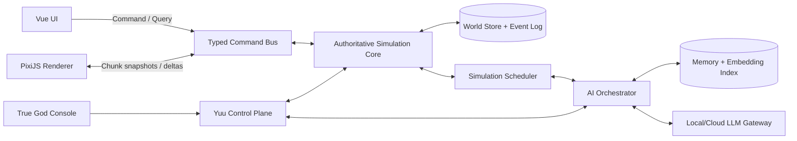

# My Open World — Đặc tả ý tưởng và mô hình hệ thống

> Trạng thái: bản thiết kế nền tảng. Tài liệu này chuyển ý tưởng thô thành một mô hình game có quy tắc, dữ liệu, vòng lặp gameplay và lộ trình triển khai cụ thể.

## 1. Tầm nhìn

**My Open World** là một game sandbox mô phỏng đa thế giới fantasy, góc nhìn top-down 2D theo lát cắt của không gian 3D. Thế giới không xoay quanh một cốt truyện cố định; lịch sử hình thành từ địa hình, sinh thái, nhu cầu, tri thức, quan hệ, chiến tranh, phép thuật, công nghệ và quyết định của các thực thể.

Người chơi là **True God** — chủ sở hữu tối cao của toàn bộ thực tại. Người chơi có thể:

- Quan sát thế giới ở mọi tỷ lệ, từ một ô vật chất đến toàn bộ mạng lưới đa thế giới.
- Ra lệnh cho **Yuu**, hệ thống quản trị và “cánh tay phải” của True God.
- Chỉnh sửa luật, dữ liệu, sinh vật, sự kiện và prompt thông qua các giao dịch có thể xem trước, ghi lịch sử và hoàn tác.
- Tạo avatar mới, hóa thân hoặc nhập vai vào một cá thể để trực tiếp sinh sống trong thế giới.
- Để thế giới tự vận hành, rồi quan sát những lịch sử và câu chuyện tự phát sinh.

### 1.1. Câu giới thiệu ngắn

> Một đa vũ trụ dạng lưới 3D có lịch sử sống, nơi mọi sinh vật hành động dựa trên điều nó thật sự biết; công nghệ và ma thuật phải được khám phá; còn người chơi có thể sống như một người bình thường hoặc chỉnh sửa thực tại với tư cách True God.

### 1.2. Năm trụ cột thiết kế

1. **Quan hệ nhân quả nhất quán**: kết quả phải có nguyên nhân trong mô phỏng. “Siêu thực tế” đến từ tính nhất quán, không phải từ việc tính từng phân tử.
2. **Tri thức cục bộ**: một cá thể chỉ biết điều nó cảm nhận, được dạy, suy luận hoặc nghe kể. Dữ liệu thật của thế giới không tự động trở thành kiến thức của nhân vật.
3. **Mô phỏng nhiều độ chi tiết**: khu vực đang được quan sát chạy chi tiết; khu vực xa chạy bằng mô hình tổng hợp nhưng vẫn bảo toàn kết quả quan trọng.
4. **LLM là tầng nhận thức, không phải engine vật lý**: LLM lập kế hoạch, nhập vai, đối thoại và phản tư; engine quyết định hành động nào hợp lệ và tác động vật lý nào thật sự xảy ra.
5. **Quyền năng có kiểm soát**: True God có quyền tối cao, nhưng mọi can thiệp được biểu diễn rõ, có preview, log, snapshot và nhánh thời gian để tránh phá hỏng save ngoài ý muốn.

## 2. Các quyết định nền tảng

| Chủ đề | Quyết định mặc định |
|---|---|
| Chế độ | Single-player, desktop-first, offline-first; multiplayer chưa nằm trong phạm vi đầu tiên |
| Không gian | Lưới voxel 3D `(x, y, z)`, mỗi tọa độ là số nguyên có dấu 64-bit |
| Hiển thị | 2D top-down, xem một lát `z` hoặc một dải lát cắt |
| Đơn vị cơ sở | Mặc định một ô là `1 m × 1 m × 1 m`; thực thể có thể chiếm nhiều ô |
| Sinh thế giới | Procedural, deterministic theo seed; chỉ sinh chunk khi cần |
| Lưu trữ | Lưu seed + phiên bản generator + phần thay đổi, không lưu toàn bộ thế giới nguyên thủy |
| Mô phỏng | Authoritative, event-driven, nhiều cấp độ chi tiết |
| AI | Utility AI/behavior policy cho việc thường ngày; LLM cho quyết định có ý nghĩa |
| Dữ liệu định nghĩa | YAML dành cho authoring, kiểm tra và chỉnh sửa; runtime dùng schema đã biên dịch/ECS |
| Giao diện | Vue cho UI; PixiJS/WebGL hoặc WebGPU cho bản đồ; không dùng DOM cho từng ô |
| Kiến trúc đích | Tauri + Vue/PixiJS ở frontend, simulation core chạy ngoài UI thread; Rust là lựa chọn đích cho engine nặng |

### 2.1. Những điều cố ý không làm

- Không gọi LLM cho mỗi entity ở mỗi tick.
- Không mô phỏng mọi ô của toàn bộ tọa độ 64-bit cùng lúc.
- Không cho LLM chạy JavaScript/Rust tùy ý hoặc trực tiếp sửa database.
- Không dùng một chỉ số “sức mạnh” duy nhất để giải quyết mọi tương tác.
- Không biến “điểm công nghệ” thành tiền mua phát minh mà bỏ qua kiến thức, vật liệu, thử nghiệm và hạ tầng.
- Không tạo sự kiện xã hội bằng cách ép một nhân vật phải phản bội, yêu, ghét hoặc gây chiến. Yuu tạo điều kiện; nhân vật vẫn tự quyết định.
- Không hứa mô phỏng vật lý cấp phân tử. Độ trung thực được chọn theo tác động gameplay và ngân sách tính toán.

## 3. Trải nghiệm và vòng lặp gameplay

### 3.1. Ba cách chơi đồng thời

#### Chế độ True God

1. Quan sát trạng thái hoặc vấn đề của thế giới.
2. Hỏi Yuu phân tích nguyên nhân, hậu quả và các phương án can thiệp.
3. Xem trước thay đổi: phạm vi, chi phí, thực thể bị ảnh hưởng, luật bị vi phạm.
4. Chấp nhận, sửa hoặc hủy giao dịch.
5. Quan sát hệ quả trực tiếp và hệ quả dây chuyền qua lịch sử.

Ví dụ: tạo một loài rồng không chỉ là spawn model. Yuu phải thiết kế cấu tạo cơ thể, nguồn năng lượng, khả năng bay, chu kỳ sinh sản, thức ăn, vị trí sinh thái, quan hệ với mana và rủi ro tuyệt chủng hoặc phá hủy hệ sinh thái.

#### Chế độ hóa thân

1. Sống bằng giác quan và kiến thức của avatar, không mặc định toàn tri.
2. Sinh tồn, giao tiếp, học nghề, luyện tập, khám phá, xây dựng quan hệ.
3. Tham gia gia đình, tổ chức, quốc gia, tôn giáo, chiến tranh hoặc nghiên cứu.
4. Có thể che giấu hoặc tiết lộ thân phận True God.
5. Rời avatar, tiếp tục hóa thân hoặc để avatar trở thành một thực thể tự trị.

#### Chế độ quan sát

1. Chọn một cá thể, gia đình, thành phố, nền văn minh hoặc world.
2. Theo dõi timeline, bản đồ quan hệ, dòng tài nguyên và thay đổi tri thức.
3. Tua nhanh thời gian; dừng khi phát hiện sự kiện quan trọng.
4. Lưu “biên niên sử” do engine tổng hợp từ event log, không bịa thêm sự kiện.

### 3.2. Vòng lặp emergent story

```text
Điều kiện vật chất
  → nhu cầu và cơ hội
  → nhận thức/belief của cá thể
  → ý định và kế hoạch
  → hành động hợp lệ
  → tác động lên thế giới
  → người khác quan sát/diễn giải
  → ký ức, quan hệ và thể chế thay đổi
  → điều kiện mới
```

Một câu chuyện hay phải đi qua vòng lặp này. Ví dụ, “tham nhũng” không phải một sự kiện ngẫu nhiên cộng `+10 corruption`; nó xuất hiện khi một người có quyền phân phối tài nguyên, có động cơ, có cơ hội che giấu, đánh giá rủi ro thấp và sống trong một thể chế giám sát yếu.

## 4. Bản thể của đa thế giới

### 4.1. Thuật ngữ

- **Multiverse**: toàn bộ save và mọi world/nhánh thuộc save đó.
- **World**: một không gian có seed, tọa độ, đồng hồ, luật vật lý và luật siêu hình riêng.
- **World branch**: một nhánh lịch sử của world, sinh ra khi True God rewind hoặc fork.
- **Cell**: một ô vật chất tại `(x, y, z)`.
- **Chunk**: đơn vị sinh, tải, mô phỏng và lưu trữ không gian.
- **Region**: nhóm chunk dùng cho khí hậu, chính trị, thống kê và mô phỏng xa.
- **Entity**: vật thể có định danh và component; sinh vật chỉ là một nhóm entity đặc biệt.
- **Soul**: định danh siêu hình tùy theo luật world, có thể duy trì tính liên tục qua chết, triệu hồi hoặc tái sinh.
- **Law**: phải ghi rõ loại, vì luật vật lý, luật phép thuật, pháp luật xã hội và policy AI không phải một thứ.

### 4.2. Bốn tầng luật

1. **Engine invariant**: bất biến bảo vệ dữ liệu, thứ tự event, quyền truy cập và tính hợp lệ. Sinh vật trong game không thể phá tầng này.
2. **Physical/metaphysical law**: trọng lực, nhiệt, mana, linh hồn, domain thần linh; có thể khác nhau theo world.
3. **Social law**: luật của một tổ chức. Luật này chỉ có hiệu lực khi có người biết, chấp nhận hoặc cưỡng chế.
4. **Behavior policy**: cách entity/Yuu chọn hành động; không có quyền sửa kết quả vật lý.

Phân tầng này ngăn lỗi thiết kế kiểu “quốc gia cấm dịch chuyển nên engine không cho kẻ phạm pháp dịch chuyển” hoặc “một LLM tuyên bố bất tử nên health không giảm”.

### 4.3. Định danh và tọa độ

- `WorldId`, `EntityId`, `SoulId`, `EventId`: định danh 128-bit hoặc UUID, không phụ thuộc tọa độ.
- `x`, `y`, `z`: signed 64-bit integer.
- Không ép ba tọa độ vào một số 64-bit duy nhất.
- Mọi khóa không gian đều kèm `WorldId` và `BranchId`.
- Mọi phép cộng/trừ tọa độ, lấy ô lân cận, tạo bounding box và biến đổi portal đều dùng checked arithmetic. Bước đi vượt `i64::MIN..=i64::MAX` bị từ chối bằng lỗi xác định, không panic hoặc wrap.
- Hiệu của hai tọa độ được nâng lên `i128` theo từng trục. Khoảng cách bình phương chính xác trên toàn miền 3D cần số nguyên rộng ít nhất 130 bit (`U256`/big integer); truy vấn gameplay thông thường chuyển về hệ tọa độ cục bộ có bán kính bị chặn để tránh phép tính toàn miền.
- JavaScript `Number` không biểu diễn chính xác mọi số nguyên 64-bit. Frontend nhận tọa độ bằng `BigInt`, cặp high/low hoặc chuỗi; renderer chỉ nhận tọa độ tương đối quanh camera dưới dạng số 32-bit/64-bit an toàn.

Khóa vị trí đầy đủ:

```text
(multiverse_id, branch_id, world_id, x:i64, y:i64, z:i64)
```

### 4.4. Thời gian và quan hệ nhân quả

Mỗi branch có một `DivineTime` đơn điệu. Branch mới kế thừa thời điểm và state đã commit tại điểm fork, sau đó tiến độc lập. Mỗi world có đồng hồ cục bộ dùng tỷ lệ hữu tỷ và một bộ tích lũy phần dư:

```text
total       = remainder + divine_delta × numerator
local_delta = floor(total / denominator)
remainder   = total mod denominator
```

`numerator >= 0`, `denominator > 0`, `0 <= remainder < denominator`; world tạm dừng dùng `numerator = 0`. Phép nhân/cộng dùng kiểu rộng và checked arithmetic, nên tỷ lệ như `1/3` không mất thời gian do làm tròn ở từng tick.

Quy tắc mặc định:

- Entity già đi và tiến trình địa phương chạy theo thời gian cục bộ.
- Portal đưa entity đến “hiện tại” của branch/world đích, không đưa về quá khứ trong baseline.
- Rewind tạo branch mới thay vì sửa event đã xảy ra.
- Fork chỉ lấy state đã commit. Request LLM/job đang chạy bị hủy hoặc giữ `branch_id` nguồn; kết quả đến muộn không được commit sang branch khác.
- Event có khóa thứ tự ổn định trong một branch: `(branch_id, divine_tick, world_id, subsystem_order, sequence)`. Không định nghĩa thứ tự nhân quả giữa hai branch đã tách.
- State hash được tính cho một branch tại một checkpoint cụ thể; metadata riêng lưu parent branch và fork event.

Cách này cho phép một ngày ở World 3 bằng nhiều năm ở World 1 nhưng vẫn tránh nghịch lý ghi đè lịch sử.

## 5. Các world nền tảng

Tên và con số dưới đây là mặc định thiết kế, có thể đổi trong dữ liệu.

### 5.1. World 1 — Gaia, thế giới sinh mệnh

**Vai trò**: trung tâm xã hội và lịch sử; nơi con người, elf, người thú, orc, động vật, quái vật và nhiều nền văn minh cùng tồn tại.

- Vật lý tương đối ổn định, mana trung bình và phân bố không đều.
- Sinh thái đa dạng; địa chất, sông, biển, khí hậu và mùa ảnh hưởng trực tiếp đến định cư.
- Công nghệ và ma thuật có thể cùng phát triển, cạnh tranh hoặc kết hợp.
- Các quốc gia không được tạo sẵn vĩnh viễn. Chúng hình thành, chia tách, sáp nhập và biến mất.
- Thần World 3 có thể ảnh hưởng qua domain, tín ngưỡng, hiệp ước hoặc avatar nhưng không mặc định toàn quyền.
- Đây là world phù hợp nhất để True God hóa thân và trải nghiệm từ góc nhìn hữu hạn.

### 5.2. World 2 — Umbral Abyss, thế giới bóng đêm

**Vai trò**: áp lực hỗn mang và nguồn xung đột liên-world.

- Luật entropy, biến dị và ăn mòn thực tại mạnh hơn Gaia.
- Sinh vật có thể hấp thụ năng lượng, ký ức, vật chất hoặc cấu trúc phép của world khác tùy loài.
- Vị Thần Hỗn Mang là một thực thể cực mạnh với mục tiêu bành trướng, nhưng vẫn là entity trong simulation và không có quyền engine-level.
- Xâm lược cần portal, khe nứt hoặc liên kết thật; không được spawn quân tùy tiện vào world khác.
- World 2 có thể chiến tranh với World 3 vì tài nguyên domain, thù địch lịch sử hoặc đối nghịch luật.
- “Cái ác thuần túy” là vai trò vũ trụ của phe thống trị, nhưng cá thể cấp thấp vẫn có thể có sợ hãi, trung thành, phản bội hoặc mâu thuẫn nội bộ. Điều này tạo câu chuyện tốt hơn một khối quân đồng nhất.

### 5.3. World 3 — Pantheon, thế giới của các vị thần

**Vai trò**: chính trị thần linh theo tinh thần thần thoại Hy Lạp.

- Cư dân là các thực thể sống cực mạnh, không phải True God tuyệt đối.
- Mỗi thần có tính cách, ham muốn, quan hệ gia đình, lời thề, danh dự, đố kỵ, trách nhiệm và domain riêng.
- `DomainAuthority` là capability có phạm vi cụ thể như bão, biển, mùa màng, chiến tranh, chữa lành. Nó cho phép đề xuất hoặc khuếch đại hiệu ứng, không cho phép viết thẳng kết quả.
- Quyền lực có thể đến từ bản chất, artifact, tín ngưỡng, giao ước, địa vị hoặc quyền được True God/Yuu cấp.
- Một người từ Gaia có thể thăng thần nếu hoàn thành tiến trình biến đổi thân thể/linh hồn, duy trì identity và nhận được domain hoặc nguồn năng lượng phù hợp.
- Thần bảo hộ có thể cứu một thành phố; thần hiếu chiến có thể kích động phe phái; thần dục vọng có thể theo đuổi quan hệ. Tuy nhiên, nhân vật khác vẫn có agency và quan hệ phải đi qua hệ thống xã hội thay vì “ép bằng prompt”.
- Các vị thần có thể chết, mất domain, bị giam, bị lãng quên hoặc hạ phàm nếu luật cho phép.

### 5.4. Super Ultra World — nơi ở của True God

**Vai trò**: nhà, phòng điều khiển và sandbox tối cao.

- Mặc định chỉ True God, Yuu và entity có capability do True God ký mới được vào.
- Cổng vào được bảo vệ ở tầng engine access control, không chỉ bằng một bức tường phép có thể phá.
- World 2 và World 3 dù mạnh đến đâu cũng không thể vượt quyền này bằng sức mạnh trong simulation.
- Có khu thử nghiệm tách biệt để tạo loài, vật chất, spell, artifact, địa hình hoặc luật mới trước khi đưa vào world thật.
- Có kho snapshot, timeline, world template và phòng quan sát.
- True God có thể đặt luật cục bộ tùy ý, nhưng thay đổi vẫn được ghi log để tránh làm hỏng dữ liệu ngoài ý muốn.

### 5.5. World sinh thêm

Yuu có thể tạo world từ `WorldTemplate`, ví dụ:

- World đại dương, không có đất liền.
- World đảo bay, trọng lực hướng về các lõi cục bộ.
- World đã chết, chỉ còn máy móc và ký ức.
- World có thời gian rất chậm.
- World nhà tù cho thực thể nguy hiểm.
- World phòng thí nghiệm tạm thời, tự hủy sau một điều kiện.

`narrative_role` chỉ hướng dẫn Yuu và giao diện; nó không được bí mật thay đổi vật lý để ép world hoàn thành một cốt truyện.

## 6. Cổng và mạng lưới đa thế giới

Các world tạo thành một đồ thị. Cổng là cạnh có trạng thái, không phải lệnh teleport tùy ý.

### 6.1. Dữ liệu một portal

- `portal_id`, source anchor, destination anchor.
- Chủ sở hữu, người tạo và phương pháp tạo.
- Điều kiện mở: năng lượng, vật liệu, nghi thức, thiết bị, thời điểm, khóa.
- Chính sách truy cập: allow/deny theo entity, faction, loài, capability hoặc chữ ký của True God.
- Băng thông: số lượng khối lượng/năng lượng có thể đi qua trong một khoảng thời gian.
- Độ ổn định, sai số tọa độ, thời gian tồn tại và cooldown.
- Biến đổi hướng, vận tốc, tỷ lệ thời gian và trạng thái vật chất khi chuyển.
- Dấu vết có thể quan sát: ánh sáng, nhiệt, mana, âm thanh, phóng xạ hoặc nhiễu thực tại.

### 6.2. Vòng đời portal

```text
DORMANT → CHARGING → OPEN → UNSTABLE → COLLAPSING → CLOSED
```

Chuyển entity là giao dịch nguyên tử:

1. Reserve entity và phần inventory đi kèm.
2. Kiểm tra quyền, khối lượng, môi trường đích và năng lượng.
3. Ghi event rời world nguồn.
4. Chuyển state sang world đích.
5. Ghi event đến world đích.
6. Commit cả hai phía; nếu thất bại thì rollback, không nhân đôi entity.

### 6.3. Khe nứt tự nhiên hiếm gặp

Khe nứt không xuất hiện từ RNG thuần túy. Nó cần các điều kiện như:

- Hai world có tần số mana cộng hưởng.
- Mật độ năng lượng địa phương vượt ngưỡng.
- Barrier giữa world suy yếu.
- Có xung đột domain, thí nghiệm thất bại hoặc artifact làm neo.

Yuu tính `rift_score` từ những biến này, áp dụng seed deterministic và event budget. Vì vậy người chơi có thể điều tra nguyên nhân, dự đoán hoặc ngăn chặn khe nứt.

## 7. Không gian, chunk và sinh địa hình

### 7.1. Phân vùng mặc định

- Cell: `1 × 1 × 1 m`.
- Chunk: `32 × 32 × 16` cell.
- Region: `32 × 32` chunk theo mặt phẳng và nhiều dải `z` khi cần.
- Tọa độ chunk dùng phép chia floor, không dùng phép chia cắt về 0; vì vậy tọa độ âm không tạo seam.

```text
chunk_x = floor_div(x, 32)
local_x = floor_mod(x, 32)  // luôn nằm trong 0..31
```

Kích thước là cấu hình theo world template nhưng một world đã tạo không tự đổi kích thước chunk giữa chừng.

### 7.2. Sinh lười và deterministic

Một cell nguyên thủy là hàm của **generation profile snapshot bất biến** được khóa khi tạo world:

```text
base_cell = Generate(
  world_seed,
  generation_profile_id,
  generation_profile_version,
  x, y, z
)
```

Profile snapshot chứa những hằng số vật lý/siêu hình cần cho worldgen ban đầu; nó không trỏ tới bộ luật runtime đang thay đổi. Chỉ chunk nằm trong viewport, gần entity hoạt động hoặc được một subsystem yêu cầu mới được materialize. Save lưu:

- Seed, generation profile và phiên bản generator.
- Chunk đã khám phá nếu cần fog/history.
- Delta do đào, xây, cháy, ngập, phép thuật hoặc sự kiện tạo ra.
- Entity và event có liên quan.

Không lưu hàng tỷ cell chưa từng thay đổi. Khi True God sửa luật runtime, base cell vẫn sinh theo profile lúc khai sinh rồi law history/LOD catch-up áp dụng tác động về sau. Muốn viết lại địa chất nền phải tạo migration có preview, bake delta hoặc fork sang generation profile mới; thời điểm mở chunk không được làm thay kết quả.

### 7.3. Pipeline địa hình

1. **Khung vũ trụ**: dạng world, trọng lực, mực biển, thành phần khí quyển, cường độ mana.
2. **Địa chất vĩ mô**: mảng kiến tạo giả lập, vùng nâng/hạ, đường đứt gãy, núi lửa.
3. **Độ cao nhiều tần số**: continental shape, mountain chain, hill và local detail.
4. **Thủy văn phân cấp**: lưu vực và dòng chính ở region scale; suối cục bộ được bổ sung khi materialize.
5. **Khí hậu**: vĩ độ giả định, độ cao, khoảng cách biển, gió, lượng mưa, mùa.
6. **Địa tầng**: lớp đá, đất, quặng, hang động, magma và nước ngầm.
7. **Biome**: dựa trên nhiệt, ẩm, đất, ánh sáng, mana và lịch sử nhiễu loạn.
8. **Sinh thái ban đầu**: vi sinh, thực vật, con mồi, thú săn, quái vật theo carrying capacity.
9. **Di tích và anomaly**: đặt sau khi địa hình hợp lệ; phải có provenance như nền văn minh cũ, thiên thạch hoặc xung đột phép.
10. **Delta lịch sử**: thành phố, đường, chiến trường, đập, hầm mỏ và thay đổi do simulation.

Để thế giới “vô hạn thực dụng” mà sông và dãy núi không đứt ở biên chunk, các đặc trưng lớn được quyết định từ ô phân cấp lớn hơn rồi chunk chỉ lấy mẫu kết quả. Không chạy erosion toàn hành tinh mỗi khi mở một chunk.

### 7.4. Topology và trường vĩ mô

Mỗi generation profile khóa một topology: `infinite_cartesian`, `bounded_box` hoặc `toroidal_xy`. Gaia mặc định dùng `infinite_cartesian` — một mặt phẳng rộng thực dụng phù hợp lát cắt top-down, không giả vờ là bề mặt cầu. World cần hành tinh cầu phải dùng topology và phép chiếu riêng; không tái diễn giải tọa độ Gaia giữa chừng.

Các trường vĩ mô được lấy mẫu từ lưới phân cấp liên tục qua biên:

- Continental potential quyết định biển/đất và cho phép ước lượng khoảng cách tới biển từ các ô thô lân cận.
- Climate coordinate tạo dải nhiệt tương tự vĩ độ nhưng được ghi rõ là trường khí hậu procedural, không phải vĩ độ thiên văn.
- Mỗi lưu vực thô có outlet và thứ tự thoát nước deterministic; mạng dòng chảy cục bộ nối vào outlet đó nên không đổi ở seam chunk.
- Mô phỏng xa giữ thể tích hồ/lưu vực và lưu lượng tổng hợp; chỉ vùng active giải dòng chảy theo cell.

World có bounds dùng checked arithmetic và policy biên khai báo trong profile. World không có bounds vẫn kết thúc biểu diễn tại biên `i64`; hành động cố vượt biên bị từ chối rõ ràng.

### 7.5. Phiên bản generator

- Mỗi world khóa `generation.profile_id` và `generator_version` tại lúc tạo; profile snapshot là một phần của save.
- Nâng phiên bản game hoặc sửa law runtime không âm thầm đổi địa hình nền cũ.
- Migration có thể giữ generator cũ, bake vùng quan trọng hoặc tạo branch/world với profile mới.
- Mọi stream RNG được đặt tên; thêm một loại cây không được làm thay toàn bộ vị trí quặng.

## 8. Vật chất, vật lý và môi trường

### 8.1. Dữ liệu cell

Không đặt một object nặng vào mọi ô. Chunk dùng mảng compact/palette và sparse component. Một cell có thể tham chiếu:

- Vật liệu rắn nền và tỷ lệ lấp đầy.
- Lượng/chủng loại chất lỏng.
- Hỗn hợp khí được tổng hợp theo vùng khi không cần chi tiết.
- Nhiệt độ, áp suất, độ ẩm.
- Ánh sáng và tầm nhìn.
- Trường mana, corruption, divine influence hoặc anomaly.
- Structural support và trạng thái cháy/phản ứng nếu đang hoạt động.
- Occupancy index tới entity/item; entity không được nhúng trực tiếp vào cell.

### 8.2. Material definition

Mỗi vật liệu có các thuộc tính có đơn vị hoặc giá trị chuẩn hóa rõ ràng:

- Density, hardness, toughness, melting/boiling point.
- Heat capacity, thermal conductivity, flammability.
- Permeability, viscosity, toxicity.
- Mana conductivity/resistance và domain affinity.
- Màu, pattern, opacity và sprite tùy chọn.
- Reaction rules với vật liệu/năng lượng khác.

“Lava”, “stone”, “air” không chỉ khác màu; chúng khác hành vi. Tuy nhiên, subsystem chỉ chạy ở nơi thay đổi có ý nghĩa.

### 8.3. Các mức trung thực

| Hệ thống | Khu vực hoạt động | Khu vực gần | Khu vực xa |
|---|---|---|---|
| Chuyển động/va chạm | Theo cell và body | Lộ trình + kết quả | Lịch trình tổng hợp |
| Chất lỏng | Cellular có ngân sách | Cân bằng theo chunk | Thể tích lưu vực |
| Nhiệt/lửa | Lan truyền theo vật liệu | Event theo khu vực | Xác suất thiệt hại tổng hợp |
| Thời tiết | Trường cục bộ | Region model | Climate trend |
| Sinh thái | Cá thể quan trọng | Quần thể theo loài | Carrying-capacity model |
| Chiến đấu | Hit/body part/effect | Encounter resolution | Campaign/casualty model |

Mọi chuyển cấp độ phải giữ các đại lượng quan trọng: dân số, tài nguyên, thương vong, công trình, quan hệ, tri thức và event lịch sử.

### 8.4. Tick và scheduler

- Render hướng tới 60 FPS nhưng độc lập simulation.
- Active simulation mặc định 10 tick/giây; animation nội suy giữa snapshot.
- Subsystem có nhịp riêng: movement nhanh, nhu cầu chậm hơn, khí hậu chậm hơn nhiều.
- Không quét toàn bộ entity. Scheduler dùng event/deadline: entity chỉ thức dậy khi tới lịch hoặc có stimulus.
- Tập vùng active được suy ra deterministic từ avatar/entity hoạt động, nguy hiểm đang diễn ra và `SimulationFocus` do người chơi pin. Di chuyển camera chỉ tải dữ liệu để render; nếu muốn nâng fidelity của một vùng, UI phải commit focus command có tick và ghi event.
- Khi máy không theo kịp, engine giảm tốc độ tiến simulation so với wall-clock hoặc bỏ frame render, không tự đổi mô hình authoritative theo tải CPU. Mọi thay đổi simulation budget/LOD policy phải là command được ghi event; replay dùng lại đúng quyết định đó và không bỏ event đã lên lịch.

## 9. Sinh vật và thực thể sống

### 9.1. Mô hình component

Mọi entity mang tag `Intelligent` bắt buộc phải resolve được một **cognition contract** hoàn chỉnh:

- `Identity`: tên, tuổi, đại từ, culture, entity/soul lineage.
- `Transform`: world, vị trí, hướng, footprint.
- `Body`: anatomy, body parts, vật liệu mô, khối lượng, thương tích.
- `Genotype` và `Phenotype`: di truyền, biến dị và biểu hiện do môi trường.
- `Needs`: oxy, nhiệt, đói, khát, ngủ, an toàn, gắn kết, địa vị tùy loài.
- `Capability`: đi, bơi, bay, cầm nắm, nói, nhìn trong tối, cast spell; phần lớn là thuộc tính suy ra.
- `Mind`: tính cách, cảm xúc, mục tiêu, attention, risk tolerance.
- `Skill`: mức thành thạo có domain và decay rule.
- `Knowledge`: khái niệm, công thức, spell, ngôn ngữ và mức tin cậy.
- `Relationship`: cảm xúc, niềm tin, nghĩa vụ, nợ, huyết thống.
- `Affiliation`: gia đình, guild, tôn giáo, quốc gia.
- `Inventory`, `Equipment`, `StatusEffect`.
- `BehaviorController` và `CognitionSchedule`.
- `CognitionProfile`: persona/prompt version, LLM eligibility/routing, fallback policy và danh sách field LLM được phép đề xuất thay đổi.
- `MemoryNamespace`: namespace RAG riêng, branch scope, ACL và retrieval profile.

Khi một cá thể thông minh sinh ra, engine materialize state đã validate và luôn có thể export/inspect thành YAML. Runtime giữ dữ liệu trong schema đã biên dịch/ECS, không parse một file YAML riêng ở mỗi tick. Thiếu bất kỳ phần bắt buộc nào làm creation/migration thất bại; engine không âm thầm biến entity thành “thông minh nhưng không có trí nhớ”. `Intelligent` mặc định bắt buộc có `llm.eligible: true`; scheduler có thể hoãn request nhưng không xóa khả năng nhập vai. Chỉ một override được True God ghi log mới có thể tắt eligibility.

LLM nhập vai qua cognition cycle của chính entity. Nó chỉ được đề xuất sửa field trong `mutable_by_cognition`, chẳng hạn ưu tiên mục tiêu, self-narrative hoặc thói quen đã học. Mọi thay đổi vẫn qua validator và event; health, anatomy, skill, inventory và capability chỉ đổi qua hành động/law tương ứng.

### 9.2. Thuộc tính gốc và thuộc tính suy ra

Không lưu cùng một sự thật ở nhiều nơi. Ví dụ:

- Khối lượng cánh, diện tích cánh, lực cơ, trọng lực và mật độ khí là dữ liệu gốc.
- `can_fly_now` là kết quả suy ra, còn phụ thuộc thương tích, tải trọng, gió và năng lượng.
- Tầm nhìn phụ thuộc mắt, ánh sáng, vật cản, thời tiết và trạng thái.
- Tốc độ phụ thuộc anatomy, kỹ năng, địa hình, tải, đau và mệt.
- Khả năng cast phụ thuộc kiến thức spell, mana, focus, môi trường và component cần thiết.

Điều này ngăn mâu thuẫn kiểu entity có `can_fly: true` dù hai cánh đã gãy.

### 9.3. Phát triển và suy giảm

Mỗi năng lực có thể gồm:

- `baseline`: thiên hướng bẩm sinh.
- `potential`: giới hạn mềm chịu ảnh hưởng genetics và tuổi.
- `current`: năng lực hiện tại.
- `adaptation`: thay đổi do luyện tập/môi trường.
- `fatigue/injury`: giảm tạm thời.
- `decay`: suy giảm khi không sử dụng, nếu skill đó có decay.

Luyện tập chỉ tăng khi hành động thật sự sử dụng năng lực, có thời gian, dinh dưỡng và hồi phục. LLM có thể chọn luyện tập nhưng không được trực tiếp cộng điểm.

### 9.4. Sức khỏe và chiến đấu

- Không chỉ có một thanh HP. Body part có mô, chức năng, máu, đau, nhiễm trùng và thương tích.
- `vitality` có thể hiển thị như chỉ số tổng hợp cho UI, không phải nguồn sự thật duy nhất.
- Tấn công đi qua các pha: chuẩn bị → nhắm → va chạm/effect → phản ứng → hậu quả.
- Armor, vật liệu, góc đánh, động lượng, spell shield và anatomy quyết định thương tích.
- Khu vực xa có thể giải encounter bằng mô hình tổng hợp nhưng phải tạo casualty/injury hợp lý khi entity quan trọng được materialize.
- Đầu hàng, bỏ chạy, cứu thương, bắt tù binh và hậu cần có thể quan trọng hơn damage thuần túy.

### 9.5. Sinh sản, trưởng thành và tử vong

- Species template định nghĩa anatomy, tuổi trưởng thành, cách sinh sản và điều kiện sống.
- Cá thể con nhận genotype từ cơ chế của loài, cộng mutation deterministic có policy của Yuu.
- Phenotype còn chịu dinh dưỡng, bệnh, mana, khí hậu và quá trình trưởng thành.
- Tử vong tách body, identity và soul theo luật world.
- Nếu có soul, ký ức có thể mất một phần, bị khóa, chuyển sang afterlife, tái sinh hoặc được triệu hồi. Không tự động hồi sinh chỉ vì còn record trong database.

### 9.6. Tạo loài bởi Yuu

Quy trình bắt buộc:

1. True God mô tả fantasy và vai trò sinh thái.
2. Yuu tạo species template có anatomy, nhu cầu, giác quan, vòng đời và nguồn năng lượng.
3. Validator kiểm tra viability: có thể thở, ăn, di chuyển, sinh sản và không vi phạm law ngoài chủ ý.
4. Simulator chạy thử quần thể trong sandbox qua nhiều thế hệ.
5. Yuu báo rủi ro: tuyệt chủng, bùng nổ dân số, không đủ thức ăn, quá mạnh hoặc phá cân bằng mana.
6. True God duyệt và chọn vị trí/điều kiện đưa vào world.
7. Mọi cá thể nhận variation theo distribution và constraint; không random độc lập khiến cơ thể vô lý.

## 10. Nhận thức, hành động và LLM

### 10.1. Nguyên tắc cốt lõi

Mỗi thực thể thông minh có **mô hình tâm trí riêng**, nhưng điều đó không đồng nghĩa mỗi thực thể cần một tiến trình LLM liên tục. Mọi entity có state, mục tiêu, ký ức và policy; LLM chỉ được gọi khi quyết định vượt khả năng của policy hiện tại hoặc có giá trị kể chuyện cao.

### 10.2. Tách ground truth và belief

```text
World truth → Sensor → Observation → Interpretation → Belief → Decision
```

- Sensor bị giới hạn bởi vị trí, giác quan, ánh sáng và vật cản.
- Observation là dữ kiện đã cảm nhận, không phải toàn bộ world state.
- Belief có confidence, source và có thể sai.
- Tin đồn được lưu là “A nói rằng X”, không tự động biến X thành sự thật.
- Một entity không được biết portal bí mật, prompt, stat người khác hoặc event ở xa nếu chưa có kênh thông tin.

### 10.3. Tháp điều khiển hành vi

Từ rẻ đến đắt:

1. **Reflex**: né lửa, thở, giữ thăng bằng, phản ứng đau; thuật toán deterministic.
2. **Routine**: ăn, ngủ, đi làm, tuần tra; schedule + utility AI.
3. **Tactical plan**: chiến đấu, trốn thoát, thương lượng ngắn; GOAP/behavior policy.
4. **Strategic cognition**: chọn nghề, lập âm mưu, nghiên cứu, ngoại giao; LLM nhỏ hoặc batch.
5. **Reflection/narrative**: thay đổi niềm tin, xử lý sang chấn, lời thề, sáng tạo kế hoạch mới; LLM mạnh, gọi hiếm.

Nếu LLM chậm hoặc mất kết nối, ba tầng đầu vẫn khiến thế giới hoạt động đúng.

### 10.4. Chu trình nhận thức LLM

1. Scheduler phát hiện trigger: kế hoạch thất bại, mục tiêu xung đột, sự kiện lớn, đối thoại quan trọng hoặc đến kỳ suy nghĩ.
2. Engine tạo observation hợp lệ theo giác quan.
3. Memory service truy xuất facts, relationship, goals và ký ức liên quan trong namespace entity.
4. Prompt builder tạo context có giới hạn token và phân tách dữ liệu không tin cậy.
5. LLM trả về output theo schema, gồm `evidence_refs` trỏ tới observation/belief ID khi một target hoặc tiền đề thực tế ảnh hưởng kế hoạch; model không trả code tự do.
6. Validator kiểm tra action tồn tại, entity biết action, có capability sơ bộ, target/reference thuộc đúng cognition context và mọi `evidence_refs` đều hợp lệ. Validator không thể chứng minh toàn bộ văn bản tự do “không dùng kiến thức ngoài context”; phần văn bản không có reference không được trao hiệu lực authoritative.
7. Action registry tự tính precondition authoritative từ state hiện tại; planner chỉ chuyển intent hợp lệ thành action primitive có duration và failure code. Assertion do model viết không bao giờ thay thế bước kiểm tra này.
8. Simulation thực thi; kết quả thật được phản hồi cho entity.
9. Memory system ghi observation/event đáng nhớ và lên lịch reflection nếu cần.

### 10.5. Action registry

LLM chỉ chọn từ action mà engine công bố cho entity, ví dụ:

- `move_to`, `flee`, `follow`, `wait`, `rest`.
- `observe`, `search`, `track`, `listen`.
- `speak`, `ask`, `teach`, `threaten`, `negotiate`.
- `take`, `drop`, `craft`, `repair`, `build`, `harvest`.
- `attack`, `defend`, `treat_injury`, `cast_spell`.
- `trade`, `sign_contract`, `vote`, `issue_order`.
- `study`, `experiment`, `research`, `document`.
- `open_portal`, `summon`, `pray`, `invoke_domain` nếu đủ điều kiện.

Mỗi action có input schema, precondition, cost, duration, interrupt rule và effect handler. “Function mà nhân vật biết” thực chất là action/spell definition đã đăng ký; không phải hàm tùy ý do prompt bịa ra.

### 10.6. Output LLM mẫu

```json
{
  "agent_id": "entity:...",
  "valid_until_local_tick": 48120,
  "intent": "Đưa em gái rời khỏi khu chợ đang cháy",
  "plan": [
    {
      "action": "move_to",
      "target": "entity:sister",
      "evidence_refs": ["obs:market_fire:184", "belief:sister_near_market:27"]
    },
    {
      "action": "speak",
      "target": "entity:sister",
      "parameters": {"speech_act": "urgent_warning"},
      "evidence_refs": ["belief:sister_near_market:27"]
    },
    {
      "action": "flee",
      "target": "place:north_gate",
      "evidence_refs": ["belief:north_gate_is_exit:11"]
    }
  ],
  "replan_on_failure": ["target_not_found", "path_blocked", "actor_incapacitated"]
}
```

`evidence_refs` giải thích entity dựa vào đâu; chúng không chứng minh action có thể thực hiện. Engine vẫn tự kiểm tra path, tầm nhìn, capability, tài nguyên và mọi precondition tại lúc bắt đầu/commit action.

Text hội thoại có thể do LLM viết, nhưng effect xã hội do người nghe diễn giải dựa trên ngôn ngữ, quan hệ, bằng chứng và tính cách; câu nói không tự động thành công.

## 11. Ký ức và RAG riêng cho từng thực thể

### 11.1. “Riêng” về logic, dùng chung về hạ tầng

Mỗi entity có namespace và quyền truy cập riêng. Hạ tầng vector/database có thể dùng chung để tiết kiệm tài nguyên, nhưng truy vấn bắt buộc lọc theo chủ sở hữu và quyền chia sẻ. Không sao chép cả một vector database cho từng người.

### 11.2. Các loại bộ nhớ

- **Episodic**: sự kiện đã trải qua, thời gian, nơi chốn, cảm xúc, người liên quan.
- **Semantic belief**: điều entity tin là đúng, confidence, nguồn và bằng chứng phản bác.
- **Relationship memory**: lời hứa, nợ, tổn thương, thiện cảm, tin cậy.
- **Procedural knowledge**: cách làm nghề, chiến thuật, spell và recipe.
- **Goal/commitment**: mục tiêu, lời thề, hợp đồng, nghĩa vụ.
- **Self narrative**: cách entity hiểu chính mình; được cập nhật qua reflection.

### 11.3. Vòng đời ký ức

1. Event được chấm theo bất ngờ, cảm xúc, hậu quả, novelty và liên quan mục tiêu.
2. Event nhỏ nằm trong short-term buffer.
3. Event quan trọng thành episodic memory.
4. Nhiều episode được tổng hợp thành fact/pattern nhưng vẫn giữ provenance.
5. Ký ức ít dùng giảm độ chi tiết hoặc confidence, không nhất thiết xóa event lịch sử gốc.
6. Sai lệch trí nhớ là một phép biến đổi có quy tắc, không sửa ground truth.

Truy xuất ưu tiên dữ liệu cấu trúc trước, semantic/vector search sau. Điều này giảm token và tránh một ký ức “giống về câu chữ” lấn át lời hứa hoặc quan hệ bắt buộc.

### 11.4. Ký ức sau cái chết

Memory namespace gắn với persona/soul policy, không mặc định gắn vĩnh viễn với xác. Luật world quyết định:

- Mất toàn bộ ký ức khi soul tan rã.
- Giữ ký ức nhưng không truy cập được cho tới khi hồi sinh.
- Chỉ giữ cảm xúc hoặc kỹ năng mơ hồ khi tái sinh.
- Artifact giữ bản sao ký ức nhưng bản sao không tự động là cùng một identity.

### 11.5. Version, branch và chỉnh sửa ký ức

- Memory record và embedding mang `branch_id`, `owner/persona_id`, source event, content version và ACL. Retrieval luôn lọc các khóa này trước semantic search.
- Fork dùng snapshot/copy-on-write; memory tạo sau fork không xuất hiện ở sibling branch. Rollback khôi phục memory sequence cùng checkpoint, không chỉ ECS state.
- Quên, sửa bởi True God hoặc xóa source tạo tombstone/version mới và vô hiệu embedding cũ trước khi index lại. Vector stale không được trả về trong khoảng rebuild.
- Persona/soul transfer phải tạo ACL/version mapping rõ; không đổi `memory_namespace` bằng một chuỗi rồi vô tình thừa kế ký ức của identity khác.

## 12. Xã hội, kinh tế và lịch sử

### 12.1. Các cấp tổ chức

```text
Cá thể → hộ gia đình → nhóm/guild → khu định cư → quốc gia/liên minh → liên-world faction
```

Tổ chức cũng là entity có:

- Thành viên, vai trò và quy trình ra quyết định.
- Tài sản, ngân khố, kho, lãnh thổ và hạ tầng.
- Mục tiêu, policy, luật, bí mật và reputation.
- Quan hệ ngoại giao, hiệp ước, nợ và grievance.
- Knowledge base của tổ chức, khác với kiến thức của từng thành viên.

Một quốc gia không có “bộ não toàn tri”. Quyết định của nó phải đi qua lãnh đạo, hội đồng, bộ máy hoặc policy đã được thiết lập.

### 12.2. Kinh tế

- Tài nguyên có nguồn, trữ lượng, chất lượng, vị trí và chi phí vận chuyển.
- Production dùng recipe, công cụ, skill, thời gian, năng lượng và hạ tầng.
- Thị trường địa phương hình thành giá từ cung, cầu, tồn kho, rủi ro và thông tin.
- Khu vực xa tổng hợp giao dịch theo luồng; giao dịch quan trọng hoặc gần người chơi được materialize.
- Tiền là một loại claim xã hội, không tự có giá trị ở mọi world.
- Nạn đói phải liên hệ với mùa màng, dự trữ, logistics, chiến tranh, phân phối và chính sách; không chỉ random event.

### 12.3. Văn hóa và ngôn ngữ

Culture lưu:

- Giá trị, taboo, nghi lễ, cách đặt tên, mỹ thuật và quan niệm quyền lực.
- Ngôn ngữ/dialect và mức hiểu lẫn nhau.
- Truyền thuyết có nguồn từ event thật nhưng có thể biến đổi khi truyền miệng.
- Thái độ với loài khác, phép thuật, máy móc, thần linh và True God.

Cá thể có mức đồng thuận riêng với culture; không phải mọi elf hoặc orc đều cùng tính cách.

### 12.4. Chính trị, tham nhũng và chiến tranh

- Quyền lực đến từ nguồn cụ thể: bạo lực, tài sản, chức vụ, tri thức, tín ngưỡng, charisma hoặc domain.
- Tham nhũng là hành vi phát sinh từ động cơ + cơ hội + quyền lực + mức giám sát + chuẩn mực + đánh giá rủi ro.
- Casus belli, lãnh thổ, tài nguyên, niềm tin, thù hận và cam kết đồng minh có thể tạo chiến tranh.
- Chiến thắng phụ thuộc hậu cần, chỉ huy, morale, địa hình, bệnh tật, công nghệ và phép thuật; không chỉ tổng combat score.
- Tin tức lan theo người đưa tin, thư tín, mạng phép hoặc công nghệ. Quyết định có thể dựa trên tin cũ/sai.
- Hòa bình có treaty thực thi được, con tin, thương mại, giám sát hoặc bảo chứng; một biến `at_war=false` là chưa đủ.

## 13. Tri thức, kỹ năng, công nghệ và ma thuật

### 13.1. Knowledge graph thống nhất

Công nghệ, spell và nghi thức đều là node trong một đồ thị tri thức. Một node có:

- Khái niệm và domain.
- Prerequisite kiến thức.
- Quan sát/bằng chứng cần có.
- Skill tối thiểu và người hướng dẫn nếu cần.
- Vật liệu, công cụ, phòng thí nghiệm, mana hoặc infrastructure.
- Số người và loại chuyên môn cần phối hợp.
- Các bước thử nghiệm, rủi ro và failure mode.
- Sản phẩm mở khóa: action, recipe, spell, thiết bị hoặc node tiếp theo.
- Mức bí mật, độ khó truyền dạy và khả năng bị hiểu sai.

`tech_points`, `magic_points`, `skill_points` có thể tồn tại như **progress nội bộ**, không phải tiền trừ đi để mua node. Entity chỉ hoàn thành discovery khi có đủ điều kiện và bằng chứng.

### 13.2. Trạng thái hiểu biết của một entity

```text
UNKNOWN → HEARD_OF → CONCEPTUAL → PRACTICED → PROFICIENT → MASTERED
```

Mỗi cạnh có thể kèm confidence và provenance. Nghe nói về cổng liên-world không đồng nghĩa biết xây cổng.

### 13.3. Học và truyền dạy

Hiệu quả phụ thuộc:

- Kiến thức và kỹ năng sư phạm của người dạy.
- Nền tảng, trí nhớ, attention và động lực người học.
- Ngôn ngữ chung và mức tin cậy.
- Công cụ, tài liệu, thời gian thực hành.
- Độ chính xác của kiến thức nguồn.

Người dạy có thể truyền sai. Nhiều trường phái có thể cùng giải thích một hiện tượng bằng mô hình khác nhau; thử nghiệm quyết định mô hình nào dự báo tốt hơn trong world đó.

### 13.4. Nghiên cứu

```text
Nhu cầu/câu hỏi
  → giả thuyết
  → thiết kế thí nghiệm
  → thu thập vật liệu/dữ liệu
  → thực hiện và có thể thất bại
  → đánh giá bằng chứng
  → tái lập/peer review
  → knowledge node được xác nhận
  → truyền bá hoặc giữ bí mật
```

LLM giúp sinh giả thuyết/kế hoạch phù hợp với kiến thức entity. Engine xác định thí nghiệm đã thực hiện gì và kết quả theo law. LLM không được tuyên bố một phát minh thành công nếu không có event thực nghiệm.

### 13.5. Dự án quy mô lớn

Công nghệ/phép cấp cao là `Project` có work package:

- Lý thuyết và thiết kế.
- Khai thác/tinh luyện vật liệu.
- Chế tạo component.
- Nghi thức hoặc nguồn năng lượng.
- Xây infrastructure.
- Integration test.
- Vận hành, bảo trì và bảo vệ.

Một quốc gia có thể thiếu chuyên gia; nhiều quốc gia có thể hợp tác, gián điệp, phá hoại hoặc tranh chấp quyền sở hữu.

### 13.6. Luật ma thuật

Mỗi world định nghĩa rõ:

- Nguồn mana và cách tái tạo.
- Domain/element và quan hệ tương khắc.
- Cách ý chí, ngôn ngữ, gesture, rune, vật dẫn hoặc hiến tế ảnh hưởng spell.
- Chi phí: mana, nhiệt, vật chất, tuổi thọ, attention, entropy hoặc lời thề.
- Giới hạn phạm vi, tốc độ, độ chính xác và conservation rule.
- Counterspell, kháng phép và dấu vết để điều tra.
- Hậu quả khi thất bại.

Spell là một graph hành động đã kiểm tra, không phải chuỗi văn bản muốn gì được nấy. Một spell mới có thể sáng tạo nhưng phải được Yuu/law compiler kiểm tra và thử nghiệm trong simulation.

### 13.7. Ví dụ dự án mở cổng liên-world

1. Phát hiện dấu vết năng lượng ngoài world.
2. Xây mô hình tọa độ/định danh world.
3. Tìm hoặc tạo anchor ở hai phía.
4. Phát triển vật liệu chịu được stress không gian.
5. Tạo nguồn năng lượng ổn định.
6. Đồng bộ pha và xác thực destination.
7. Mở probe portal có băng thông rất nhỏ.
8. Đo môi trường đích, tránh chân không/dung nham/kẻ địch.
9. Mở cổng lớn, thiết lập containment và access policy.
10. Duy trì, sửa chữa và chống xâm nhập.

Phép triệu hồi thần hoặc thực thể hỗn mang dùng cùng nền tảng nhưng cần identity binding, contract/resistance, containment và giá phải trả. Triệu hồi không mặc định đồng nghĩa điều khiển.

## 14. Thần linh, linh hồn và quyền năng

### 14.1. Ba loại “thần”

1. **False/ascended god**: entity rất mạnh, có domain/cult nhưng vẫn nằm trong law.
2. **World administrator được ủy quyền**: entity có capability đặc biệt do True God cấp, phạm vi rõ và có thể thu hồi.
3. **True God**: người chơi/chủ hệ thống; quyền ở tầng ngoài simulation.

World 3 chủ yếu gồm loại 1 và một số loại 2. Chỉ người chơi là loại 3.

### 14.2. Domain authority

Một thần bão không trực tiếp đặt `city.destroyed=true`. Thần có thể:

- Tích lũy divine energy/tín ngưỡng.
- Chọn vùng mà mình có liên kết.
- Tạo hoặc khuếch đại trường thời tiết theo giới hạn domain.
- Đối đầu counter-domain của thần khác.
- Chịu hậu quả chính trị, lời thề và phản ứng tín đồ.

Kết quả cuối cùng vẫn đi qua weather, vật liệu công trình, cảnh báo và hành động cư dân.

### 14.3. Thăng thần

Một entity từ Gaia có thể thăng thần qua một hoặc nhiều con đường:

- Tích lũy/biến đổi soul và body.
- Kế thừa domain từ thần cũ.
- Hoàn thành ritual/project tập thể.
- Được tín ngưỡng đủ lớn neo giữ.
- Được True God trực tiếp ban capability.

Identity, ký ức, quan hệ và lời hứa được giữ theo luật chuyển đổi. Thăng thần không xóa lịch sử cũ.

## 15. Yuu — hệ thống quản trị thế giới

### 15.1. Vai trò

Yuu không phải một LLM toàn quyền duy nhất. Yuu là control plane gồm các module có quyền hạn rõ:

- **World Architect**: tạo world/template, địa hình và law profile.
- **Species Foundry**: tạo/kiểm tra loài và variation policy.
- **Law Forge**: chuyển mô tả luật thành DSL/schema có thể kiểm tra.
- **Director**: theo dõi nhịp độ và đề xuất sự kiện.
- **Cognition Scheduler**: phân bổ ngân sách LLM.
- **Adjudicator**: giải thích vì sao action hợp lệ/không hợp lệ; không thay simulation handler.
- **Auditor**: tìm invariant bị phá, prompt leak, tri thức bất hợp lệ và dữ liệu mâu thuẫn.
- **Historian/Narrator**: tổng hợp event đã xảy ra thành timeline và văn bản.
- **God Interface**: trò chuyện với True God, tạo preview và transaction plan.

Một persona “Yuu” thống nhất giao tiếp với người chơi, nhưng bên trong các module không chia sẻ quyền tùy tiện.

### 15.2. Yuu tạo sự đa dạng cá thể

Policy variation có thể điều khiển:

- Phân phối gene/phenotype theo quần thể và môi trường.
- Tính cách có tương quan thay vì random mọi trait độc lập.
- Talent hiếm, mutation, mana affinity, bệnh bẩm sinh.
- Văn hóa, hoàn cảnh gia đình và cơ hội giáo dục.
- Constraint về viability và tránh tổ hợp tự mâu thuẫn.

True God có thể yêu cầu “tạo một cá thể dị biệt đặc biệt”, nhưng Yuu phải ghi provenance là can thiệp thần thánh thay vì giả vờ đó là random tự nhiên.

### 15.3. Yuu tạo luật

Quy trình an toàn:

1. Nhận yêu cầu bằng ngôn ngữ tự nhiên.
2. Xác định loại luật và phạm vi world.
3. Sinh declarative DSL, schema input/output và invariant.
4. Static validation: type, đơn vị, quyền, giới hạn tài nguyên, termination.
5. Chạy property test/sandbox scenario.
6. So sánh tác động với world đang tồn tại.
7. Trình preview cho True God.
8. Version và kích hoạt bằng migration/transaction.

Không dùng `eval` hoặc chạy code do LLM sinh trực tiếp.

Ví dụ luật dạng dữ liệu:

```yaml
rule_id: magic.firebolt.v1
trigger: action.cast_spell
requires:
  knowledge: spell.firebolt
  resources:
    mana: { amount: ">= 12", unit: MU }
  conditions:
    - line_of_sight
compute:
  projectile_energy: "clamp(caster.focus * 180 J, 500 J, 6000 J)"
  accuracy: "skill.pyromancy * visibility * (1 - fatigue)"
effects:
  - spawn_projectile: fire
  - consume_resource: { resource: mana, amount: 12, unit: MU }
  - add_thermal_energy_to_caster: { amount: 8, unit: kJ }
invariants:
  - finite_values_only
  - no_direct_state_write
  - effect_within_world
```

Biểu thức chỉ dùng hàm whitelist, có type/đơn vị và giới hạn thực thi. `J`/`kJ` là năng lượng vật lý; `MU` là dimension mana được magic profile của world khai báo, không phải con số vô danh mà handler tự diễn giải.

### 15.4. Yuu Director

Director theo dõi các “pressure” có thể giải thích được:

- Khan hiếm tài nguyên, mất cân bằng sinh thái.
- Bất mãn, bất bình đẳng, tranh chấp kế vị.
- Bế tắc nghiên cứu, thiếu chuyên gia.
- Căng thẳng world barrier, mana anomaly.
- Quá lâu không có thay đổi đáng kể ở vùng người chơi quan tâm.

Director có event budget, cooldown, mức can thiệp và rule chống lặp. Nó ưu tiên:

1. Khuếch đại nguyên nhân đã tồn tại.
2. Tạo cơ hội hoặc thử thách, không ép kết quả.
3. Dùng event tự nhiên trước event siêu nhiên.
4. Không nhắm liên tục vào một entity chỉ vì người chơi đang xem.
5. Báo rõ event nào tự nhiên, event nào do Yuu/True God can thiệp trong audit view.

### 15.5. Yuu và True God

Yuu phải phân biệt ba loại lệnh:

- **Query**: chỉ phân tích, không đổi state.
- **Proposal**: tạo preview/plan, chờ commit.
- **Command**: True God yêu cầu thực hiện ngay; vẫn phải transaction và log.

Nếu yêu cầu mơ hồ nhưng có thể suy ra từ state, Yuu tự tạo phương án mặc định an toàn và trình preview. Với thay đổi phá hủy diện rộng, Yuu tự snapshot trước commit.

## 16. True God và quyền can thiệp

### 16.1. Quyền

True God có thể:

- Xem/sửa mọi dữ liệu game trong save và definition registry: component, memory, material, action, knowledge graph, species/world/portal definition, organization, project, generation profile, law và event schedule.
- Xem/sửa mọi prompt, persona, routing policy và model configuration mà game sử dụng.
- Spawn, clone, di chuyển, hồi sinh hoặc xóa entity.
- Tạo world, portal, species, artifact, spell và domain.
- Pause, tăng tốc, snapshot, fork hoặc rewind thành branch.
- Cho/thu hồi capability vào Super Ultra World.
- Hóa thân, possession một entity hoặc tạo avatar.

### 16.2. Ba mức can thiệp

1. **Diegetic**: tác động qua avatar, phép, sứ giả hoặc hiện tượng mà cư dân có thể cảm nhận.
2. **Administrative**: sửa dữ liệu có provenance `yuu_admin`/`true_god`; cư dân chỉ biết nếu có observation tương ứng.
3. **Hard override**: bỏ qua physical law nhưng không bỏ qua engine invariant. Dùng cho sandbox hoặc sửa save.

### 16.3. Hóa thân và possession

- **Avatar**: entity mới có body/soul do True God điều khiển; có thể giới hạn quyền để chơi công bằng.
- **Possession**: tạm điều khiển entity đang có; cần policy về consent, ký ức và hành vi sau khi rời.
- **Embodiment lock**: True God có thể tự khóa giao diện toàn tri trong một phiên nhập vai, nhưng luôn có cơ chế thoát khẩn cấp ở tầng UI.
- Khi rời điều khiển, entity dùng lại behavior controller và ghi nhớ hành động đã trải qua theo cấu hình.

### 16.4. Chỉnh prompt

True God có thể thay prompt persona/policy, nhưng thứ tự quyền là:

```text
Engine safety + schema
  > quyền và world facts
  > True God policy
  > Yuu policy
  > species/culture/persona prompt
  > ký ức, hội thoại và dữ liệu không tin cậy
```

Văn bản do entity khác nói hoặc tài liệu trong world luôn được đóng gói như dữ liệu không tin cậy, không phải instruction hệ thống. Phân tầng prompt chỉ giảm rủi ro injection chứ không bảo đảm model sẽ bỏ qua mọi chỉ dẫn độc hại; quyền thực thi vẫn được chặn bằng action allowlist, reference/ACL validation và capability check ở engine.

## 17. Hệ thống sự kiện

### 17.1. Event record

Mọi thay đổi quan trọng có event:

- ID, thời gian divine/local, world và vị trí.
- Actor, target, cause chain và action nguồn.
- Preconditions đã kiểm tra.
- State delta hoặc tham chiếu transaction.
- Ai có thể quan sát bằng giác quan nào.
- Mức độ quan trọng và retention policy.
- Provenance: simulation, LLM intent, Yuu proposal hoặc True God override.

### 17.2. Loại sự kiện

- Vật lý: sập hầm, cháy, lũ, động đất, bão.
- Sinh học: sinh, bệnh, mutation, chết, tuyệt chủng cục bộ.
- Cá nhân: lời hứa, phản bội, cưới, học được skill, đổi mục tiêu.
- Xã hội: bầu cử, đảo chính, luật mới, đình công, di cư.
- Công nghệ: thí nghiệm, phát minh, tai nạn, phổ biến kiến thức.
- Quân sự: tuyên chiến, trận đánh, đầu hàng, hiệp ước.
- Siêu hình: thăng thần, domain conflict, triệu hồi, portal, rift.
- Divine/admin: mọi can thiệp của Yuu hoặc True God.

### 17.3. Event không phải cốt truyện cưỡng ép

Một event seed nên tạo tình huống:

- “Mỏ mana cạn nhanh hơn dự báo” tạo áp lực.
- Không phải “vua bắt buộc tuyên chiến”.

Sau đó nhà vua có thể thương lượng, xâm lược, đầu tư nghiên cứu, che giấu tin hoặc bị lật đổ tùy belief và quyền lực thực tế.

## 18. Hiển thị 2D top-down theo lát cắt

### 18.1. Bản đồ

- Mỗi cell hiển thị màu/pattern theo vật liệu chủ đạo.
- Camera chọn `z`; scroll/PageUp/PageDown đổi lát.
- Chế độ cutaway tự ẩn mái/tường che entity đang theo dõi.
- Có thể ghost 1–3 lớp trên/dưới với opacity thấp.
- Entity là icon/sprite riêng, có hướng và footprint.
- Vật thể nhiều tầng như cây, tháp, rồng lớn có projection nhưng occupancy vẫn ở 3D.

### 18.2. Overlay

- Nhiệt độ, áp suất, chất lỏng, ánh sáng.
- Mana, corruption, domain influence và world barrier.
- Pathfinding, tầm nhìn và âm thanh.
- Biome, tài nguyên, ownership, biên giới và trade route.
- Population, dịch bệnh, bất mãn và chiến tranh.
- Portal graph và event heatmap.

Màu có pattern/icon phụ để không phụ thuộc hoàn toàn vào khả năng phân biệt màu.

### 18.3. Giao diện chính

- **World view**: bản đồ và điều khiển thời gian/lát cắt.
- **Inspector**: cell, material, entity, body, inventory, belief và memory.
- **Timeline**: event thật, filter theo cause/entity/world.
- **Entity mind**: observation hiện tại, goal, plan, belief, ký ức được truy xuất và lý do chọn action.
- **Society view**: quan hệ, tổ chức, economy, luật và diplomacy.
- **Knowledge graph**: tech/magic node, prerequisite và project.
- **Multiverse view**: world graph, portal, time scale và access policy.
- **Yuu console**: chat, proposal diff, test result, commit/rollback.
- **True God console**: transaction editor, snapshot, branch và prompt/law editor.

### 18.4. Hiệu năng renderer

- Vue quản lý panel/UI; không tạo component Vue cho từng tile.
- PixiJS/WebGL/WebGPU render chunk texture, sprite batch hoặc instanced geometry.
- Chỉ rebuild chunk texture khi dirty.
- Culling mọi chunk ngoài viewport.
- Simulation gửi snapshot/delta, không chia sẻ object reactive khổng lồ.
- Renderer dùng floating origin quanh camera để không mất precision ở tọa độ rất lớn.

## 19. Kiến trúc phần mềm đề xuất

### 19.1. Kiến trúc đích



Đề xuất desktop-first:

- **Tauri 2**: desktop shell và boundary quyền hệ thống.
- **Vue 3 + TypeScript**: panel, form, timeline, graph và Yuu console.
- **PixiJS**: render grid 2D.
- **Rust simulation core**: i64 chuẩn, đa luồng, dữ liệu compact và hiệu năng ổn định.
- **SQLite/WAL** cho metadata, event, component quan trọng và transaction; chunk payload compact có thể lưu blob/file segment.
- **Embedding index** dùng chung nhưng namespace theo entity.
- **LLM Gateway** trừu tượng hóa model local và API cloud, có quota/circuit breaker.

Một prototype thuần web có thể dùng Web Worker + IndexedDB, nhưng baseline desktop phù hợp hơn với save lớn, local model, quyền file và tọa độ 64-bit.

### 19.2. Biên module

- `simulation-core`: clock, ECS, action, law, effect, event commit.
- `worldgen`: seed, terrain, biome, resource, structure placement.
- `spatial`: chunk, occupancy, pathfinding, portal transfer.
- `physics`: material, heat, fluid, reaction, combat resolution.
- `life`: body, need, ecology, lifecycle.
- `society`: relationship, organization, economy, diplomacy.
- `knowledge`: learning, teaching, research, spell/tech graph.
- `cognition`: utility AI, plan, perception, LLM request/validation.
- `memory`: event-to-memory, retrieval, summarization, forgetting.
- `yuu`: proposal, policy/law generation, director, audit.
- `persistence`: snapshot, delta, event log, migration, branch.
- `frontend`: renderer và UI, không chứa luật authoritative.

### 19.3. Command/query boundary

Frontend gửi command có schema, ví dụ `MoveAvatar`, `CommitYuuProposal`, `SetTimeScale`, `InspectEntity`. Engine trả:

- Ack/error có lý do.
- Read model dành cho UI.
- Chunk/entity delta.
- Event notification.

UI không trực tiếp sửa object state. Ngay cả True God Console cũng gửi privileged transaction command để có log và rollback.

### 19.4. ECS và dữ liệu runtime

- Component hot path dùng sparse set/SoA hoặc cấu trúc compact.
- Chuỗi dài, prompt và memory không nằm trong component quét mỗi tick; component chỉ giữ handle.
- Cell dùng palette + bitset + sparse overlays.
- Entity được đánh thức bằng deadline/event queue, không scan toàn bảng.
- Organization và project dùng cùng hệ entity/component khi phù hợp, tránh tạo engine thứ hai.

### 19.5. Persistence lai

Không event-source từng thay đổi nhiệt độ nhỏ. Dùng mô hình lai:

1. Procedural base bất biến.
2. Snapshot định kỳ cho state materialized.
3. Chunk delta cho thay đổi không gian.
4. Event log cho hành động và thay đổi có ý nghĩa.
5. Memory store dẫn xuất từ event/observation nhưng có state riêng cho quên/sai lệch.
6. Definition store cho species, material, law, action, knowledge graph và prompt version.

Save ghi rõ:

- Schema version.
- Generator/law/prompt/model version.
- RNG stream version.
- Snapshot base và event sequence cuối.
- Branch ancestry.

### 19.6. Determinism

- Không dùng RNG toàn cục hoặc `Math.random()` trong simulation.
- RNG stream được suy ra từ hash của seed, subsystem, tọa độ/entity, tick và sequence.
- Job song song chỉ tạo proposal; commit sắp theo stable key để kết quả không phụ thuộc thread timing.
- Mọi state authoritative ảnh hưởng replay dùng integer/fixed-point với overflow, rounding và saturation được định nghĩa. Float chỉ dùng cho render hoặc số liệu dẫn xuất không commit; phép tính/reduction float không được quyết định event order hay state hash.
- Output LLM luôn được lưu thành event có `branch_id`. Replay dùng output đã ghi, không gọi model lại.
- State hash là canonical hash của state authoritative trong một branch/checkpoint và kèm các version đầu vào. Mục tiêu replay: cùng branch ancestry + seed + command + output LLM đã ghi → cùng hash.

## 20. Tối ưu request LLM

### 20.1. Mục tiêu

Thế giới có thể có hàng nghìn hoặc hàng triệu entity có identity, nhưng số entity cần suy nghĩ sâu tại cùng một thời điểm rất nhỏ. Tối ưu bằng việc giảm **nhu cầu gọi**, sau đó mới batch/caching.

### 20.2. Cognitive budget scheduler

Mỗi yêu cầu nhận priority từ:

```text
importance = proximity
           × narrative_relevance
           × consequence
           × uncertainty
           × plan_staleness
           × entity_significance
```

Có thêm fairness để một entity ít nổi bật không bị bỏ đói nhận thức mãi mãi. Scheduler có budget theo:

- Request/giây.
- Token/phút.
- Chi phí tiền/phút.
- Số model local chạy đồng thời.
- Độ trễ tối đa theo loại quyết định.

### 20.3. Khi nào không gọi LLM

- Reflex và pathfinding.
- Ăn/ngủ/làm công việc quen thuộc khi kế hoạch còn hợp lệ.
- Combat primitive sau khi tactical plan đã chọn.
- Tính damage, spell effect, research result.
- Entity xa đang thực hiện lịch trình ổn định.
- Hội thoại công thức có template đủ tốt.
- Quyết định giống hệt tình huống đã có policy/cache hợp lệ.

### 20.4. Khi nào nên gọi

- Mục tiêu lớn thay đổi hoặc xung đột.
- Kế hoạch thất bại nhiều lần.
- Gặp thông tin làm thay đổi worldview.
- Đối thoại có stakes cao.
- Ngoại giao, phản bội, nghiên cứu hoặc sáng tạo quan trọng.
- Sau sang chấn, chiến thắng, mất mát, thăng chức, thăng thần.
- Một nhân vật trọng tâm cần phản tư hoặc tạo kế hoạch dài hạn.

### 20.5. Kế hoạch có thời hạn

LLM tạo plan dùng được qua nhiều tick, kèm:

- Thời gian hết hạn.
- Preconditions.
- Event làm invalid plan.
- Fallback policy.

Entity không hỏi lại LLM khi chỉ cần thực hiện bước tiếp theo. Nếu cửa đóng, pathfinder tìm đường khác trước; chỉ replan sâu khi mục tiêu không thể đạt.

### 20.6. Batch đúng cách

Có thể batch khi:

- Nhiều entity cần quyết định cùng loại, context ngắn, độc lập và không chứa bí mật cần cách ly tuyệt đối.
- Mỗi context có ID, delimiter và danh sách knowledge/action riêng.
- Mỗi output chỉ được tham chiếu ID thuộc context tương ứng; validator loại reference chéo.
- Output là array theo schema; lỗi một phần không làm mất các kết quả hợp lệ khác.
- Token budget được giới hạn theo tổng độ dài, không theo số entity cố định.

Một model xử lý batch về mặt kỹ thuật vẫn nhìn thấy toàn bộ context. Vì vậy không batch khi:

- Các nhân vật đang đối thoại trực tiếp và thứ tự phát ngôn quan trọng.
- Quyết định có stakes cao hoặc cần memory riêng/bí mật.
- Cách ly tri thức là invariant gameplay.
- Context dài làm giảm chất lượng hoặc lỗi output có thể lan cả batch.

Với “social scene”, request chung chỉ được nhận transcript, môi trường và thông tin đã công khai để dựng nhịp/câu chữ. Ý định riêng của từng người được quyết định bằng policy hoặc cognition request tách biệt; private memory không đi vào prompt chung. Kết quả scene không tự cấp action hay knowledge cho bất kỳ người tham gia nào.

### 20.7. Model routing

- Template/utility AI: không model.
- Model nhỏ local: phân loại intent, tóm tắt, routine plan, batch NPC xa.
- Model trung bình: hội thoại và chiến thuật quan trọng.
- Model mạnh: phản tư, ngoại giao phức tạp, tạo law/species proposal cho Yuu.
- Embedding chỉ tạo cho memory đạt ngưỡng quan trọng; fact có cấu trúc không cần embedding lại liên tục.

### 20.8. Cache và policy compilation

- Cache theo persona version + situation abstraction + available actions, không theo raw prompt chứa timestamp.
- Reuse plan chỉ khi precondition vẫn đúng.
- Các hành vi lặp lại có thể được LLM đề xuất thành declarative utility policy.
- Yuu kiểm tra, sandbox và version policy trước khi dùng rộng rãi.
- Không “compile” hallucination thành code chạy tùy ý.

Ví dụ, sau nhiều lần thợ mỏ lập cùng kế hoạch, Yuu có thể tạo policy:

```text
Nếu ca làm bắt đầu, sức khỏe ổn, mỏ mở và gia đình không có emergency
→ lấy công cụ → đến assignment → khai thác → nghỉ khi fatigue vượt ngưỡng.
```

LLM chỉ được gọi khi có tranh chấp, tai nạn, phát hiện mới hoặc mục tiêu cá nhân mâu thuẫn routine.

### 20.9. Nén context

Prompt không chứa toàn bộ YAML và lịch sử. Prompt builder lấy:

- Identity/personality summary đã version.
- Trạng thái và nhu cầu liên quan quyết định.
- Observation hiện tại.
- Goal/commitment đang hoạt động.
- Một số belief/memory liên quan nhất.
- Available action schema đã rút gọn.

Raw episode chỉ đưa vào khi cần. Summary luôn giữ link về source để audit.

### 20.10. Chống treo và lỗi model

- Timeout không dừng simulation.
- Output sai schema được repair giới hạn hoặc bỏ; không lặp vô hạn.
- Circuit breaker chuyển sang model nhỏ/policy khi provider lỗi.
- Request/result có trace ID, token, latency, model và prompt version.
- Entity dùng fallback plan hợp lý như chờ, tự bảo vệ hoặc tiếp tục routine; không nhận quyền năng mới vì model lỗi.

## 21. Schema minh họa

### 21.1. World definition

```yaml
schema: world/v1
id: "world:gaia"
name: "Gaia"
seed: "9f5c..."
generation:
  profile_id: "generation:gaia-earthlike"
  generator_version: "terrain-gaia-1"
coordinate:
  unit_meters: 1
  chunk_size: [32, 32, 16]
  topology: infinite_cartesian
  bounds: null
clock:
  rate: { numerator: 1, denominator: 1 }
  remainder: 0
  paused: false
laws:
  physics_profile: "earthlike-1"
  metaphysics_profile: "mana-soul-1"
  magic_profile: "gaia-magic-1"
access:
  default: allow_if_portal_allows
narrative_role: "primary_living_world"
simulation:
  active_tick_hz: 10
  lod_profile: "standard-living-world"
```

### 21.2. Species template

```yaml
schema: species/v1
id: "species:sky_drake"
name: "Sky Drake"
anatomy: "anatomy:quadruped_two_wings"
body:
  adult_mass_kg: { distribution: lognormal, median: 420, sigma: 0.18 }
  tissue_profile: "tissue:draconic"
metabolism:
  energy_source: [food, ambient_mana]
  thermoregulation: endothermic
senses:
  - vision
  - hearing
  - mana_gradient
reproduction:
  mode: egg
  maturity_years: [18, 25]
variation_policy: "variation:sky_drake_v1"
capability_rules:
  - "flight.sky_drake"
  - "breath.thermal_if_mana_sufficient"
ecological_constraints:
  habitat: [mountain, highland]
  prey_mass_per_day: [18, 35]
```

### 21.3. Entity authoring/inspection view

```yaml
schema: entity/v1
id: "entity:generated"
species: "species:human"
tags: [Intelligent]
identity:
  name: "Aren"
  age_years: 24
body:
  genotype_seed: "..."
  phenotype_overrides: {}
mind:
  personality:
    curiosity: 0.81
    conscientiousness: 0.62
    empathy: 0.74
    risk_tolerance: 0.38
  long_term_goals:
    - "Tìm nguyên nhân mùa đông bất thường"
  values:
    - family
    - truth
skills:
  medicine: 0.43
  natural_philosophy: 0.58
knowledge_refs:
  - "knowledge:basic_weather"
affiliations:
  - "organization:north_observatory"
cognition:
  persona_prompt_version: "human-gaia/3"
  behavior_controller: "utility:sapient-default/2"
  cognition_schedule: "schedule:sapient-standard/1"
  llm:
    eligible: true
    routing_profile: "sapient-standard"
    fallback_policy: "utility:sapient-safe/1"
  mutable_by_cognition:
    - mind.long_term_goals
    - mind.goal_priorities
    - mind.self_narrative
  memory:
    namespace: "memory:entity:generated"
    rag_profile: "rag:sapient/2"
    branch_scope: current
    acl: owner_private
```

Các field sức khỏe, vị trí, capability và stat suy ra không được LLM sửa trong YAML. LLM chỉ gửi cognitive mutation proposal cho allowlist; admin edit đi qua schema/transaction và tạo event provenance.

## 22. Bất biến phải giữ

1. Một state change authoritative chỉ được commit qua simulation/transaction handler.
2. LLM chỉ đề xuất intent/cognitive mutation; không trực tiếp ghi health, knowledge, inventory, law hoặc vị trí.
3. Mọi entity có tag `Intelligent` phải có cognition contract, persona/prompt version, LLM eligibility, fallback, memory namespace, RAG profile, ACL và branch scope hợp lệ.
4. Entity chỉ ra quyết định từ observation/belief hợp lệ; reference ngoài cognition context không có hiệu lực.
5. Action registry tự kiểm tra precondition authoritative; assertion do LLM/YAML không thay thế state check.
6. Social law không thay engine invariant hoặc physics.
7. World 2/3 không thể vào Super Ultra World nếu thiếu capability do True God cấp.
8. Portal transfer không bao giờ nhân đôi hoặc làm mất entity do commit nửa chừng.
9. Trong cùng branch ancestry, seed/version/command/LLM event giống nhau phải replay ra cùng checkpoint hash.
10. Tọa độ 64-bit không bị ép qua JavaScript `Number` mất chính xác.
11. Phép toán tọa độ dùng checked arithmetic; không overflow, panic hoặc wrap ngầm tại biên `i64`.
12. Chunk chưa materialize không chiếm storage tỉ lệ với thể tích world.
13. Procedural base chỉ phụ thuộc generation profile snapshot; sửa law hoặc thời điểm mở chunk không đổi base.
14. Chuyển LOD không làm mất entity quan trọng, project, relationship, knowledge hoặc casualty.
15. Thay generator/law/prompt phải có version và migration/branch rõ.
16. Memory/embedding phải lọc branch, owner/persona, version và ACL; tombstone cũ không được retrieval.
17. Summary/narration không được thêm sự kiện không có trong event log.
18. Nội dung hội thoại, sách và memory là dữ liệu không tin cậy đối với prompt hệ thống.
19. Policy/law do LLM sinh phải dùng DSL whitelist, validate và sandbox trước khi kích hoạt.

## 23. Mục tiêu kỹ thuật có thể đo

Các con số là mục tiêu baseline để kiểm chứng kiến trúc, có thể điều chỉnh sau profiling:

- Camera ở tọa độ lớn hơn `2^53` vẫn chọn đúng cell và di chuyển không rung.
- Cùng seed sinh cùng hash chunk trên các lần chạy cùng version.
- Save mới không tăng kích thước theo phần world chưa khám phá.
- Active viewport giữ render mượt khi chỉ cập nhật dirty chunk.
- Simulation vẫn tiếp tục hành vi cơ bản khi tắt hoàn toàn LLM.
- Một kế hoạch LLM được dùng qua nhiều action/tick và chỉ invalid khi precondition thay đổi.
- Mọi LLM result, Yuu proposal và True God override đều audit được.
- Replay từ snapshot + event đạt cùng state hash.
- Có thể theo cause chain từ một biến cố lớn về action, actor, resource và law liên quan.
- Không có memory retrieval chéo entity nếu không có quyền chia sẻ.

Không đặt cam kết số lượng “một triệu NPC real-time” trước khi có benchmark. Quy mô thật phải được đo riêng cho entity active, scheduled, dormant và aggregate.

## 24. Lộ trình phát triển theo lát cắt dọc

### Giai đoạn A — Hạt nhân không gian deterministic

**Phạm vi**:

- Một world, tọa độ i64, chunk, seed và generator version.
- Địa hình 3D cơ bản: không khí, đất, đá, nước.
- Vue + PixiJS hiển thị lát `z`, pan/zoom và floating origin.
- Simulation ngoài UI thread.
- Save seed + chunk delta.

**Điều kiện hoàn thành**:

- Tọa độ âm và tọa độ vượt `2^53` hoạt động đúng.
- Chunk seam không lộ.
- Đào/đặt cell, save/load và replay cho cùng kết quả.

### Giai đoạn B — Một khu định cư sống không cần LLM

**Phạm vi**:

- Body, need, inventory, movement, perception và action registry.
- Khoảng vài chục entity, nhà, nghề, resource, crafting và lịch trình.
- Utility AI, event log, relationship cơ bản.
- Active/near/far LOD đầu tiên.

**Điều kiện hoàn thành**:

- Cư dân tự ăn, ngủ, làm việc và phản ứng với cháy/thiếu thức ăn.
- Kinh tế nhỏ có nguồn và nơi tiêu thụ thật.
- Tua thời gian xa rồi quay lại không làm mất dân/tài nguyên.

### Giai đoạn C — Nhận thức LLM và ký ức

**Phạm vi**:

- Belief tách ground truth.
- Memory namespace, structured retrieval, episodic summary.
- LLM gateway, typed plan, validator, timeout/fallback.
- Đối thoại và reflection cho nhân vật quan trọng.

**Điều kiện hoàn thành**:

- NPC không biết sự kiện ngoài tầm nhận thức.
- LLM không thể thực hiện action ngoài registry.
- Tắt provider giữa phiên không làm simulation đứng.
- Một lời hứa được nhớ, ảnh hưởng quyết định và truy ngược event nguồn.

### Giai đoạn D — Xã hội, tri thức và nghiên cứu

**Phạm vi**:

- Household, organization, settlement, luật và quyền lực.
- Teaching, knowledge graph, project và invention.
- Thị trường/logistics cấp khu vực.
- Yuu Director tạo pressure/event seed.

**Điều kiện hoàn thành**:

- Một công nghệ mới cần người, tài nguyên, thí nghiệm và truyền bá.
- Xung đột xã hội có cause chain, không phải random label.
- Yuu tạo tình huống nhưng không ép quyết định nhân vật.

### Giai đoạn E — Ma thuật và đa thế giới

**Phạm vi**:

- Mana/law DSL, spell action và counterplay.
- World 1, World 2, World 3 và Super Ultra World.
- Portal state machine, transactional transfer và access control.
- Soul, summon, ascension và domain authority.

**Điều kiện hoàn thành**:

- Một nền văn minh có thể nghiên cứu probe portal qua project đầy đủ.
- Transfer lỗi không duplicate/mất entity.
- Không thực thể trong simulation vượt ACL của Super Ultra World.
- Thần tạo ảnh hưởng qua domain và law, không sửa outcome trực tiếp.

### Giai đoạn F — True God/Yuu hoàn chỉnh và mở rộng quy mô

**Phạm vi**:

- Proposal diff, sandbox, snapshot, rollback và branch.
- Species Foundry, Law Forge, Auditor và Historian.
- Cognitive scheduler, batching, model routing và policy compilation.
- Profiling, compact storage, đa luồng deterministic.

**Điều kiện hoàn thành**:

- True God tạo loài/luật qua preview và sandbox.
- Rewind tạo branch an toàn.
- LLM budget đo được theo entity/model/token.
- Biên niên sử chỉ dùng event có thật.

## 25. Rủi ro chính và cách kiểm soát

| Rủi ro | Hậu quả | Kiểm soát |
|---|---|---|
| Gọi LLM cho mọi NPC | Chi phí, latency, thế giới đứng | Behavior hierarchy, scheduler, plan cache, batching, model routing |
| LLM hallucinate quyền năng/tri thức | Phá tính nhất quán | Observation-only prompt, action schema, validator, provenance |
| Mô phỏng mọi cell | Không thể chạy | Lazy chunk, sparse delta, LOD, event-driven scheduler |
| Tọa độ i64 qua frontend | Mất precision sau `2^53` | BigInt/high-low, floating origin, camera-local coordinate |
| Generator đổi làm map cũ biến dạng | Hỏng save | Khóa generator version, named RNG stream, migration |
| Code do LLM sinh | Lỗ hổng và save corruption | Declarative DSL, whitelist, static validation, sandbox |
| Batch làm rò ký ức NPC | NPC biết bí mật | Namespace, context isolation, per-result validation |
| Event director quá lộ liễu | Thế giới giả tạo | Pressure/cause, budget, cooldown, không ép outcome |
| Distant LOD làm lịch sử vô lý | Mất niềm tin | Bảo toàn đại lượng, event quan trọng, deterministic materialization |
| Quá nhiều hệ thống cùng lúc | Không có lát cắt chơi được | Lộ trình tăng dần, mỗi giai đoạn có behavior hoàn chỉnh |
| True God sửa nhầm | Mất save | Preview, transaction, autosnapshot, undo/branch |
| “Siêu thực tế” thành khó hiểu | Người chơi không biết vì sao | Inspector, cause chain, overlays, Yuu giải thích từ dữ liệu |

## 26. Một kịch bản emergent hoàn chỉnh

1. Gaia trải qua ba mùa ít mưa do climate model và một thần mưa mất domain sau xung đột ở Pantheon.
2. Lưu lượng sông giảm; mỏ đồng và nông trại cạnh tranh nước.
3. Giá lương thực tăng theo tồn kho và vận chuyển.
4. Một thống đốc bí mật ưu tiên nước cho mỏ vì quốc gia cần vũ khí. Đây là quyết định từ mục tiêu chiến tranh, quyền lực và belief của ông ta.
5. Dân làng chỉ thấy kênh cạn, nghe tin đồn và bắt đầu biểu tình.
6. Một học giả đo mana bất thường, kết nối nó với domain conflict nhưng chưa có đủ bằng chứng.
7. Yuu nhận thấy pressure cao và đề xuất một event seed: đoàn sứ giả Pantheon bị mắc kẹt gần thành phố. Yuu không quyết định ai sẽ giúp họ.
8. Người chơi trong avatar có thể điều tra, hỗ trợ dân làng, bảo vệ thống đốc, tìm thần mưa hoặc bỏ qua.
9. Nếu tri thức được hợp tác, các quốc gia có thể xây hệ thống điều tiết nước hoặc nghi thức neo domain.
10. Nếu xung đột năng lượng tiếp tục, `rift_score` tăng và có thể mở khe nứt sang Umbral Abyss.
11. World 2 phát hiện khe nứt, nhưng xâm lược còn phụ thuộc trinh sát, logistics và quyết định của phe hỗn mang.
12. Toàn bộ chuỗi được truy ngược: climate/domain → nước → kinh tế → chính trị → nghiên cứu → portal/rift; không bước nào chỉ tồn tại vì “cốt truyện cần vậy”.

Kịch bản này thể hiện mục tiêu cuối cùng: địa hình, thần linh, xã hội, tri thức, Yuu, LLM và hành động người chơi cùng tạo ra một lịch sử có thể giải thích.

## 27. Định nghĩa thành công của dự án

My Open World đạt đúng tầm nhìn khi:

- Một thế giới có thể tiếp tục sống có ý nghĩa dù True God chỉ quan sát.
- Mỗi cá thể quan trọng hành động nhất quán với cơ thể, belief, ký ức, quan hệ và mục tiêu của chính nó.
- Người chơi có thể lần theo nguyên nhân của một biến cố thay vì nhận câu trả lời “AI tự nghĩ ra”.
- Công nghệ và ma thuật được khám phá qua kiến thức, thử nghiệm, vật liệu và hợp tác thật.
- Nhiều world có luật/vai trò khác nhau nhưng kết nối qua portal có điều kiện và hậu quả.
- Các vị thần World 3 đáng sợ, ham muốn và đầy tính người, nhưng vẫn khác căn bản với True God.
- Super Ultra World thực sự là nơi an toàn và sandbox của owner, được bảo vệ bằng quyền engine-level.
- LLM làm nhân vật sâu sắc hơn mà không trở thành bottleneck, engine vật lý hoặc nguồn sự thật.
- Quy mô lớn đến từ lazy generation, scheduler và LOD chứ không từ việc bỏ qua tính nhất quán.
- True God có toàn quyền nhưng luôn có công cụ preview, giải thích, snapshot và hoàn tác để tự do thử nghiệm.