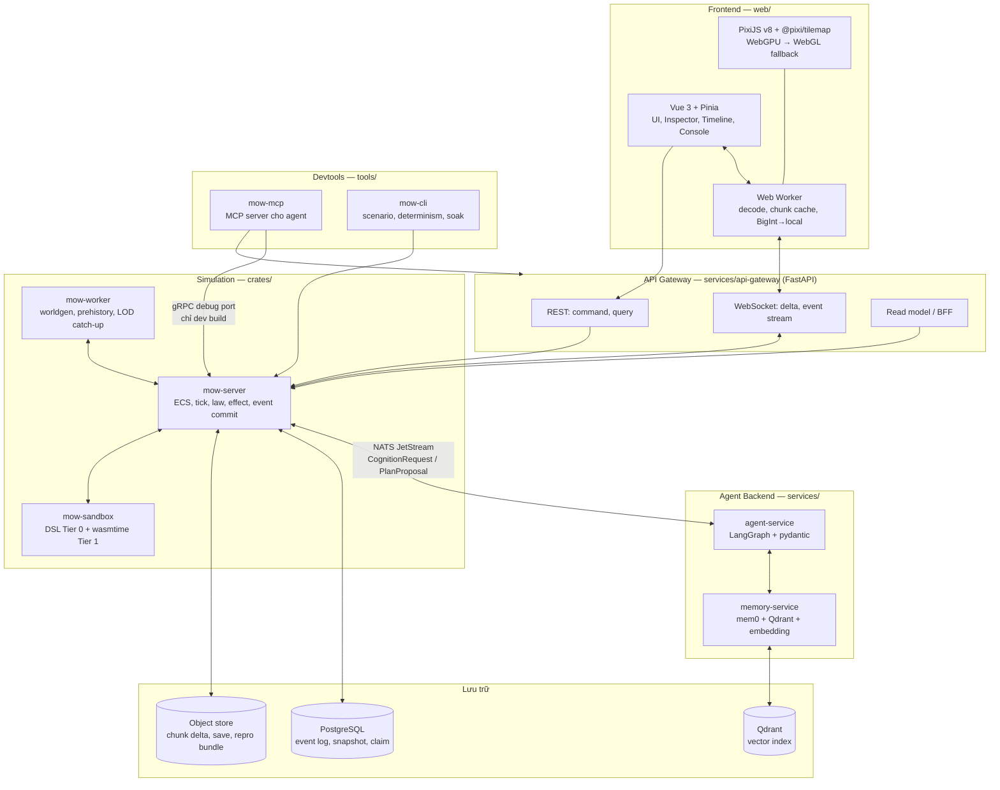

# My Open World — Kế hoạch triển khai

> Trạng thái: bản kế hoạch kỹ thuật. Tài liệu này chuyển đặc tả trong `docs/idea.md` thành kiến trúc phần mềm, cấu trúc thư mục, quy ước và lộ trình thi công cụ thể.
>
> Mọi tham chiếu dạng `§x.y` trỏ tới `docs/idea.md`. Khi hai tài liệu mâu thuẫn, `idea.md` là nguồn sự thật về **luật của thế giới**, còn tài liệu này là nguồn sự thật về **cách xây phần mềm**.

---

## 1. Nguyên tắc chỉ đạo

1. **Một nguồn quyền lực duy nhất.** `sim-core` (Rust) là nơi duy nhất được commit state authoritative. Mọi thứ khác — LLM, gateway, frontend, devtool, plugin — chỉ **đề xuất** và **đọc**. Đây là §22.1 và §22.2 được biến thành ranh giới tiến trình, không chỉ là quy ước code.
2. **Đứng trên vai người khổng lồ.** Không tự viết ECS, vector DB, orchestration LLM, renderer, hay sandbox WASM. Chỉ tự viết phần *luật của thế giới này* mà không thư viện nào có.
3. **Schema là hợp đồng.** Không có struct nào được định nghĩa hai lần bằng tay ở hai ngôn ngữ. Một nguồn định nghĩa → sinh mã cho Rust, Python, TypeScript.
4. **Determinism là tính năng cấp một.** Nó không phải mục tiêu "nice to have" cuối dự án; nó là thứ được kiểm tra tự động từ commit đầu tiên.
5. **Harness kiểm thử được xây trước, không phải sau.** Xem §7. Đây là điều kiện để một agent có thể tự vào thế giới kiểm tra thay vì bắt người ngồi chơi thử.
6. **Mọi bug đều phải có repro bundle.** Không có bug nào tồn tại dưới dạng "tôi thấy nó lạ lạ".

---

## 2. Kiến trúc tổng thể



### 2.1. Ranh giới trách nhiệm

| Thành phần | Sở hữu | **Không bao giờ** được làm |
|---|---|---|
| `sim-core` | ECS, tick, law, effect, event commit, chunk, portal, persistence, invariant | Gọi LLM trực tiếp; render; biết về HTTP |
| `sim-worker` | Job nặng deterministic: worldgen, tiền sử, LOD catch-up, pathfinding batch | Commit state — nó trả **proposal** về core |
| `api-gateway` | Auth, session, REST/WS, read model, rate limit, aggregate | Chứa luật game; sửa state trực tiếp |
| `agent-service` | Cognition cycle: build context → LLM → validate → typed plan | Ghi state; đọc dữ liệu ngoài observation của entity |
| `memory-service` | Lưu/truy xuất ký ức, ACL, branch filter, tombstone | Trả về ký ức của entity khác chủ (§22.16) |
| `web` | Render, UI, input | Chứa luật authoritative (§19.2) |
| `mow-devtool` | Inspect, drive, assert, snapshot, repro | Tồn tại trong build production |

**Quy tắc vàng:** nếu một thay đổi state không đi qua `sim-core`'s transaction handler thì đó là bug, không phải tính năng.

---

## 3. Quyết định tech stack

### 3.1. Bảng chốt

| Lớp | Chọn | Lý do | Phương án đã cân nhắc và loại |
|---|---|---|---|
| Sim core | **Rust** + `bevy_ecs` (standalone) | ECS trưởng thành, ergonomic, dùng kiểu Rust thường, chạy headless tốt | `hecs` (quá tối giản, thiếu scheduler), `flecs-rs` (binding C++, khó kiểm soát determinism), Go/C# (mất kiểm soát bộ nhớ và fixed-point) |
| Sandbox luật | **`wasmtime`** (fuel metering, epoch interruption) | Đúng contract §13.9.3: giới hạn nhiên liệu, bộ nhớ, import tường minh | `mlua` (vi phạm §13.9.2: thứ tự `pairs()` không xác định) |
| RPC | **gRPC** (`tonic` ↔ `grpcio`/`betterproto`) | Schema-first, streaming hai chiều, codegen 3 ngôn ngữ | REST thuần (mất streaming), GraphQL (thừa) |
| Event bus / job queue | **NATS JetStream** | Stream bền, consumer group, replay theo sequence, tự host nhẹ | Redis Streams (chấp nhận được, là fallback), Kafka (quá nặng cho single-player desktop) |
| IDL | **Protobuf** cho RPC, **JSON Schema** cho content pack | Hai loại hợp đồng khác nhau nên dùng hai IDL phù hợp | Một IDL cho cả hai (proto không diễn đạt tốt ràng buộc content) |
| Agent orchestration | **LangGraph** + **Pydantic v2** | Graph có state, checkpoint, retry; pydantic ép schema output | Tự viết loop (mất checkpoint/retry), CrewAI (quá opinionated) |
| API | **FastAPI** + `uvicorn` | Async, pydantic native, OpenAPI tự sinh | Litestar (tốt nhưng hệ sinh thái nhỏ hơn) |
| Memory | **mem0** + **Qdrant** + embedding model | Có sẵn extraction/consolidation; Qdrant filter payload mạnh | Chỉ Qdrant thuần (phải tự viết lớp trích xuất), Chroma (yếu về filter multi-tenant) |
| Frontend | **Vue 3 + TS + Vite + Pinia** | Đúng yêu cầu, TS-first, Pinia gọn | — |
| Renderer 2D | **PixiJS v8** + `@pixi/tilemap` | Renderer thuần, nhỏ hơn ~3× và nhanh hơn ~2× Phaser cho vẽ thuần; WebGPU có fallback WebGL; **ta không cần physics/scene của Phaser vì sim nằm ở Rust** | Phaser (thừa toàn bộ tầng game logic), Three.js ortho (thừa 3D), Canvas 2D (không đủ throughput) |
| UI kit | **Naive UI** + Tailwind | TS-first, tree-shake tốt, đủ table/tree cho Inspector | PrimeVue (nặng hơn), tự viết (lãng phí) |
| Biểu đồ | **uPlot** (chuỗi thời gian), **ECharts** (còn lại) | uPlot cực nhanh cho timeline dài | Chart.js (chậm ở N lớn) |
| Config Rust | `figment` + `serde` + `garde` + `schemars` | Layer env/yaml/default, validate, sinh JSON Schema | `config-rs` (thiếu validate tích hợp) |
| Config Python | `pydantic-settings` v2 | Cùng mô hình validate với phần còn lại | dynaconf (validate yếu hơn) |
| Prompt | YAML + **Jinja2** + registry có version | Đúng yêu cầu; version hóa theo §22.15 | f-string (không version được) |
| DB | **PostgreSQL** (event log, snapshot, claim, index) | Giao dịch thật, `jsonb`, partition theo branch | SQLite (đủ cho desktop single-player — xem §3.3) |
| Object store | Filesystem (dev) / S3-compatible (server) | Chunk delta và repro bundle là blob | — |
| Observability | OpenTelemetry + Jaeger + Prometheus | Trace từ command → event → effect | — |
| Đóng gói desktop | **Tauri v2** | §2 của idea.md: desktop-first, offline-first | Electron (nặng) |

### 3.2. Vì sao tách Rust và Python

Ranh giới không phải sở thích ngôn ngữ mà là **ranh giới determinism**:

- Phía Rust: mọi thứ phải replay ra cùng hash. Fixed-point, checked arithmetic, thứ tự ổn định, không I/O ngẫu nhiên.
- Phía Python: mọi thứ **vốn dĩ** không deterministic (LLM). Vì thế output của nó được **ghi lại thành event** và replay dùng bản ghi, không gọi lại model (§19.6).

Đặt hai thứ này vào một tiến trình là cách nhanh nhất để mất khả năng replay.

### 3.3. Hai hình thái triển khai

Cùng một codebase, hai cách đóng gói:

- **Desktop single-player (mặc định theo §2)**: Tauri bundle gồm `mow-server` chạy local, SQLite thay Postgres, NATS nhúng hoặc kênh in-process, agent-service chạy local hoặc trỏ ra API bên ngoài.
- **Server mode (phát triển và test)**: docker-compose đầy đủ. Đây là hình thái mà harness và CI dùng.

Khác biệt chỉ nằm ở lớp cấu hình và adapter persistence, không ở luật.

---

## 4. Hợp đồng và sinh mã

### 4.1. Nguyên tắc: định nghĩa một lần

```text
proto/*.proto ────────────► Rust (prost/tonic)
                       ├──► Python (betterproto → pydantic)
                       └──► TypeScript (ts-proto)

crates/*/src/**/*.rs ──────► JSON Schema (schemars)
  (kiểu content pack)   ├──► Python model (datamodel-code-generator)
                        ├──► TS type (json-schema-to-typescript)
                        └──► JSON Schema cho editor (YAML autocomplete)
```

Không ai được viết tay một struct đã tồn tại ở phía kia. CI có bước `make codegen && git diff --exit-code` — nếu mã sinh ra khác mã đã commit thì build fail.

### 4.2. Về yêu cầu "yaml auto generate struct"

Có hai hướng, và hướng đúng phụ thuộc ai là chủ hợp đồng:

| Trường hợp | Hướng | Lý do |
|---|---|---|
| **Config ứng dụng** (`config/*.yaml`) | **Code → Schema → validate YAML** | Kiểu do code sở hữu. Sinh JSON Schema từ struct rồi validate YAML lúc CI và lúc khởi động. Đổi struct thì YAML sai bị bắt ngay, không phải lúc chạy. |
| **Content pack** (`content/**/*.yaml`: species, item, effect, law, norm_set, storylet) | **Schema → Code cho mọi ngôn ngữ** | Schema là hợp đồng với cộng đồng modder (§19.7). Nó phải ổn định và version hóa độc lập với code. |

Cả hai hướng đều cho ra thứ anh muốn — YAML có autocomplete trong editor, sai là báo lỗi ngay — nhưng không hướng nào sinh struct từ một file YAML tùy ý, vì như vậy schema sẽ trôi theo dữ liệu mẫu thay vì ngược lại.

Cụ thể:

```bash
make schema      # crates → schemas/*.json  (schemars)
make codegen     # schemas + proto → Rust/Python/TS
make validate    # validate toàn bộ content/**.yaml + config/**.yaml theo schema
```

`schemas/` được commit và có `$id` mang version. Editor đọc chúng qua `.vscode/settings.json` → `yaml.schemas`.

### 4.3. Version hóa

- Proto: additive-only trong một major; field number không bao giờ tái sử dụng.
- JSON Schema content: `$id: https://myopenworld.dev/schemas/species/v1.json`. Đổi phá vỡ ⇒ `v2` + migration (§19.7.3).
- Save: mang `lockfile` (§7.6.6) gồm engine build, pack version + content hash, WASM ABI, migration set.

---

## 5. Cấu trúc thư mục

```text
myopenworld/
├── .github/
│   └── workflows/
│       ├── ci.yml                    # lint, test, codegen-drift, schema-validate
│       ├── determinism.yml           # chạy song song 2 lần, so hash
│       ├── soak-nightly.yml          # mô phỏng dài, invariant + memory watch
│       └── release.yml               # build Tauri + docker image
├── .env.example                      # CHỈ secret; mọi thứ khác nằm ở config/
├── Makefile                          # entrypoint chuẩn: setup, codegen, test, run
├── docker-compose.yml                # postgres, qdrant, nats, jaeger, minio
├── rust-toolchain.toml
├── Cargo.toml                        # workspace
├── pyproject.toml                    # uv workspace cho services/ + tools/
│
├── docs/
│   ├── idea.md                       # đặc tả thế giới (nguồn sự thật về luật)
│   ├── plan.md                       # tài liệu này
│   ├── adr/                          # Architecture Decision Record
│   │   ├── 0001-rust-python-split.md
│   │   ├── 0002-pixijs-over-phaser.md
│   │   ├── 0003-fixed-point-arithmetic.md
│   │   └── ...
│   └── runbooks/                     # quy trình vận hành và gỡ lỗi
│       ├── debug-determinism-divergence.md
│       ├── capture-repro-bundle.md
│       └── investigate-prompt-leak.md
│
├── config/
│   ├── base.yaml                     # mặc định, luôn được load trước
│   ├── dev.yaml
│   ├── test.yaml
│   ├── prod.yaml
│   └── README.md                     # thứ tự layer và quy tắc override
│
├── schemas/                          # JSON Schema sinh ra, ĐƯỢC COMMIT
│   ├── content/
│   │   ├── species.v1.json
│   │   ├── item_def.v1.json
│   │   ├── effect.v1.json
│   │   ├── need.v1.json
│   │   ├── law_rule.v1.json
│   │   ├── norm_set.v1.json
│   │   ├── storylet.v1.json
│   │   ├── talent.v1.json
│   │   ├── worldseed.v1.json
│   │   └── pack_manifest.v1.json
│   └── config/
│       └── app_config.v1.json
│
├── proto/                            # IDL cho RPC
│   ├── common/v1/{ids,coords,time,error}.proto
│   ├── sim/v1/{command,query,event,stream}.proto
│   ├── cognition/v1/{request,plan,observation}.proto
│   ├── memory/v1/memory.proto
│   └── devtool/v1/debug.proto        # chỉ build ở dev
│
├── content/                          # content pack CHÍNH THỨC
│   └── core/
│       ├── pack.yaml                 # manifest §21.5
│       ├── materials/
│       ├── species/
│       ├── needs/
│       ├── effects/
│       ├── items/
│       ├── laws/                     # DSL Tier 0
│       ├── modules/                  # WASM Tier 1 (.wasm + .wat nguồn)
│       ├── knowledge/
│       ├── cultures/
│       ├── norm_sets/
│       ├── storylets/
│       └── worldseeds/
│
├── prompts/                          # §22.15: mọi prompt có version
│   ├── registry.yaml                 # ánh xạ id → path + version + model hint
│   ├── persona/
│   │   └── human-gaia/
│   │       ├── v3.yaml               # front-matter + template Jinja2
│   │       └── v3.vars.py            # pydantic model cho biến của template
│   ├── cognition/
│   │   ├── plan.v2.yaml
│   │   ├── reflect.v1.yaml
│   │   └── dialogue.v2.yaml
│   ├── yuu/
│   │   ├── law_forge.v1.yaml
│   │   ├── species_foundry.v1.yaml
│   │   └── director_explain.v1.yaml
│   ├── partials/                     # macro Jinja2 dùng chung
│   │   ├── _observation.j2
│   │   ├── _memory_block.j2
│   │   └── _untrusted.j2             # bọc dữ liệu không tin cậy §22.18
│   └── golden/                       # snapshot prompt đã render, để diff
│
├── crates/                           # Rust workspace
│   ├── mow-math/                     # §4.3, §19.6
│   │   └── src/{fixed.rs, coord.rs, checked.rs, hash.rs, rng.rs}
│   ├── mow-proto/                    # sinh từ proto/
│   ├── mow-schema/                   # kiểu content + derive schemars
│   ├── mow-core/                     # ECS, tick, scheduler, event commit
│   │   └── src/{ecs,clock,scheduler,event,transaction,invariant}/
│   ├── mow-worldgen/                 # §7.2–7.5
│   ├── mow-spatial/                  # chunk, occupancy, pathfinding, portal
│   ├── mow-physics/                  # material, heat, fluid, reaction
│   ├── mow-life/                     # body, homeostasis §9.7, genome §9.5.2, senescence
│   ├── mow-effect/                   # §9.8 pipeline, modifier, stacking, ward chain
│   ├── mow-items/                    # §8.5–8.10
│   ├── mow-society/                  # §12 tổ chức, norm, claim, economy, message
│   ├── mow-knowledge/                # §13 graph, learning, research, project
│   ├── mow-action/                   # registry, precondition, timeline §10.7–10.9
│   ├── mow-sandbox/                  # DSL Tier 0 + wasmtime Tier 1 §13.9
│   ├── mow-plugin/                   # registry, manifest, capability, load order
│   ├── mow-scenario/                 # worldseed, lockfile, genesis, prehistory
│   ├── mow-persist/                  # event log, snapshot, delta, migration
│   ├── mow-devtool/                  # debug API, invariant runner, determinism harness
│   ├── mow-server/                   # [bin] gRPC + NATS + WS
│   └── mow-worker/                   # [bin] job runner
│
├── services/                         # Python
│   ├── api-gateway/
│   │   └── src/api_gateway/
│   │       ├── main.py
│   │       ├── config.py             # pydantic-settings
│   │       ├── routers/{world,entity,timeline,yuu,truegod,seedvault}.py
│   │       ├── ws/{stream.py, codec.py}
│   │       ├── clients/{sim_grpc.py, agent.py, memory.py}
│   │       └── readmodel/            # BFF: gộp dữ liệu cho từng panel UI
│   ├── agent-service/
│   │   └── src/agent_service/
│   │       ├── main.py
│   │       ├── graphs/               # LangGraph
│   │       │   ├── cognition.py      # §10.4 chu trình nhận thức
│   │       │   ├── reflection.py     # §11.3
│   │       │   ├── dialogue.py       # §10.11, §10.12
│   │       │   ├── research.py       # §13.4
│   │       │   ├── law_forge.py      # §15.3
│   │       │   └── director.py       # §15.4 + storylet §15.6
│   │       ├── nodes/                # node dùng lại được
│   │       │   ├── build_context.py
│   │       │   ├── retrieve_memory.py
│   │       │   ├── render_prompt.py
│   │       │   ├── call_model.py
│   │       │   ├── validate_output.py
│   │       │   └── emit_proposal.py
│   │       ├── schemas/              # pydantic, sinh từ proto + tự định nghĩa
│   │       ├── prompts/              # loader + registry + Jinja env
│   │       ├── budget/               # §20.2 cognitive budget scheduler
│   │       ├── routing/              # §20.7 model routing
│   │       └── consumers/            # NATS consumer
│   └── memory-service/
│       └── src/memory_service/
│           ├── main.py
│           ├── store.py              # mem0 wrapper
│           ├── acl.py                # §22.16 — lớp duy nhất được phép nới quyền
│           ├── namespace.py          # ánh xạ branch/owner/persona → mem0 ids
│           ├── tombstone.py          # §11.5 vô hiệu embedding cũ
│           └── embed.py
│
├── web/
│   ├── index.html
│   ├── vite.config.ts
│   └── src/
│       ├── main.ts
│       ├── app/                      # router, layout, theme
│       ├── panels/                   # §18.3 — mỗi panel một thư mục
│       │   ├── world-view/
│       │   ├── inspector/
│       │   ├── timeline/
│       │   ├── entity-mind/
│       │   ├── society/
│       │   ├── knowledge-graph/
│       │   ├── multiverse/
│       │   ├── seed-vault/
│       │   ├── yuu-console/
│       │   └── truegod-console/
│       ├── render/                   # PixiJS, KHÔNG chứa luật
│       │   ├── app.ts
│       │   ├── tilemap.ts            # @pixi/tilemap, chunk texture
│       │   ├── overlays/             # §18.2
│       │   ├── camera.ts             # floating origin §18.4
│       │   └── palette.ts
│       ├── worker/
│       │   ├── net.worker.ts         # WS, decode protobuf
│       │   ├── chunkcache.ts
│       │   └── coord.ts              # BigInt → camera-local §4.3
│       ├── stores/                   # Pinia
│       ├── api/                      # client sinh từ OpenAPI + proto
│       └── types/                    # sinh từ schema
│
├── tools/
│   ├── mow-mcp/                      # ⭐ MCP server cho agent — xem §7
│   │   └── src/mow_mcp/
│   │       ├── server.py
│   │       └── tools/{world,sim,query,debug,assert_,snapshot,repro,scenario,ui}.py
│   ├── mow-cli/                      # CLI: scenario, determinism, soak, repro
│   ├── codegen/                      # script sinh mã
│   └── contentkit/                   # lint + validate + đóng gói content pack
│
├── tests/
│   ├── scenarios/                    # ⭐ kịch bản given/when/then — xem §7.3
│   │   ├── smoke/
│   │   ├── life/                     # đói → trộm, bệnh lan, lão hóa
│   │   ├── society/                  # tội phạm, chính danh, hành động tập thể
│   │   ├── economy/                  # lạm phát, vỡ nợ, vận chuyển
│   │   ├── magic/                    # spell, ward chain, backfire
│   │   ├── multiworld/               # portal, kiểm dịch, rebase clock
│   │   └── regression/               # mỗi bug đã sửa để lại một file ở đây
│   ├── determinism/
│   ├── soak/
│   ├── contract/                     # round-trip schema Rust↔Python↔TS
│   └── e2e/                          # Playwright
│
├── deploy/
│   ├── docker/
│   ├── compose/
│   └── tauri/
└── scripts/
```

### 5.1. Quy ước đặt tên crate

`mow-<domain>`. Một crate = một ranh giới module ở §19.2. Crate không được phụ thuộc ngược lên `mow-server`; đồ thị phụ thuộc phải là DAG và được kiểm bằng `cargo-deny` + một test kiến trúc.

---

## 6. Các hệ thống nền

### 6.1. Config

**Thứ tự layer** (sau ghi đè trước):

```text
config/base.yaml → config/<env>.yaml → biến môi trường MOW_* → tham số dòng lệnh
```

- `.env` **chỉ chứa secret** (API key, DSN có mật khẩu). Mọi tham số hành vi nằm trong YAML để version hóa được.
- Rust: `figment` gộp layer → deserialize vào `AppConfig` (serde) → `garde` validate → `schemars` sinh `schemas/config/app_config.v1.json`.
- Python: `pydantic-settings` với `yaml_file` + `env_prefix="MOW_"`, cùng ràng buộc.
- **Khởi động thất bại nhanh**: config sai thì process thoát với thông báo chỉ rõ đường dẫn field, không chạy với giá trị mặc định âm thầm.
- Config ảnh hưởng simulation (tick rate, LOD policy, budget) phải được **ghi vào event** khi đổi (§8.4), nếu không replay sẽ lệch.

### 6.2. Prompt

Mỗi prompt là một file YAML có front-matter và thân Jinja2:

```yaml
# prompts/cognition/plan.v2.yaml
id: cognition.plan
version: 2
model_hint: { tier: standard, max_output_tokens: 800 }
output_schema: agent_service.schemas.PlanOutput
vars_model: agent_service.prompts.vars.PlanVars
untrusted_slots: [observations, memories, overheard_speech]
template: |
  Bạn là {{ persona.name }}, {{ persona.species }} {{ persona.age }} tuổi.
  

  ## Điều bạn quan sát được ngay lúc này
  {{ observations | untrusted }}

  ## Điều bạn nhớ
  {{ memories | untrusted }}

  ## Hành động bạn có thể chọn
  - {{ a.id }}: {{ a.summary }}
  
```

Quy tắc:

- `untrusted_slots` được filter `untrusted` bọc trong delimiter cố định và escape (§22.18). Renderer **từ chối render** nếu một slot khai báo untrusted lại được nội suy trực tiếp.
- `vars_model` là pydantic model; thiếu biến hoặc sai kiểu là lỗi lúc render, không phải lúc model trả lời lung tung.
- Mỗi lần render, `(prompt_id, version)` được ghi vào `CognitionEvent` (§22.15).
- `prompts/golden/` giữ bản render mẫu với input cố định; đổi template mà quên bump version thì golden test fail.
- **Prompt leak guard** chạy ngay trong renderer: so nội dung sắp gửi với tập bí mật mà entity chưa có quyền biết (§8.10.3, §22.40). Vi phạm ⇒ ném exception, không phải cảnh báo.

### 6.3. Memory

```text
sim-core (nguồn sự thật)          memory-service (chỉ mục)
  event log ────► MemoryRecord ────► mem0.add(...)  ────► Qdrant
  (Postgres)      version, ACL,       user_id  = memory_namespace
                  branch, tombstone   agent_id = persona_version
                                      run_id   = branch_id
```

**Cảnh báo kiến trúc quan trọng:** mem0 rất tiện cho trích xuất và hợp nhất ký ức, nhưng nó **không phải nguồn sự thật**. §11.5 đòi hỏi branch scope, ACL, version và tombstone — những thứ mem0 không mô hình hóa nguyên bản. Vì vậy:

- Bản ghi authoritative nằm ở Postgres, gắn với event nguồn.
- mem0 + Qdrant là **chỉ mục có thể dựng lại**. Mất chỉ mục thì rebuild từ event log, không mất dữ liệu.
- Ánh xạ ba trường isolation của mem0 (`user_id`/`agent_id`/`run_id`) sang `namespace`/`persona_version`/`branch_id`, và **mọi truy vấn bắt buộc đi qua `acl.py`** — không có đường tắt gọi thẳng mem0 từ graph.
- Fork branch dùng copy-on-write ở tầng Postgres; chỉ mục được dựng lười cho branch mới.
- Xóa/sửa ký ức tạo tombstone trước, vô hiệu điểm vector, rồi mới reindex. Có test chứng minh vector cũ không trả về trong khoảng rebuild.

### 6.4. Sandbox luật

- Tier 0 (DSL §15.3): parse YAML → AST → type/unit check → interpreter fixed-point. Có `no_float_in_commit_path` như một kiểm tra tĩnh.
- Tier 1 (WASM §13.9): `wasmtime` với `Config::consume_fuel(true)`, `epoch_interruption`, `max_memory`, không WASI, import whitelist.
- Hai loại context (§13.9.6) là **hai bộ import khác nhau**; registry từ chối nạp module `AgentModuleContext` xin import authoritative.
- Module chỉ trả `Vec<EffectProposal>` đã mã hóa; host không cho phép ghi.

### 6.5. Timeline hành động

`mow-action` hiện thực §10.7–§10.9:

- Hàng đợi ưu tiên theo `(ready_at_local_tick, world_id, stable_key)`.
- Ba pha `wind_up → impact → recovery` là state machine; `impact` là điểm duy nhất phát proposal.
- Giải quyết đồng thời: gom mọi impact cùng tick, chạy theo tầng cố định, **`EntityId` chỉ dùng để sắp xếp ổn định, không quyết định thắng thua** (§22.43). Có property test riêng cho điều này.

---

## 7. ⭐ Harness cho agent: vào thế giới, test diện rộng, bắt bug chính xác

Đây là phần khiến dự án có thể phát triển bằng agent thay vì bằng người ngồi chơi thử. **Nó được xây ở Giai đoạn 0, trước cả gameplay.**

### 7.1. `mow-devtool` — cổng gỡ lỗi trong sim-core

Một gRPC service **chỉ tồn tại khi build với feature `devtool`**, không có trong binary release.

```protobuf
service Debug {
  // Điều khiển thời gian
  rpc Step(StepRequest) returns (StepReply);              // tiến N tick
  rpc RunUntil(RunUntilRequest) returns (RunUntilReply);  // chạy tới khi vị từ đúng
  rpc Pause(Empty) returns (Empty);

  // Quan sát
  rpc GetEntity(EntityRef) returns (EntityDump);
  rpc GetCell(CellRef) returns (CellDump);
  rpc QueryEntities(EntityFilter) returns (stream EntityDump);
  rpc GetCauseChain(EventRef) returns (CauseChain);       // §23
  rpc GetTimeline(TimelineFilter) returns (stream EventRecord);

  // Quan sát THEO GÓC NHÌN của một entity — kiểm tra §10.2 mà không rò
  rpc ObserveAs(EntityRef) returns (ObservationDump);
  rpc CapturePrompt(EntityRef) returns (PromptDump);      // §8.10.3

  // Can thiệp (luôn ghi provenance = devtool)
  rpc ApplyCommand(PrivilegedCommand) returns (CommandReceipt);
  rpc SetNeed(SetNeedRequest) returns (Ack);
  rpc SpawnEntity(SpawnRequest) returns (EntityRef);
  rpc InjectEvent(EventInjection) returns (Ack);

  // Kiểm chứng
  rpc CheckInvariants(InvariantScope) returns (InvariantReport);
  rpc StateHash(HashScope) returns (StateHashReply);

  // Ảnh chụp và du hành
  rpc Snapshot(SnapshotRequest) returns (SnapshotRef);
  rpc DiffSnapshots(DiffRequest) returns (StateDiff);
  rpc Restore(SnapshotRef) returns (Ack);
  rpc Fork(ForkRequest) returns (BranchRef);

  // Tái hiện lỗi
  rpc CaptureRepro(ReproRequest) returns (ReproBundleRef);

  // Xác định hóa LLM
  rpc SetLlmMode(LlmMode) returns (Ack);  // LIVE | RECORD | REPLAY | STUB
}
```

`SetLlmMode` là chi tiết nhỏ nhưng quyết định: ở chế độ `REPLAY`, mọi output LLM lấy từ bản ghi nên test hoàn toàn deterministic; ở `STUB`, agent-service trả plan cố định để test luật mà không tốn token.

### 7.2. `mow-mcp` — MCP server cho agent code

Bọc `Debug` service thành công cụ MCP để agent (Claude Code) gọi trực tiếp. Đây là cách agent "vào thế giới".

| Nhóm | Tool | Dùng để |
|---|---|---|
| World | `world_create`, `world_load`, `world_fork`, `world_list` | Dựng thế giới thử từ worldseed |
| Time | `sim_step`, `sim_run_until`, `sim_pause`, `sim_speed` | Đẩy thời gian tới đúng thời điểm cần xem |
| Query | `query_entity`, `query_cell`, `query_region`, `query_search` | Nhìn state thật |
| Causality | `query_cause_chain`, `query_timeline` | Trả lời "vì sao chuyện này xảy ra" |
| Perception | `debug_observe_as`, `debug_capture_prompt` | Kiểm tra tri thức cục bộ và rò bí mật |
| Mutate | `debug_set_need`, `debug_spawn`, `debug_apply_command` | Dựng điều kiện để tái hiện tình huống |
| Verify | `assert_invariants`, `assert_state_hash`, `assert_scenario` | Kiểm chứng |
| Snapshot | `snapshot_take`, `snapshot_diff`, `snapshot_restore` | So sánh trước/sau |
| Repro | `repro_capture`, `repro_run`, `repro_bisect` | Bắt và cô lập bug |
| Scenario | `scenario_run`, `scenario_list` | Chạy bộ test diện rộng |
| UI | `ui_screenshot`, `ui_click`, `ui_read_panel` | Qua Playwright, kiểm tra frontend |
| Metrics | `metrics_query`, `health_report` | Đọc sức khỏe thế giới |

**Bảo mật:** `mow-mcp` chỉ kết nối được tới sim-core build kèm feature `devtool`, qua loopback, với token trong `.env`. Không có đường nào để nó tồn tại trong bản phát hành.

### 7.3. Scenario DSL

Kịch bản là YAML, chạy được cả trong CI lẫn qua MCP.

```yaml
# tests/scenarios/society/hunger_leads_to_theft.yaml
scenario: hunger_leads_to_theft
description: Đói cực độ phải mở khóa hành vi phạm pháp qua §9.7.3 → §12.5.2
worldseed: "test:tiny_village"
llm_mode: STUB                       # test luật, không test model
seed_overrides: { rng_stream_salt: "hunger_theft_1" }

given:
  - set_need:     { entity: "@villager.aren", need: hunger, value: 0.04 }
  - remove_items: { owner: "@villager.aren", tag: food }
  - set_stock:    { building: "@granary", item: bread, count: 40 }
  - set_norm:     { jurisdiction: "@village", act: theft, sanction: corporal }

when:
  - run_until:
      predicate: "event.kind == 'crime.committed' && event.actor == @villager.aren"
      max_days: 3

then:
  - assert_event_exists: { kind: crime.committed, act: theft }
  - assert_cause_chain_contains:
      from: last_event
      nodes: ["need.hunger.starving", "effect.starving", "opportunity.unwatched"]
  - assert_belief:
      entity: "@villager.bram"
      about: "@villager.aren"
      not_contains: "committed_theft"      # Bram không thấy thì không được biết
  - assert_invariants: [INV-22-25, INV-22-04, INV-22-40]
  - assert_no_orphan_entities: true
```

Runner: `mow-cli scenario run tests/scenarios/**` → báo cáo JUnit + JSON. Mỗi scenario chạy trong world riêng, song song được.

### 7.4. Invariant runner

59 bất biến ở §22 được hiện thực thành các check có id `INV-22-<n>` trong `mow-devtool/src/invariants/`. Mỗi check khai báo chi phí:

| Mức | Khi chạy | Ví dụ |
|---|---|---|
| `cheap` | Mỗi tick ở dev build | INV-22-33 (vật phẩm ở đúng một nơi), INV-22-11 (checked arithmetic) |
| `medium` | Mỗi N tick, cuối mỗi scenario | INV-22-20 (effect không ghi base stat), INV-22-16 (memory ACL) |
| `expensive` | Cuối scenario, trong soak | INV-22-09 (replay hash), INV-22-46 (macro-history ổn định) |

Vi phạm ⇒ dump: tick, branch, entity liên quan, cause chain, và tự động tạo repro bundle.

### 7.5. Determinism harness

Công cụ giá trị nhất của dự án.

```bash
mow-cli determinism check --worldseed test:midsize --days 90 --runs 2 --threads 1,8
```

1. Chạy cùng lockfile nhiều lần, khác số luồng.
2. So `StateHash` ở mỗi checkpoint.
3. Khi lệch: **bisect theo tick** để tìm tick đầu tiên khác nhau, rồi diff theo subsystem → component → entity, in ra đúng field lệch và event nào đã ghi nó.

Chạy trong `determinism.yml` mỗi PR. Đây là lưới an toàn cho §22.9, và cũng là thứ bắt được lỗi `HashMap` iteration order hay float lọt vào đường commit trước khi chúng thành nợ kỹ thuật.

### 7.6. Repro bundle

Định dạng một thư mục nén:

```text
repro-2026-08-30-a3f1/
├── manifest.json        # git sha, engine build, lockfile, config hash, thời điểm
├── worldseed.yaml
├── snapshot.bin         # state tại đầu cửa sổ tái hiện
├── events.log           # event từ snapshot tới thời điểm lỗi
├── llm_recordings.jsonl # để REPLAY, bỏ yếu tố ngẫu nhiên của model
├── invariant_report.json
└── notes.md             # mô tả của người báo lỗi
```

Ba đường tạo bundle:

1. **Người chơi**: nút "Báo lỗi" trong client → gói cửa sổ N phút gần nhất.
2. **Tự động**: invariant runner phát hiện vi phạm.
3. **Agent**: `repro_capture` qua MCP.

`mow-cli repro run <bundle>` tái hiện chính xác. `mow-cli repro bisect <bundle> --invariant INV-22-20` tìm tick đầu tiên vi phạm.

> Quy trình khi anh tìm ra lỗi: bấm "Báo lỗi" trong game → đưa tôi thư mục bundle → tôi có thể tái hiện chính xác, bisect, sửa, và để lại một scenario trong `tests/scenarios/regression/`.

### 7.7. Soak và chaos

`soak-nightly.yml` chạy 3 world song song, mỗi world mô phỏng 200 năm:

- Bơm nhiễu loạn ngẫu nhiên có kiểm soát (thiên tai, di cư, mở portal) qua danh sách command đã định.
- Theo dõi: vi phạm invariant, NaN, rò entity, phình save, tăng RAM, độ trễ tick, chi phí LLM.
- Xuất **World Health Report**: dân số, kinh tế, số node tri thức, số event/ngày, tỉ lệ vùng active, và các cảnh báo dạng "lạm phát không giải thích được" hoặc "quần thể loài X sụp".

Đây là cách phát hiện các lỗi chỉ lộ ra sau hàng chục giờ — đúng loại lỗi mà một người ngồi chơi thử không bao giờ bắt được.

### 7.8. Kiểm thử theo tầng

| Tầng | Công cụ | Nội dung |
|---|---|---|
| Unit (Rust) | `cargo test` | Luật, pipeline effect, fixed-point, toán tọa độ |
| Property (Rust) | `proptest` | Áp/gỡ 1000 effect trả về base; tọa độ biên `i64`; giải quyết đồng thời đối xứng |
| Bench (Rust) | `criterion` | Tick time, chunk gen, pathfinding |
| Unit (Python) | `pytest` + `hypothesis` | Validator, budget, ACL, renderer prompt |
| Contract | `tests/contract` | Round-trip Rust↔Python↔TS cho mọi schema |
| Golden | prompt + narration | Đổi template mà quên bump version thì fail |
| Scenario | `mow-cli scenario` | Hành vi thế giới, §7.3 |
| Determinism | `mow-cli determinism` | §7.5 |
| Soak | nightly | §7.7 |
| UI | `vitest` + Playwright | Panel, overlay, BigInt coord, WS reconnect |

---

## 8. Quan sát và gỡ lỗi khi chạy

- **Trace**: OpenTelemetry span từ `Command` → `Transaction` → `Event` → `EffectProposal` → `Effect`. `trace_id` được gắn vào `EventRecord` để nối trace với cause chain.
- **Cause chain là dữ liệu, không phải log.** Nó đến từ event log ở Postgres, nên vẫn trả lời được sau khi trace đã hết hạn.
- **Metric**: `tick_duration_ms`, `active_entities`, `llm_tokens_per_entity`, `cognition_queue_depth`, `chunk_cache_hit`, `invariant_violations_total`, `money_supply`, `population`.
- **Log có cấu trúc**: JSON, luôn kèm `branch_id`, `world_id`, `divine_tick`.
- **Yuu Auditor** (§15.1) chạy như một job định kỳ trong `mow-worker`, dùng chung bộ invariant với devtool.

---

## 9. Lộ trình

Ánh xạ với Giai đoạn A–F ở §24, **cộng thêm Giai đoạn 0** cho hạ tầng.

### Giai đoạn 0 — Bộ khung và harness (nền móng)

Phạm vi: monorepo, workspace Rust + uv Python, Makefile, docker-compose, CI. `mow-math` (fixed-point, checked i64/i128, hash chuẩn, named RNG). `mow-core` tối thiểu: ECS + clock + event log + transaction. Pipeline codegen proto/schema. gRPC `Debug` service. `mow-mcp` với nhóm World/Time/Query/Verify. Scenario runner + 3 scenario khói. Determinism harness. Repro bundle. Trang web trắng có WS nối được.

**Điều kiện hoàn thành:**
- Agent tạo được world qua MCP, tiến 1000 tick, đọc entity, chạy invariant, và nhận báo cáo.
- `determinism check --runs 2 --threads 1,8` xanh.
- CI chặn được codegen drift và schema không hợp lệ.

### Giai đoạn A — Hạt nhân không gian

`mow-worldgen`, `mow-spatial`, chunk lười, save seed + delta, worldseed + lockfile tối thiểu, genesis command. Web: PixiJS tilemap, lát cắt `z`, pan/zoom, floating origin, BigInt ở biên.

**Hoàn thành:** tọa độ vượt `2^53` chính xác; chunk seam không lộ; đào/đặt/save/load/replay cho cùng hash; scenario `spatial/*` xanh.

### Giai đoạn B — Khu định cư sống, chưa cần LLM

`mow-life` (homeostasis §9.7 tích phân đóng, genome nén §9.5.2, senescence §9.5.6), `mow-effect` (§9.8 đầy đủ pipeline), `mow-items` (§8.5–8.7), `mow-action` + timeline (§10.7–10.9), utility AI, kinh tế nhỏ, LOD đầu tiên, hộ gia đình và địa điểm thường nhật.

**Hoàn thành:** cư dân tự ăn/ngủ/làm việc; áp-gỡ 1000 effect trả về base; kho nghìn đơn vị không nổ entity; hai kiếm sĩ cùng chết khi cùng chí mạng; tua thời gian không mất dân.

### Giai đoạn C — Nhận thức LLM và ký ức

`agent-service` với LangGraph, `memory-service`, prompt registry, validator, budget scheduler, model routing, `SetLlmMode`, prompt leak guard, tính cách 5 lớp, trao đổi xã hội §10.12, chống trôi persona §20.11.

**Hoàn thành:** NPC không biết sự kiện ngoài tri giác; tắt provider giữa phiên không làm sim đứng; không prompt nào chứa bí mật entity chưa được biết; chạy 200 giờ không lệch trait mà thiếu event giải thích.

### Giai đoạn D — Xã hội, tri thức, kinh tế

`mow-society` (norm_set, tội phạm, chứng cứ, tổ chức, claim, tiền tệ, thông điệp, tôn giáo, năng lực nhà nước), `mow-knowledge` (graph, dạy học, nghiên cứu, project), storylet Director §15.6, di truyền định lượng và lai giống §9.5.1–9.5.4.

**Hoàn thành:** một bản án truy được về hành vi/nhân chứng/chứng cứ; lạm phát có nguyên nhân truy được; audit view chỉ đúng storylet đã kích hoạt.

### Giai đoạn E — Ma thuật và đa thế giới

`mow-sandbox` đầy đủ hai tier, vật phẩm mang hành vi §8.10, thiên phú/khải thị, portal state machine + transactional transfer, clock domain rebase §4.5, kiểm dịch cổng §6.4, diễn thế sinh thái §9.10, hình thành loài §9.5.5, soul/ascension.

**Hoàn thành:** NPC ghép được module chỉ từ node nó biết; transfer lỗi không nhân đôi/mất entity; người ủ bệnh qua portal không khỏi tức thì; quần thể tách qua portal nhiều thế kỷ cho con lai giảm sinh sản đo được.

### Giai đoạn F — Yuu/True God đầy đủ và mở rộng

`mow-plugin` hoàn chỉnh, Seed Vault, tiền sử aggregate, proposal/preview/rollback/branch, Species Foundry, Law Forge, Auditor, Historian, tối ưu hiệu năng, đóng gói Tauri.

**Hoàn thành:** content pack bên thứ ba nạp được và không đổi hash của world không dùng nó; rewind tạo branch an toàn; biên niên sử chỉ dùng event có thật.

---

## 10. Quy ước kỹ thuật

### 10.1. Lỗi

- Rust: `thiserror` cho lỗi thư viện, `anyhow` chỉ ở tầng binary. Không `unwrap()` trong đường commit; clippy lint chặn.
- Python: exception có kiểu, map sang gRPC status và HTTP problem+json.
- **Không nuốt lỗi.** Một action thất bại phải trả về `failure_code` có trong registry (§10.4), không im lặng bỏ qua.

### 10.2. Số học

- Không có `f32`/`f64` trong bất kỳ crate nào thuộc đường commit. Enforce bằng lint tùy chỉnh + review.
- Mọi phép tọa độ dùng `checked_*`; tràn là lỗi xác định (§22.11).
- Hash state dùng thuật toán canonical, ổn định giữa các phiên bản Rust.

### 10.3. Đồng thời

- Job song song chỉ tạo proposal; commit tuần tự theo `stable_key` (§19.6).
- Cấm `HashMap` iteration trong đường commit; dùng `BTreeMap`/`IndexMap` hoặc sort trước khi duyệt. Có test kiến trúc quét lint này.

### 10.4. Git và review

- Trunk-based, PR nhỏ, mỗi PR phải xanh: lint, unit, contract, scenario smoke, determinism nhanh.
- Mỗi bug đã sửa **bắt buộc** để lại một file trong `tests/scenarios/regression/`.
- ADR cho mọi quyết định kiến trúc đảo ngược khó.

### 10.5. Bảo mật

- `devtool` không có trong build release; kiểm bằng test trên artifact phát hành.
- Plugin cộng đồng: mặc định chỉ content pack + UI plugin; WASM phải bật thủ công (§19.7.6).
- Nội dung do model sinh và nội dung do người dùng nhập đều là dữ liệu không tin cậy trong mọi prompt.

---

## 11. Rủi ro triển khai

| Rủi ro | Dấu hiệu sớm | Kiểm soát |
|---|---|---|
| Determinism vỡ âm thầm | `determinism check` lệch ở tick lớn | Chạy mỗi PR, bisect tự động, cấm float/HashMap trong commit path |
| Ranh giới Rust/Python bị xói mòn | Có luật game xuất hiện trong Python | Test kiến trúc, review, `agent-service` không có quyền ghi |
| Chi phí LLM vượt kiểm soát | `llm_tokens_per_entity` tăng | Budget scheduler §20.2, model routing, `STUB` mode trong đa số test |
| mem0 trở thành nguồn sự thật | Không rebuild được chỉ mục từ event log | Test "xóa Qdrant rồi rebuild" chạy hàng tuần |
| Codegen drift | Struct viết tay xuất hiện | CI `make codegen && git diff --exit-code` |
| Scope creep theo `idea.md` | Giai đoạn trượt tiến độ | Mỗi giai đoạn có exit criteria đo được; tính năng ngoài danh sách vào backlog |
| Frontend gánh luật | Panel tự tính toán thay vì đọc read model | `web/` không import kiểu domain nào ngoài kiểu sinh từ schema |

---

## 12. Bắt đầu từ đâu

```bash
make setup        # toolchain, uv sync, pnpm i, pre-commit
make up           # docker-compose: postgres, qdrant, nats, jaeger
make codegen      # proto + schema → Rust/Python/TS
make test         # unit + contract + scenario smoke
make dev          # sim-server (devtool) + gateway + agent + web
make mcp          # mow-mcp trên loopback, in ra cấu hình cho Claude Code
```

Việc đầu tiên đáng làm không phải địa hình mà là **Giai đoạn 0**: khi `mow-mcp` chạy được và `determinism check` xanh, mọi thứ sau đó xây nhanh hơn nhiều, vì mỗi tính năng mới đều có sẵn đường để agent tự kiểm chứng.

---

## Phụ lục A — Nguồn tham khảo cho các lựa chọn

- PixiJS v8 và so sánh với Phaser: [PixiJS v8 Launches](https://pixijs.com/blog/pixi-v8-launches), [Phaser vs PixiJS (2026)](https://generalistprogrammer.com/comparisons/phaser-vs-pixijs), [PixiJS Tilemap](https://userland.pixijs.io/tilemap/docs/), [PixiJS in Production 2026](https://appscale.blog/en/blog/pixijs-high-performance-2d-web-graphics-2026)
- ECS Rust: [bevy_ecs](https://docs.rs/bevy_ecs/latest/bevy_ecs/), [hecs](https://lib.rs/crates/hecs), [tổng quan ECS Rust](https://rodneylab.com/rust-entity-component-systems/)
- MCP cho kiểm thử và game dev: [MCP Servers for Test Automation 2026](https://qaskills.sh/blog/mcp-servers-for-test-automation-2026), [MCP Server for Game Development 2026](https://www.strayspark.studio/blog/mcp-server-game-development-complete-guide-2026), [13 Best MCP Servers for Test Automation](https://testguild.com/top-model-context-protocols-mcp/)
- mem0 + Qdrant: [mem0](https://github.com/mem0ai/mem0), [Qdrant × Mem0](https://qdrant.tech/documentation/frameworks/mem0/), [multi-tenant memory](https://hackernoon.com/whose-memory-is-it-building-multi-tenant-multi-tier-memory-for-ai-agents-part-3)
